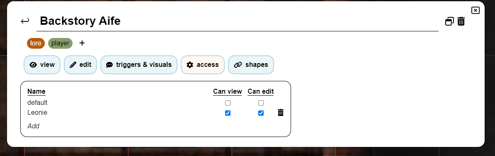
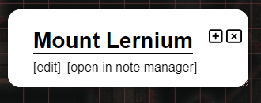
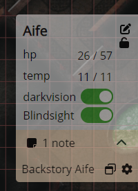

import Info from "/src/components/directives/Info.astro";
import Warning from "/src/components/directives/Warning.astro";

# Notas

Como DM o jugador, a veces sentirás la necesidad de tomar notas sobre un personaje, una ubicación, un evento, ...
Esta página te mostrará lo que PlanarAlly ofrece en cuanto a gestión de notas.

## Conceptos

En esencia, todas las notas son contenedores simples que contienen texto, un título opcional y un autor.
Sin embargo, se pueden usar de varias maneras diferentes.

Las notas se pueden compartir con otros jugadores o mantenerse privadas para el creador de la nota.
Las notas también se pueden adjuntar a formas, lo que permite un acceso rápido a la nota al seleccionar la forma.
O simplemente para recordarte algo sobre la forma.

Las notas admiten formato Markdown. Para obtener más información al respecto, consulta el [Tutorial de Markdown](../../../learn/dm/Markdown_Tutorial/markdown)

### Global vs Local

En la mayoría de los casos, una nota solo es relevante para la campaña/ubicación actual.
Pero hay algunos casos extremos en los que podrías querer tener una nota independiente de la campaña y disponible desde cualquier lugar.

Lo primero se llama local y lo segundo global.
Durante la creación de la nota tendrás que decidir cuál quieres crear.

Un buen ejemplo de nota global es el bloque de estadísticas de un monstruo.
Si combinas esto con las [plantillas de recursos](/es/docs/dm/assets/#templates), podrás soltar un goblin en el tablero y
tener una nota con su bloque de estadísticas adjunta.

## La interfaz del gestor de notas

En el núcleo de la interacción con las notas está el gestor de notas.
Es un gran elemento de interfaz que permite buscar, filtrar y crear notas.

### Apertura

El gestor de notas se puede abrir haciendo clic en la sección "Notes" del menú lateral en el lado izquierdo de la pantalla.

También se puede abrir/cerrar usando el atajo de teclado <kbd>n</kbd>.

Por último, también se puede abrir usando el menú contextual sobre una forma o
usando el panel de información de selección en el lado derecho de la pantalla cuando una forma está seleccionada.
En estos casos, el gestor de notas se abrirá con un filtro aplicado para mostrar solo las notas relacionadas con la forma.

### Vista principal

Esto muestra la lista de todas las notas que están disponibles actualmente (con filtros específicos aplicados).

#### Búsqueda y filtrado

El primer gran elemento de interfaz es la barra de búsqueda, que te permite buscar entre todas las notas y filtrarlas.

La barra de búsqueda contiene un conmutador para alternar entre notas locales y globales.
Estas notas suelen ser muy diferentes por naturaleza y, por lo tanto, tienen una vista separada dedicada.

El segundo elemento es el campo de entrada de la barra de búsqueda, donde puedes escribir tu consulta.

PA comparará todas las notas conocidas con esta consulta y mostrará los resultados en la lista de abajo.
Dónde buscará PA tu consulta dependerá de los filtros utilizados,
esto se puede configurar usando el último elemento de la barra de búsqueda.

Por defecto, PA buscará tu consulta en el título y las etiquetas de la nota.
Sin embargo, se puede modificar para que también busque en el contenido de la nota, así como en el autor.

Por defecto, PA también solo buscará en las notas creadas en la ubicación activa.
Esto se puede cambiar para buscar en todas las ubicaciones no archivadas o incluso en todas las ubicaciones de la campaña actual.

Es posible ocultar todas las notas que están adjuntas a formas,
esto puede ser útil si quieres centrarte en notas más relacionadas con la historia general.

Un último filtro posible es ignorar el conmutador local para las notas globales que están adjuntas a formas locales.
En esencia, esto incluirá todas las notas (independientemente de su estado local/global) que estén adjuntas a una forma en la ubicación actual.
(p. ej., el bloque de estadísticas global de un goblin aparecerá en la lista local, si hay un goblin en la ubicación actual)

##### Shape filtering

Es posible poner el gestor de notas en modo de filtro por forma, usando el menú contextual sobre una forma y
seleccionando mostrar notas o yendo a la sección de notas de la selección de forma activa.

Cuando esto sucede, solo se mostrarán las notas adjuntas a la forma relevante.
La mayoría de los filtros de búsqueda desaparecerán/desactivarán cuando esto ocurra, ya que ya no son relevantes. (ten en cuenta que se mostrarán tanto las notas globales como las locales adjuntas a la forma)

Cuando estés en este modo, el botón de crear nueva nota también adjuntará automáticamente una nota a la forma.

<Info>También es posible adjuntar notas a notas existentes usando la pestaña 'shapes' en la vista de edición.</Info>

#### Listado de notas

El centro de la vista principal muestra el título, el autor, las etiquetas y algunas acciones rápidas para cada nota que coincidió con la consulta de búsqueda y los filtros.

El título es un enlace en el que se puede hacer clic y que abrirá la nota en la vista de edición.

Las 2 acciones rápidas disponibles ahora mismo son los botones de editar y de vista emergente (popout).
El icono de editar, igual que hacer clic en el título, abrirá la nota en la vista de edición,
el icono de popout abrirá la nota en un modal separado. (Consulta [Notas emergentes](#popout-notes) para más información)

Esta vista se paginará si demasiadas notas coinciden con los filtros activos. En ese caso, aparecerá un botón `<` y `>` en la parte superior derecha.

### Crear una nueva nota

Después de hacer clic en el botón de crear nueva nota en la vista de la lista principal, aparecerá una nueva pantalla para preconfigurar una nueva nota.
En esta vista puedes configurar el título y el tipo de nota (global o local).

Esto se hace con una vista separada, para dar espacio a explicar la diferencia entre notas globales y locales.

Después de crear una nota, serás llevado automáticamente a la vista de edición para una configuración adicional.

### Vista de edición

Esta vista es el modo avanzado para editar una nota.
Si quieres volver a la vista principal, puedes presionar la flecha hacia atrás en la parte superior izquierda, junto al título de la nota.

La vista de edición está dividida en varias secciones, de arriba a abajo:

#### Título

Esto simplemente muestra el título de la nota.

Si tienes derechos de edición sobre la nota, puedes editarla.

En el lado derecho hay de nuevo algunas acciones rápidas disponibles.
Hay otro icono de [popout](#popout-notes) y un icono de papelera que eliminará la nota.

#### Etiquetas

Esto muestra todas las etiquetas que están actualmente adjuntas a la nota.

Si tienes derechos de edición sobre la nota, puedes añadir/eliminar etiquetas.

Las etiquetas son de forma libre y pueden ser lo que quieras, aunque idealmente deberían ser relativamente cortas.
Su único uso por parte de PA es para filtrar/buscar notas, así que puedes organizarlas como quieras.

A una etiqueta se le asignará automáticamente un color consistente basado en su contenido.

<Warning>
    Las etiquetas son visibles para todos los usuarios que tienen derechos de 'can view' sobre la nota. (consulta la
    [pestaña Access](#tab-access))
</Warning>

_La generación de colores solo funciona en contextos HTTPS, ya que usa un algoritmo SHA1, por lo que en contextos HTTP se recurrirá a un color grisáceo_

#### Pestaña: View & Edit

Estas dos pestañas trabajan juntas y forman el núcleo de la nota.

En la pestaña Edit puedes escribir/editar el contenido real de la nota en un formato textual compatible con markdown.
El markdown realmente renderizado se puede ver en la pestaña View.

#### Pestaña: Triggers & Visuals

Esta pestaña solo se puede abrir si la nota está adjunta a una forma.

Permite configurar algunos comportamientos especiales para la nota.

Actualmente ofrece dos opciones:

Mostrar icono de nota: Esto mostrará un pequeño icono junto a la forma (en el mapa).
Se puede usar para recordarte una nota importante.

Mostrar texto al pasar el cursor sobre la forma: Esto mostrará el contenido (renderizado en markdown) de la nota cuando pases el cursor sobre la forma.
Aparecerá en el centro superior de la pantalla. Ten en cuenta que si tu nota es grande, probablemente cubrirá una gran parte de la pantalla.

#### Pestaña: Access

Esta pestaña te permite configurar quién puede ver y editar la nota.

Por defecto, solo el autor de la nota puede verla y editarla.
Pero quizás quieras dar a todos los jugadores acceso de vista a una nota que encontraron en algún lugar.

También puedes dar acceso granular a jugadores específicos, lo que te permite compartir notas ocultas con jugadores concretos.

Es importante darse cuenta de que las etiquetas de una nota son visibles para los jugadores con acceso de vista.
Asegúrate de no estropear accidentalmente algo teniendo una etiqueta `faction:evil` o algo similar.

<Info>
Al dar acceso de vista a un jugador (sea específico o a todos los jugadores), recibirán una notificación de que hay una nueva nota disponible.

Entonces, como DM, simplemente dar acceso de vista a una nota es una buena manera de notificar a tus jugadores sobre un dato en particular que acaban de descubrir.

</Info>

#### Pestaña: Shapes

Esta pestaña enumera todas las formas que están actualmente adjuntas a la nota.

Lo hace enumerando primero una suma numérica de todas las formas en todas las campañas, seguida de una suma para la ubicación activa.

Para la ubicación activa también enumera todas las formas con su nombre. Hacer clic en el nombre centrará tu pantalla en esa forma.
Al pasar el cursor sobre un nombre también aparecerá un icono de papelera que, al hacer clic, desvinculará la nota de esa forma.

## Notas emergentes (popout)

A veces necesitas acceso frecuente a una o varias notas.
Abrir constantemente el gestor de notas y cambiar de nota es un fastidio en ese caso.

Para resolver esto, PA ofrece la capacidad de sacar una nota a un modal separado (popout).
Se pueden tener varios abiertos al mismo tiempo y se pueden arrastrar individualmente.

Un popout solo ofrece funcionalidad de vista y edición; para otras configuraciones de la nota necesitas abrir el gestor de notas propiamente dicho.

También es posible contraer un popout, lo que ocultará el contenido de la nota y solo mostrará el título.
Esto es especialmente útil si tienes varios popouts abiertos o sabes que una nota ya no es relevante, pero lo será en un futuro cercano.

## Notas de la selección de forma activa

PA siempre muestra un elemento de interfaz en el lado derecho de la pantalla con información rápida sobre la forma seleccionada actualmente.

Esta sección también tiene una sección de notas dedicada.
Muestra el número de notas adjuntas y un icono para abrir inmediatamente el gestor de notas con un filtro aplicado para mostrar solo las notas relacionadas con la forma. (Consulta [Filtrado por forma](#shape-filtering) para más información)

Si hay 1 o más notas adjuntas a la forma, también puedes expandir/contraer esta sección para listar las notas.
Esto te permite sacar rápidamente una nota en un popout o abrirla en el gestor de notas.
Además, al pasar el cursor sobre estas notas se mostrará el contenido de la nota en el centro superior de la pantalla, independientemente de su configuración de activación.
