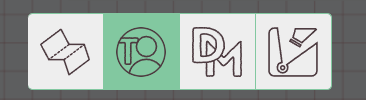

import Cog from "~icons/fa-solid/cog";
import Info from "/src/components/directives/Info.astro";
import Tip from "/src/components/directives/Tip.astro";

# Tu primer mapa

La mayoría de las partidas acaban girando en torno a un mapa; no siempre es el caso, pero en estas guías vamos a suponer que iremos por una configuración tradicional de exploración de mazmorras.

En esta guía añadiremos un mapa, configuraremos paredes, luces, personajes de jugador y monstruos.

## Configuración

Antes de ponernos manos a la obra, echemos primero un vistazo a alguna configuración que quizá queramos modificar.

Abre el <Cog /> arriba a la izquierda y haz clic en «Configuración del DM».
Esto abrirá la interfaz en la que puedes configurar una variedad de ajustes globales para toda la campaña.

### Configuración de administrador

<Info>
    ¡Para añadir jugadores a tu partida, tienes que enviarles el enlace de invitación, que puedes encontrar en esta
    pestaña!
</Info>

Sin embargo, más relevantes para nuestra preparación actual son las pestañas de cuadrícula y visión.

### Configuración de la cuadrícula

Dependiendo de tu juego, estos valores predeterminados pueden estar bien o requerir algunos ajustes.

Algunas cosas notables aquí:

- Por defecto se usa una cuadrícula cuadrada; esto se puede cambiar a cuadrículas hexagonales
- Una sola celda de la cuadrícula se interpreta por defecto como una cuadrícula de 5x5 ft para varias cosas (p. ej. la herramienta Ruler)

### Configuración de visión

Por ahora solo activa «Rellenar el lienzo con niebla de guerra».

Personalmente también me gusta subir la opacidad de la niebla de guerra (p. ej. 0.7), pero esto es cuestión de preferencia personal.
Determinará con qué fuerza verás, como DM, las zonas que los jugadores no pueden ver.

¿Por qué hemos activado esta opción de niebla de guerra?

Vamos a simular una incursión a una mazmorra en lo profundo del subsuelo, así que la configuración predeterminada probablemente sea que todo esté cubierto de oscuridad y solo algunas antorchas aquí y allá aporten luz a la escena.
Por eso hemos rellenado el lienzo con niebla de guerra.

Con estos ajustes iniciales configurados, cerremos la configuración del DM y añadamos un mapa.

## Añadir recursos

PA tiene un gestor de recursos donde, muy parecido al explorador de archivos de tu sistema operativo, puedes organizar los recursos subidos en carpetas, renombrarlos, etc.
Cuando tengas varias partidas o simplemente quieras subir muchas imágenes de fichas a la vez, querrás explorar el gestor de recursos a fondo.

Por ahora, sin embargo, solo vamos a arrastrar un recurso desde el explorador de archivos de tu sistema operativo hasta el mapa.
Si todo ha ido bien, ahora deberías ver lo siguiente:

El mapa usado aquí se generó aleatoriamente con el [generador de mazmorras de donjon](http://donjon.bin.sh/d20/dungeon/index.cgi).

Observa que la pantalla está bastante oscura; eso es por mi ajuste de opacidad de 0.7. Ahora mismo, si un jugador se uniera a la sesión, vería una pantalla completamente negra.

## Un intermedio sobre las capas

Si también seguiste la guía del jugador, quizá hayas notado la interfaz adicional abajo a la izquierda que el jugador no podía ver.
Aquí es donde controlas plantas y capas. Las plantas son un tema más avanzado que omitiremos por ahora, pero las capas son una herramienta esencial en el kit de todo DM.

Las capas se organizan verticalmente unas encima de otras y se usan para mejorar el rendimiento del renderizado, pero también para tener una separación de responsabilidades.

La capa seleccionada por defecto es la capa de tokens. Está pensada para que vivan en ella todas las fichas generales (sean jugadores, pnj o monstruos).
Es la única capa con la que los jugadores pueden interactuar.

Como DM tienes acceso a bastantes más capas. A la izquierda de la capa de tokens está la capa de mapa. Esta es la capa más baja y la idea es que coloques aquí tus grandes elementos de mapa.
Esto garantiza que ninguna forma quede atrapada detrás del arte del mapa o que muevas accidentalmente el recurso del mapa en sí.

La tercera capa es la capa DM; simplemente es una capa donde, como DM, puedes guardar cualquier cosa que quieras y que los jugadores no deben poder ver.
Quizá tengas un monstruo oculto en algún lugar que solo quieras revelar cuando llegue el momento, o quizá añadiste algo de texto en ciertas ubicaciones como recordatorios.

La última capa es la capa de Visión; la usaremos muy pronto, pero por ahora todo lo que necesitas saber es que es el lugar habitual para dibujar paredes y cosas por el estilo.

### Mover nuestro mapa

Así que lo que realmente hemos aprendido ahora es que el mapa que añadimos antes está en la capa equivocada.

Podríamos borrar el mapa, cambiar a la capa de mapa y añadir el mapa de nuevo, pero eso es mucho esfuerzo.

En su lugar, haz clic derecho en el recurso del mapa. (¡Asegúrate de seguir en la capa de tokens! No puedes interactuar directamente con recursos de otra capa)

¡Aquí podemos mover la forma seleccionada a una capa diferente!
Así es también como harías que ese monstruo oculto de la capa DM aparezca en la capa de tokens.

<Info title="La capa oculta">
    En realidad hay otra capa, una que no puedes seleccionar: la capa de cuadrícula. La capa de cuadrícula encaja
    perfectamente entre la capa de mapa y la capa de tokens, y solo se puede configurar desde la configuración de la
    cuadrícula del DM, como vimos antes.

    Observa cómo cuando el mapa estaba en la capa de tokens, las líneas de la cuadrícula quedaban ocultas detrás del
    mapa, mientras que ahora sí pasan por encima del mapa.

</Info>

## Configurar una luz

De acuerdo, tenemos el mapa en la capa correcta, ¡vamos a iluminarlo!

Cualquier forma puede actuar como fuente de luz, así que empecemos dibujando un pequeño círculo para representar una antorcha en alguna habitación.

### Forma base

Para dibujar formas necesitamos usar la herramienta Draw; es una de las herramientas que forma parte del modo Build de la barra de herramientas, ya que su uso principal es durante la preparación de la sesión.
Así que cambiemos el modo a Build (recuerda el atajo <kbd>tab</kbd>) y seleccionemos la herramienta Draw.

Elige un círculo (¡u otra forma!), un color y dibújalo en el tablero. Las formas se dibujan generalmente haciendo clic izquierdo con el ratón y arrastrando.

<video autoplay loop muted style="max-width: min(680px, 75vw);">
    <source src="/learn/dm/add-light-shape.webm" type="video/webm" />
    <source src="/learn/dm/add-light-shape.mp4" type="video/mp4" />
</video>

### Añadir fuente de luz

Ahora podemos abrir las propiedades de la forma recién dibujada y añadir una fuente de luz.

Esto se puede hacer en la pestaña de rastreadores configurando un aura que actúe como fuente de luz y sea pública.

¡Siéntete libre de experimentar con esto! Los dos valores de rango son, respectivamente, el rango de luz brillante y el de luz tenue.
En lugar de un círculo completo, puedes restringir la fuente de luz a un cono y orientarlo en una dirección concreta.

También puedes darle a tu luz un color específico para que se sienta más como una antorcha real.

<video autoplay loop muted style="max-width: min(680px, 75vw);">
    <source src="/learn/dm/add-light-source.webm" type="video/webm" />
    <source src="/learn/dm/add-light-source.mp4" type="video/mp4" />
</video>

## Arreglar las dimensiones del mapa

Ahora que hemos añadido una luz que se supone que tiene un radio de 40 ft,
quizá te preguntes cómo se relaciona eso con las dimensiones del mapa, ya que acabamos de soltar la imagen del mapa en el tablero sin ninguna modificación extra.

Si cogieras la herramienta Ruler y midieras el tamaño de una sola celda de la cuadrícula en el mapa, confirmarías tus sospechas: ¡el mapa no está escalado correctamente en absoluto!
La desalineación del mapa con la cuadrícula de PA también puede haberte dado la pista ya ;)

Podríamos intentar arreglar manualmente las dimensiones del mapa usando la herramienta Select y redimensionando el mapa (en modo Build).
Sin embargo, esto es un trabajo propenso a errores y tedioso. En su lugar, vamos a usar una herramienta de Build a la que solo los DM tienen acceso: la herramienta Map.

Esta herramienta te permite configurar las dimensiones del mapa. Puedes introducir el ancho/alto completo en celdas de cuadrícula esperadas o simplemente el ancho/alto en píxeles esperados,
pero también puedes arrastrar un área y configurar cuántas celdas de cuadrícula se supone que debe representar esa área. Personalmente encuentro esto último lo más fácil.

<video autoplay loop muted style="max-width: min(680px, 75vw);">
    <source src="/learn/dm/map-tool.webm" type="video/webm" />
    <source src="/learn/dm/map-tool.mp4" type="video/mp4" />
</video>

En el vídeo anterior, hacemos los siguientes pasos:

1. Movernos a la capa de mapa (ya que queremos interactuar con nuestra forma de mapa)
2. Seleccionar el mapa y cambiar a la herramienta Map
3. Arrastrar un área sobre la forma del mapa
4. Introducir en la herramienta Map cuántas celdas de cuadrícula debe representar el área arrastrada, tanto en horizontal como en vertical
5. Conté el número horizontal de celdas arrastradas, que fue 5, y lo introduje en el campo horizontal
6. Antes de introducir el número, hice clic en el icono de la cadena, que garantiza que cualquier edición actualice automáticamente el otro campo para mantener la relación de aspecto
7. Esto terminó con ~5.02 para el campo vertical, lo que parece correcto
8. Después de pulsar aplicar, la forma del mapa se redimensiona inmediatamente para ajustarse a nuestras restricciones
9. Aún así sigue desalineado, así que volvemos a la herramienta Select y lo arrastramos de manera que se solape con la cuadrícula de PA (las líneas rojas)

Esto puede parecer bastante complicado, pero una vez que le coges el truco, en realidad es una forma bastante rápida de alinear mapas.

<Tip title="Consejos">
    1. Si arrastras un área más grande, ¡la precisión aumentará! Puede que solo cueste más trabajo contar el número de
    celdas de cuadrícula que has seleccionado.  
    2. Tengo el contorno de mi cuadrícula relativamente tenue; puedes cambiarlo en tu configuración del cliente  
    3. Incluso si el resultado final no es perfecto, deberías poder redimensionar el mapa a una coincidencia mucho más
    precisa ahora que el tamaño general es más o menos correcto
</Tip>

## Añadir paredes

Ahora tenemos un mapa bien alineado y una luz, pero la luz simplemente ignora nuestro mapa.
Para arreglar esto necesitamos informar a PA de dónde están las paredes.

<Info>
    Hay algunas opciones más avanzadas disponibles para ayudarte con este proceso, como subir un svg con la información
    de las paredes. (Aunque personalmente la mayoría de las veces simplemente dibujo las paredes a mano)
</Info>

Al igual que con la luz, las paredes también se dibujarán con la herramienta Draw.
La pregunta principal es: ¿en qué capa queremos dibujarlas?

Aunque hay una opción óptima, en realidad podríamos elegir cualquier capa excepto la capa DM, ya que esas no serán visibles para los jugadores.

Podríamos dibujarlas en la capa de mapa o de tokens, pero la capa de Visión tiene algunas mejoras de calidad de vida que la hacen más interesante:

En primer lugar, las formas de la capa de Visión no se renderizan cuando estás en otra capa, lo que significa que el ruido visual de muchas formas de pared, etc. se puede ocultar cuando se está jugando de verdad.
También significa que puedes codificar por colores tus formas para significar cosas específicas (p. ej. los segmentos naranjas de pared son puertas secretas) sin que esos colores puedan filtrarse en la escena principal.

El segundo beneficio es que cuando seleccionas la capa de Visión, la herramienta Draw activa automáticamente algunos ajustes:

Como puedes ver, los ajustes `blocks vision/light` y `blocks movement` se activan automáticamente.
Esta es una pequeña ayuda de calidad de vida que hace configurar paredes un poco más fácil, ya que no tienes que acordarte de configurar esos ajustes cada vez que quieras dibujar una pared.

Estos 2 ajustes son bastante importantes y se pueden cambiar después de dibujar. Como sugiere el nombre, la luz y el movimiento quedarán bloqueados a través de esta forma.
Lo cual normalmente quieres para una pared. Si queremos imitar una ventana, querríamos mantener `blocks movement` activado, pero desactivar el bloqueo de luz y visión.

<Info title="Colores predeterminados">
Otra función de calidad de vida es la configuración de colores predeterminados para las formas de visión.
Se pueden configurar en la pestaña Apariencia de la configuración de tu cliente:
 

La forma usará automáticamente el color definido aquí cuando sea relevante. (p. ej. las formas con ambos ajustes de bloqueo activados actúan como paredes, y las que solo bloquean el movimiento actúan como ventanas).

Si quieres dibujar estas formas con un color concreto en lugar de su predeterminado, puedes desmarcar la opción 'Prefer default colours' en los ajustes de visión de la herramienta Draw.

</Info>

Con todo eso fuera del camino, ¡dibujemos de verdad nuestra pared! Puedes usar cualquier forma, pero la herramienta de polígono es la más versátil para dibujar paredes.

<video autoplay loop muted style="max-width: min(680px, 75vw);">
    <source src="/learn/dm/draw-walls.webm" type="video/webm" />
    <source src="/learn/dm/draw-walls.mp4" type="video/mp4" />
</video>

Como puedes ver, ¡dibujar paredes es muy fácil! Es un poco una preferencia estilística cuánto de la pared real quieres mantener visible para los jugadores;
yo suelo mostrarles un poco para que vean visualmente que hay una pared en lugar de depender solo de la sombra.

<Tip>
    ¡Necesitas hacer clic derecho para completar la forma de polígono!
     
    No te preocupes demasiado por las líneas que no son rectas o los puntos que olvidaste añadir. La herramienta Select
    en el modo Build te permite mover puntos del polígono, así como añadir nuevos puntos o eliminar los existentes.
    Dibujar primero el panorama general y hacer algunos retoques después suele ser mucho más rápido.
</Tip>

Comprueba cómo se ve ahora si vas, por ejemplo, a la capa de tokens y observa que las formas de pared dibujadas han desaparecido, ¡pero la sombra permanece!

## Añadir personajes

Ahora tenemos un mapa con algunas paredes, una fuente de luz, pero aún no personajes. No hay nada que represente a los jugadores y no hay monstruos ni pnj.

Podemos arrastrar y soltar algunas fichas en el tablero igual que hicimos con el mapa. Sin embargo, para esta configuración de ejemplo vamos a crear una ficha de personaje básica dentro de PA.
Son fichas circulares pequeñas con solo una etiqueta de texto. Fáciles para un prototipo rápido o cuando necesitas un pnj rápidamente en el tablero y no quieres perder tiempo buscando algún recurso en tu sesión.

Para añadir una ficha de personaje básica, haz clic derecho en un lugar vacío del tablero. ¡Idealmente haremos esto en la capa de tokens!

<video autoplay loop muted style="max-width: min(680px, 75vw);">
    <source src="/learn/dm/basic-token.webm" type="video/webm" />
    <source src="/learn/dm/basic-token.mp4" type="video/mp4" />
</video>

En el vídeo anterior:

- Creamos una ficha básica con el nombre «test»
- Damos permiso al jugador con el nombre de usuario «test» sobre la forma
- La arrastramos un poco probando si la pared funciona, ¡y funciona!

Si ahora comprobamos lo que puede ver el jugador con el nombre de usuario «test», notamos el siguiente problema:

¡Nuestro jugador puede ver todo en la habitación con la luz mientras su personaje ni siquiera está ahí!

### Acceso de visión

Antes de sumergirnos en la línea de visión, necesitamos hacer un pequeño desvío para hablar de los niveles de acceso a las formas.

Cuando añadimos el acceso del jugador 'test' a la forma anterior, los 3 permisos de acceso (editar/movimiento/visión) se concedieron automáticamente.
Los 3 derechos de acceso no siempre se dan de inmediato; depende de algún contexto, así que es importante darse cuenta de qué hacen.

En particular, el permiso de acceso de visión es importante, ya que decide lo que los jugadores pueden ver.
Con el acceso activado, PA asumirá que el jugador tiene acceso de visión a las auras privadas de la forma y, esencialmente, verá lo que la ficha puede ver en el mundo.

Incluso si no hay auras configuradas en la ficha, siempre habrá un aura de visión mínima alrededor de ella para que no la pierdas cuando te muevas a un lugar donde apenas puedes ver.

Si desactivaras el acceso de visión para la ficha, en su lugar veríamos lo siguiente:

Así que aunque tengamos acceso de edición y movimiento, en realidad no vemos la forma porque nada está iluminando actualmente el área donde está la forma.

## Visión

Como se señaló antes, puede ser un poco extraño que el jugador pueda ver la habitación iluminada por esa luz sin estar allí con su personaje.
Esto se debe a que actualmente no aplicamos restricciones de visión al jugador. Puede ver todo lo que está (públicamente) iluminado.

Esto puede funcionar bien en ciertos escenarios, pero cuando esperas que el jugador solo pueda ver lo que su personaje puede ver,
esto puede volverse muy tedioso, ya que, como DM, tendrás que encender o apagar las luces mientras exploran el mapa.

Y este enfoque laborioso seguirá terminando con que los jugadores puedan ver lo que otros jugadores ven, lo que quizá tampoco sea lo que deseas.

Para activar realmente la visión por personaje de forma adecuada necesitamos dos cosas:

1. Los jugadores necesitan tener acceso de visión sobre sus formas
2. La ubicación debe estar configurada para tener la línea de visión habilitada

(1) Cubrimos esto en la sección Acceso de visión anterior, así que eso ya está cubierto, pero para (2) necesitamos volver a nuestra configuración del DM [donde activamos la opción de «niebla de guerra completa» antes](#vision-settings).

<Tip>
Si tienes varias ubicaciones (ver más adelante), estos ajustes del DM a menudo también se pueden configurar por ubicación.

La configuración del DM son los ajustes predeterminados y se usarán cuando una ubicación no los sobrescriba explícitamente.

</Tip>

Si todo ha ido bien, ahora tenemos la siguiente vista (del lado del DM):

Así que lo que está pasando aquí es que el jugador ahora solo ve esos lugares donde hay luz visualmente dentro de su línea de visión basada en las paredes que dibujamos.
(Recuerda que solo dibujamos la pared interior en la cámara de la derecha).

Para ayudarte a visualizar por qué se muestra esto, hice este dibujo tosco:

- Las líneas rojas son las paredes que hicimos; bloquean la luz.
- Las líneas amarillas muestran el cono que emite la luz y que atraviesa la abertura de la puerta que dejamos en la pared
- Las líneas verdes muestran el cono que el personaje puede ver hacia la otra habitación a través de esa misma abertura de puerta

Para la habitación en la que está el personaje:

- El personaje puede ver toda la habitación
- La luz solo ilumina una sección (ese cono amarillo)

-> Solo la sección del cono es realmente visible

Para la habitación en la que está la luz:

- El personaje solo puede ver la sección del cono verde
- La luz ilumina toda la habitación

-> Solo la sección del cono es realmente visible

### Auras del jugador

Normalmente los personajes tendrán alguna capacidad innata para ver a través de la oscuridad hasta cierta distancia, o simplemente tienen algún objeto como una antorcha que da luz.

Ya vimos [antes](#add-light-source) cómo crear un aura para la luz en la otra habitación; podemos simplemente hacer lo mismo para nuestro personaje de jugador.
Abre la configuración de la forma, ve a la pestaña Rastreadores y añade un aura nueva.

Las auras configuradas como públicas se mostrarán para todos los jugadores (con visión del aura), así que esto es perfecto para una antorcha, mientras que un aura privada es más adecuada para habilidades innatas como la visión en la oscuridad.

Es importante marcar la propiedad de 'acts as light source', ya que es lo que realmente hace que funcione como fuente de luz/visión. (fuente de visión probablemente sea un mejor nombre)

--

Esto debería darte lo esencial para dejar tus mapas listos para jugar.

[A continuación](/es/learn/dm/other-features) vamos a ver algunas otras funciones que probablemente querrás conocer como DM.
