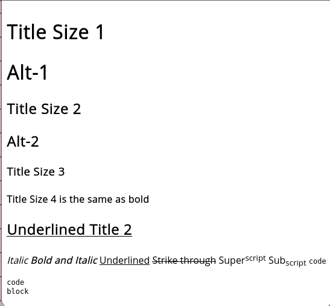

# **Guía de tutorial de Markdown.**

Guía aportada por [@veritanuda](https://keybase.io/veritanuda)

Esta guía explorará específicamente las funciones del formato Markdown a lo largo de PlanarAlly. Se usa tanto en los campos de [Notas](../../../../docs/game/notes) como en la ventana de [Chat](../../../../docs/game/chat).

La información de esta guía se obtuvo en gran parte de esta [Guía de sintaxis](https://markdown-it.github.io/)

## **Efectos de texto**

Lo siguiente es un ejemplo de los Efectos de texto que se pueden aplicar.



En él puedes ver:

- Tamaños de título
- Formato de texto
- Estilos de texto

Así es como se ve en la ventana de Notas.


Y así es como se ve en modo edición.


El carácter `#` se puede usar para establecer tamaños de título. 1 dará el tamaño más grande `Title Size 1`

2 `#` da el siguiente tamaño `Title Size 2`

3 `#` da el siguiente tamaño más pequeño `Title Size 3`

4 `#` es lo mismo que usar el tipo en negrita, que se puede hacer con `**` o `__` rodeando el texto. `Title Size 4`

Subrayar requiere notación HTML, que también funcionará para otros efectos de texto como la cursiva `<i> </i>` y la negrita `<b></b>`.

`<u>Underlined</u>`

`*` es _Cursiva_

`**` es **negrita**

`***` es **_Negrita y cursiva_**

`~~` es ~~Tachado~~

`<sup> </sup>` es Super<sup>script</sup>

`<sub> </sub>` es Sub<sub>script</sub>

``is`code`

` ``` ` es

```
code
block
```

---

## **Diseño de texto**

Lo siguiente es un ejemplo de Diseños de texto


### <u>Listas desordenadas</u>

Las listas desordenadas pueden usar `*` o `-` para delimitar los elementos de la lista.

```
Unordered List 1
* First
* Second
* Third
* Fourth
```

Unordered List 1

- First
- Second
- Third
- Fourth

```
Unordered List 2
- First
- Second
- Third
- Fouth
```

Unordered List 2

- First
- Second
- Third
- Fouth

### <u>Listas ordenadas</u>

Las listas ordenadas usan `<número>.` con los números incrementando desde el primer número que especifiques.

```
Ordered List
1. First
2. Second
3. Third
4. Fourth
```

Ordered List

1. First
2. Second
3. Third
4. Fourth

### <u>Listas escalonadas/de varios niveles</u>

Las listas escalonadas, o de varios niveles, se pueden conseguir añadiendo un doble espacio entre cada nivel de la lista.

```
Stepped List
- First
- Second
- Third
  - 3 a
  - 3 b
- Fourth
```

Stepped List

- First
- Second
- Third
    - 3 a
    - 3 b
- Fourth

### <u>Tablas</u>

Las tablas usan `|` para delimitar columnas, mientras que `-` y `:` se usan para especificar la justificación (opcional, ya que la justificación a la izquierda es el valor predeterminado).

```
|Col A|Col B|Col C|
|--|:--:|--:|
|Row 1|Row One|R 1|
|Left|Centre|Right|
```

| Col A |  Col B  | Col C |
| ----- | :-----: | ----: |
| Row 1 | Row One |   R 1 |
| Left  | Centre  | Right |

---

## <u>Imágenes y enlaces</u>

A continuación hay un ejemplo de imágenes en línea e hipervínculos.


Para **_la mayoría_** de las URL de imágenes, puedes simplemente cortar y pegar la ubicación de la imagen y debería resolver la imagen.

Si no lo hace, deberías poder insertar imágenes en línea si precedes el elemento con `!`, especificas un nombre de etiqueta en `[ ]` y luego el enlace en `( )`.

```
This is a Goblin below.


```

Existe un método alternativo, que puede hacer el código más limpio, llamado método de referencia, donde en lugar de un enlace a la imagen, puedes usar una referencia, que a su vez enlaza a la imagen.

```
![Goblin][Goblin1]

This is a Goblin above

This is another Goblin

![Goblin2][Goblin2]

[Goblin1]:https://www.imarvintpa.com/Mapping/Tokens/g1/Goblin.png "This is a Goblin"
[Goblin2]:https://gamepedia.cursecdn.com/crafttheworld_gamepedia/thumb/b/be/Cave_Goblin.png/150px-Cave_Goblin.png "This is a Cave Goblin"
```

Las referencias también pueden proporcionar información sobre herramientas, así que cuando el cursor se sitúa sobre una imagen se puede ver una información sobre herramientas. Se crean citando `" "` el texto de la información sobre herramientas después de la URL.


**NOTA:** Al seleccionar imágenes para insertar, se escalarán en la ventana de chat, pero cuando se hace clic en la imagen, se abrirá en una versión más grande en otra ventana.

## <u>**Enlaces URL**</u>

Los enlaces URL son lo mismo que arriba pero sin el `!` precedente.

```
[5E Character Sheet](https://media.wizards.com/2016/dnd/downloads/5E_CharacterSheet_Fillable.pdf)
```

[5E Character Sheet](https://media.wizards.com/2016/dnd/downloads/5E_CharacterSheet_Fillable.pdf)

# Conclusión

Usar markdown en las notas o en el chat es una forma útil de involucrar a tus jugadores y darles acceso a cosas como folletos o imágenes de monstruos para aportar más profundidad a una partida. Desde el punto de vista de un GM, gestionar notas en las fichas para estadísticas, habilidades especiales, información general, descripciones de ubicaciones, etc., puede aliviar enormemente la cantidad de información que necesitas almacenar y consultar fuera de una partida. Esto hace que dirigir una partida sea mucho más fluido y sin fricciones.

¡Feliz juego!
