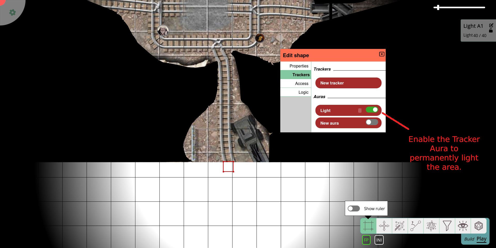

import Lightbulb from "~icons/fa-solid/lightbulb";

# Iluminación estilo RTS

Guía aportada por [@veritanuda](https://keybase.io/veritanuda)

Este tutorial se centrará en una configuración de iluminación más compleja.
Asegúrate de estar familiarizado con el [sistema de iluminación y visión](/es/docs/dm/lighting-vision/) de PlanarAlly, así como con sus [capas](/es/docs/dm/layers) y las [auras](/es/docs/game/shapes/#trackers--auras) y el [acceso](/es/docs/game/shapes/#access) de las fichas.

En este tutorial, queremos emular configuraciones de iluminación de estilo RTS (*R*eal *T*ime *S*trategy).
La configuración **sí**:

- dará a los jugadores un mapa para explorar y
- les mostrará las zonas que ya han explorado.

La configuración **no**:

- tendrá en cuenta la línea de visión real del jugador, sino que trabajará con simplificaciones,
- añadirá 'niebla de guerra fina' que solo oculta las fichas pero no el mapa (PlanarAlly no puede hacer esto), ni
- automatizará el proceso.

## Concepto

Los juegos de estrategia en tiempo real a menudo enfrentan a los jugadores con mapas inexplorados.
Sin embargo, en el momento en que un explorador llega a la zona, el mapa se revela y cualquier niebla de guerra solo ocultará las unidades de otros jugadores, pero no el mapa.
Esta es una función que se ha solicitado a menudo.
Aun así, por varias razones, no se ha implementado en PlanarAlly (¿todavía?).

Pero es fácil emular un efecto similar.
Tendrá los inconvenientes mencionados arriba, pero dará a los jugadores más (y mejor) orientación en el mapa que solo su propia línea de visión.

En esencia, vamos a

- dividir el mapa en zonas,
- dotar a estas zonas de fuentes de luz, cada una,
- iluminar las zonas en el momento en que los jugadores las hayan explorado, para que puedan verlas cuando se vayan.

## Preparación

Primero, prepara tu mapa habitual usando el sistema de iluminación y visión: rellena el lienzo con niebla de guerra, añade algunas paredes y luces como prefieras.

### Sectores

Después, mira tu mapa para identificar las partes que se pueden explorar de forma independiente.
Para tu mazmorra habitual, esto debería ser fácil, ya que ya está dividida en varias habitaciones.

Ahora, coloca una o más fuentes de luz (dependiendo de la distribución de la zona).
Estas luces deberían poder iluminar toda la zona.
Probablemente querrás auras nítidas sin luz tenue en los bordes.

Esconde las luces en la capa _DM_ y/o desactiva las auras para usarlas más tarde.

## Implementación

En el momento en que la zona deba ser visible para tus jugadores (ya sea cuando entren en ella o cuando la hayan explorado por completo), enciende las luces.
Hazlo activando el aura (si la desactivaste) y moviendo la fuente de luz a la capa `fow`, para iluminar la zona.
Configura también la fuente de luz como _pública_, para que los jugadores puedan verla de verdad.

Como la fuente de luz está en la capa `fow`, su aura se dibujará en la capa de tokens, mientras que la forma en sí permanecerá invisible.
La capa `fow` también eliminará _cualquier_ color del aura.

En caso de que quieras poder diferenciar entre la vista real y la vista estilo RTS, da a la vista de los jugadores un ligero tono o mueve las fuentes de luz a la capa _map_.
Puedes hacer la ficha invisible u ocultarla debajo de cualquier imagen de mapa que hayas añadido usando la función `move to back`.
Usa la función `lock` para evitar arrastrar accidentalmente las luces con tu grupo u otros elementos del mapa.

En caso de que hayas habilitado la opción _solo mostrar luces dentro de la línea de visión_, necesitas, en su lugar, añadir acceso de _visión_ para todos los jugadores a las luces que quieras usar.
De lo contrario, perderán el conocimiento de la zona ya explorada en el momento en que haya una pared entre ellos y la zona respectiva.
En este caso, quizá quieras añadir _entradas_ de acceso para todos los jugadores en las propiedades de las fuentes de luz de antemano, desactivando todos los niveles de acceso.

De esta manera, solo necesitas marcar unos pocos iconos <Lightbulb/> para iluminar una zona.

Ten en cuenta que esto iluminará no solo la capa _map_, sino también la capa _tokens_.

Si quieres ocultar los movimientos de los enemigos a tu jugador, mueve sus fichas a la capa _DM_.
