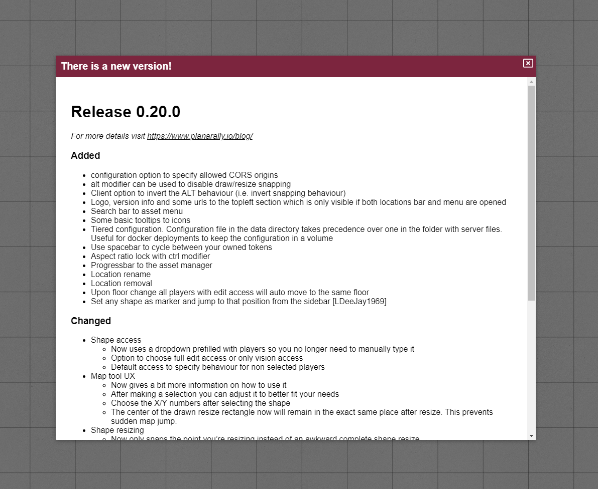

Cette version apporte de nouvelles propriétés de formes, un système d'emplacements d'apparition, des traductions, un tas de changements de confort et plusieurs correctifs de bugs pour compléter l'habituel.

## Forme

De nouvelles fonctionnalités ont été ajoutées aux propriétés de formes et la détection de collision lors du mouvement a également été améliorée.

### Option invisible

Il est désormais possible de marquer une forme comme invisible. Cela la rendra invisible pour tous les joueurs qui n'ont pas d'accès à la vision sur la forme.
Les joueurs ayant accès à la vision verront la forme normalement.

C'est particulièrement pratique pour des choses comme les familiers invisibles, mais aussi pour divers objets émettant de la lumière.
Ce dernier cas est intéressant car l'option invisible ne s'applique pas aux auras de ces formes invisibles.
C'est idéal si vous voulez ajouter une lampe à une scène sans avoir un vilain cercle visible par vos joueurs, depuis lequel la lumière émane.

<video autoplay loop muted style="max-width: min(680px, 75vw);">
    <source src="/blog/release-0.21/invisible.webm" type="video/webm" />
    <source src="/blog/release-0.21/invisible.mp4" type="video/mp4" />
</video>

### Option verrouillé

Un autre nouvel interrupteur est l'option verrouillé, qui lorsqu'elle est activée empêche le pion d'être déplacé et/ou redimensionné.
C'est surtout utile pour le DM qui veut s'assurer de ne pas déplacer accidentellement sa carte ou les limites d'éclairage.

Il y a aussi un raccourci clavier (ctrl + L) qui fonctionne également sur des sélections plus grandes, pour ne pas avoir à ouvrir les propriétés pour chaque forme individuellement.

Il est important de noter que les formes verrouillées ne seront pas incluses dans les sélections, sauf s'il n'y a que des formes verrouillées dans la région sélectionnée.

<video autoplay loop muted style="max-width: min(680px, 75vw);">
    <source src="/blog/release-0.21/locked.webm" type="video/webm" />
    <source src="/blog/release-0.21/locked.mp4" type="video/mp4" />
</video>

### Accès au mouvement

Dans la dernière version, la section des accès a été étendue en ajoutant une permission d'accès vision uniquement pour les autres joueurs qui ne devraient pas pouvoir modifier une forme mais qui sont autorisés à voir leur vision privée.

Cette version ajoute une permission d'accès supplémentaire qui permet à un autre utilisateur de déplacer la forme.

### Améliorations de la collision

Le test de collision des hitbox avec les murs a toujours été très strict et parfois trop strict (à cause de petites erreurs d'arrondi).
Cela offre une expérience désagréable pendant le jeu lorsqu'on essaie de traverser un petit couloir ou une porte.

À partir de cette version, la hitbox utilisée pour tester la collision est beaucoup plus petite pendant le mouvement, ce qui se traduit par un gameplay plus fluide.

## Emplacements d'apparition

Un nouveau concept dans cette version est la notion d'emplacements d'apparition.
C'est une fonctionnalité DM qui détermine où les pions apparaîtront s'ils changent d'emplacement.

Une forme spéciale devrait désormais toujours apparaître sur le calque DM et peut être déplacée librement (également entre les étages) par le DM.
Lorsque le DM déplace un pion vers un autre emplacement, il apparaîtra centré sur la forme d'apparition susmentionnée.

Actuellement, cela est limité à un seul point d'apparition par emplacement, mais le support de plusieurs points d'apparition sera ajouté à l'avenir.

<video autoplay loop muted style="max-width: min(680px, 75vw);">
    <source src="/blog/release-0.21/spawn.webm" type="video/webm" />
    <source src="/blog/release-0.21/spawn.mp4" type="video/mp4" />
</video>

Dans la vidéo ci-dessus, les pions sont déplacés vers l'emplacement actif pour des raisons de présentation, mais le même concept s'applique au déplacement des formes vers d'autres emplacements.

## i18n

L'internationalisation (i18n) a été ajoutée au codebase, ce qui signifie que les traductions peuvent désormais être travaillées. Il existe déjà des traductions en chinois et en allemand au moment de la rédaction.

Il y a un élément de sélection de langue dans l'écran de connexion pour basculer entre les langues actuellement prises en charge.

## Confort d'utilisation

Un certain nombre de changements de confort plus petits ont été travaillés dans cette version.

### Mode Build/Play

L'un des changements les plus notables concerne les nouveaux 'modes d'outils'. La barre d'outils devenait de plus en plus grande à chaque version.
De plus, certains outils ne sont pas pertinents pendant la plupart des sessions mais seulement pendant la préparation du DM.

C'est pourquoi la barre d'outils est désormais divisée en 2 modes : build et play mode.
On peut basculer entre les deux modes en cliquant sur la lettre à la fin de la barre d'outils ou en appuyant sur TAB.

Certains outils n'apparaissent désormais que dans l'un des deux modes (par ex. draw en mode build et ping en mode play).

<video autoplay loop muted style="max-width: min(680px, 75vw);">
    <source src="/blog/release-0.21/toolmode.webm" type="video/webm" />
    <source src="/blog/release-0.21/toolmode.mp4" type="video/mp4" />
</video>

#### Redimensionner les formes

Certains outils peuvent désormais également avoir un comportement différent selon leur mode actif.

À partir de 0.21.0, l'outil de sélection ne peut redimensionner les formes qu'en mode build. Toutes les autres fonctionnalités de l'outil de sélection resteront utilisables en mode play.

Ce changement est introduit parce que les gens redimensionnaient souvent accidentellement les formes en essayant de les déplacer, et redimensionner une forme n'est pas quelque chose qui arrive souvent pendant le jeu.

### Changelog

Un autre changement notable est qu'il y aura désormais une fenêtre contextuelle de changelog pour informer les joueurs que le serveur a été mis à jour.

### Ruler public

L'outil ruler a désormais une petite fenêtre d'options comme l'ont les outils draw et map.
Il n'a qu'un seul paramètre : un interrupteur pour décider si votre ruler doit être privé ou public.

### Initiative

Lorsque vous insériez votre initiative pendant que tous les autres joueurs faisaient de même, vous deviez souvent réessayer car quelqu'un d'autre était plus rapide, ce qui causait une réorganisation de la liste d'initiative et vous faisait perdre votre focus de saisie.

Désormais, tant que vous avez un champ de saisie focalisé dans la boîte de dialogue d'initiative, l'interface attendra pour se mettre à jour jusqu'à ce que vous quittiez l'élément de saisie.

### Restreindre l'interface joueur

Il y avait certains endroits où les joueurs avaient accès à des options qui ne devraient être disponibles que pour le DM.

À partir de cette version, les joueurs ne peuvent plus supprimer ou ajouter des étages et ne peuvent plus déplacer eux-mêmes leur forme vers d'autres calques/étages/emplacements.

## Varia

- La création d'un nouvel étage ne déplacera plus automatiquement tout le monde vers cet étage
- La version affichée dans la zone en haut à gauche du jeu sera désormais limitée à la version de la dernière release
- Les pions de base auront désormais leur nom par défaut défini sur leur libellé au lieu de 'Unknown shape'
- Les utilisateurs de mobiles ne peuvent désormais plus déclencher le rafraîchissement par dépassement en se déplaçant simplement
- Passer la souris sur une image dans la liste d'initiative affichera désormais le nom de la forme
- L'outil polygone se comporte désormais comme les autres formes en matière d'accrochage. Chaque point s'accrochera à une ligne de la grille à moins que vous ne désactiviez l'accrochage.

## Correctifs de bugs

- La création d'un polygone côté serveur avec une liste de sommets initiale cassait la session
- L'emplacement d'étage du joueur n'étant pas mémorisé
- Le ruler n'affichant pas les décimales
- Les paramètres DM/taille d'unité de grille affichant une entrée invalide sur firefox pour les nombres à virgule flottante
- Le serveur affichant des erreurs de décodage JSON
- Les joueurs ne pouvant pas mettre à jour les effets d'initiative
- Le calque actif se réinitialisant parfois au rechargement
- Les DM pouvant s'exclure eux-mêmes
- Certains composants d'interface ne se mettant pas correctement à jour lors de la réinitialisation d'une forme
- Zone à droite du sélecteur de calques empêchant le dessin/la sélection
- Le centrage clavier générant une erreur quand aucun pion n'est défini
- Plusieurs bugs avec la synchronisation de l'initiative
- Trois bugs avec des options spécifiques à l'emplacement ne se chargeant/s'enregistrant pas correctement
- Barre de défilement en bas de page sur firefox lorsque la barre d'emplacement ne tient pas à l'écran
- Bug où une source de lumière avec des rayons 0/0 bloquait toutes les lumières de cette forme

## À venir

On me demande souvent ce qui vient ensuite sur la feuille de route, alors je voulais partager certains des sujets que j'aimerais aborder dans les prochaines versions.
Cette liste n'est ni exhaustive ni définitive et ne sera pas entièrement dans la prochaine version ; c'est un aperçu des choses possibles à venir.

##### Travail préparatoire sur les métadonnées/export/import

Il y a eu des discussions sur le serveur discord concernant l'ajout de métadonnées aux ressources et la possibilité de les importer/exporter vers d'autres serveurs.
Certaines étapes préparatoires doivent être faites avant de pouvoir m'attaquer au problème principal.

##### Rotation

La rotation est quelque chose qui manque depuis un moment dans PA et devrait enfin être prise en charge.

##### Refonte de la séquence de démarrage

La séquence de démarrage actuelle (ordre des événements à l'arrivée sur le chargement du jeu) devrait être refaite. Il y a de la performance à gagner en réorganisant les choses ici
et certaines choses sont envoyées inutilement.

##### Passer à fontawesome-vue

Les icônes dans PA sont fournies par fontawesome, ce qui est actuellement fait en sideloadant la bibliothèque fontawesome.js. C'est un gros fichier qui prend du temps de chargement, ce qui peut être résolu
en utilisant une bibliothèque spécifique à vue qui n'inclut que les icônes réellement utilisées.

##### Liste de ressources asynchrone en jeu

Au démarrage, le DM reçoit la liste entière des ressources pour qu'elle puisse être affichée dans la barre latérale.
C'est un effort gaspillé ; le gestionnaire de ressources en jeu devrait, comme le gestionnaire de ressources complet, demander les données au serveur quand il en a besoin.

##### Améliorations du polygone

Les polygones sont géniaux, mais peuvent encore utiliser quelques fonctionnalités supplémentaires comme l'ajout et la suppression de points sur les polygones existants.

##### Améliorations de l'outil d'étage

Il devrait être possible de réordonner et renommer les étages ainsi que d'avoir des options pour masquer les étages aux joueurs.

##### Étendre les options d'auras

Les auras pourraient utiliser quelques nouvelles fonctionnalités comme les couleurs de bordure et d'autres formes comme les auras en cône.

##### Visibilité publique des étages

Les informations sur les étages sont actuellement publiques pour tous les joueurs ; cela devrait probablement recevoir un traitement public/visibilité comme beaucoup d'autres choses dans PA.

##### Améliorer le curseur de l'outil de dessin

Un curseur de souris personnalisé est utilisé dans l'outil de dessin pour une expérience de dessin plus fluide. Cependant, il n'est pas toujours clairement visible, ce qui est très agaçant.

##### Grille hexagonale

La prise en charge des grilles hexagonales a été demandée plusieurs fois par le passé, donc je devrais ajouter un certain support pour ce type de grille tôt ou tard.

Une partie de la logique existante est basée sur des grilles rectangulaires, donc peut-être qu'une version initiale n'aura que le rendu des hexagones sans capacités d'accrochage. À étudier.

##### Chargement rapide de l'étage actuel

Actuellement, lors du chargement d'un emplacement, le jeu attend de charger tous les étages avant de se lancer.
Cela peut être amélioré en chargeant d'abord l'étage actif puis les autres étages.

##### Blurhash

Certaines images, en particulier les cartes, peuvent prendre plus de temps à charger. J'aimerais fournir un blurhash rapide comme indication visuelle qu'une image est en cours de chargement jusqu'à ce que l'image complète soit disponible.

##### Emplacements d'apparition multiples

Comme indiqué dans les notes de version, le nouveau système d'emplacements d'apparition ne prend pas en charge plusieurs points d'apparition dans un même emplacement.
Étendre cela est possible et c'est surtout un problème d'interface qui devrait être relativement simple.

##### Plus d'options de groupement

Il y a une certaine logique de groupement lors du copier-coller de formes, mais il n'y a pas d'autres capacités.
Des choses comme l'ajout d'un pion à un groupe, la fusion de groupes, la scission de groupes, etc. sont intéressantes pour diverses raisons.

Appliquer automatiquement l'interrupteur d'initiative de groupe pour les groupes est un autre changement de confort que j'ai l'intention d'ajouter.
