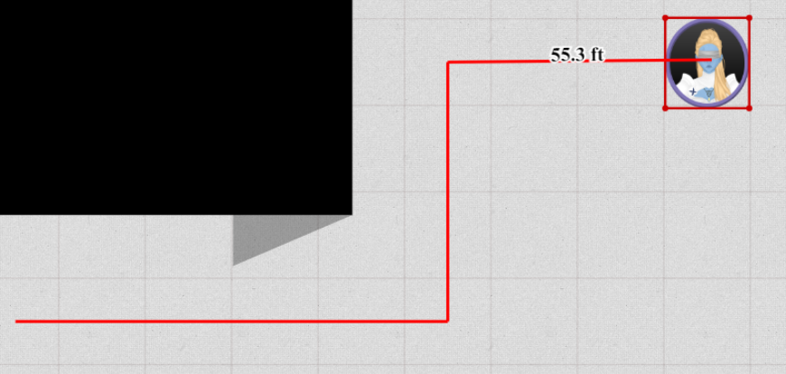

Ça fait un moment ! Mais j'ai eu beaucoup de temps libre le mois dernier, donc cette version contient des fonctionnalités passionnantes et un tas de correctifs de bugs !

Un petit avertissement lors de l'ouverture d'une carte dans la nouvelle version :
En raison d'un correctif de bug avec le zoom pour les tailles de grille non par défaut, il est probable que votre premier chargement d'une carte soit légèrement décentré
par rapport à l'endroit où votre caméra se trouvait la dernière fois. Cela ne devrait normalement pas être très loin de l'emplacement d'origine.
Si vous avez du mal à retrouver vos éléments, essayez la barre d'espace pour centrer sur vos pions ou ctrl+0 pour aller au centre du monde.
Si vous avez toujours des problèmes, contactez-moi et je pourrai vous fournir du code de console.

## Hexagones

Une demande fréquente et à juste titre est la prise en charge des hexagones.
Je peux maintenant enfin dire qu'il existe _un certain_ support.

Dans le cadre des paramètres de grille du DM, vous pouvez désormais sélectionner le type de grille, qui est par défaut une grille carrée,
mais qui peut être changé en hexagones plats ou pointus.
Cela peut être configuré au niveau d'une campagne ou d'un emplacement.

<video autoplay loop muted style="max-width: min(680px, 75vw);">
    <source src="/blog/release-0.24/hexagons.webm" type="video/webm" />
    <source src="/blog/release-0.24/hexagons.mp4" type="video/mp4" />
</video>

_Il se peut que ce ne soit pas extrêmement clair à cause de ma faible opacité de grille, désolé pour cela_

Un point important à savoir est que l'accrochage à la grille n'est pas encore pris en charge, je recommande donc fortement d'inverser votre comportement ALT pour le moment lors de l'utilisation d'hexagones.

## Améliorations des groupes

Les groupes sont une façon d'organiser les formes avec un badge optionnel pour les différencier (par ex. ogre 5).
Au sein d'un groupe, chaque forme a une valeur unique : son badge.

Jusqu'à cette version, il existait un concept de groupement implicite qui s'appliquait lors du copier-coller d'une forme.

Cette version étend considérablement le système de groupes et le rend beaucoup plus configurable et explicite.

Un nouvel onglet dans la boîte de dialogue de modification de la ressource est désormais disponible pour les propriétaires de formes/DM.
Cet onglet permet la configuration de divers éléments liés au groupe auquel appartient la forme sélectionnée.

Les jeux de caractères peuvent être configurés ; 2 jeux prédéfinis sont disponibles, mais vous êtes libre de définir un jeu personnalisé (par ex. `α,β,γ,δ,ε,ζ,η,θ,ι,κ,λ,μ,ν,ξ,ο,π,ρ,ς,τ,υ,φ,χ,ψ,ω`).

Les badges peuvent être activés/désactivés individuellement ou pour tout le groupe à la fois. Les membres individuels peuvent être supprimés et le groupe entier peut également être supprimé.

Les badges peuvent désormais également être randomisés pour tempérer les joueurs métagameurs potentiels.

<video autoplay loop muted style="max-width: min(680px, 75vw);">
    <source src="/blog/release-0.24/groups.webm" type="video/webm" />
    <source src="/blog/release-0.24/groups.mp4" type="video/mp4" />
</video>

De plus, il existe désormais une nouvelle option de menu contextuel liée aux groupes lors d'un clic droit sur une sélection de formes.
Cela vous permet de créer/fusionner/scinder/supprimer des groupes comme bon vous semble.

Cela signifie également que les groupes ne sont plus limités aux formes de la même ressource !

Pour plus d'informations sur le système de groupes, [consultez la documentation](/fr/docs/game/assets/#group)

## Variantes

_C'est **expérimental**, je m'attends à l'apparition de cas limites, alors n'hésitez pas à me signaler tout bug que vous rencontrez !_

Une nouvelle fonctionnalité pour les formes est la possibilité d'ajouter des variantes. Les variantes sont définies de manière large comme toute autre forme vers laquelle on pourrait vouloir basculer sans avoir à créer un nouveau pion et à supprimer un pion précédent.
Pensez aux formes sauvages, aux arts alternatifs, aux boss multi-étapes, aux révélations surprises...

À tout moment, une seule variante est visible et peut être remplacée par une autre.
Chaque variante conserve sa propre taille, ses propriétés et ses trackers, mais les trackers et les auras peuvent être configurés pour être partagés entre toutes les variantes.

<video autoplay loop muted style="max-width: min(680px, 75vw);">
    <source src="/blog/release-0.24/variants.webm" type="video/webm" />
    <source src="/blog/release-0.24/variants.mp4" type="video/mp4" />
</video>

Comme on peut le voir dans la vidéo ci-dessus, les variantes peuvent être créées, renommées et supprimées depuis un nouvel élément d'interface en bas de la boîte de dialogue d'édition de la forme.

#### Limitations connues

Lors de la création d'une nouvelle variante, elle n'aura aucun des réglages appliqués de la variante de base.
Cela inclut les droits d'accès, les propriétés générales de la forme (par ex. nom, est-ce un pion, etc.) ou les annotations !

Pour le moment, vous ne pouvez ajouter de nouvelles variantes que s'il s'agit de ressources dans votre gestionnaire de ressources. La forme de base peut toutefois être n'importe quelle forme.
À l'avenir, vous pourrez également sélectionner un pion de base comme alternative au lieu de ne pouvoir choisir que depuis le gestionnaire de ressources.

Pour le moment, il n'est pas possible d'enregistrer une forme avec des variantes dans la base de données ; cela sera possible à l'avenir lorsque vous pourrez également enregistrer d'autres formes personnalisées dans la base de données.

## Outils

### Initiative

L'outil d'initiative a reçu quelques petits changements : il dispose désormais d'un bouton explicite pour supprimer les effets, au lieu de ne compter que sur la suppression automatique pour les nombres négatifs.

De plus, le compteur de tours commence désormais à 1 au lieu de 0, et de nombreux bugs liés à la synchronisation de l'initiative ont été corrigés.

### Map

L'outil Map dispose désormais d'une fonctionnalité de maintien du ratio ! Lors de la configuration des valeurs de grille, une icône de verrouillage peut être activée pour forcer le verrouillage du ratio.

Une autre nouveauté est que vous pouvez décider de sauter la sélection de redimensionnement, mais plutôt de redimensionner directement l'ensemble de la ressource.
Cela peut être fait en nombre de cellules de grille ou en pixels.

### Ruler

Le ruler a reçu un nouveau raccourci clavier qui vous permet de courber les rulers.
En appuyant sur 'espace', vous pouvez commencer un nouveau ruler à partir du point final du dernier ruler.
La distance affichée est la somme totale de tous les rulers actuels combinés.

Vous pouvez désormais également activer 'show ruler' sur l'outil de sélection, pour afficher un ruler lors du déplacement des formes.
Cela affichera un ruler commençant à la position d'origine de la forme et suivant la forme que vous déplacez activement.
Cela prend également en charge 'espace' pour mesurer les distances derrière les coins.

Lors de l'utilisation du ruler en mode sélection, il conservera le mode de confidentialité (c'est-à-dire public/privé) de l'outil ruler.

### Vision

Le comportement de l'outil Vision a changé lorsque vous désélectionnez la dernière forme. Dans le passé, il resélectionnait immédiatement tout.
C'était toutefois très contre-intuitif et agaçant, cela a donc été supprimé.

Pour rendre visuellement clair que vous limitez votre vision à un ensemble sélectionné de pions,
l'outil Vision aura désormais une couleur de fond différente lorsqu'il n'affiche pas tout.

## Import/export de ressources

La dernière version a vu l'ajout des modèles. Il est désormais possible d'exporter des ressources de la bibliothèque de ressources vers votre ordinateur local et de les téléverser vers un autre serveur PA ou de les conserver comme une sorte de sauvegarde.

Le fichier exporté se terminera par l'extension '.paa', abréviation de planar ally assets. Il conservera la structure de dossiers et le schéma de nommage exacts que vous aviez, y compris toutes les informations de modèles.

Lors de l'importation d'un fichier paa, tout sera extrait dans le dossier actuel que vous consultez.
Prenez en compte que les fichiers portant le même nom ne seront pas écrasés, mais que les nouveaux fichiers et dossiers seront toujours créés.

<video autoplay loop muted style="max-width: min(680px, 75vw);">
    <source src="/blog/release-0.24/export.webm" type="video/webm" />
    <source src="/blog/release-0.24/export.mp4" type="video/mp4" />
</video>

**Important** La vidéo ci-dessus est accélérée (ou plutôt certaines images ont été coupées) car le processus dépend de la taille des fichiers/dossiers et peu de retours sont fournis pendant cette période actuellement. J'espère améliorer cela dans les prochaines versions, mais cela fournit une base fonctionnelle pour le moment.

## Améliorations générales de l'UX

### Ouverture de la boîte de dialogue d'édition

La boîte de dialogue d'édition pouvait toujours être ouverte depuis le menu contextuel de la forme (clic droit) ou l'info de sélection rapide en haut à droite.

Vous pouvez désormais également appuyer sur 'entrée' sur une forme sélectionnée pour ouvrir immédiatement cette fenêtre.

### Se déplacer

Vous pouvez désormais utiliser le pavé numérique pour naviguer, avec un support complet du mouvement en hexagones.
Appuyer sur 5 centrera l'écran sur l'origine.

### Boîte de dialogue de création de pion

Le champ de saisie est désormais automatiquement focalisé et appuyer sur entrée soumettra les informations !

### Outils généraux

La plupart des outils prennent désormais en charge le menu contextuel (clic droit) sur les formes sélectionnées sans avoir à passer à l'outil de sélection.

Il y a deux exceptions à cela : draw et map. Ceux-ci ont leur propre comportement de clic droit.

De plus, les outils de filtre et de vision permettent d'utiliser un plus large éventail d'options de l'outil de sélection sans changer d'outil.

Enfin, lors du passage à un mode d'outil que l'outil actuel ne prend pas en charge, passez automatiquement à l'outil Select.

### Performance de suppression

Lors de la suppression de plusieurs formes à la fois, en particulier liées à la vision/l'éclairage, le client pouvait subir une grosse perte de performance ou même se figer complètement et ne supprimer qu'en partie.

Cela était dû à un recalcul assez inefficace de la triangulation vision/éclairage. Cela est désormais fait plus intelligemment et se traduit par un comportement **beaucoup** plus réactif.

## Correctifs notables

### Sélection de formes

Deux correctifs ont été apportés à la sélection de formes concernant les formes pivotées :

Lors d'un clic sur une forme pivotée dans l'intention de la sélectionner, le code sélectionnait la forme si vous cliquiez à un emplacement que la forme non pivotée occuperait.

Lors d'une sélection de groupe, les polygones (et autres formes) utilisaient leur plus grande boîte englobante pour déterminer la collision de hit.
C'est plutôt imprécis et cela a désormais été changé pour être exact.

## Autres changements

Certains changements techniques plus petits qui ne devraient pas immédiatement impacter les utilisateurs finaux ont également été apportés :

- Mise à niveau vers socket.io v3
- Réduction du nombre de calculs utilisés pour déterminer la portée minimale de vision des pions

## Autres correctifs

- Le verrouillage des formes via le raccourci clavier n'était pas synchronisé avec le serveur
- Affichage des annotations d'autres étages
- Mémorisation de la visibilité du ruler lors du changement d'outil
- `Ctrl 0` centre désormais la vue sur l'origine (avant, il montrait l'origine en haut à gauche de la vue)
- Effets d'initiative devenant NaN pour des entrées non numériques
- Les nouveaux effets d'initiative ne se synchronisant pas immédiatement jusqu'à un rafraîchissement complet du client
- Les mises à jour des noms de formes (noms publics) ne se synchronisant pas pour les utilisateurs qui ne possèdent pas la forme
- Les mises à jour des noms de formes ne se mettant pas toujours à jour dans la liste d'initiative
- Le déplacement des formes avec les permissions de mouvement par défaut ne fonctionnant pas
- Divers bugs avec les mises à jour des permissions d'initiative
- Les valeurs négatives pour les auras ne causent plus de problèmes de rendu
- Les trackers ne fournissant pas de lignes vides jusqu'à la réouverture de la boîte de dialogue
- Le collage de formes résultant en des lignes de trackers vides supplémentaires
- Le redimensionnement des rectangles causant un décalage de position
- Les changements d'emplacement ne passant parfois pas pour tout le monde
- Le redimensionnement des formes pivotées avec accrochage s'accroche désormais correctement aux points de la grille
- Les ressources déposées ne se rendant pas immédiatement
- Formes avec une valeur d'index cassée (utilisée pour le passage à l'arrière-plan/au premier plan)
- Zone en haut au centre de l'écran où la souris ne pouvait parfois pas être utilisée
- Les auras devenues publiques ne sont pas correctement configurées comme source de vision sur les autres clients
- Sélection des rectangles et ressources pivotés
- Sélection de groupe des formes pivotées
- Doubles entrées dans l'outil Vision
- La plupart des ressources se redimensionnant automatiquement pour tenir dans 1 cellule de grille
    - elles conservent désormais leur taille d'origine lors du dépôt (sauf en cas d'utilisation de modèles)
- État incorrect dans le gestionnaire de ressources lors d'une reconnexion
- Ordre de tri dans le gestionnaire de ressources
- La sélection avec maj dans le gestionnaire de ressources se comportant bizarrement en mélangeant fichiers et dossiers
- Plus de cas où l'outil ruler et ping pouvaient se bloquer
- Les boîtes de dialogue des outils se déplacent désormais correctement lors du changement de mode
- La boîte de dialogue d'édition reste ouverte lors de la sélection d'une autre forme
- Le déplacement d'étage ne recalculant pas la triangulation vision/mouvement
- Sélection incluant des formes hors de la vision
- L'ajout/suppression de libellés n'étant plus synchronisé par le serveur
- L'étage actuel n'étant plus mis en évidence dans le menu contextuel
- Problèmes multiples lors d'une taille de grille client modifiée
    - auras/zoom/map utilisaient tous de mauvais calculs
- La téléportation vers un emplacement d'apparition ne changeant que l'emplacement sans définir la position
- Synchronisation de la visibilité des libellés
- L'initiative ne fonctionnant possiblement pas lors des changements d'emplacement
- [DM] Le renommage d'étage définissant toujours un nom vide
