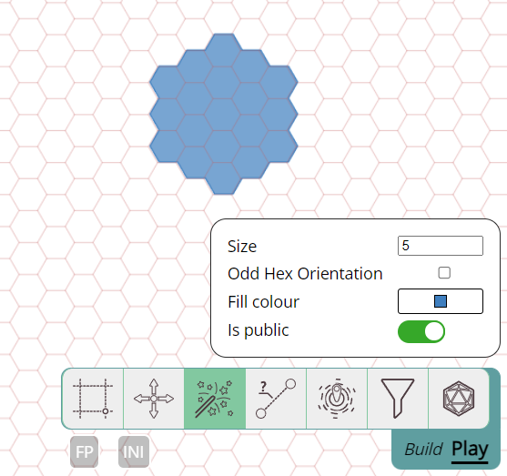

Cela fait encore quelques mois depuis la dernière release, alors sans plus attendre, voici quelques nouveautés :)

### Rappel de l'avis de dépréciation

Comme annoncé dans la release précédente, le système d'étiquettes/filtres est déprécié et sera supprimé dans la prochaine release.

## Système de chat simple

Cette release introduit un système de chat simple qui vous permet de discuter avec les autres joueurs de la campagne.

Il est conçu pour être simple et direct. Un peu de mise en forme est disponible sous forme de markdown, et les URL d'images sont automatiquement converties en images.

Il est important de noter que les messages envoyés ne sont actuellement pas stockés sur le serveur. Ainsi, tout rafraîchissement ou toute reconnexion à la session effacera l'historique du chat.

Il ne m'est pas toujours facile de savoir quels types de groupes utilisent PA, c'est pourquoi la fonctionnalité de chat est relativement minimale.
Si un historique de chat persistant ou d'autres fonctionnalités de chat pourraient aider votre groupe, contactez-moi !

Pour plus d'informations sur le chat, voir la [documentation](../../docs/game/chat) ; des informations sur le markdown se trouvent [ici](../../learn/dm/Markdown_Tutorial/markdown/).

## Améliorations des dés

Une grande partie de cette release a été consacrée à l'amélioration de divers aspects du système de lancer de dés.

### Interface de l'outil de dés

L'interface de l'outil de dés a été entièrement refondue.

#### Mode non-3D

Auparavant, la seule façon de lancer des dés était de les simuler avec des objets 3D.
Cela peut être amusant, mais ce n'est pas toujours la meilleure option pour diverses raisons.

Désormais, il existe une option pour résoudre automatiquement les résultats des dés sans simulation 3D.

#### Améliorations de la saisie

La version précédente avait un champ de saisie de texte et une interface de clic simple pour sélectionner les dés sans les taper (par ex. cliquer 3 fois sur 'd6' ajoutait 3d6 à la zone de texte).

Cela fonctionnait, mais était assez limité. L'interface « clic » a été considérablement étendue.

La grammaire du parseur de dés a aussi été étendue et permet désormais des expressions plus complexes comme « kh2 (keep highest 2) » et autres.

#### Partage des résultats

Il est désormais possible de lancer des dés de manière totalement privée, sans que le DM ne voie les résultats non plus.

Les utilisateurs qui reçoivent des résultats de lancer d'un autre joueur peuvent désormais cliquer sur la notification pour voir les détails du lancer.

#### Interface des résultats et historique

L'interface qui affiche les résultats du lancer de dés a aussi légèrement changé.

Pour réduire l'encombrement, les lancers individuels d'un groupe (par ex. 3d6) ne sont plus affichés, mais peuvent être révélés en survolant le groupe.

L'historique des lancers a aussi légèrement changé et, en cliquant sur une ligne de l'historique, l'interface complète du résultat s'affichera à nouveau.

### Mise à jour de la bibliothèque 3D

Pour la simulation 3D, le moteur de jeu babylonjs est utilisé. Il a été mis à niveau de la version 4 à la version 7.
Ce changement inclut aussi un changement dans le moteur physique utilisé, car babylonjs utilise désormais le moteur havok au lieu d'ammo.

La logique de lancer 3D a aussi légèrement changé, mais dans l'ensemble, un comportement identique est attendu.

### Bibliothèque planarally-dice et systèmes de dés

Actuellement, une grande partie de l'interface des dés s'articule autour du système d20, courant dans D&D, mais aussi dans certains autres systèmes.

Cela dit, la bibliothèque de dés elle-même a été réécrite pour pouvoir supporter une grande variété de systèmes de dés.
L'interface de PA n'a toutefois encore aucun moyen de basculer entre les systèmes, elle utilise donc actuellement le système d20 par défaut.

Je réfléchis actuellement à la meilleure façon d'offrir d'autres systèmes de dés dans PA lui-même.
(par ex. avoir un réglage « dice system » dans vos paramètres de campagne DM, peut-être même un réglage général « rpg system ».)

Donc d'autres changements liés aux systèmes rpg/dés pourraient arriver à l'avenir.

## Manœuvres en donjon plus faciles

Il peut parfois être pénible de déplacer un groupe de pions à travers quelques couloirs étroits avec des virages à cause des collisions avec les murs.
Au départ, je les groupais souvent manuellement bien serrés, puis les répartissais à nouveau une fois arrivés à un point où la position redevenait importante.
Plus récemment, je déplaçais généralement juste 1 forme et déplaçais les autres vers l'emplacement final avec shift, simplement parce que c'était moins de travail.

Aucune de ces solutions n'est très bonne, cette release ajoute donc une nouvelle fonctionnalité qui combine un peu les deux approches de manière moins manuelle.

Vous pouvez désormais faire un clic droit sur un groupe de formes et sélectionner « Collapse » (regrouper), ce qui déplacera toutes les formes pour les centrer sur la forme à partir de laquelle vous avez lancé le regroupement.
Ainsi, pendant que vous déplacez cette seule forme, toutes les autres suivront automatiquement. Une fois une certaine position atteinte, vous pouvez faire un clic droit et « Expand » (déployer),
ce qui repoussera toutes les formes vers leur position d'origine par rapport à la forme à partir de laquelle vous avez lancé le regroupement.

Il existe aussi un raccourci clavier : en maintenant la lettre 'c' (pour collapse), votre sélection se regroupera, et elle se déploiera automatiquement au relâchement du bouton de la souris ou en appuyant de nouveau sur 'c'.

<video autoplay loop muted style="max-width: min(750px, 75vw);">
    <source src="/blog/release-2024.3/collapse-drag.webm" type="video/webm" />
    <source src="/blog/release-2024.3/collapse-drag.mp4" type="video/mp4" />
</video>

 
 

## Fonctionnalités de campagne

Un ajout plus modeste est la possibilité pour le DM de désactiver certaines fonctionnalités.
En particulier, les outils de chat et de dés peuvent être désactivés à partir de cette release.

C'est davantage une fonctionnalité bêta, car je ne suis pas encore sûr de ce que j'en pense.
Ces réglages pourraient être plus appropriés comme préférences utilisateur à la place.

## Outils

### Changement d'interface de la barre d'outils

Un petit changement dans l'interface de la barre d'outils : toutes les interfaces étendues des outils seront désormais entièrement alignées à droite au lieu de flotter au-dessus de l'outil concerné.
Cela signifie aussi que la petite flèche qui reliait l'interface de l'outil et la barre d'outils a maintenant disparu.

En travaillant sur les changements de l'outil select (voir plus bas), il est apparu que l'interface des outils situés plus vers le centre posait quelques problèmes.
Soit l'outil ne pouvait pas avoir une grande interface, soit elle bloquait une grande partie de l'espace d'écran principal.

En déplaçant toutes les interfaces des outils vers la droite, elles peuvent occuper plus d'espace sans entrer en concurrence pour l'espace central de l'écran.

### état de l'outil select et du ruler

Lorsqu'une forme est sélectionnée, l'interface de l'outil select offrait une option pour ajouter un ruler au déplacement de la forme.

C'est assez pratique, mais les réglages de ce ruler (par ex. est-il visible par les autres joueurs) n'étaient configurables que dans l'outil ruler.
Cela signifiait que vous deviez souvent basculer entre les deux outils pour modifier ou confirmer les réglages du ruler.

Désormais, l'outil select affiche aussi les réglages du ruler et permet de les modifier directement.

### Hexagones dans l'outil spell

La release précédente a fait une grosse mise à niveau des hexagones, mais n'a pas couvert tous les endroits où ils pourraient être utiles.

Cette release voit l'outil spell prendre conscience du type de grille que vous utilisez et offre désormais l'option de créer des effets de sorts dans différentes tailles d'hexagones.

### Corrections de bugs

- Outil Draw : cliquer sur l'étiquette « blocks movement » dans le réglage de vision de l'outil Draw bascule désormais correctement la case à cocher associée
- Outil Ruler : la barre d'espace en mode grille ne synchronisait pas correctement l'extrémité accrochée avec les autres joueurs
