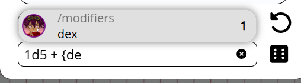

import Info from "/src/components/directives/Info.astro";
import Warning from "/src/components/directives/Warning.astro";

Quelques nouveautés excitantes dans cette release ! Parmi les points forts :

- Mises à jour UI/UX de l'Initiative et des Notes
- Corrections du copier-coller et des systèmes similaires
- Un nouveau concept de « custom data » (données personnalisées) a été ajouté aux formes, permettant notamment une simple feuille de personnage

<Info title="Avis de dépréciation">
    Les fonctionnalités des variantes seront simplifiées dans 2026.2, voir [Variantes](#variants) pour plus
    d'informations.
</Info>

Cette release était initialement prévue pour novembre/décembre, mais les refontes techniques (voir plus loin) ont finalement nécessité une période plus longue pour régler les problèmes de stabilité.

Cette release contient également des contributions de nombreuses personnes, merci à vous tous, ainsi qu'à toutes les personnes qui ont signalé des bugs sur la branche de développement !

<Warning title="Modifications de la configuration du serveur">Voir [la section serveur](#server-changes)</Warning>

## Initiative

_Ces changements ont été apportés par Rexy712_

Comme mentionné en introduction, l'UI a reçu quelques mises à jour, comme vous pouvez le voir ci-dessous.

Elle dispose désormais aussi d'un défilement interne (overflow scroll), afin que l'élément d'initiative lui-même ne devienne pas gigantesque s'il y a beaucoup d'acteurs dans l'initiative.

Autre nouveauté : lors de l'ajout d'effets, vous pouvez désormais rendre un effet infini dans le temps, alors qu'auparavant vous deviez toujours indiquer un nombre de tours avant qu'il ne disparaisse.

En tant que DM, vous avez maintenant aussi la possibilité de vider toute l'initiative d'un seul coup, ainsi que des boutons pour faire avancer l'initiative d'un tour complet.

## Les bases de la feuille de personnage

### Pourquoi

L'une des plaintes que je reçois de temps en temps tourne autour du manque de feuilles de personnage.
J'ai toujours pensé qu'une feuille de personnage générique qui conviendrait à tous les systèmes/usages n'est pas vraiment réalisable
et qu'en conséquence les feuilles de personnage sont mieux adaptées aux mods.

Cela dit, les mods restent très expérimentaux, demandent des connaissances techniques pour être créés
et, soyons honnêtes, PA est un VTT très de niche.
Il n'est donc pas surprenant qu'aucun travail n'ait réellement été fait dans ce domaine.

Je crois toujours qu'une feuille de personnage « taille unique » au rendu correct n'est pas vraiment réalisable,
mais je me suis lancé dans la création d'un système plus rudimentaire qui s'intègre au système de dés.
Ainsi, les mods pourront toujours utiliser ce système central commun en arrière-plan, tout en proposant une UI plus agréable visuellement.

### Comment

Cette release ajoute un nouvel onglet à l'UI « modifier la forme », appelé « custom data » (données personnalisées).

Vous pouvez y ajouter librement des données liées à la forme. Vous pouvez organiser les données dans un format de données arborescent.

Les données que vous pouvez ajouter peuvent actuellement être de l'un des 3 types suivants :

- texte
- nombre
- expression de dés

La plupart de ces types sont assez explicites. Ce qui est bien avec les expressions de dés, c'est que vous pouvez charger immédiatement l'outil de dés
avec l'expression donnée, qui peut référencer d'autres éléments de données personnalisées, appelés plus simplement références.

Vous pouvez également utiliser ces références directement dans l'outil de dés, qui affichera une UI d'autocomplétion pour vous aider à sélectionner la statistique de la forme correcte.

Autre ajout à l'outil de dés : un bouton rapide est présent pour chaque forme de votre sélection qui possède des expressions de dés.
Ainsi, vous n'avez plus à ouvrir constamment les paramètres de la forme, naviguer jusqu'à l'onglet des données personnalisées et cliquer sur le bouton de lancer pour le jet souhaité.

### Futur

L'objectif est de mettre à jour d'autres endroits pour interagir également avec les références.
Les trackers et les auras étant parmi les endroits les plus évidents qui pourraient bénéficier de cette interaction.
(par ex. un tracker de PV lié à une référence de PV)

Une autre chose que j'aimerais faire, c'est créer un véritable mod de feuille de personnage spécifique à un système comme vitrine convenable.
Il y a cependant pour moi un gros problème de licence/droits à cet égard.

Pour beaucoup de systèmes, ce n'est pas autorisé, ou des contrats doivent être en place, pour proposer ces choses à titre officiel.
D&D, par exemple, est un système que je suis très réticent à toucher à cet égard, même s'il existe la SRD,
car ils n'ont pas vraiment été accueillants envers les autres acteurs étant donné qu'ils ont leurs propres outils.
De même, j'ai contacté les gens de Mothership pour voir ce qui était possible, mais j'ai reçu un message indiquant qu'aucune intégration VTT n'est actuellement autorisée.
Le système Wildsea est très ouvert et j'ai d'ailleurs commencé à travailler sur un mod lié à Wildsea dans le dépôt des mods d'exemple,
mais mon gros problème là-bas, c'est que ce système est en fait l'un des rares pour lesquels je n'utilise moi-même aucun VTT,
donc cela semble un peu absurde.

Je ne suis donc pas vraiment sûr de ce que je vais faire à l'avenir, car c'est une situation où je suis maudit si je le fais et maudit si je ne le fais pas :
légalement, je ne peux pas faire grand-chose, mais les gens semblent vouloir des intégrations.

## Notes

Dans la release [2024.1](/fr/blog/release-2024.1), une grande refonte du système de notes a été introduite.
Elle a ajouté un framework unifié et une meilleure UI autour de certains concepts épars qui existaient auparavant.

Elle a introduit le concept selon lequel une note est soit une note globale, disponible dans toutes vos campagnes, soit spécifique à un emplacement de campagne.
L'idée étant que vous avez généralement des notes spécifiques à votre partie (locales) ou des notes dont vous avez souvent besoin comme les blocs de statistiques (globales).
Vous pouvez passer de local/global aux deux, et vous pouvez aussi faire des filtres comme « n'afficher que les notes de l'emplacement actuel ».

Maintenant, 2 ans plus tard, c'est le bon moment pour réévaluer ce que je pense du système et changer ce qui ne semble pas correct.

### Problèmes du système actuel

#### Notes de campagne

L'un des problèmes auxquels je suis souvent confronté, c'est que je crée beaucoup de notes qui ne sont pertinentes que pour un emplacement particulier.
Cela signifie que lorsque je suis sur l'emplacement X, soit je vois toutes les notes de chaque emplacement de ma partie, soit je ne vois que celles de mon emplacement actuel.

Sur le papier, cela semble bien, mais en pratique j'ai aussi des notes qui sont pertinentes pour toute la campagne et uniquement pour cette campagne.
Le problème, c'est que comme chaque note est intrinsèquement associée à l'emplacement où elle a été créée, ces notes à l'échelle de la campagne sont difficiles à trouver.
Si vous filtrez vos notes sur l'emplacement actuel, vous ne voyez plus les notes à l'échelle de la campagne (sauf si elles ont été créées par hasard dans votre emplacement actuel) ; si vous ne filtrez pas, vous voyez un million de notes et il est difficile de suivre quoi que ce soit.

Le filtre pour l'emplacement actif est aussi caché derrière un menu supplémentaire, ce qui rend son activation fréquente assez pénible.

#### Notes de forme

Une autre bizarrerie est que comme une note est associée à l'emplacement où elle a été créée, on se retrouve dans des situations gênantes lorsque la note est attachée à une forme et que cette forme change d'emplacement.
Cela faisait que la note n'apparaissait pas toujours au bon endroit.

#### Notes globales

Comme mentionné plus haut, les notes globales comblent un besoin pour certaines notes dont vous pourriez avoir besoin fréquemment. Dans ma vision d'origine, cela concernerait surtout les blocs de statistiques de monstres ou les règles des systèmes.
Depuis, certaines personnes m'ont fait remarquer qu'elles ont parfois des notes pertinentes pour une sélection de campagnes parce que les mêmes (P)PNJ peuvent y apparaître.

Le problème, cependant, c'est que pour les notes globales, la configuration de l'accès demande plus de travail, car comme elles n'appartiennent pas à une campagne particulière, PA ne sait pas quels joueurs suggérer.
Vous devez donc lier manuellement chaque joueur à chacune de ces notes, ce qui peut devenir pénible assez rapidement.

#### Notes d'emplacement

Une dernière gêne : comme vous n'avez le choix qu'entre « tous les emplacements » ou « emplacement actuel », toute note d'un autre emplacement que vous voulez simplement consulter rapidement nécessite soit de changer complètement d'emplacement, soit de fouiller toutes les notes.
Cette dernière option peut être réalisable ou non selon que vous vous souvenez du titre.

### Ce qui change

Avec ces points douloureux à l'esprit, cette release remanie certains concepts.

#### Abandon du concept Global/Local

Le local-global n'a finalement pas fonctionné comme je l'espérais initialement.
En réalité, les notes varient beaucoup dans leur usage et peuvent être pertinentes pour 1 emplacement, plusieurs emplacements dans plusieurs campagnes, ou ne concerner réellement aucune campagne spécifique.

En conséquence, l'accent est désormais mis sur la liaison d'une campagne et/ou d'un emplacement spécifique à une note.
Lors de la création d'une note, vous choisissez maintenant si son objectif principal est à l'échelle de la campagne, spécifique à un emplacement ou sans lien particulier,
mais vous pouvez toujours lier n'importe quel autre emplacement.

#### UI de filtre

À la place du panneau de préférences déroutant + de la barre de filtre par tags, l'UI de recherche/filtre a été remaniée en une barre de filtre active, toujours immédiatement accessible, qui vous permet d'afficher les notes d'emplacements sur lesquels vous n'êtes pas actuellement actif.

#### Pagination côté serveur

Une chose qui n'était pas spécifiquement mentionnée dans les points douloureux, c'est que jusqu'à présent les notes étaient paginées entièrement côté client.
Cela signifie que toutes les notes devaient être fournies au client lorsque vous chargez une campagne.
C'était facile pour obtenir rapidement une version fonctionnelle au début, mais cela ajoute de la charge au temps de démarrage et à la base de données,
alors qu'en réalité vous n'interagissez généralement pas avec la majorité des notes.

Désormais, les notes ne sont récupérées du serveur que lorsqu'elles sont réellement demandées.

L'UI de pagination a également été déplacée en bas à gauche et rendue visuellement plus claire.

#### Tags

Il était possible d'ajouter librement des tags à n'importe quelle note. Il n'y avait cependant aucune vraie amélioration de confort d'utilisation pour vous aider à gérer les tags.
Vous deviez à peu près savoir exactement comment vous aviez tapé un tag particulier par le passé pour l'ajouter à une nouvelle note, car il n'y avait ni menu déroulant, ni autocomplétion, ni recherche, ni quoi que ce soit.

Cette release change cela : les tags sont désormais correctement gérés dans une collection de base de données séparée au lieu d'être des données json aléatoires attachées à une note.
Cela permet à l'UI d'afficher réellement les tags existants dans les détails de modification de vos notes et de les faire apparaître aussi dans la barre de filtre de l'UI.

<video autoplay loop muted style="max-width: min(680px, 75vw);">
    <source src="/blog/release-2026.1/notes-tags.webm" type="video/webm" />
    <source src="/blog/release-2026.1/notes-tags.mp4" type="video/mp4" />
</video>

.

## Variantes

### Corrections de permissions

_contribution de Rexy712_

La façon dont l'accès/permissions des formes variantes était configurée empêchait les non-DM de modifier certains de leurs aspects.
Les corrections suivantes ont été apportées :

- Les joueurs peuvent désormais ajouter des variantes aux formes auxquelles ils ont un accès en modification
- Les joueurs peuvent désormais alterner entre les variantes des formes auxquelles ils ont un accès en modification
- [tech] Les permissions d'accès des variantes sont désormais basées uniquement sur les permissions de la forme parente

### Annonce de la refonte

Les variantes sont actuellement implémentées d'une manière assez compliquée.
Pour chaque variante, il existe une véritable instance de forme ainsi qu'une forme de contrôle cachée qui est responsable de l'affichage de la bonne forme et de la gestion de l'état/des interactions de toutes les variantes.

L'aspect positif de cela est que chaque variante peut être entièrement configurée pour être ce que l'on veut. Tous les paramètres de forme sont uniques à cette variante, ce qui permet une liberté créative totale.

Cela comporte cependant beaucoup d'inconvénients.

- Tout concept censé être partagé entre les variantes doit être dupliqué. Tout changement que vous faites et qui pourrait s'appliquer à toutes les variantes doit être fait sur toutes les variantes.
    - L'exception étant les trackers/auras pour lesquels un système spécial a été ajouté pour les rendre partageables.
- Tout le codebase doit faire de la logique supplémentaire uniquement pour ce concept de niche, car la façon dont les formes sont gérées affecte beaucoup d'interactions
    - Cela ajoute une surcharge supplémentaire à chaque autre fonctionnalité pour essayer de bien fonctionner avec d'éventuelles formes variantes
- Comme elles fonctionnent si différemment de la grande majorité des formes, elles finissent souvent par avoir des problèmes subtils

La réalité, c'est que la liberté créative totale pour chaque forme ne vaut pas toute cette peine et, en pratique, n'est simplement pas nécessaire dans la grande majorité des cas.
Au fond, l'idée des variantes est simplement de pouvoir alterner rapidement entre quelques ressources graphiques avec potentiellement quelques petites différences.

Les petites différences que je peux imaginer comme réellement utiles sont la taille du pion, potentiellement un nom différent et quelques trackers/auras.

J'ai l'intention de réduire toute la complexité des formes multiples et de l'alternance entre elles à une seule forme.
Cette forme unique aura un nouvel onglet pour gérer les variantes, où vous pourrez ajouter une nouvelle entrée avec une icône et un nom.

Et c'est tout. Pour les trackers et les auras, cela signifie aussi que le concept spécial « partagé » peut être supprimé.
Mes plans initiaux sont de ne proposer aucune interaction spéciale pour les trackers/auras et de simplement laisser l'utilisateur activer/désactiver les trackers/auras comme nécessaire lors du changement de variantes.
Si cela s'avère trop pénible, je suis ouvert à l'idée d'ajouter une logique d'activation/désactivation spécifique aux trackers/auras dans le nouvel onglet des variantes.

Cela signifie aussi que l'UX sera globalement améliorée, car il n'est actuellement pas possible de charger directement une variante particulière si vous en avez plusieurs configurées.
Vous devez actuellement faire défiler les variantes une par une, ce qui les révèle momentanément à tous les joueurs qui peuvent voir la forme.

<Warning>
    Cela sera modifié dans 2026.2. Si vous avez des inquiétudes/problèmes avec ce changement, contactez-moi pour que
    nous voyions ce qui est possible.
</Warning>

## Corrections de l'accrochage à la grille

_contribution de Rexy712 et Craftidore_

Une série de corrections du comportement d'accrochage ont été apportées.

### Interactions clavier

Le mouvement au clavier s'accroche désormais aussi à la cellule de grille la plus proche (lorsque l'accrochage est pertinent).
Jusqu'à présent, cela n'était pas fait, ce qui causait des cas bizarres où vous déplaciez une forme hors grille parce qu'elle avait touché un mur en cours de route.

De plus, un bug a été corrigé qui faisait que le mouvement au clavier déplaçait une forme deux fois si la Ruler était activée dans l'outil Select pendant le déplacement.

### Taille horizontale vs verticale

Dans [2024.2](/fr/blog/release-2024.2#shape-grid-size), un contrôle plus fin sur la taille d'une forme dans le contexte de la grille a été ajouté.
Permettant à l'utilisateur d'indiquer la taille que la forme devrait occuper sur la grille lorsqu'elle est déplacée, indépendamment de la taille réelle de l'image.
Elle vous montrait également la taille estimée que PA pense que la forme fait.

Cette release apporte d'autres améliorations en divisant cette propriété de taille en un composant horizontal et un composant vertical (pour les grilles carrées).
Cela corrige certains comportements d'accrochage lorsqu'une forme est irrégulière (par ex. 2x7).

## Refontes techniques

### Améliorations de la duplication des données

PA a subi plusieurs refactorisations techniques qui ont corrigé un certain nombre de problèmes de longue date,
que je ne pouvais pas corriger avant ces changements.

En particulier, deux choses ont été modifiées :

- La façon dont les données intermédiaires des formes sont représentées côté client
- La façon dont les modèles (de formes) sont stockés dans la base de données

Je vous épargne les détails techniques, mais le résultat est que les actions suivantes partageaient toutes une variété de bugs qui devraient désormais fonctionner correctement

- annulation/rétablissement (undo/redo) de la suppression de formes
- copier-coller d'une forme
- déposer un modèle sur la table de jeu

Ces 3 systèmes ont tous existé et fonctionné (dans une certaine mesure). Ils n'étaient cependant pas capables de gérer les informations de forme stockées dans des endroits plus spécialisés.
Les notes, par exemple, sont stockées dans une collection de base de données séparée, ce qui fait que l'undo/redo oubliait la relation entre une note et une forme, et que le copier-coller n'en avait aucune idée non plus.

Au lieu d'avoir à ajouter des cas spéciaux un peu partout, la nouvelle restructuration fonctionne de telle sorte que les 3 systèmes ci-dessus n'ont pas réellement besoin de connaître les détails, ça fonctionne tout simplement.

### Modèles de ressources

#### Changements de stockage

Les modèles de ressources sont un système sympa qui permet à l'utilisateur d'enregistrer des données liées à une certaine ressource,
de sorte que si vous déposez la ressource sur la table de jeu à l'avenir, elle soit pré-remplie. (par ex. se souvenir des PV/CA d'un gobelin)

Parmi les problèmes mentionnés dans la section précédente, les modèles avaient aussi quelques autres soucis.
De par la façon dont ils étaient stockés dans la base de données, ils n'étaient pas affectés par les migrations de la base de données vers une nouvelle version.

Cela signifie que des modèles créés dans des versions antérieures pouvaient potentiellement ne pas se comporter correctement lorsqu'ils étaient utilisés dans une nouvelle version.

Ils seront désormais stockés comme des formes classiques dans la base de données, ce qui permet la migration automatique et rend aussi certaines autres logiques internes plus cohérentes.

#### Icône du gestionnaire de ressources

Ce n'est pas une refonte technique, mais cela concerne les modèles de ressources.

Le gestionnaire de ressources affiche désormais une icône sur les ressources qui ont des données de modèle.
Cela aide si vous avez plusieurs ressources avec le même nom (à cause de collections différentes ou autre) et
que vous n'êtes pas sûr de celle pour laquelle vous avez enregistré des informations.

### Mise à niveau de Pydantic

C'est une mise à niveau purement technique d'une bibliothèque de validation de données utilisée par le serveur.
Elle a cependant un impact significatif sur le flux de données et, bien qu'il ne devrait y avoir aucun changement réellement perceptible pour les joueurs,
il est toujours possible que j'aie manqué certains cas provoquant des erreurs dans le serveur.

Je le mentionne ici surtout pour les hébergeurs de serveurs,
afin que s'ils voient des erreurs de validation apparaître dans leurs journaux serveur,
ils signalent ces problèmes dès que possible !

## Corrections de bugs

#### Incohérence de l'ordre des formes

Pour garantir que les formes soient affichées visuellement dans le bon ordre lorsqu'elles se chevauchent,
le serveur garde la trace d'une position par forme.
Lors du déplacement d'une forme, certaines formes doivent voir leur position ajustée car elles peuvent être montées ou descendues.

Bien que cela fonctionne plutôt bien depuis longtemps,
il n'existe aujourd'hui aucune véritable correction d'erreur,
donc si pour une raison quelconque quelque chose bug quelque part et cause un trou dans l'ordre ou une entrée de position en double,
cela peut provoquer des comportements bizarres.

Vérifier constamment l'intégrité de l'ordre serait assez coûteux,
j'ai donc cherché un endroit où l'incohérence peut être vérifiée facilement et qui n'est pas exécuté fréquemment.

Désormais, si vous effectuez l'action « déplacer la forme à l'arrière »,
une vérification sera faite pour voir si le nombre de formes mises à jour correspond au nombre attendu.
Si ce n'est pas le cas, toutes les formes seront repositionnées et une notification apparaîtra pour tous les clients connectés
expliquant le problème et demandant un rafraîchissement pour garantir la justesse visuelle.

De plus, la requête de mise à jour des positions a été améliorée d'un point de vue performance,
même si vous ne le remarquerez probablement pas.

## Changements côté serveur

### Logging

_contribution de nwhansen_

Le comportement de journalisation (logging) peut désormais être configuré à l'aide de la configuration du serveur.

Cela permet au propriétaire du serveur de choisir si des journaux fichier sont conservés et quelle sévérité les différents loggers capturent.

Voir [la doc de configuration](/fr/server/management/configuration/#logging) pour plus de détails.

<Warning title="Modifications de la configuration du serveur">
    Avec ce changement, la journalisation par défaut se fait uniquement sur stdout, donc plus de journalisation fichier comme avant cette release.

    De plus, les paramètres de journalisation « max_log_backups » et « max_log_size_in_bytes » qui se trouvaient à l'origine dans la section « general » de la configuration sont désormais déplacés dans la section de journalisation fichier.
    Si vous les aviez configurés spécifiquement, votre serveur ne démarrera plus !

</Warning>

## Varia

- les images de direction des pions hors écran débordaient de leur conteneur
- les raccourcis clavier ignorés dans un élément select
- l'esperluette dans le nom d'une campagne cassait la partie
- corrections des polygones pivotés
    - la découpe
    - le déplacement des points
- le créateur d'une campagne ne peut plus changer son propre rôle ni s'exclure lui-même
- le texte des paramètres du compte se chevauchait sur les petites largeurs de vue
- déplacer des formes spéciales de masquage/révélation depuis le calque du brouillard de guerre pouvait conduire à un bug de niche
- le curseur de rotation n'affichait pas la valeur actuelle dans le champ texte au chargement du composant
- les fichiers DDraft ne pouvaient plus être téléversés dans le gestionnaire de ressources
- survoler une entrée d'initiative faisant partie d'un groupe mais non marquée comme entrée de groupe surlignait tous les membres du groupe
- erreur de journalisation à propos des vues sur le serveur
- l'activation/désactivation de l'initiative cassait les interactions de verrouillage de vision
- la roue crantée de l'initiative n'ouvrait pas l'onglet initiative dans les paramètres du client
- les entrées d'initiative restaient floues si l'entrée focalisée était supprimée par un autre joueur.
- le système de groupes ne faisait pas correctement le nettoyage lors des changements d'emplacement
- les badges de groupe n'étaient pas triés numériquement dans les paramètres de groupe d'une forme lorsqu'ils étaient réglés sur le jeu de caractères numériques.
- la saisie du tracker revient à la dernière valeur si elle est laissée vide
