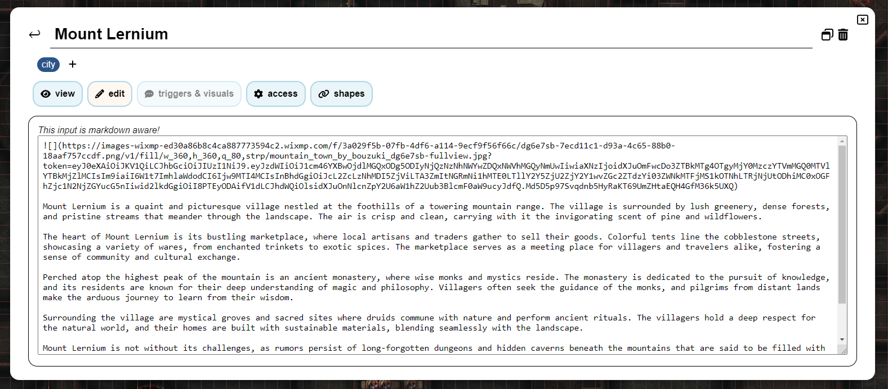

import Info from "/src/components/directives/Info.astro";
import Warning from "/src/components/directives/Warning.astro";

# Notes

En tant que DM ou joueur, il vous arrivera parfois d'avoir besoin de prendre des notes sur un personnage, un emplacement, un événement, ...
Cette page vous montrera ce que PlanarAlly propose en matière de gestion des notes.

## Concepts

À la base, toutes les notes sont de simples conteneurs contenant du texte, un titre facultatif et un auteur.
Elles peuvent cependant être utilisées de plusieurs manières différentes.

Les notes peuvent être partagées avec d'autres joueurs ou rester privées pour leur créateur.
Les notes peuvent également être attachées à des formes, ce qui permet d'y accéder rapidement lorsque la forme est sélectionnée.
Ou simplement pour vous rappeler quelque chose à propos de la forme.

Les notes prennent en charge la mise en forme Markdown. Pour plus d'informations, consultez le [Tutoriel Markdown](../../../learn/dm/Markdown_Tutorial/markdown)

### Global vs Local

Dans la plupart des cas, une note ne concerne que la campagne/l'emplacement actuel.
Mais il existe des cas particuliers où vous pourriez vouloir une note indépendante de la campagne, disponible de n'importe où.

Les premières sont dites locales et les secondes globales.
Lors de la création d'une note, vous devrez choisir laquelle vous souhaitez créer.

Un bon exemple de note globale est un bloc de statistiques pour un monstre.
Si vous combinez cela avec les [modèles de ressources](/fr/docs/dm/assets/#templates), vous pourrez poser un gobelin sur la table de jeu et
avoir une note avec son bloc de statistiques attachée à lui.

## L'interface du gestionnaire de notes

Au cœur de l'interaction avec les notes se trouve le gestionnaire de notes.
C'est un grand élément d'interface qui permet la recherche, le filtrage et la création de notes.

### Ouverture

Le gestionnaire de notes peut être ouvert en cliquant sur la section « Notes » du menu latéral situé à gauche de l'écran.

Il peut également être ouvert/fermé à l'aide du raccourci clavier <kbd>n</kbd>.

Enfin, il peut également être ouvert via le menu contextuel d'une forme ou
via le panneau d'informations de sélection sur le côté droit de l'écran lorsqu'une forme est sélectionnée.
Dans ces cas, le gestionnaire de notes s'ouvrira avec un filtre appliqué pour n'afficher que les notes liées à la forme.

### Vue principale

Cette vue affiche la liste de toutes les notes actuellement disponibles (avec les filtres spécifiques appliqués).

#### Recherche et filtrage

Le premier grand élément d'interface est la barre de recherche, qui vous permet de parcourir toutes les notes et de les filtrer.

La barre de recherche contient un bouton pour basculer entre les notes locales et globales.
Ces notes sont généralement de nature très différente et disposent donc d'une vue séparée dédiée.

Le deuxième élément est le champ de saisie de la barre de recherche, où vous pouvez taper votre requête.

PA comparera toutes les notes connues à cette requête et affichera les résultats dans la liste ci-dessous.
L'endroit où PA cherchera votre requête dépendra des filtres utilisés ;
cela peut être configuré à l'aide du dernier élément de la barre de recherche.

Par défaut, PA recherche votre requête dans le titre et les tags de la note.
Il peut cependant être modifié pour rechercher également dans le contenu de la note ainsi que chez l'auteur.

Par défaut, PA ne recherchera également que dans les notes créées dans l'emplacement actif.
Cela peut être modifié pour rechercher dans tous les emplacements non archivés, voire dans tous les emplacements de la campagne actuelle.

Il est possible de masquer toutes les notes attachées à des formes ;
cela peut être utile si vous souhaitez vous concentrer sur les notes davantage liées à l'histoire principale.

Un dernier filtre possible consiste à ignorer le bouton local pour les notes globales attachées à des formes locales.
En substance, cela inclura toutes les notes (quel que soit leur état local/global) attachées à une forme dans l'emplacement actuel.
(p. ex. le bloc de statistiques global d'un gobelin apparaîtra dans la liste locale, s'il y a un gobelin dans l'emplacement actuel)

##### Filtrage par forme

Il est possible de mettre le gestionnaire de notes en mode filtre par forme, en utilisant le menu contextuel d'une forme et en
sélectionnant afficher les notes, ou en passant par la section notes de la sélection de forme active.

Dans ce cas, seules les notes attachées à la forme concernée seront affichées.
La plupart des filtres de recherche disparaîtront ou seront désactivés, car ils ne sont plus pertinents. (notez que les notes globales et locales attachées à la forme seront toutes deux affichées)

Dans ce mode, le bouton de création de note créera également automatiquement une note attachée à la forme.

<Info>
    Il est également possible d'attacher des notes à des notes existantes à l'aide de l'onglet 'shapes' de la vue
    d'édition.
</Info>

#### Liste des notes

Le centre de la vue principale affiche le titre, l'auteur, les tags et quelques actions rapides pour chaque note correspondant à la requête de recherche et aux filtres.

Le titre est un lien cliquable qui ouvrira la note dans la vue d'édition.

Les 2 actions rapides actuellement disponibles sont les boutons d'édition et d'extraction.
L'icône d'édition ouvrira la note dans la vue d'édition, tout comme un clic sur le titre,
l'icône d'extraction ouvrira la note dans une fenêtre modale séparée. (Voir [Notes extraites](#popout-notes) pour plus d'informations)

Cette vue sera paginée si trop de notes correspondent aux filtres actifs. Dans ce cas, des boutons `<` et `>` apparaîtront en haut à droite.

### Créer une nouvelle note

Après avoir cliqué sur le bouton de création de note dans la vue de liste principale, un nouvel écran apparaîtra pour préconfigurer une nouvelle note.
Dans cette vue, vous pouvez configurer le titre et le type de note (globale ou locale).

Cela se fait dans une vue séparée, afin de laisser de la place pour expliquer la différence entre les notes globales et locales.

Après avoir créé une note, vous serez automatiquement redirigé vers la vue d'édition pour une configuration plus poussée.

### Vue d'édition

Cette vue est le mode avancé d'édition d'une note.
Si vous souhaitez revenir à la vue principale, vous pouvez appuyer sur la flèche de retour en haut à gauche, à côté du titre de la note.

La vue d'édition est divisée en plusieurs sections, de haut en bas :

#### Titre

Cette section affiche simplement le titre de la note.

Si vous disposez des droits d'édition sur la note, vous pouvez la modifier.

Sur le côté droit, quelques actions rapides sont également disponibles.
Une autre icône d'[extraction](#popout-notes) est disponible, ainsi qu'une icône de corbeille qui supprimera la note.

#### Tags

Cette section affiche tous les tags actuellement attachés à la note.

Si vous disposez des droits d'édition sur la note, vous pouvez ajouter/retirer des tags.

Les tags sont libres et peuvent être ce que vous voulez, même s'ils devraient idéalement être relativement courts.
Leur seule utilité pour PA est le filtrage/la recherche de notes, vous pouvez donc les organiser comme bon vous semble.

Une couleur cohérente sera automatiquement attribuée à chaque tag en fonction de son contenu.

<Warning>
    Les tags sont visibles par tout utilisateur ayant le droit « can view » sur la note. (voir [Onglet
    Accès](#tab-access))
</Warning>

_La génération de couleurs ne fonctionne qu'en contexte HTTPS car elle utilise un algorithme SHA1 ; elle retombera donc sur une couleur grisâtre en contexte HTTP_

#### Onglet : Vue et édition

Ces deux onglets fonctionnent ensemble et constituent le cœur de la note.

Dans l'onglet Édition, vous pouvez écrire/modifier le contenu réel de la note dans un format textuel compatible avec le markdown.
Le markdown réellement rendu peut ensuite être consulté dans l'onglet Vue.

#### Onglet : Déclencheurs et visuels

Cet onglet ne peut être ouvert que si la note est attachée à une forme.

Il permet de configurer certains comportements spéciaux pour la note.

Il propose actuellement deux options :

Afficher l'icône de note : Cela affichera une petite icône à côté de la forme (sur la carte).
Cela peut servir à vous rappeler une note importante.

Afficher le texte au survol de la forme : Cela affichera le contenu de la note (rendu en markdown) lorsque vous survolerez la forme.
Il apparaîtra en haut au centre de l'écran. Sachez que si votre note est volumineuse, elle couvrira probablement une grande partie de l'écran.

#### Onglet : Accès

Cet onglet vous permet de configurer qui peut voir et modifier la note.

Par défaut, seul l'auteur de la note peut la voir et la modifier.
Mais vous pourriez souhaiter donner à tous les joueurs un accès en lecture à une note qu'ils ont trouvée quelque part.

Vous pouvez également accorder un accès granulaire à des joueurs spécifiques, ce qui vous permet de partager des notes cachées avec certains joueurs.

Il est important de comprendre que les tags d'une note sont visibles pour les joueurs ayant un accès en lecture.
Veillez à ne pas gâcher accidentellement une surprise avec un tag `faction:evil` ou quelque chose de similaire.

<Info>
Lorsque vous accordez un accès en lecture à un joueur (qu'il soit spécifique ou que ce soient tous les joueurs), il recevra une notification indiquant qu'une nouvelle note est disponible.

Ainsi, en tant que DM, accorder simplement un accès en lecture à une note est un bon moyen d'informer vos joueurs d'une information particulière qu'ils viennent de découvrir.

</Info>

#### Onglet : Formes

Cet onglet répertorie toutes les formes actuellement attachées à la note.

Pour ce faire, il affiche d'abord un total numérique de toutes les formes de toutes les campagnes, suivi d'un total pour l'emplacement actif.

Pour l'emplacement actif, il répertorie également toutes les formes avec leur nom. Un clic sur le nom centrera votre écran sur cette forme.
Le survol d'un nom affichera également une icône de corbeille qui, lorsqu'elle est cliquée, détachera la note de cette forme.

## Notes extraites

Il arrive que vous ayez fréquemment besoin d'accéder à une ou plusieurs notes.
Ouvrir constamment le gestionnaire de notes et alterner entre les notes devient alors pénible.

Pour résoudre ce problème, PA propose de pouvoir extraire une note dans une fenêtre modale séparée.
Plusieurs d'entre elles peuvent être ouvertes simultanément et déplacées individuellement.

Une note extraite n'offre que les fonctionnalités de lecture et d'édition ; pour les autres paramètres de la note, vous devez ouvrir le gestionnaire de notes lui-même.

Il est également possible de réduire une note extraite, ce qui masquera le contenu de la note pour n'afficher que le titre.
C'est particulièrement utile si vous avez plusieurs notes extraites ouvertes ou si vous savez qu'une note n'est plus pertinente pour le moment, mais le redeviendra bientôt.

## Notes de la sélection de forme active

PA affiche toujours un élément d'interface sur le côté droit de l'écran avec quelques informations rapides sur la forme actuellement sélectionnée.

Cette section possède également une section notes dédiée.
Elle affiche le nombre de notes attachées et une icône permettant d'ouvrir immédiatement le gestionnaire de notes avec un filtre appliqué pour n'afficher que les notes liées à la forme. (Voir [Filtrage par forme](#shape-filtering) pour plus d'informations)

Si 1 note ou plus sont attachées à la forme, vous pouvez également développer/réduire cette section pour lister les notes.
Cela vous permet d'extraire rapidement une note ou de l'ouvrir dans le gestionnaire de notes.
De plus, survoler ces notes affichera leur contenu en haut au centre de l'écran, indépendamment de leur configuration de déclenchement.
