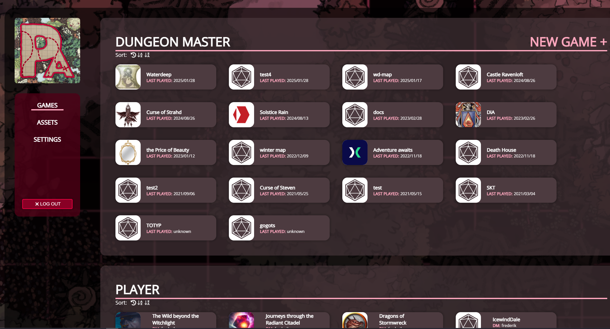

import Cog from "~icons/fa-solid/cog";
import Info from "/src/components/directives/Info.astro";
import Warning from "/src/components/directives/Warning.astro";

# Introduction

Félicitations, votre groupe envisage d'utiliser PlanarAlly pour votre prochaine partie !
Mais comment l'utiliser concrètement ?

Dans ce guide d'introduction, nous allons voir comment créer un compte, rejoindre une partie et
mettre les pieds dans l'eau en examinant les principaux éléments d'interface visibles à l'ouverture d'une partie !

## Création de compte

<Info title="Serveurs PA">
    Il n'existe pas un serveur PlanarAlly unique, n'importe qui est libre d'héberger sa propre version et de la rendre
    ouverte ou fermée aux autres. En général, quelqu'un de votre groupe a décidé sur quel serveur PA vous allez jouer ;
    sinon, quelqu'un devra se renseigner sur la [documentation serveur](/fr/server/setup/) et se mettre d'accord sur un
    serveur commun.
</Info>

Lorsque vous visitez l'hôte du serveur choisi, vous êtes immédiatement accueilli par une page de connexion.
PlanarAlly ne demande rien de spécial lors de l'enregistrement d'un nouveau compte,
juste un nom d'utilisateur et un mot de passe, avec éventuellement une adresse e-mail.

Actuellement, l'adresse e-mail n'est utilisée pour rien dans PA lui-même,
mais un administrateur de serveur pourrait l'utiliser pour informer les utilisateurs d'arrêts à venir ou de choses du même genre.

## Rejoindre une partie

Une fois connecté, vous êtes accueilli par le tableau de bord principal, qui affiche les parties dont vous faites partie ; et si vous décidez un jour d'héberger une partie vous-même, elles y apparaîtront aussi.

Pour qu'une partie apparaisse ici, vous devez d'abord être invité.

Votre hôte vous enverra une URL qui, lorsqu'elle sera visitée, établira automatiquement la connexion avec votre compte et vous placera dans la partie.
À l'avenir, la partie apparaîtra dans votre tableau de bord principal comme expliqué ci-dessus !

## Brève introduction à l'interface

Dès que vous ouvrez une partie, vous êtes immédiatement accueilli par divers éléments d'interface.

L'essentiel de l'écran est occupé par le cœur de tout VTT : la carte avec les pions, la vision et l'éclairage.
Votre DM l'aura préparée au préalable.

<Warning title="Tout est noir ?!">
    Il est possible que la seule chose que vous voyiez soit le vide noir pur. Mais ne vous inquiétez pas, votre DM doit
    probablement encore vous donner accès à une forme !

    S'ils l'ont fait et que vous ne voyez toujours rien, essayez d'appuyer sur <kbd>espace</kbd> pour recentrer l'écran
    sur un pion auquel vous avez accès en vision.

</Warning>

Dans le chapitre suivant, nous verrons comment interagir correctement avec la carte, la déplacer et zoomer dessus, ainsi que déplacer nos personnages.

Commençons d'abord par vous présenter les coins de l'écran, là où PA place la plupart de ses autres éléments d'interface proéminents.

En haut à gauche se trouve une icône <Cog /> qui ouvre un panneau latéral,
cela sert principalement à configurer certains paramètres moins utilisés et c'est aussi le moyen de quitter la partie en cours pour revenir au tableau de bord principal.

En haut à droite, il y a un curseur de zoom pour contrôler le niveau de zoom de la carte, et vous voyez aussi un élément d'interface affichant des informations sur le personnage actuellement sélectionné.

En poursuivant le tour du cadran, nous voyons un ensemble d'icônes en bas à droite et un interrupteur Build/Play.
Tout cela est lié à une variété d'outils que propose PA. Cela va des outils de dessin aux règles et aux dés.
Nous en parlerons davantage dans le chapitre suivant !

Enfin, il y a le coin en bas à gauche, qui est vide sur la capture d'écran ci-dessus.
Cette zone est surtout réservée aux choses spécifiques au DM, mais elle peut apparaître du côté des joueurs si votre DM utilise une fonctionnalité spéciale de PA appelée « étages ».
Le chat textuel apparaîtra aussi ici si votre DM a activé cette fonctionnalité !

Cette brève introduction n'a fait que nous mettre les pieds dans l'eau ; plongeons-nous entièrement et voyons ce que sont ces outils et comment interagir avec notre personnage [dans le chapitre suivant](/fr/learn/player/interaction/) !
