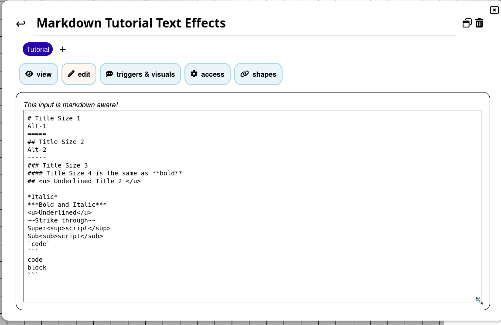

# **Guide du tutoriel Markdown.**

Guide contribué par [@veritanuda](https://keybase.io/veritanuda)

Ce guide explorera spécifiquement les fonctionnalités de mise en forme Markdown à travers PlanarAlly. Il est utilisé à la fois dans les champs de [Notes](../../../../docs/game/notes) et dans la fenêtre de [Chat](../../../../docs/game/chat).

Les informations de ce guide proviennent en grande partie de ce [Guide de syntaxe](https://markdown-it.github.io/)

## **Effets de texte**

Voici un exemple des Effets de texte qui peuvent être appliqués.


On peut y voir :

- Les tailles de titre
- La mise en forme du texte
- Les styles de texte

Voici à quoi cela ressemble dans la fenêtre Notes.


Et voici à quoi cela ressemble en mode édition.



Le caractère `#` peut être utilisé pour définir les tailles de titre. 1 donnera la plus grande taille `Title Size 1`

2 `#` donne la taille suivante `Title Size 2`

3 `#` donne encore la taille en dessous. `Title Size 3`

4 `#` équivaut à utiliser le gras, ce qui peut être fait soit avec `**` soit avec `__` autour du texte. `Title Size 4`

Le soulignement nécessite une notation HTML, qui fonctionnera aussi pour d'autres effets de texte comme l'italique `<i> </i>` et le gras `<b></b>`.

`<u>Souligné</u>`

`*` est _Italique_

`**` est **gras**

`***` est **_Gras et Italique_**

`~~` est ~~Barré~~

`<sup> </sup>` est Sup<sup>erposé</sup>

`<sub> </sub>` est Sub<sub>posé</sub>

``is`code`

` ``` ` est

```
code
block
```

---

## **Disposition du texte**

Voici un exemple des Dispositions de texte


### <u>Listes non ordonnées</u>

Les listes non ordonnées peuvent utiliser soit `*` soit `-` pour délimiter les éléments de la liste.

```
Liste non ordonnée 1
* Premier
* Deuxième
* Troisième
* Quatrième
```

Liste non ordonnée 1

- Premier
- Deuxième
- Troisième
- Quatrième

```
Liste non ordonnée 2
- Premier
- Deuxième
- Troisième
- Quatrième
```

Liste non ordonnée 2

- Premier
- Deuxième
- Troisième
- Quatrième

### <u>Listes ordonnées</u>

Les listes ordonnées utilisent `<nombre>.` avec les nombres qui augmentent à partir du premier nombre que vous spécifiez.

```
Liste ordonnée
1. Premier
2. Deuxième
3. Troisième
4. Quatrième
```

Liste ordonnée

1. Premier
2. Deuxième
3. Troisième
4. Quatrième

### <u>Listes à étages / multi-niveaux</u>

Les listes à étages, ou listes multi-niveaux, peuvent être réalisées en ajoutant un double espace entre chaque niveau de liste.

```
Liste à étages
- Premier
- Deuxième
- Troisième
  - 3 a
  - 3 b
- Quatrième
```

Liste à étages

- Premier
- Deuxième
- Troisième
    - 3 a
    - 3 b
- Quatrième

### <u>Tableaux</u>

Les tableaux utilisent `|` pour délimiter les colonnes tandis que `-` et `:` sont utilisés pour spécifier la justification (facultatif, car la justification à gauche est la valeur par défaut)

```
|Col A|Col B|Col C|
|--|:--:|--:|
|Ligne 1|Ligne Un|L 1|
|Gauche|Centre|Droite|
```

| Col A   |  Col B   |  Col C |
| ------- | :------: | -----: |
| Ligne 1 | Ligne Un |    L 1 |
| Gauche  |  Centre  | Droite |

---

## <u>Images et liens</u>

Voici un exemple d'images en ligne et d'hyperliens.


Pour la **_plupart_** des URL d'images, vous pouvez simplement copier-coller l'emplacement de l'image et l'image devrait se résoudre.

Si ce n'est pas le cas, vous devriez pouvoir insérer des images en ligne si vous faites précéder l'élément d'un `!`, spécifiez un nom de balise entre `[ ]` puis le lien entre `( )`.

```
Voici un Gobelin ci-dessous.


```

Il existe une méthode alternative, qui peut rendre le code plus propre, appelée méthode par référence, où au lieu d'un lien vers l'image, vous pouvez utiliser une référence, qui à son tour renvoie vers l'image.

```
![Gobelin][Gobelin1]

Voici un Gobelin ci-dessus

Voici un autre Gobelin

![Gobelin2][Gobelin2]

[Gobelin1]:https://www.imarvintpa.com/Mapping/Tokens/g1/Goblin.png "Ceci est un Gobelin"
[Gobelin2]:https://gamepedia.cursecdn.com/crafttheworld_gamepedia/thumb/b/be/Cave_Goblin.png/150px-Cave_Goblin.png "Ceci est un Gobelin des cavernes"
```

Les références peuvent aussi fournir des infobulles, de sorte que lorsqu'un curseur survole une image, une infobulle peut être vue. Elles sont créées en mettant entre guillemets `" "` le texte de l'infobulle après l'URL


**REMARQUE :** Lors de la sélection d'images à insérer, elles seront mises à l'échelle dans la fenêtre de chat, mais lorsque l'image est cliquée, elle s'ouvrira dans une version agrandie dans une autre fenêtre.

## <u>**Liens URL**</u>

Les liens URL sont identiques à ce qui précède mais sans le `!` qui précède.

```
[Feuille de personnage 5E](https://media.wizards.com/2016/dnd/downloads/5E_CharacterSheet_Fillable.pdf)
```

[Feuille de personnage 5E](https://media.wizards.com/2016/dnd/downloads/5E_CharacterSheet_Fillable.pdf)

# Conclusion

Utiliser le markdown dans les notes ou dans le chat est un moyen utile d'impliquer vos joueurs et de leur donner accès à des choses comme des documents à distribuer ou des images de monstres pour apporter plus de profondeur à une partie. Du point de vue d'un MJ, gérer les notes sur les pions pour les statistiques, les capacités spéciales, les informations générales, les descriptions d'emplacements, etc. peut grandement réduire la quantité d'informations que vous devez stocker et consulter en dehors d'une partie. Cela rend la direction d'une partie beaucoup plus fluide et sans friction.

Bon jeu !
