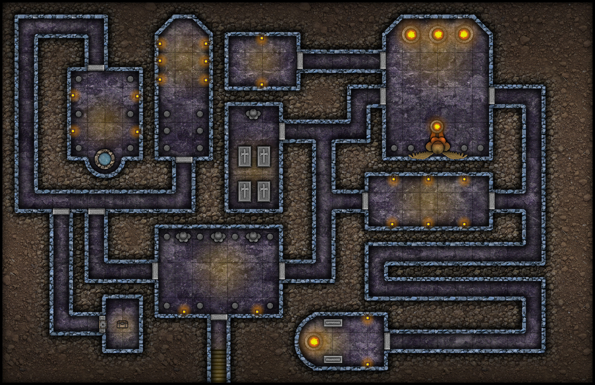
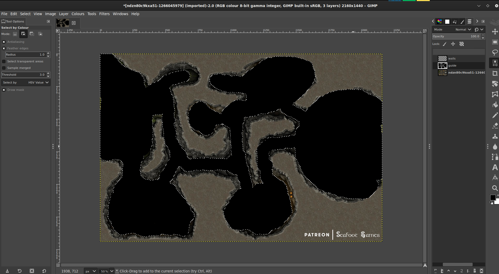

# **Guide pour créer des masques de murs.**

Guide contribué par [@veritanuda](https://keybase.io/veritanuda)

Cette méthode devrait fonctionner pour n'importe quelle carte selon sa fidélité, mais même les cartes irrégulières comme les grottes peuvent facilement être masquées.

# Prérequis

Les instructions ci-dessous concernent l'utilisation d'outils librement disponibles, [GIMP](https://gimp.org) et [potrace](https://potrace.sourceforge.net/). Vous pouvez bien sûr utiliser des outils propriétaires pour obtenir les mêmes résultats, mais il n'y a aucune garantie qu'ils se comportent de la même façon.

---

Ci-dessous, je vais montrer 2 méthodes.

- Une méthode pour les donjons et les cartes préfabriquées
- L'autre méthode pour les cartes irrégulières et les cartes personnalisées.

# **Méthode Un**

Pour cette méthode, je vais choisir une carte aléatoire de Free Friday Maps. Vous pouvez les obtenir [ici](https://www.drivethrurpg.com/browse/pub/10213/Paths-to-Adventure/subcategory/25973_33572/Free-Map-Friday), mais n'importe quelle carte fera l'affaire du moment qu'elle possède quelques caractéristiques clés.

- Elle a une version en noir et blanc et
- elle a une option sans grille.

    Ces éléments ne sont pas essentiels, mais ils rendent simplement la création du masque un peu moins longue.

Voici donc la carte avec laquelle je vais commencer.

Elle existe en plusieurs types, y compris Lineart. C'est celui que nous allons utiliser.

# Supprimer l'arrière-plan

Sur cette carte, il y a un hachurage irrégulier autour de la carte pour l'arrière-plan. Heureusement, il est d'une couleur différente, une sorte de gris. En sélectionnant donc l'outil `Fuzzy select/Colour Select`, choisissez `Colour Select`, sélectionnez l'une des zones grises de l'arrière-plan et vous devriez voir tout le gris devenir surligné.

C'est bien, mais, comme les lignes qui les séparent ne sont pas sélectionnées, si nous les supprimions maintenant, cela laisserait juste le pavage noir irrégulier.

Alors, avec tout sélectionné, faites un clic droit sur l'image, allez dans `Select` `>` `Grow...`

Agrandissez la sélection de quelques pixels jusqu'à ce qu'elle couvre les lignes entre les zones grises. Une fois que vous êtes satisfait d'avoir tout attrapé, appuyez sur `Delete` et _POOF_, l'arrière-plan disparaît.

Retournez maintenant au `Fuzzy Select` et cette fois choisissez `Fuzzy Select`. Cliquez sur l'arrière-plan maintenant blanc et voyez que tout est sélectionné.

- _Note : si vous avez des espaces clos, comme cette carte, vous devez maintenir la touche shift et cliquer dedans pour l'ajouter à la sélection._

Maintenant, dans le panneau `Layers`, ajoutez `New Layer`. Nommez ce calque `mask`.

Sur ce calque, sélectionnez l'outil `Bucket Fill`. Cliquez sur la sélection de l'arrière-plan faite précédemment et elle devrait se remplir tout en noir.

Masquez le calque du line art et vérifiez que vous avez un masque complet sans parties manquantes.

Si vous avez manqué quelque chose, pas de panique, appuyez juste sur `Cntrl-Z` pour annuler et retournez sélectionner les parties manquées auparavant.

Selon la carte et la façon dont vous avez sélectionné l'arrière-plan, certaines portes pourraient aussi être peintes. Vous devrez, avec l'outil Erase et la forme de pinceau qui convient le mieux, repasser sur toutes les portes et portes secrètes et retirer le noir.

Si vous ne faites pas cela, vous rendrez une porte infranchissable. Vous pouvez toujours ajouter des pions de porte à n'importe quelle ouverture que vous avez faite une fois la carte importée et les murs ajoutés.

Une fois que vous êtes satisfait de votre masque, vous pouvez supprimer le calque du line art.

La partie suivante est **vitale** si vous voulez le convertir correctement en SVG, ce qui est ce que PlanarAlly utilise pour les murs.

Faites un clic droit sur l'image et allez dans `Image` `>` `Mode`. Si vous avez importé le line art, comme moi, il aura été en `greyscale`. Parfois, vous devrez convertir une carte couleur en `greyscale` pour faciliter la suppression des arrière-plans, etc. Mais maintenant, le mode doit être `RGB`. Changez l'image à cela.

Ensuite, faites un clic droit sur l'image, allez dans `File` `>` `Export As...` et enregistrez l'image en `BMP`. Désactivez `Run Length Encoding`, désactivez `Do not write colour space information` et assurez-vous que sous `Advanced` vous êtes en `32 Bits`.

Une fois cela enregistré, vous pouvez soit utiliser `potrace` en ligne de commande, soit le faire en ligne gratuitement sur [ce site web](https://svg-converter.com/potrace).

La commande pour le faire vous-même est extrêmement simple.

`potrace -s FREE-MAP-FRIDAY-001_LINEART_WALLS.bmp`

Cela devrait vous donner un `svg` qui, si vous l'ouvrez dans un programme graphique, devrait être noir là où la lumière sera bloquée et transparent là où la lumière peut briller.

# **Méthode Deux**

Disons que vous avez une carte irrégulière ou que l'arrière-plan n'est pas si facile à supprimer. Eh bien, vous pouvez toujours fabriquer un masque à la main en utilisant juste des outils normaux.

Pour cet exemple, j'utiliserai [cette carte](https://www.reddit.com/r/FantasyMaps/comments/hrf51h/battlemap30x202160x1440pxcavejunglepirateoc/)

Importez la carte dans gimp.

Créez un nouveau calque, appelez-le `guide`.

Avec l'`outil Pencil`, sélectionnez le `Circle` comme pinceau et rendez-le noir. Redimensionnez au besoin. En vous assurant d'avoir sélectionné le calque `guide`, commencez à dessiner sur les parties colorées de la carte **à l'intérieur** des murs.

Une fois que vous êtes satisfait d'avoir rempli toute la forme, créez un autre calque appelé `walls.`

Sur le calque `guide`, utilisez l'outil `Select by colour` et cliquez sur le guide noir que vous avez fait. Ensuite, inversez la sélection.

Ensuite, sur le calque `walls`, utilisez l'outil bucket fill pour remplir la sélection inversée avec du noir et remplir les murs.

Une fois cela fait, masquez les calques précédents et, si vous êtes satisfait de n'avoir manqué aucun endroit, supprimez ces calques et enregistrez l'image en BMP comme ci-dessus pour être convertie en utilisant l'une ou l'autre méthode ci-dessus.

# Importer les murs dans PA

Maintenant, téléversez ce SVG dans votre dossier `Assets` sur PlanarAlly, en même temps que la carte du joueur et la carte du MJ s'il y en a une.

Faites glisser ces ressources dans un emplacement, la carte du joueur étant sur le calque MAP et la carte du MJ sur le calque GM. Sur le calque MAP, faites un clic droit dessus, ouvrez Properties et définissez un `Name` et, sous `Advanced`, cochez `Blocks Vision/Light` et `Blocks Movement`. Allez ensuite dans l'onglet `Extra` et, sous `Lighting & Vision` `>` `Upload walls`, sélectionnez le SVG que vous venez de téléverser dans vos ressources. Vos murs devraient maintenant être appliqués.

Testez avec un pion qui a une source de lumière sur le calque `Token` et vous avez presque terminé. Maintenant, s'il y a des portes ou des passages secrets, ils doivent être isolés manuellement avec des pions de porte ou du FOW, à votre choix. Mais si tout se passe bien, vous ne devriez plus avoir à vous soucier de fabriquer des murs à la main.

Bon jeu !

\*/}
