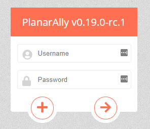

Con la 0.19.0 abbiamo la nostra prima release dell'anno! Ci sono un paio di grandi nuove funzionalità (piani e badge) e un sacco di piccole correzioni e cambiamenti per la qualità della vita.

Gli argomenti menzionati in questo aggiornamento sono elencati a sinistra, il changelog completo si trova su [github](https://github.com/Kruptein/PlanarAlly/releases/tag/0.19.0).

_Ho anche creato un [account patreon](https://www.patreon.com/planarally), sentiti libero di dargli un'occhiata :)_

## Visione

### Piani

Una delle aggiunte più grandi di questa release è l'introduzione dei piani. Proprio come nella vita reale, un edificio può essere composto da più piani.
Fino ad ora, se volevi simulare questo in PA, dovevi usare luoghi separati oppure avere aree diverse in un unico luogo che rappresentassero piani diversi.
Entrambi gli approcci richiedono un bel po' di salti da una parte all'altra, il che è in definitiva indesiderabile.

Con questa release le cose cambiano: il DM può creare/eliminare un piano usando il pulsante del piano nell'angolo in basso a sinistra, proprio accanto al selettore dei livelli. Il numero mostrato in questa casella è il numero del piano attivo.

Visione e luci funzionano tra i piani in modo naturale; Un segnalino al piano superiore può vedere un segnalino con una luce in giardino attraverso una finestra, e allo stesso modo qualcuno in giardino può vedere la persona sul balcone superiore. _Nota che questo non è un vero rendering 3D, quindi possono verificarsi alcuni piccoli casi limite in cui l'altezza di certi elementi è sconosciuta._

**Il video qui sotto potrebbe contenere spoiler sulla mappa dell'avventura Waterdeep Dragonheist della WotC.**

<video autoplay loop muted style="max-width: min(680px, 75vw);">
    <source src="/blog/release-0.19/newfloors.webm" type="video/webm" />
    <source src="/blog/release-0.19/newfloors.mp4" type="video/mp4" />
</video>

L'esempio sopra mostra come funziona la visione tra i piani: il lato sinistro rappresenta un giocatore con la proprietà del segnalino Y al primo piano. Il lato destro rappresenta il DM che ha accesso a entrambi i segnalini.

Per cambiare piano clicchi sul pulsante del piano in basso a sinistra e selezioni il piano desiderato. Per cambiare il piano di una forma o di un gruppo di forme, fai clic destro su di esse e usa il sottomenu del piano.

**Suggerimento d'oro:** ci sono alcune scorciatoie extra dedicate ai piani, che ti permetteranno di passare da uno all'altro senza problemi. Page Up/Down ti sposta di un piano su o giù. Puoi anche spostare una selezione di forme su altri piani tramite scorciatoie; Ctrl + Page Up/Down sposterà i segnalini di un piano su/giù, se vuoi spostarti immediatamente insieme a loro usa invece Ctrl + Shift + Page Up/Down.

Nota che attualmente i giocatori sono liberi di spostarsi su qualsiasi piano desiderino. In futuro verrà aggiunto un controllo degli accessi extra, ma con le giuste impostazioni di visione questo dovrebbe in realtà andare perfettamente bene!

Ogni piano in sostanza è un intero nuovo set di livelli. Questo significa anche che c'è un carico aggiuntivo lato client per ogni piano che aggiungi. In futuro verrà aggiunta un'opzione per rendere solo il piano attivo, per quei giocatori che potrebbero non essere in grado di gestire l'aumento del carico. Il caso predefinito con un solo piano non avrà alcun sovraccarico extra rispetto alle release precedenti.

### Modalità disponibili

La vecchia modalità di visione basata sulle bounding volume hierarchies (bvh) è stata rimossa dal gioco, qualsiasi mappa che la usava ancora dovrebbe essere cambiata alla modalità predefinita basata sull'espansione dei triangoli.

Inoltre è disponibile una nuova modalità di visione. È un aggiornamento sperimentale della modalità di visione predefinita basata sui triangoli, che non deve ricalcolare l'intera scena ma lavora in modo iterativo. Questo dovrebbe fornire notevoli miglioramenti delle prestazioni sulle mappe con molti elementi di visione, ma potrebbe ancora contenere bug che potrebbero rompere la visione; se ciò accade, ricaricare la pagina dovrebbe funzionare.

## forme

### badge

Un'altra nuova funzionalità suggerita da @adunis su github è l'introduzione dei badge; sono piccole icone numerate nell'angolo in basso a destra dei segnalini.

La visualizzazione dei badge può essere attivata o disattivata per ogni gruppo di segnalini. Un gruppo di segnalini qui è definito come tutte le istanze risultanti dal copia e incolla dello stesso segnalino. _(es. trascino un segnalino di orco sul tavolo e lo copio e incollo un bel po', tutti questi segnalini sono un unico gruppo. Trascinare un nuovo segnalino di orco sul tavolo è un gruppo diverso.)_

I badge prendono il colore di sfondo dal colore del tratto della forma, e il colore del bordo e del font sono neri o bianchi a seconda di cosa è più leggibile. I numeri dei segnalini vengono incrementati automaticamente al momento dell'incolla.

<video autoplay loop muted style="max-width: min(680px, 75vw);">
    <source src="/blog/release-0.19/badges.webm" type="video/webm" />
    <source src="/blog/release-0.19/badges.mp4" type="video/mp4" />
</video>

### annotazioni

Ero riuscito a dimenticare un bug segnalato ad agosto, ma ora è finalmente stato corretto!

Le annotazioni smettevano di funzionare quando si cambiava luogo. Ora è stato risolto :)

## strumenti

### aggancio

Lo strumento poligono è uno strumento che uso molto. In particolare la versione che non si auto-chiude. Un problema in cui però mi imbatto di frequente è che non avevo un modo affidabile per aggiungere con precisione un punto al mio poligono che dovesse corrispondere esattamente a un punto esistente (es. collegamento dei muri). Questo causava problemi molto piccoli ma evidenti con l'illuminazione in queste aree dove si incontravano poligoni aperti.

Questa release aggiunge una funzione di aggancio, che trascina automaticamente il cursore del mouse verso un punto esistente vicino quando ti avvicini. Questo comportamento di aggancio è attivo solo quando ridimensioni o usi lo strumento di disegno. Lo strumento di disegno ora evidenzia anche i punti agganciabili quando si attiva (potrei rimuoverlo in futuro, a seconda del feedback).

<video autoplay loop muted style="max-width: min(680px, 75vw);">
    <source src="/blog/release-0.19/snapping.webm" type="video/webm" />
    <source src="/blog/release-0.19/snapping.mp4" type="video/mp4" />
</video>

Come puoi vedere alla fine del video, appare solo 1 punto rosso nel punto in cui si incontrano due poligoni. In passato c'erano più punti molto vicini tra loro.

_Promemoria: per chiudere un poligono usa il clic destro; una release futura dovrebbe renderlo più chiaro nell'interfaccia_.

### gesti tattili

Il supporto touch è sempre stato molto traballante, nella migliore delle ipotesi. Questo è un primo passo per permettere ai dispositivi touch di interagire con PlanarAlly in modo più intuitivo.

L'aggiunta di questi cambiamenti è per lo più limitata all'interazione con i vari elementi dell'interfaccia tramite touch, alcuni dei gesti più 'avanzati' come il pinch to zoom ecc. non sono ancora stati aggiunti.

_Questa funzionalità è stata contribuita da @ZachMyers3 su github_

### correzioni dello strumento select

C'era una serie di bug legati allo strumento select che potevano causare una brutta esperienza utente, ora questi dovrebbero essere risolti.

In particolare, trascinare un gruppo di segnalini spesso iniziava con un salto improvviso e inaspettato; ciò era causato da una matematica vettoriale sbagliata e ora trascinare più forme contemporaneamente dovrebbe essere molto meglio.

Il cursore di ridimensionamento inoltre non appariva correttamente per tutte le forme in una selezione multipla.

Il ridimensionamento in generale era anche rotto se trascinavi un angolo sopra un altro angolo.

## impostazioni

### impostazioni account

È stata creata una pagina di impostazioni account molto essenziale. La ruota dentata nella dashboard ora ha finalmente uno scopo!

Come si può vedere è abbastanza limitata nel suo ambito, ma ora puoi cambiare il tuo nome utente, aggiungere un indirizzo email, cambiare la tua password ed eliminare il tuo account se lo desideri.

Nota che l'indirizzo email non viene usato in alcun modo da PA (né è obbligatorio), ma è lì per possibili cambiamenti futuri o se un amministratore del server desidera inviare un'email ai suoi utenti.

## Varia

### ctrl 0

Dato che PA ha una mappa infinita, può succedere che non riesca a ritrovare la tua mappa reale dopo aver fatto pan/scroll in giro.

Come semplice soluzione alternativa ora esiste una scorciatoia ctrl+0 per ripristinare la camera all'origine della mappa.

_Questa funzionalità è stata contribuita da @LDeeJay1969 su github_

### /\_load

Speriamo che la maggior parte degli utenti non lo abbia notato, ma PA aveva un percorso speciale /\_load che veniva usato per la transizione tra i percorsi.
Se però tornavi indietro usando il pulsante indietro del browser, potevi finire su questa pagina speciale che non ha nulla con cui interagire.

Il meccanismo di caricamento è stato cambiato e non ha più bisogno del percorso speciale.

_Questa funzionalità è stata contribuita da @ZachMyers3 su github_

### numero di versione

Per poter vedere quale versione di PA sta usando il server a cui sei connesso, il pannello di login ora mostra il numero di versione nel suo titolo.

_Questa funzionalità è stata contribuita da @ZachMyers3 su github_

### rimozione degli artefatti js

Questo è un cambiamento tecnico rilevante solo per chi contribuisce al codice.

In passato gli artefatti di build js venivano salvati nel repository git, così che la cartella del server potesse essere usata immediatamente senza alcuna build js extra.
Questo però portava a un sacco di conflitti di merge e file non necessari nel repository.

Ora dovresti compilare tu stesso i file js se vuoi testare in locale.

## In programma per la 0.20.0

### Rinnovamento dei luoghi

Quello che assolutamente vorrei affrontare nella prossima release è l'interfaccia/UX della barra dei luoghi. Ora è solo una cosa brutta con funzionalità limitate.

### Segnaposto

@LDeeJay1969 ha lavorato a un sistema di segnaposto per saltare ai luoghi segnati.

### Finestra delle scorciatoie

@Daniferrito ha iniziato a lavorare a una finestra per le scorciatoie da tastiera.
