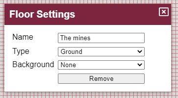

L'ultima release è stata un grande cambiamento tecnico e sono felice di vedere che la transizione è stata abbastanza fluida, senza che nulla di grave fosse segnalato come rotto. Questa release porta un altro cambiamento tecnico, cambiando il sistema di build js da vue-cli (webpack) a vite (esbuild + rollup). Questo cambiamento dovrebbe avere poco o nessun impatto sugli utenti finali, ma aumenta notevolmente i tempi di build!

Oltre al cambiamento tecnico, sono stati aggiunti alcuni miglioramenti della qualità della vita, un discreto numero di bug è stato schiacciato e la principale nuova funzionalità è la possibilità di impostare un colore di sfondo o un'immagine ripetuta per un piano.

## Cambiamenti ai piani

L'interfaccia dei piani è stata leggermente ridotta e non mostra più le icone di modifica e del cestino. Ora presenta invece una ruota dentata, comunemente usata in tutto PlanarAlly per indicare le impostazioni.

La rinomina e la rimozione dei piani ora avvengono tramite questa nuova interfaccia delle impostazioni dei piani.

Se hai familiarità con i piani, noterai due nuove impostazioni.

_Il colore di sfondo merita una sezione a parte e verrà spiegato in dettaglio più sotto._

Questa release aggiunge il concetto di tipi di piano, composto da un elenco preimpostato di opzioni: underground/ground/air.

Le impostazioni dei piani possono essere configurate a livello di singolo piano come mostra l'interfaccia sopra, ma potranno anche essere configurate a livello di luogo o di campagna, e questo dipende dal tipo di piano.

Attualmente l'unico posto in cui il tipo di piano influenza le cose è l'impostazione dello sfondo. In futuro intendo aggiungere alcuni miglioramenti automatici delle prestazioni a seconda del tipo di piano. (es. non renderizzare i piani inferiori se sei al piano terra)

Questo è ancora molto un'idea con cui sto giocando e forse in futuro rimuoverò la nozione di tipi di piano per sostituirla con impostazioni di rendering per piano.

## Riempimento dello sfondo

Nella maggior parte dei casi il DM avrà preparato una mappa per i giocatori da esplorare.
A volte però può verificarsi un'esplorazione laterale improvvisata o magari i giocatori escono dai confini della tua mappa perché hanno trovato qualche espediente.

In quei casi lo sfondo bianco predefinito è il luogo in cui si muoveranno, e questo può essere un po' noioso. Altre mappe o immagini possono ovviamente essere aggiunte dal DM, ma a volte vuoi solo qualcosa che riempia il vuoto.

Come accennato in precedenza, ora è possibile configurare lo sfondo per un piano. Sia per un piano specifico che per tutti i piani dello stesso tipo.

### Colore semplice

L'opzione più basilare è semplicemente impostare un singolo colore come colore di sfondo.

Questo può migliorare rapidamente l'immersione, dando una sensazione erbosa con uno sforzo minimo.

### Motivi

È comunque anche possibile impostare un'immagine come sfondo che verrà ripetuta in tutte le direzioni. Questo permette l'uso di tileset senza soluzione di continuità.

Quando si fornisce un'immagine, è possibile modificare l'offset e la scala del motivo.

L'offset è un valore in pixel di quanto spostare il motivo in relazione alla griglia.

La scala è una percentuale che influenza la dimensione del motivo.

## Qualità della vita

### Iniziativa

La release 0.26 ha rinnovato l'interfaccia dell'iniziativa; questa release aggiunge un piccolo miglioramento a quel cambiamento di layout permettendo ai giocatori di far procedere il turno dell'iniziativa se un personaggio di loro proprietà sta attualmente agendo.

### Barra degli strumenti

Una causa comune di confusione è il sistema di modalità della barra degli strumenti e in particolare quale modalità sia attiva. Nelle release passate la modalità attiva era mostrata sul lato destro della barra degli strumenti con la sua prima lettera visibile. Passando il mouse sopra la lettera si mostrava il nome completo.

Molte persone non erano mai sicure se mostrasse la modalità attiva o quella che si sarebbe attivata cliccandola.

Questa release affronta quella confusione e mostra tutte le modalità possibili sotto la barra degli strumenti, con la modalità attiva evidenziata.

### Aiuto per il disegno

Perdere di vista lo strumento di disegno è un'altra lamentela spesso sentita.
Un miglioramento molto piccolo che viene aggiunto in questa release è un sottile bordo di contrasto attorno al pennello, per assicurarsi che il pennello non si confonda con lo sfondo se è dello stesso colore.

Non è affatto una soluzione completa per perdere di vista il pennello di disegno, ma è un primo piccolo passo.

Sto pensando di aggiungere un cerchio più grande attorno al pennello se il pennello è più piccolo di una certa dimensione, ma non sono ancora sicuro se la gente sarà contenta di questo.

## Correzioni

### Selettore colore

Il selettore colore è stato il più colpito dai cambiamenti tecnici dell'ultima release, poiché il componente originale che usavo non era ancora disponibile per vue3, quindi ne ho creato una versione mia.

Questa release corregge:

- Mantenere la concentrazione sulla saturazione mentre il mouse è premuto
- Aumentare l'altezza dei cursori
- Correggere il clic sul cursore della tonalità che inizialmente non si muoveva
- Ripristinare lo sfondo a scacchiera
- Mostrare cursore\:pointer al passaggio del mouse sui cursori

### Annotazioni

Il componente markdown era un altro che non era stato ancora portato a vue3. Per questo componente però ho trovato un altro strumento opensource che forniva il supporto markdown in vue3.

Per impostazione predefinita però disabilitava alcune impostazioni di rendering a cui eravamo abituati con il componente più vecchio. In particolare, una serie di modifiche HTML ora viene nuovamente renderizzata.

### Altro

#### Strumento di disegno

Il cursore dello strumento di disegno non aggiornava immediatamente il suo colore quando si sceglieva un colore diverso.

#### Iniziativa

Riordinare le voci dell'iniziativa generava errori se una delle voci non aveva ancora un valore.

#### Co-DM

Non è più possibile rimuovere lo stato di DM al creatore della campagna, né è possibile cacciare il creatore.

#### Asset

Con l'introduzione del supporto sperimentale agli svg, è stato introdotto un bug che faceva sì che le proprietà "blocks vision" e "blocks movement" degli asset (cioè i contenuti caricati dagli utenti) non funzionassero più.

#### Note

Quando si cambiavano i luoghi, la sezione delle note veniva svuotata.
