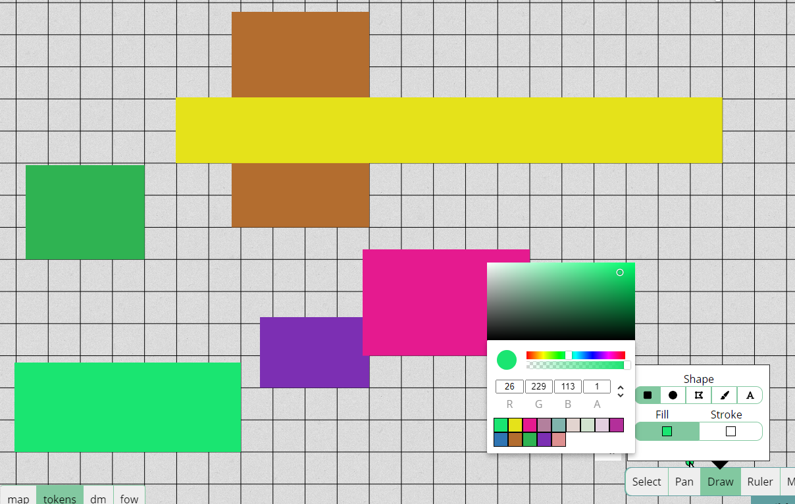

import Lock from "~icons/fa-solid/lock";
import Unlock from "~icons/fa-solid/unlock";

Come promesso nell'ultima release, voglio fare aggiornamenti più regolari anche se non aggiungono molte funzionalità.
Questa release corregge molti bug, ma introduce anche alcune novità!

_Amministratori del server: sono state apportate modifiche alla server_config, controlla [Cose del server](#server-stuff)_

## Importazione/Esportazione

La funzionalità più importante è l'importazione/esportazione.
La funzionalità di esportazione era già stata aggiunta nell'ultima release come funzionalità solo API (ovvero senza interfaccia utente per esportare),
ma la funzionalità di importazione non era ancora stata definita.

_Tra l'altro, grazie a questa funzionalità di esportazione sono riuscito ad aiutare a risolvere più velocemente alcuni bug!_

Questa release introduce la funzionalità di importazione e anche un'interfaccia utente sia per l'esportazione che per l'importazione, così che anche gli utenti finali possano utilizzarle.

### Sperimentale

Voglio sottolineare che questa funzionalità non è ancora nella sua forma definitiva, ma trattandosi di una funzionalità di nicchia,
mi sono sentito sicuro di renderla già disponibile per i test.

Cose da tenere presenti:

- L'interfaccia utente è molto minimale: sia l'importazione che l'esportazione sono solo un singolo pulsante, senza informazioni sul progresso.
- Non c'è ancora nemmeno un'indicazione degli errori lato client
- Non puoi importare una campagna che condivide il nome con una campagna che stai già eseguendo
- Puoi importare una campagna solo su un server che esegue la stessa versione o una versione più recente rispetto al server da cui hai esportato

I primi due punti sono cose su cui lavorerò per una futura release.
Il terzo punto è una questione di UI/UX e di offrire un modo per specificare un nome di campagna diverso.
L'ultimo è un evidente limite tecnico, dato che un server più vecchio non avrà idea di cosa sia cambiato nel formato di salvataggio.

Per affrontare questo problema, dovrà essere creato un servizio separato in grado di aggiornare/retrocedere i file di salvataggio tra versioni arbitrarie. Richiederà parecchio lavoro, quindi non aspettarti che arrivi presto.

### Come esportare/importare

Sia l'esportazione che l'importazione si accedono dal dashboard principale, quindi NON nel gioco!

Per esportare una campagna di cui sei DM, ti basta cliccare su una campagna nella tua sezione "run" e poi cliccare il pulsante "export" nella barra laterale.
Quando l'esportazione è terminata (se non è fallita lato server), il tuo browser ti mostrerà una richiesta di download del file. Esportare una campagna non è immediato, ma non richiede nemmeno moltissimo tempo.

L'output di una campagna esportata è un singolo file con estensione ".pac", abbreviazione di PlanarAlly Campaign.
Questo file contiene tutti gli asset usati nella campagna esportata, oltre a tutte le informazioni del database relative alla campagna.

Per importare poi quella campagna su un altro server, vai alla sezione "import" nella barra di navigazione laterale e premi il semplice pulsante.
Al termine, verrai reindirizzato alla sezione "run" e la campagna importata dovrebbe essere elencata.

Il tempo richiesto sia per l'esportazione che per l'importazione dipende dalle dimensioni della campagna (#luoghi, #piani, #forme) e anche dalle dimensioni degli asset usati in quelle campagne.

### Quando potrei usarla?

Potresti chiederti a cosa serva davvero, e scommetto che la maggior parte delle persone si limiterà a usare 1 server senza mai doversi preoccupare di esportazione/importazione!

Ecco alcuni potenziali casi d'uso:

1. Hai trovato un bug, qualcosa non funziona come dovrebbe e da una chat con me non è subito chiaro cosa stia andando storto.
   Questo è il momento perfetto per fare un'esportazione della tua campagna e inviarmela. Così posso eseguire il debug con calma senza dover fare avanti e indietro con te.

2. Ti piace fare i tuoi backup. È sempre possibile che qualcosa vada storto con un server che stai usando. Tenere un backup non fa male a nessuno.

3. Stai per giocare in un posto senza internet. Esporta rapidamente la tua campagna,
   importala su un server locale che puoi eseguire e boom, puoi continuare a giocare da dove avevi lasciato.
   Quando sei di nuovo in un ambiente con internet, puoi reimportarla!

4. Vuoi semplicemente passare a un altro server PA.

## Selettore colori

Il selettore colori ha ricevuto una nuova divertente funzionalità e anche 2 correzioni che mi davano fastidio :D.

### Ricorda i colori usati in precedenza

Il selettore colori ora ricorda quali colori hai usato (\*).
Vengono mostrati in fondo al selettore su 2 righe (vengono tracciati al massimo 20 colori). Puoi cliccare su uno di questi colori per impostarlo come colore corrente. Passando il mouse su un colore dell'elenco verrà mostrato anche il valore rgba di quel colore.

La cronologia dei colori viene salvata per utente in tutte le sue campagne.



(\*) Un colore viene aggiunto all'elenco quando chiudi il selettore, _non_ quando disegni con esso. Quest'ultimo caso avrebbe richiesto modifiche al codice in tutta la codebase, mentre ora tutto è contenuto nella logica del selettore colori.

### Bug

Sono stati corretti anche 2 bug del selettore colori.

#### Reset dell'opacità

Cliccando sulla barra dei colori (quella sopra la barra dell'opacità), l'opacità veniva spesso reimpostata a 1 o 0, invece di ricordare il livello di opacità corrente.

#### Pannello della saturazione che torna al rosso

Dopo aver selezionato un colore sulla barra dei colori e aver cliccato sul rettangolo della saturazione, la barra dei colori veniva spesso reimpostata al suo valore più a sinistra (rosso). Ora questo non dovrebbe più accadere.

## Modifiche alla logica

La logica è stata una delle nuove funzionalità brillanti della release 2022.1 e siamo qui per rifinire parte di quella nuova lucentezza!

### Porta: chiarezza delle icone

Passando il mouse sopra una porta in modalità Play appare un'icona <Lock /> o <Unlock />.
Era solo un'icona nera, difficile da vedere su uno sfondo scuro.

Questa release aggiunge un bordo bianco alle icone, così che dovrebbero essere sempre visibili.

### Porta: specifica i bloccanti

La prima release della logica delle porte era pensata puramente per... le porte.
Per una porta standard, le proprietà "block movement" e "block vision" dovrebbero essere attivate/disattivate quando si apre o si chiude.
Esistono però anche varianti di porte (ad es. il saracinesca) o elementi come le finestre in cui potresti voler attivare/disattivare solo 1 proprietà.

Ora puoi specificare quale bloccante la porta deve attivare/disattivare al clic.


Ovviamente puoi ancora modificare manualmente l'altra proprietà di blocco come preferisci. \
(ad es. far usare a una finestra la logica della porta per attivare/disattivare solo la visione, per simulare delle tende, ma cambiare la proprietà di movimento se qualcuno lancia un mattone attraverso la finestra)

### Bug

Sono stati risolti diversi bug relativi alla logica delle forme.

- Autorizzazioni delle porte dello strumento Draw non salvate
- La logica della porta non aggiornava immediatamente l'interfaccia utente quando le proprietà della forma erano aperte
- Le zone di teletrasporto che si attivavano da altri piani
- Casi limite dell'inizializzazione della logica che rompevano l'interfaccia utente fino al refresh
- Il selettore delle autorizzazioni della logica che mostrava un errore in un caso limite

## Miglioramenti UI/UX

Sono state apportate alcune belle modifiche per migliorare la UX e l'interfaccia utente generale in certe aree.

### Animazione di caricamento mostrata più rapidamente

All'apertura di una campagna viene mostrata una bella animazione di caricamento.
Tuttavia, questa animazione partiva solo a un certo punto e, a seconda del computer,
poteva esserci un breve periodo in cui sembrava non succedesse nulla all'apertura di una campagna.

L'animazione ora viene mostrata immediatamente al clic su una campagna, così è chiaro che PA sta facendo qualcosa e non hai semplicemente cliccato per errore.

### Ridimensionamento della sconfitta e del badge con la forma

L'overlay di sconfitta della forma e i badge delle forme avevano una dimensione fissa.
Questo significava che un badge per una creatura gargantuesca era minuscolo e che un badge per una creatura minuscola oscurava quasi del tutto il segnalino della creatura stessa.
Inoltre, tutto si incasinava anche usando dimensioni di griglia diverse.

Questa release ora ridimensiona correttamente questi aspetti in base alla dimensione della forma a cui appartengono.

### Gestione delle finestre modali su firefox

La gestione degli eventi dragEnd di Firefox è molto incoerente/piena di bug, cosa che rompeva completamente il trascinamento delle finestre modali.
Parti di questo comportamento difettoso sono corrette nelle versioni nightly di firefox, ma non tutto ciò che mi dava fastidio verrà corretto a breve su firefox. Ho quindi cambiato la logica delle finestre modali per usare l'evento drop. Richiede un po' più di codice, ma almeno garantisce un comportamento simile su tutti i browser.

### Viewport

Il rettangolo che mostra il viewport attivo dei giocatori (quando è abilitato) usava un solo colore pieno che, come per le icone delle porte, non era molto leggibile a seconda del colore di sfondo. Ora usa anche un secondo colore per il contrasto.


### Varia

- Pulsante predefinito "no" mostrato nel prompt di eliminazione/uscita dalla campagna
- Asset Manager aggiorna correttamente l'interfaccia utente usando i pulsanti avanti/indietro del browser
- Le intestazioni di navigazione del dashboard a volte venivano stilizzate in modo errato

## Cose del server

Il lato server ha ricevuto alcune piccole modifiche, incluse modifiche alla config del server!

### Rotazione dei log

Il server ora eseguirà una rotazione dei log invece di avere un unico grande file di log infinito.

La sezione General ha ricevuto due nuove proprietà:

```python
max_log_size_in_bytes = 200_000
max_log_backups = 5
```

Per maggiori informazioni su cosa fanno, consulta la documentazione nella config del server.

### Dimensione dei blocchi di importazione

I file delle campagne possono diventare grandi perché gli asset fanno parte del file.
Per evitare di dover configurare la dimensione di upload su un numero spropositatamente alto, che sarebbe un rischio per la sicurezza,
il client invierà invece i file di importazione in blocchi che corrispondono alla dimensione massima accettata dal server.

Questa dimensione ora può essere configurata nella sezione Webserver e per impostazione predefinita è di 10 MiB.

```python
max_upload_size_in_bytes = 10_485_760
```

## Bug

### Correzioni SVG

Un paio di correzioni specifiche per la sezione SVG nel menu delle Impostazioni extra della forma:

- La sezione svg di ExtraSettings non veniva aggiornata immediatamente finché non cambiavi scheda
- La rimozione di svg in ExtraSettings non funzionava correttamente
- L'aggiunta di svg in ExtraSettings non funzionava per forme senza proprietà svg precedenti

### Correzioni Undo/Redo

- La logica Redo durante un'operazione di ridimensionamento non ricordava la posizione corretta quando era avvenuto un aggancio
- Lo strumento Draw tentava di aggiungere l'operazione di creazione della forma allo stack di undo quando la forma non era valida
- Undo/Redo non persistiti sul server per movimento e rotazione

### Varie

- Luoghi di apparizione caricati in modo errato
- I punti modificati con l'interfaccia di modifica dei poligoni non erano agganciabili fino a un refresh
- Il socket degli asset non ripuliva le vecchie connessioni
- Le aure che sono fonti di luce non appaiono più come un cerchio nero sinistro quando la FOW non è attivata
- Il livello di zoom predefinito del luogo è ora 0.2 invece di 1.0
