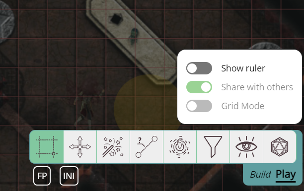

È passato di nuovo qualche mese dall'ultima release, quindi senza tanti preamboli, ecco alcune novità :)

### Ripetizione dell'avviso di deprecazione

Come annunciato nella release precedente, il sistema etichette/filtri è deprecato e verrà rimosso nella prossima release.

## Sistema di chat semplice

Questa release introduce un semplice sistema di chat che ti permette di chattare con gli altri giocatori della campagna.

È progettata per essere semplice e diretta. È disponibile qualche opzione di formattazione tramite markdown e gli URL delle immagini vengono convertiti automaticamente in immagini.

È importante notare che al momento i messaggi inviati non vengono salvati sul server. Quindi qualsiasi aggiornamento o riconnessione alla sessione cancellerà la cronologia della chat.

Non mi è sempre facile capire che tipo di gruppi usano PA, motivo per cui la funzionalità di chat è relativamente minimale.
Se per il tuo gruppo sarebbe utile avere una cronologia persistente della chat o altre funzionalità, contattami!

Per maggiori informazioni sulla chat consulta la [documentazione](../../docs/game/chat), le informazioni sul markdown si trovano [qui](../../learn/dm/Markdown_Tutorial/markdown/).

## Miglioramenti ai dadi

Una buona parte di questa release è stata dedicata al miglioramento di vari aspetti del sistema di lancio dei dadi.

### Interfaccia dello strumento Dadi

L'interfaccia dello strumento Dadi è stata completamente rinnovata.

#### Modalità non 3D

In passato l'unico modo per lanciare i dadi era simularli con oggetti 3D.
Può essere divertente, ma non è sempre la scelta migliore per vari motivi.

D'ora in poi c'è un'opzione per risolvere automaticamente i risultati dei dadi senza simulazione 3D.

#### Miglioramenti all'input

La versione precedente aveva un campo di testo e una semplice interfaccia cliccabile per selezionare i dadi senza scriverli (ad es. cliccare 3 volte su 'd6' aggiungeva 3d6 alla casella di testo).

Funzionava, ma era piuttosto limitato. L'interfaccia "click" è stata ampliata notevolmente.

È stata ampliata anche la grammatica del parser dei dadi, che ora permette espressioni più complesse come "kh2 (mantieni i 2 più alti)" e simili.

#### Condivisione dei risultati

Ora è possibile lanciare i dadi in modo completamente privato, senza che nemmeno il DM veda i risultati.

Gli utenti che ricevono i risultati di un lancio da un altro giocatore ora possono cliccare sul popup di notifica per vedere i dettagli del lancio.

#### Interfaccia dei risultati e cronologia

Anche l'interfaccia che mostra i risultati del lancio dei dadi è cambiata leggermente.

Per ridurre il disordine, i singoli lanci in un gruppo (ad es. 3d6) non vengono più mostrati, ma possono essere rivelati passando il mouse sul gruppo.

Anche la cronologia dei lanci è stata leggermente modificata e cliccando su una riga della cronologia verrà mostrata di nuovo l'interfaccia completa dei risultati.

### Aggiornamento della libreria 3D

Per la simulazione 3D viene utilizzato il motore di gioco babylonjs. È stato aggiornato dalla versione 4 alla 7.
Questo cambiamento include anche una modifica al motore fisico utilizzato, poiché babylonjs ora usa il motore havok al posto di ammo.

Anche la logica di lancio 3D è stata leggermente modificata, ma in gran parte ci si può aspettare lo stesso comportamento.

### La libreria planarally-dice e i sistemi di dadi

Attualmente gran parte dell'interfaccia dei dadi ruota attorno al sistema d20, comune in D&D ma usato anche da altri sistemi.

Detto questo, la libreria dei dadi in sé è stata riscritta per supportare una grande varietà di sistemi di dadi.
L'interfaccia di PA però non ha ancora un modo per passare da un sistema all'altro, quindi per ora utilizza di default il sistema d20.

Sto attualmente pensando a come offrire al meglio altri sistemi di dadi direttamente in PA.
(ad es. un'impostazione "dice system" nelle impostazioni campagna del DM, o magari un'impostazione generale "rpg system".)

Quindi in futuro potrebbero arrivare ulteriori modifiche legate ai sistemi rpg/dadi.

## Manovrare più facilmente nei dungeon

A volte può essere una seccatura spostare un gruppo di segnalini attraverso un paio di corridoi stretti con curve a causa della collisione con le pareti.
Inizialmente li raggruppavo spesso manualmente e poi li risistemavo una volta raggiunto un punto in cui la posizione tornava a essere importante.
Più di recente di solito muovevo 1 sola forma e spostavo le altre con shift nella posizione finale, semplicemente perché richiedeva meno lavoro.

Nessuna delle due soluzioni è però molto comoda, quindi questa release aggiunge una nuova funzionalità che combina i due approcci in modo meno manuale.

Ora puoi cliccare con il tasto destro su un gruppo di forme e selezionare "Collapse", che le sposterà tutte per centrarle sulla forma da cui hai avviato la compressione.
Ora, mentre muovi quella singola forma, tutte le altre la seguiranno automaticamente. Una volta raggiunta una certa posizione puoi cliccare con il tasto destro ed "Expand",
che spingerà fuori tutte le forme nelle loro posizioni originali rispetto alla forma da cui hai avviato la compressione.

C'è anche una scorciatoia da tastiera: tenendo premuta la lettera 'c' (per collapse/compressione) la tua selezione verrà compressa e si espanderà automaticamente quando rilasci il pulsante del mouse o premi di nuovo 'c'.

<video autoplay loop muted style="max-width: min(750px, 75vw);">
    <source src="/blog/release-2024.3/collapse-drag.webm" type="video/webm" />
    <source src="/blog/release-2024.3/collapse-drag.mp4" type="video/mp4" />
</video>

 
 

## Funzionalità di campagna

Un'aggiunta minore è la possibilità per il DM di disattivare alcune funzionalità.
In particolare, a partire da questa release, è possibile disattivare gli strumenti Chat e Dadi.

È più che altro una funzionalità beta, dato che non sono ancora sicuro di come la penso al riguardo.
Queste impostazioni potrebbero essere più adatte come preferenze utente.

## Strumenti

### Modifica dell'interfaccia della barra degli strumenti

Una piccola modifica all'interfaccia della barra degli strumenti: tutta l'interfaccia estesa degli strumenti ora è allineata completamente a destra invece di fluttuare sopra lo strumento corrispondente.
Questo significa anche che la piccola freccia che collegava l'interfaccia dello strumento alla barra è sparita.

Lavorando alle modifiche dello strumento Select (vedi sotto) è emerso che l'interfaccia degli strumenti più vicini al centro aveva alcuni problemi.
O lo strumento non poteva avere un'interfaccia grande, oppure avrebbe bloccato gran parte dello spazio dello schermo principale.

Spostando tutte le interfacce degli strumenti a destra, possono occupare più spazio senza contendersi lo spazio centrale dello schermo.

### Stato di Select & Ruler

Quando una forma è selezionata, l'interfaccia dello strumento Select offriva un'opzione per aggiungere un righello al movimento della forma.

È una cosa carina, ma le impostazioni di quel righello (ad es. se è visibile agli altri giocatori) erano configurabili solo nello strumento Ruler.
Il che significava che spesso dovevi passare avanti e indietro tra i due strumenti per modificare o confermare le impostazioni del righello.

Ora lo strumento Select mostra anche le impostazioni del righello e ti permette di modificarle direttamente.

### Esagoni nello strumento Spell

La release precedente ha introdotto un grande aggiornamento per gli esagoni, ma non ha coperto tutti i punti in cui potrebbero essere utili.

Con questa release lo strumento Spell riconosce il tipo di griglia che stai usando e ora offre l'opzione di creare effetti degli incantesimi in varie dimensioni esagonali.

### Correzioni di bug

- Draw: cliccando sull'etichetta "blocca il movimento" nell'impostazione visione dello strumento Draw ora l'apposita casella di spunta viene attivata/disattivata correttamente
- Ruler: in modalità griglia la barra spaziatrice non sincronizzava correttamente l'estremità agganciata con gli altri giocatori
