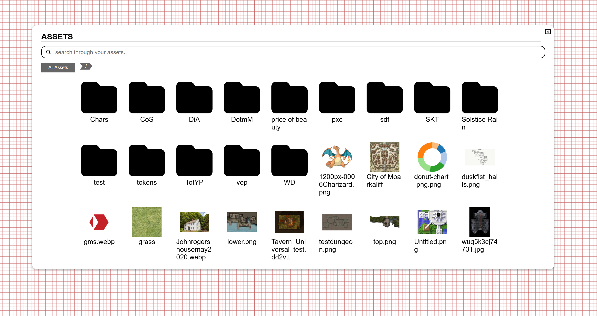

import Warning from "/src/components/directives/Warning.astro";

È un nuovo anno e abbiamo in serbo alcune belle novità per te!

<Warning title="Aggiornamento del server">
    Se sei un amministratore del server, controlla le modifiche agli asset per 3 cambiamenti lato server.
</Warning>

## RIMOSSI

Questa release porta con sé un po' di pulizia con 2 funzionalità rimosse:

### Etichette/Filtri

Come annunciato nelle ultime 2 note di rilascio, questo insieme di funzionalità è ora ufficialmente rimosso.

Le etichette erano tag che potevi applicare alle forme e lo strumento filtro ti permetteva di nascondere/mostrare le forme sullo schermo filtrando in base a questi tag.
Vedo ancora alcuni casi d'uso per questo, ma l'implementazione attuale non era granché, sembrava molto datata e per quanto ne so non veniva utilizzata.
Il fatto che nessuno si sia fatto sentire riguardo a esse da quando è stato pubblicato l'avviso di deprecazione è un segno che la loro rimozione non farà male a nessuno.

### File .paa

In una versione precedente di PA il gestore degli asset aveva l'opzione di esportare tutti i tuoi asset in un file `.paa`, che potevi poi importare in un'altra installazione di PA.

Da allora il gestore degli asset è stato rinnovato e non offre più questa funzionalità nella sua interfaccia.
Inizialmente era mia intenzione riportare questa funzionalità, ma nel frattempo è stata invece aggiunta la possibilità di esportare le campagne, che esporta automaticamente tutti gli asset correlati.

Questo ha coperto la maggior parte dei casi d'uso della configurazione originale di paa. Analogamente all'altra rimozione, nessuno mi ha chiesto di questa funzionalità che non è più disponibile nell'interfaccia,
quindi era un buon momento per fare pulizia, dato che parte della logica interna degli asset è stata riscritta per alcuni cambiamenti più avanti in queste note di rilascio.

## Dadi

### Interfaccia dello strumento

_contributo di rexy712_

Nella 2024.3 lo strumento dadi ha ricevuto una nuova brillante interfaccia, che era già un passo avanti rispetto all'interfaccia originale, ma rexy ha deciso di migliorarla ulteriormente.

L'interfaccia ha ricevuto alcune transizioni fluide e unifica i risultati di un lancio nell'interfaccia invece di aprire un modale separato, rendendo l'esperienza meno dispersiva.
Inoltre la cronologia dei dadi è meglio integrata ed è stato aggiunto un pulsante per ripetere rapidamente l'ultimo lancio.

I dadi 3D ora possono anche essere lanciati in 2 modalità separate: default e box. Default è il comportamento originale in cui vengono lanciati su tutto lo schermo,
box aprirà una piccola sezione in alto simile a un vassoio per i dadi.

## Modifiche alla simulazione dei dadi 3D

_contributo di rexy712_

Sono state apportate modifiche alle proprietà fisiche dei dadi 3D che dovrebbero comportare un comportamento migliore,
in particolare i dadi ora dovrebbero smettere di scivolare molto più rapidamente.

## Gestione dei D100

La gestione dei lanci di D100 era molto diversa tra la modalità 2D e la modalità 3D, con la modalità 2D che copriva tutti i valori tra 1-100,
mentre la modalità 3D copriva solo le decine (ad es. 10/20/30/...) e richiedeva il lancio di un ulteriore d10 per coprire le unità,
ma non c'era alcuna logica per gestire cosa dovrebbe succedere se venivano lanciati ad esempio un 00 e uno 0.

Questa release migliora tutto quanto sopra. In modalità 3D, quando lanci un d100, un d10 verrà lanciato automaticamente insieme ad esso,
così non devi specificarlo tu stesso. Inoltre è presente una logica integrata che determina il comportamento del caso 00/0.

La libreria dei dadi sottostante `@planarally/dice` può essere configurata per essere in modalità 0-99 o 1-100.
Tuttavia l'interfaccia attuale di PlanarAlly non offre alcun modo per configurarla, quindi per ora è sempre selezionata la modalità 1-100.

## Asset

Un altro insieme di grandi cambiamenti riguarda gli asset. Sono state fatte alcune modifiche tecniche sul server oltre ad aggiornamenti visivi sul client!

### Interfaccia in gioco del DM

Il gestore degli asset è un bel modo per organizzare i tuoi asset fuori dal gioco, per preparare le cose per una sessione.

In gioco invece, il DM ha una visione completamente diversa dei propri asset.
C'è una barra laterale con una struttura ad albero, ma non sono possibili vere interazioni, a parte trascinare un determinato asset sulla mappa.

Questa release cambia tutto ciò e rimuove la barra laterale, sostituendola con un grande modale simile per certi versi alla nuova interfaccia delle note,
ma con un aspetto e una sensazione simili a quelli del gestore degli asset fuori dal gioco.
In effetti i gestori degli asset fuori dal gioco e in gioco ora condividono gran parte del codice della loro interfaccia.

Proprio come la rinnovata interfaccia delle note dell'anno scorso, l'interfaccia degli asset può essere aperta dalla barra laterale, ma anche premendo la scorciatoia <kbd>a</kbd>.

#### Ricerca

La barra laterale aveva sempre una barra di ricerca, che è ancora disponibile nella nuova interfaccia ed è implementata in modo molto più efficiente,
non richiedendo più di caricare tutte le informazioni degli asset in anticipo quando ci si connette al gioco.

Il suo comportamento è leggermente diverso dalla ricerca nella barra laterale, dato che la rappresentazione è completamente diversa.
Mostrerà direttamente tutti gli asset corrispondenti alla ricerca. La barra laterale invece manteneva visibili tutte le cartelle che contenevano un asset corrispondente da qualche parte al loro interno.

#### Scorciatoie

Un'altra nuova funzionalità è la possibilità di contrassegnare una cartella come scorciatoia. Le scorciatoie appariranno sul lato sinistro, sotto la scorciatoia permanente "All assets".
Ti permettono di raggiungere rapidamente una particolare cartella di cui potresti avere spesso bisogno (ad es. la cartella principale della campagna, i segnalini dnd comuni, ...).

Le scorciatoie sono salvate per campagna.

#### Trascinamento

Potresti chiederti come dovresti ora trascinare un asset sulla mappa, dato che la nuova interfaccia occupa una buona parte del centro dello schermo.

Quando inizi a trascinare un asset, puoi trascinarlo sopra una cartella per spostarlo in quella cartella, come faresti nel gestore degli asset.
Se invece trascini l'asset fuori dall'interfaccia, questa scomparirà completamente permettendoti di posizionarlo sulla mappa.

Per garantire chiarezza, durante il trascinamento viene sempre mostrato un messaggio nella parte inferiore dell'interfaccia per informarti di questo comportamento.

<video autoplay loop muted style="max-width: min(680px, 75vw);">
    <source src="/blog/release-2025.1/asset-drop.webm" type="video/webm" />
    <source src="/blog/release-2025.1/asset-drop.mp4" type="video/mp4" />
</video>

### Modifiche minori al gestore degli asset

#### Interfaccia di rinomina

_contributo di rexy712_

Rinominare un asset apriva un popup in cui dovevi inserire il nuovo nome.
Questo è stato reso meno invasivo, permettendoti invece di modificare il nome sul posto, come potresti essere abituato a fare nell'esplora file del tuo sistema operativo.

#### Selezione nel menu contestuale

Quando fai clic con il tasto destro su un asset nel gestore degli asset, apparirà un menu contestuale.
In passato questo reimpostava sempre la selezione al solo asset su cui avevi fatto clic con il tasto destro.

Questo non è più il caso, permettendoti di selezionare correttamente un gruppo di file e rimuoverli usando il menu contestuale.
Azioni come "rinomina" non vengono mostrate quando sono selezionati più asset.

La selezione verrà reimpostata al solo asset su cui hai cliccato se non faceva già parte della selezione corrente.

### Anteprime

Gli asset possono essere caricati in un'ampia varietà di qualità e quando vengono mostrati sulla mappa, vogliamo che siano della stessa qualità.

Ci sono però altri punti in cui interagiamo con gli asset dove la qualità superiore non è richiesta e rende solo le cose più pesanti.
Il gestore degli asset è il candidato principale, dove carichiamo potenzialmente molte immagini contemporaneamente.

A partire da questa release il server tenterà di generare anteprime per tutti gli asset caricati e preferirà usarle quando mostra gli asset, ad esempio nel gestore degli asset.
Questo renderà il gestore degli asset molto più scattante, dato che non dovrà caricare un mucchio di immagini di qualità superiore.

<Warning title="Aggiornamento del server">
    All'avvio del server verrà avviato un processo in background per generare le anteprime di tutti gli asset esistenti. Questo registrerà
    qualche progresso di tanto in tanto, ma per il resto non blocca il comportamento principale del server.

    È presente anche un comportamento di fallback nel caso le anteprime non esistano, quindi questo processo è meno critico.

</Warning>

### Limiti di caricamento e archiviazione

L'amministratore del server ora può configurare limiti globali agli asset nella configurazione del server.
Sono disponibili due nuove impostazioni: una per limitare la dimensione massima di un singolo asset e un'altra per limitare la dimensione totale di tutti gli asset che un determinato utente ha sul server.

Entrambe queste impostazioni non hanno limiti per impostazione predefinita, quindi assicurati di modificarle in base a ciò che vuoi fare.

È importante notare che le modifiche ai limiti si applicano solo agli asset caricati di recente.
Se un utente sta usando più spazio prima dell'aggiunta dell'impostazione, nessuno dei suoi asset esistenti verrà rimosso, ma non potrà caricare altri asset.

<Warning title="Aggiornamento del server">
    Questo aggiunge nuove voci al file di configurazione, assicurati di aggiungerle alla tua configurazione o il server
    non riuscirà ad avviarsi.
</Warning>

### Posizione di salvataggio

_questa è una modifica tecnica lato server, puoi saltarla se sei un giocatore_

I file fisici associati agli asset caricati sono salvati su disco in una particolare cartella con tutti i nomi uguali all'hash dell'asset.
Fino ad ora erano salvati in 1 cartella piatta, ma per motivi di prestazioni questa release li salverà invece in una struttura di sottocartelle basata sull'hash.
Questo ridurrà alcuni tempi di operazioni I/O, dato che non dovranno più operare in 1 grande cartella.

<Warning title="Aggiornamento del server">
    Verrà eseguita una migrazione una tantum per spostare tutti i file esistenti nella loro nuova posizione all'avvio.
    A seconda della quantità di asset sul tuo server, questa operazione potrebbe richiedere un po' di tempo.

    È essenziale che questo processo non venga interrotto, poiché vengono spostati sia i file fisici che i dati nel database che collega tutto.

</Warning>

## Note

Un ultimo gruppo di modifiche riguarda le note. Tuttavia la maggior parte di queste sono modifiche minori e correzioni di bug.

### Popout completo

Con l'introduzione della nuova interfaccia delle note, una nota può essere estratta dal gestore delle note, risultando in un modale fluttuante che puoi trascinare all'interno dello schermo di PA.

Questa release rende possibile estrarre questo modale completamente fuori dalla pagina, permettendoti di trascinare la nota su un altro schermo e continuare a interagire con essa.
Questa finestra fluttuante è ancora legata alla pagina PA aperta, ma non è vincolata a una particolare posizione dello schermo. Chiudendo la scheda di PA, anche la finestra fluttuante si chiuderà.

### Accesso globale alle note

L'accesso predefinito alle note globali è stato rimosso.
In passato questo permetteva agli utenti di impostare una nota come visibile (o addirittura modificabile) a livello globale tra tutti gli utenti, cosa che non è proprio quello che vogliamo.

### Piccoli miglioramenti all'interfaccia

- Ora puoi pulire la barra di ricerca delle note con un pulsante.
- L'interruttore locale/globale è ora un menu a discesa con l'opzione di filtrare tutte le note
- Il pulsante delle note nella barra laterale ora è visibile anche per i giocatori
- I popout delle note per note senza accesso in scrittura ora dicono "Vedi sorgente" invece di "Modifica"

### Correzioni

- Risolti vari bug dell'interfaccia relativi all'interazione con l'accesso in sola visualizzazione
- La paginazione delle note non veniva reimpostata quando si modificavano ricerca/filtri
- L'accesso di modifica predefinito alle note non funzionava correttamente
- La barra di ricerca si sovrapponeva ad altre interfacce
- Era possibile modificare localmente una nota di sola lettura (queste modifiche venivano sempre rifiutate dal server)

## Colori predefiniti dello strumento Draw

Quando disegno sul livello della nebbia di guerra, tendo spesso a passare dal disegnare muri a finestre, porte, ecc.
Per ognuno di questi tendo a usare un colore particolare, così che risaltino visivamente immediatamente quando apro il livello della nebbia di guerra.

Fino ad ora questo era un po' una seccatura, perché dovevi sempre cambiare i colori quando passavi da un tipo all'altro e anche se lo strumento colore ha una memoria dei colori usati di recente,
era comunque una scocciatura.

Questo ora cambia con l'aggiunta dei colori predefiniti: nelle tue impostazioni client ora puoi configurare colori predefiniti per muri/finestre e porte.
Questi verranno applicati per impostazione predefinita quando sono pertinenti nello strumento Draw.

Per comunicare questo chiaramente, i selettori di colore sono disabilitati nello strumento Draw quando verrebbe usato un colore predefinito.
Puoi comunque disattivare questo comportamento e scegliere colori specifici per un particolare oggetto deselezionando la casella 'usa colori predefiniti' nelle impostazioni di visione dello strumento Draw (2ª scheda).

Questa è una piccola aggiunta, ma mi ha già fatto risparmiare un sacco di tempo!

## Varia

- SuikaXhq si è impegnato ad aggiornare molte delle etichette inglesi hardcoded nell'interfaccia per usare le etichette di traduzione
- Aggiornati i colori del bordo del pulsante di nuova partita nella dashboard
- Corretta una gestione strana delle modifiche quando la selezione cambiava (ad es. cambiare il nome di una forma e cliccare su un'altra forma prima di uscire dal campo di input del nome)
- Trascinare i modali ora li mette anche a fuoco
- Il teletrasporto di forme composite poteva causare alcuni errori lato client
- L'aggancio dello strumento Select ora si comporta come l'aggancio dello strumento Draw (cioè una volta agganciato a un punto, non si aggancia più alla griglia al rilascio del mouse)
- Cliccare su una sessione che condivide un nome con un'altra sessione faceva espandere entrambe
