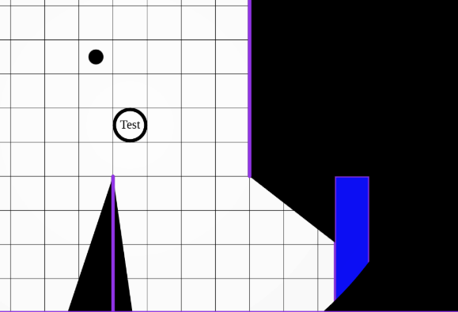

Questa è una release molto piccola pensata per distribuire alcune correzioni di bug varie, ripulire la vecchia configurazione del server e sostituire il vecchio client admin separato con un pannello admin integrato.

## Spostamento del pannello admin

Fino a questa release, il proprietario del server poteva avere un secondo webserver speciale riservato all'admin, oltre al server planarally principale.
Questo server admin poteva essere usato per alcune cose molto semplici come elencare tutti gli utenti, reimpostare le password, ecc.

Era abbastanza di nicchia, richiedeva una certa conoscenza tecnica per la configurazione e rendeva la configurazione del server un po' più complicata.
Essendo un'applicazione separata, spesso veniva anche ignorato da me, causando dipendenze obsolete e, in generale, nessun aggiornamento.

Così ho deciso di eliminarlo del tutto e di aggiungerlo direttamente all'applicazione principale.
È stata aggiunta una nuova opzione di configurazione "admin_user" (vedi [il manuale di configurazione](/it/server/management/configuration/#field-admin_user)) che può essere configurata per designare un utente specifico come admin principale.

Questo utente vedrà un'ulteriore sezione "Admin" nella propria dashboard, che apre la dashboard admin. Sono per lo più gli stessi dati che aveva il pannello admin originale, ma con alcune piccole aggiunte.

L'obiettivo è ampliarlo in futuro con cose come:

- modifica della configurazione del server
- dare ad altri utenti i permessi per vedere/gestire alcune cose
- mostrare le statistiche raccolte dalla 2025.2

Ma questo è per una release futura ;)

## Miglioramenti allo scroll dello zoom

Quando si era ingranditi molto, c'erano grandi salti nel livello di zoom, abbastanza sgradevoli e fastidiosi.

L'esperienza di zoom dovrebbe ora essere molto più fluida.

## Correzioni dell'iniziativa

Rexy ha fatto una serie di correzioni al comportamento dell'iniziativa!

- Tornare indietro di un turno diminuiva i timer degli effetti
- Rimuovere una voce dell'iniziativa poteva causare alcune inconsistenze di stato

Quando ora si rimuove una voce dell'iniziativa, la voce successiva nell'elenco diventa la voce attiva.

## Correzioni alla modalità di visione "Dietro"

Nella [2024.1](/it/blog/release-2024.1) è stata introdotta la modalità di blocco della visione "dietro".

In origine era implementata con una specie di hack intelligente. Di recente però mi è stato segnalato (dal sopracitato Rexy) che ci sono alcuni casi in cui questo produceva risultati di rendering errati.

Nell'immagine qui sopra il rettangolo blu è configurato in modalità di blocco della visione "dietro", ma in qualche modo una grande parte di esso è visibile dove non dovrebbe.

I dettagli sono abbastanza tecnici, ma ho passato un paio di giorni a lavorarci e ho riscritto completamente la logica della modalità di visione "dietro", che ora dovrebbe essere robusta (TM).

## Correzioni alla ricerca asset

Un subdolo bug di sintassi nel codice del server faceva apparire gli asset di altri giocatori durante la ricerca nel gestore di asset in gioco.

Mentre correggevo quel bug ho anche notato che gli asset condivisi non venivano interrogati durante la ricerca degli asset.
È un'operazione più costosa includerli per impostazione predefinita, quindi è stato aggiunto un toggle alla barra di ricerca per poter attivare opzionalmente la ricerca degli asset condivisi con te.

## Rimozione della vecchia configurazione

Nell'ultima release il formato di configurazione è cambiato completamente. Da allora viene salvato in `data/config.toml` invece del file originale `server_config.cfg`.

Poiché la configurazione originale era sotto controllo di versione, non volevo sorprendere le persone rimuovendo improvvisamente il file durante l'aggiornamento.
Ripensandoci avrei dovuto semplicemente rimuoverlo (o aggiungere un grande banner al file), visto che c'è stata una certa confusione per la presenza di quei file, sebbene non più utilizzati.

Lezioni imparate, suppongo!

Ad ogni modo, i vecchi file di configurazione sono stati rimossi.

## Configurazione server non valida

Il server ora non si avvierà più e segnalerà errori quando vengono rilevati dati di configurazione sconosciuti o errati.

Questa è una misura extra per prevenire sorprese per chi pensa di aver configurato qualcosa correttamente, quando in realtà non l'ha fatto.

## Statistiche

Sono state fatte alcune piccole modifiche alle API interne, in particolare l'esportazione verso il server di statistiche PA principale ora avviene a blocchi per prevenire pacchetti di dati grandi se l'esportazione non è avvenuta da un po'.

Inoltre, i problemi di rete dei giocatori che causano connessioni/disconnessioni rapide non saranno più tracciati nelle statistiche, poiché potrebbero inondare i dati senza alcun valore reale.

## Correzioni di bug

- Non riaprire le proprietà della forma dopo una nuova selezione
- L'ultima linea della griglia sull'asse X o Y a volte non veniva renderizzata
- Rinominare un piano dopo un riordino rinominava il piano sbagliato
