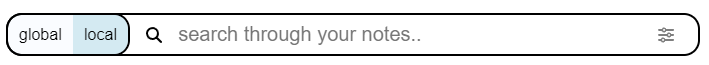
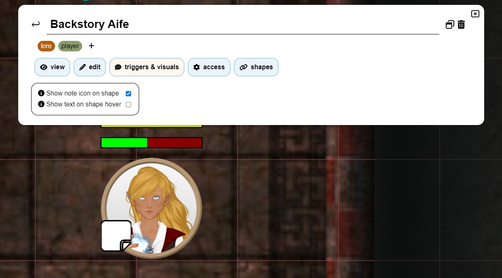

import Info from "/src/components/directives/Info.astro";
import Warning from "/src/components/directives/Warning.astro";

# Note

Come DM o giocatore a volte sentirai il bisogno di prendere note su un personaggio, un luogo, un evento, ...
Questa pagina ti mostrerà cosa offre PlanarAlly in termini di gestione delle note.

## Concetti

In sostanza tutte le note sono semplici contenitori che contengono testo, un titolo opzionale e un autore.
Possono però essere usate in diversi modi.

Le note possono essere condivise con altri giocatori, oppure mantenute private per chi le ha create.
Le note possono anche essere collegate alle forme, consentendo un accesso rapido alla nota quando si seleziona la forma.
O semplicemente per ricordarti qualcosa sulla forma.

Le note supportano la formattazione Markdown. Per maggiori informazioni consulta il [Tutorial Markdown](/it/learn/varia/Markdown_Tutorial/markdown/)

### Globale vs Locale

Nella maggior parte dei casi una nota è rilevante solo per la campagna/luogo corrente.
Ma ci sono alcuni casi limite in cui potresti volere una nota che non dipenda dalla campagna e sia disponibile ovunque.

Il primo caso è chiamato locale e il secondo globale.
Durante la creazione della nota dovrai decidere quale vuoi creare.

Un buon esempio di nota globale è la scheda caratteristiche di un mostro.
Se la combini con i [modelli di asset](/it/docs/dm/assets/#templates), sarai in grado di trascinare un goblin sul tavolo e
avere una nota con la sua scheda caratteristiche collegata.

## L'interfaccia del Gestore note

Al centro dell'interazione con le note c'è il gestore note.
È un grande elemento dell'interfaccia che consente di cercare, filtrare e creare note.

### Apertura

Il Gestore note può essere aperto cliccando sulla sezione "Note" nel menu laterale sul lato sinistro dello schermo.

Può anche essere aperto/chiuso usando la scorciatoia da tastiera <kbd>n</kbd>.

Infine può essere aperto anche usando il menu contestuale su una forma oppure
usando il pannello di informazioni sulla selezione sul lato destro dello schermo quando una forma è selezionata.
In questi casi il gestore note verrà aperto con un filtro applicato per mostrare solo le note relative alla forma.

### Vista principale

Questa mostra l'elenco di tutte le note attualmente disponibili (con i filtri specifici applicati).

#### Ricerca e filtraggio

Il primo grande elemento dell'interfaccia è la barra di ricerca, che ti consente di cercare tra tutte le note e filtrarle.

La barra di ricerca contiene un interruttore per passare dalle note locali a quelle globali.
Queste note di solito sono di natura molto diversa e quindi hanno una vista separata dedicata.

Il secondo elemento è il vero e proprio campo di input della barra di ricerca, in cui puoi digitare la tua query di ricerca.

PA confronterà tutte le note note con questa query e mostrerà i risultati nell'elenco sottostante.
Il punto in cui PA cercherà la tua query dipenderà dai filtri usati,
questo può essere configurato usando l'ultimo elemento della barra di ricerca.

Per impostazione predefinita PA cercherà la tua query nel titolo e nei tag della nota.
Può però essere modificato per cercare anche nel contenuto della nota e nell'autore.

PA per impostazione predefinita cercherà inoltre solo nelle note create nel luogo attivo.
Questo può essere cambiato per cercare in tutti i luoghi non archiviati o persino in tutti i luoghi della campagna corrente.

È possibile nascondere tutte le note collegate alle forme,
questo può essere utile se vuoi concentrarti su note più legate alla storia complessiva.

Un ultimo filtro possibile è ignorare l'interruttore locale per le note globali collegate a forme locali.
In sostanza questo includerà tutte le note (indipendentemente dallo stato locale/globale) collegate a una forma nel luogo corrente.
(ad es. la scheda caratteristiche globale di un goblin apparirà nell'elenco locale, se c'è un goblin nel luogo corrente)

##### Filtro per forma

È possibile mettere il gestore note in modalità filtro per forma, usando il menu contestuale su una forma e
selezionando mostra note oppure passando dalla sezione note della selezione attiva.

Quando questo accade, verranno mostrate solo le note collegate alla forma pertinente.
La maggior parte dei filtri di ricerca sparirà/si disabiliterà quando questo accade, poiché non sono più rilevanti. (nota che verranno mostrate sia le note globali che quelle locali collegate alla forma)

Quando sei in questa modalità, il pulsante di creazione di una nuova nota collegherà automaticamente la nota alla forma.

<Info>È anche possibile collegare note a note esistenti usando la scheda 'forme' nella vista di modifica.</Info>

#### Elenco delle note

Il centro della vista principale mostra il titolo, l'autore, i tag e alcune azioni rapide per ogni nota che corrisponde alla query di ricerca e ai filtri.

Il titolo è un link cliccabile che apre la nota nella vista di modifica.

Le 2 azioni rapide disponibili al momento sono i pulsanti di modifica e di popout.
L'icona di modifica, proprio come il clic sul titolo, apre la nota nella vista di modifica,
l'icona di popout apre la nota in un modale separato. (Vedi [Note in popout](#popout-notes) per maggiori informazioni)

Questa vista sarà impaginata se troppe note corrispondono ai filtri attivi. In questo caso appariranno i pulsanti `<` e `>` in alto a destra.

### Creare una nuova nota

Dopo aver cliccato sul pulsante di creazione di una nuova nota nella vista principale dell'elenco, apparirà una nuova schermata per preconfigurare una nuova nota.
In questa vista puoi configurare il titolo e il tipo di nota (globale o locale).

Questo viene fatto con una vista separata, per dare spazio a spiegare la differenza tra note globali e locali.

Dopo aver creato una nota, verrai automaticamente portato alla vista di modifica per un'ulteriore configurazione.

### Vista di modifica

Questa vista è la modalità avanzata per modificare una nota.
Se vuoi tornare alla vista principale, puoi premere la freccia indietro in alto a sinistra, accanto al titolo della nota.

La vista di modifica è divisa in più sezioni, dall'alto verso il basso:

#### Titolo

Questo mostra semplicemente il titolo della nota.

Se hai i diritti di modifica sulla nota, puoi modificarlo.

Sul lato destro sono di nuovo disponibili alcune azioni rapide.
Sono disponibili un'altra icona di [popout](#popout-notes) e un'icona a forma di cestino che eliminerà la nota.

#### Tag

Questo mostra tutti i tag attualmente collegati alla nota.

Se hai i diritti di modifica sulla nota, puoi aggiungere/rimuovere tag.

I tag sono liberi e possono essere qualsiasi cosa tu voglia, anche se idealmente dovrebbero essere relativamente brevi.
Il loro unico uso da parte di PA è per filtrare/cercare note, quindi puoi organizzarli come preferisci.

A un tag verrà automaticamente assegnato un colore coerente in base al suo contenuto.

<Warning>
    I tag sono visibili a ogni utente che ha i diritti di 'visualizzazione' sulla nota. (vedi [Scheda
    Accesso](#tab-access))
</Warning>

_La generazione dei colori funziona solo in contesti HTTPS poiché usa un algoritmo SHA1, quindi in contesti HTTP ripiegherà su un colore grigiastro_

#### Scheda: Vista e Modifica

Queste due schede lavorano insieme e formano il nucleo della nota.

Nella scheda Modifica puoi scrivere/modificare il contenuto effettivo della nota in un formato testuale compatibile con Markdown.
Il Markdown effettivamente renderizzato può poi essere visto nella scheda Vista.

#### Scheda: Attivatori e Aspetto

Questa scheda può essere aperta solo se la nota è collegata a una forma.

Consente di configurare alcuni comportamenti speciali per la nota.

Attualmente offre due opzioni:

Mostra icona della nota: mostrerà una piccola icona accanto alla forma (sulla mappa).
Questo può essere usato per ricordarti di una nota importante.

Mostra testo al passaggio del mouse sulla forma: mostrerà il contenuto della nota (renderizzato in Markdown) quando passi il mouse sulla forma.
Apparirà nella parte centrale alta dello schermo. Tieni presente che se la tua nota è grande, coprirà probabilmente una buona parte dello schermo.

#### Scheda: Accesso

Questa scheda ti consente di configurare chi può vedere e modificare la nota.

Per impostazione predefinita solo l'autore della nota può vedere e modificare la nota.
Ma potresti voler dare a tutti i giocatori l'accesso in visualizzazione a una nota che hanno trovato da qualche parte.

Puoi anche dare un accesso granulare a giocatori specifici, consentendoti di condividere note nascoste con giocatori specifici.

È importante rendersi conto che i tag di una nota sono visibili ai giocatori con accesso in visualizzazione.
Assicurati di non rovinare accidentalmente qualcosa avendo un tag `fazione:malvagia` o qualcosa di simile.

<Info>
Quando dai l'accesso in visualizzazione a un giocatore (sia specifico che a tutti), riceverà una notifica che una nuova nota è disponibile.

Quindi come DM, dare semplicemente l'accesso in visualizzazione a una nota è un buon modo per notificare ai tuoi giocatori una particolare informazione che hanno appena scoperto.

</Info>

#### Scheda: Forme

Questa scheda elenca tutte le forme attualmente collegate alla nota.

Lo fa elencando prima una somma numerica di tutte le forme in tutte le campagne, seguita da una somma per il luogo attivo.

Per il luogo attivo elenca inoltre tutte le forme con il loro nome. Cliccando sul nome, lo schermo si centrerà su quella forma.
Passando il mouse su un nome apparirà anche un'icona a forma di cestino che, quando cliccata, scollega la nota da quella forma.

## Note in popout

A volte hai bisogno di accedere di frequente a una o più note.
Aprire continuamente il gestore note e scambiare le note è una seccatura in questo caso.

Per risolvere questo problema PA offre la possibilità di estrarre una nota in un modale separato.
Più di queste possono essere aperte contemporaneamente e possono essere trascinate individualmente.

Un popout offre solo funzionalità di visualizzazione e modifica, per altre impostazioni della nota devi aprire il gestore note vero e proprio.

È anche possibile comprimere un popout, che nasconderà il contenuto della nota e mostrerà solo il titolo.
Questo è particolarmente utile se hai più popout aperti o se sai che una certa nota non è più rilevante, ma lo sarà nel prossimo futuro.

## Note nella selezione attiva

PA mostra sempre un elemento dell'interfaccia sul lato destro dello schermo con alcune informazioni rapide sulla forma attualmente selezionata.

Questa sezione ha anche una sezione dedicata alle note.
Mostra il numero di note collegate e un'icona per aprire immediatamente il gestore note con un filtro applicato per mostrare solo le note relative alla forma. (Vedi [Filtro per forma](#shape-filtering) per maggiori informazioni)

Se 1 o più note sono collegate alla forma, puoi anche espandere/comprimere questa sezione per elencare le note.
Questo ti consente di estrarre rapidamente una nota in un popout o di aprirla nel gestore note.
Inoltre, passando il mouse su queste note verrà mostrato il contenuto della nota nella parte centrale alta dello schermo, indipendentemente dalla loro configurazione di attivazione.
