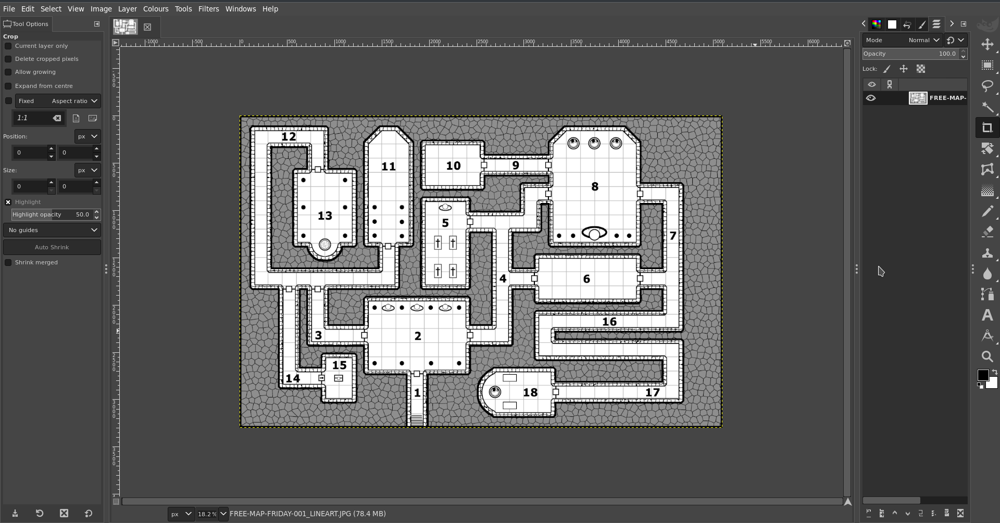
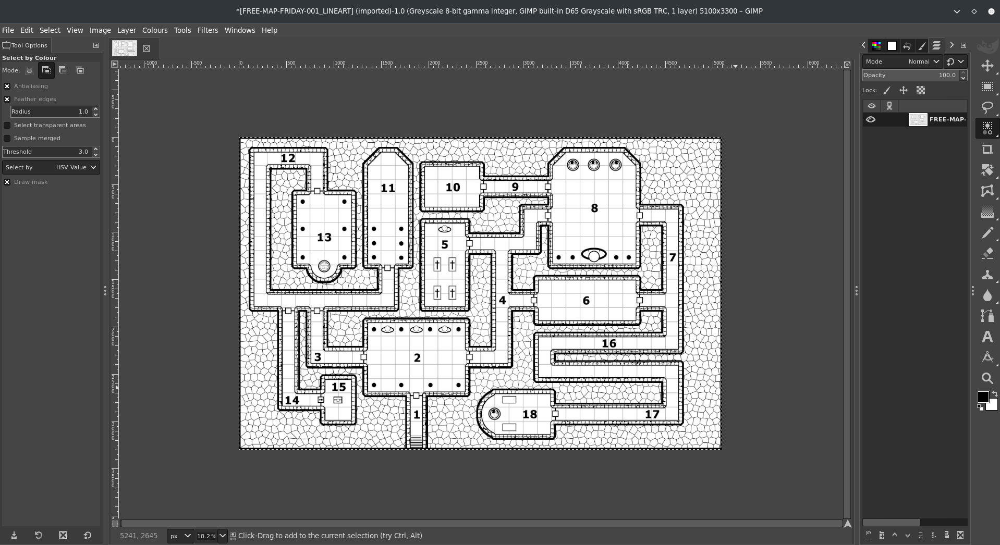

# **Guida alla creazione di maschere per i muri.**

Guida contribuita da [@veritanuda](https://keybase.io/veritanuda)

Questo metodo dovrebbe funzionare per qualsiasi mappa a seconda della sua fedeltà, ma anche mappe irregolari come le caverne possono essere mascherate facilmente.

# Requisiti

Le istruzioni qui sotto sono per l'uso di strumenti liberamente disponibili [GIMP](https://gimp.org) e [potrace](https://potrace.sourceforge.net/); puoi ovviamente usare strumenti proprietari per ottenere gli stessi risultati, ma non c'è garanzia che si comportino allo stesso modo.

---

Qui sotto mostrerò 2 metodi.

- Un metodo è per i dungeon e le mappe già pronte
- L'altro metodo è per le mappe irregolari e le mappe personalizzate.

# **Metodo Uno**

Per questo metodo sceglierò una mappa casuale da Free Friday Maps, che puoi trovare [qui](https://www.drivethrurpg.com/browse/pub/10213/Paths-to-Adventure/subcategory/25973_33572/Free-Map-Friday), ma qualsiasi mappa va bene purché abbia alcune caratteristiche chiave.

- Ha una versione in bianco e nero e
- ha un'opzione senza griglia.

    Queste non sono essenziali, ma rendono la creazione della maschera un po' meno dispendiosa in termini di tempo.

Quindi questa è la mappa con cui inizierò.

È disponibile in alcuni tipi, inclusa la Lineart, che è quella che useremo.

# Rimozione dello sfondo

In questa mappa c'è un po' di tratteggio irregolare attorno alla mappa come sfondo. Fortunatamente è di un colore diverso, una sorta di grigio. Quindi selezionando lo strumento `Fuzzy select/Colour Select`, scegli `Colour Select`, seleziona una delle aree grigie dello sfondo e dovresti vedere tutto il grigio diventare evidenziato.

Questo è buono, ma poiché le linee tra di loro non sono selezionate, se le eliminassimo ora lascerebbe solo l'aspetto di una pavimentazione nera irregolare.

Quindi, mentre è tutto selezionato, fai clic destro sull'immagine e vai su `Select` `>` `Grow...`

Ingrandisci la selezione di qualche pixel finché non copre le linee tra i punti grigi. Una volta che sei soddisfatto di aver catturato tutto, premi `Delete` e _POOF_ lo sfondo scompare.

Ora torna a `Fuzzy Select` e questa volta scegli `Fuzzy Select`. Clicca sullo sfondo ormai bianco e vedi tutto selezionato.

- _Nota: se hai spazi chiusi, come questa mappa, devi tenere premuto il tasto shift e cliccarci dentro per aggiungerli alla selezione._

Ora, nel pannello `Layers`, aggiungi `New Layer` e chiama questo livello `mask`.

Su quel livello seleziona lo strumento `Bucket Fill`. Clicca sulla selezione dello sfondo fatta prima e dovrebbe riempirsi tutto di nero.

Nascondi il livello line art e controlla di avere una maschera completa senza parti mancanti.

Se hai dimenticato qualcosa, niente panico: premi `Cntrl-Z` per annullare e torna a selezionare le parti che hai mancato prima.

A seconda della mappa e di come hai selezionato lo sfondo, alcune porte potrebbero essere state dipinte. Dovrai usare lo strumento Erase (Gomma) con il pennello della forma più adatta, passare sopra tutte le porte e le porte segrete e rimuovere il nero.

Se non lo fai, renderai una porta impassabile. Puoi sempre aggiungere segnalini porta a qualsiasi apertura che hai creato, una volta che la mappa è importata e i muri sono stati aggiunti.

Una volta che sei soddisfatto della tua maschera, puoi eliminare il livello line art.

La parte successiva è **vitale** se vuoi convertirla correttamente in SVG, che è quello che PlanarAlly usa per i muri.

Fai clic destro sull'immagine e vai su `Image` `>` `Mode`; se hai importato la Line art, come ho fatto io, sarebbe stata `greyscale`. A volte dovrai convertire una mappa a colori in `greyscale` per rendere più facile eliminare gli sfondi, ecc. Ma ora la modalità deve essere `RGB`. Cambia l'immagine in quella.

Poi fai clic destro sull'immagine e vai su `File` `>` `Export As...` e salva l'immagine come `BMP`. Disattiva `Run Length Encoding`, disattiva `Do not write colour space information` e assicurati che sotto `Advanced` tu sia su `32 Bits`

Una volta salvato, puoi usare `potrace` da riga di comando oppure farlo online gratuitamente da [questo sito](https://svg-converter.com/potrace)

Il comando per farlo da soli è estremamente semplice.

`potrace -s FREE-MAP-FRIDAY-001_LINEART_WALLS.bmp`

Questo dovrebbe darti un `svg` che, se aperto in un programma grafico, dovrebbe essere nero dove la luce sarà bloccata e trasparente dove la luce può brillare.

# **Metodo Due**

Diciamo che hai una mappa irregolare o che lo sfondo non è così facile da rimuovere. Beh, puoi comunque creare una maschera a mano usando solo strumenti normali.

Per questo esempio userò [questa mappa](https://www.reddit.com/r/FantasyMaps/comments/hrf51h/battlemap30x202160x1440pxcavejunglepirateoc/)

Importa la mappa in GIMP.

Crea un nuovo livello e chiamalo `guide`.

Con lo strumento `Pencil tool` seleziona `Circle` come pennello e rendilo nero. Ridimensiona come necessario. Assicurandoti di aver selezionato il livello `guide`, inizia a disegnare sulle porzioni colorate della mappa **all'interno** dei muri.

Una volta che sei soddisfatto di aver riempito tutta la forma, crea un altro livello chiamato `walls.`

Sul livello `guide` usa lo strumento `Select by colour` e clicca sulla guida nera che hai creato. Poi inverti la selezione.

Poi, sul livello `walls`, usa lo strumento bucket fill per riempire di nero la selezione invertita e riempire i muri.

Una volta fatto, nascondi i livelli precedenti e, se sei soddisfatto di non aver dimenticato niente, elimina quei livelli e salva l'immagine come BMP come sopra, per convertirla usando uno dei metodi di cui sopra.

# Importare i muri in PA

Ora carica questo SVG nella tua cartella `Assets` su PlanarAlly insieme alla mappa del giocatore e alla mappa del GM, se ce n'è una.

Trascina quegli asset in un luogo, con la mappa del giocatore sul livello MAPPA e la mappa del GM sul livello GM. Sul livello MAPPA fai clic destro su di esso, apri Proprietà e imposta un `Name` e sotto `Advanced` spunta `Blocks Vision/Light` e `Blocks Movement`. Poi vai alla scheda `Extra` e sotto `Lighting & Vision` `>` `Upload walls`. Seleziona l'SVG che hai appena caricato tra i tuoi asset. I tuoi muri dovrebbero ora essere applicati.

Testalo con un segnalino che ha una sorgente di luce sul livello `Token` e hai quasi finito. Ora, se ci sono porte o passaggi segreti, devono essere isolati manualmente con segnalini porta o FOW, a tua scelta. Ma se tutto va bene, non dovrai più preoccuparti di creare muri a mano.

Buon gioco!

\*/}
