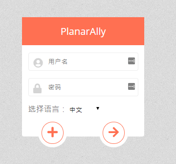

今回のリリースでは、新しいシェイプのプロパティ、スポーンロケーションシステム、翻訳、さまざまな生活の質を向上させる変更、そしておなじみの多数のバグ修正を追加しました。

## Shape

シェイプのプロパティに新しい機能が追加され、移動中の衝突判定も改善されました。

### 不可視トグル

シェイプを不可視としてマークできるようになりました。これにより、そのシェイプへの視野アクセス権を持たないすべてのプレイヤーには見えなくなります。
視野アクセス権を持つプレイヤーには、通常どおりに表示されます。

これは、不可視のファミリアなどに特に便利ですが、さまざまな発光オブジェクトにも役立ちます。
後者については、不可視トグルがこれらの不可視シェイプのオーラには適用されないため、興味深い点があります。
これは、光を放つ醜い円をプレイヤーに見せることなく、シーンにランプを追加したい場合に理想的です。

<video autoplay loop muted style="max-width: min(680px, 75vw);">
    <source src="/blog/release-0.21/invisible.webm" type="video/webm" />
    <source src="/blog/release-0.21/invisible.mp4" type="video/mp4" />
</video>

### ロックトグル

もう 1 つの新しいトグルはロックトグルで、有効にするとトークンの移動やサイズ変更ができなくなります。
これは主に、マップや照明の境界線を誤って動かしてしまわないようにしたい DM に役立ちます。

より大きな選択範囲でも機能するキーバインド（ctrl + L）もあるため、シェイプごとに個別にプロパティを開く必要はありません。

ロックされたシェイプは、選択範囲内にロックされたシェイプしかない場合を除き、選択に含まれないことに注意してください。

<video autoplay loop muted style="max-width: min(680px, 75vw);">
    <source src="/blog/release-0.21/locked.webm" type="video/webm" />
    <source src="/blog/release-0.21/locked.mp4" type="video/mp4" />
</video>

### 移動アクセス

前回のリリースで、アクセスセクションに、シェイプを編集できないが非公開の視野を見ることができる他のプレイヤー向けの視野専用アクセス権限が追加されました。

今回のリリースでは、他のユーザーがシェイプを移動できるようにする追加のアクセス権限を追加しました。

### 衝突判定の改善

壁とのヒットボックス衝突判定は、常に非常に厳格で、時には（小さな丸め誤差が原因で）厳格すぎることもありました。
これにより、狭い廊下やドアを通ろうとするときのプレイ中に不快な体験が生じていました。

今回のリリースから、移動中の衝突判定に使用されるヒットボックスははるかに小さくなり、よりスムーズなゲームプレイが実現しました。

## スポーンロケーション

今回のリリースでの新しいコンセプトは、スポーンロケーションという考え方です。
これは、トークンがロケーションを移動したときにどこに表示されるかを指定する DM 機能です。

DM レイヤーには常に特別なシェイプが表示され、DM はそれを（フロア間でも）自由に移動できます。
DM がトークンを別のロケーションに移動すると、前述のスポーンシェイプの中心に表示されます。

現在はロケーションごとに 1 つのスポーンに限定されていますが、将来的には複数のスポーンがサポートされる予定です。

<video autoplay loop muted style="max-width: min(680px, 75vw);">
    <source src="/blog/release-0.21/spawn.webm" type="video/webm" />
    <source src="/blog/release-0.21/spawn.mp4" type="video/mp4" />
</video>

上記の動画では、説明の都合上、トークンがアクティブなロケーションに移動されていますが、同じコンセプトが他のロケーションへのシェイプの移動にも適用されます。

## i18n

コードベースに国際化（i18n）が追加され、翻訳作業が行えるようになりました。執筆時点では、中国語とドイツ語の翻訳がすでにあります。

ログイン画面に言語選択要素があり、現在サポートされている言語を切り替えることができます。

## 生活の質の向上

今回のリリースでは、多数の小さな生活の質の改善が行われました。

### Build/Play モード

最も注目すべき変更の 1 つは、新しい「ツールモード」です。ツールバーはリリースのたびにどんどん大きくなっていました。
さらに、一部のツールはセッション中にはあまり関係なく、DM の準備中にのみ使用されます。

そのため、ツールバーは Build モードと Play モードの 2 つのモードに分割されました。
ツールバーの最後にある文字をクリックするか、TAB キーを押すことで、2 つのモードを切り替えられます。

一部のツールは 2 つのモードのいずれかにのみ表示されるようになりました（例: Draw は Build モード、Ping は Play モード）。

<video autoplay loop muted style="max-width: min(680px, 75vw);">
    <source src="/blog/release-0.21/toolmode.webm" type="video/webm" />
    <source src="/blog/release-0.21/toolmode.mp4" type="video/mp4" />
</video>

#### シェイプのリサイズ

一部のツールは、アクティブなモードによって動作が異なる場合もあります。

0.21.0 以降、Select ツールは Build モードでのみシェイプをリサイズできます。Select ツールの他の機能はすべて Play モードでも使用できます。

この変更は、プレイヤーがシェイプを移動しようとした際に誤ってリサイズしてしまうことがよくあり、シェイプのリサイズはプレイ中にはあまり発生しないことが理由です。

### チェンジログ

もう 1 つの注目すべき変更は、サーバーが更新されたことをプレイヤーに知らせるチェンジログのポップアップが追加されたことです。

### 公開ルーラートグル

ルーラーツールには、Draw ツールやマップツールのように小さなオプションポップアップが追加されました。
設定は 1 つだけで、ルーラーを非公開にするか公開にするかを決めるトグルです。

### イニシアチブ

他のすべてのプレイヤーと同時にイニシアチブを入力するとき、他の誰かが先に入力してイニシアチブリストが並べ替えられ、入力フォーカスが失われるため、再試行が必要になることがよくありました。

今後は、イニシアチブダイアログで入力フィールドにフォーカスしている間は、入力要素から離れるまで UI の更新が待機されます。

### プレイヤー UI の制限

プレイヤーが DM のみが利用できるオプションにアクセスできる場所がいくつかありました。

今回のリリースから、プレイヤーはフロアの追加や削除ができなくなり、自分のシェイプを他のレイヤー/フロア/ロケーションへ自分で移動することもできなくなりました。

## その他

- 新しいフロアを作成しても、全員がそのフロアに自動的に移動されなくなりました
- ゲーム内の左上に表示されるバージョンは、最新のリリースバージョンに限定されるようになりました
- ベーシックトークンの既定の名前は、「Unknown shape」ではなくラベルになりました
- モバイルデバイスのユーザーが、単に動き回ることでオーバースクロールのリフレッシュを引き起こすことができなくなりました
- イニシアチブリスト内の画像にホバーすると、シェイプの名前が表示されるようになりました
- ポリゴンツールも、他のシェイプと同様にスナップ動作をするようになりました。スナップを無効にしない限り、すべてのポイントがグリッド線にスナップします。

## バグ修正

- 頂点リストを指定したポリゴンのサーバー側作成でセッションが壊れる
- プレイヤーのフロア位置が記憶されない
- ルーラーに小数点が表示されない
- Firefox での DM 設定/グリッド単位サイズの浮動小数点数入力が無効な値を示す
- サーバーが JSON デコードエラーを表示する
- プレイヤーがイニシアチブの効果を更新できない
- リロード時にアクティブレイヤーがリセットされることがある
- DM が自分自身をキックできる
- 一部の UI コンポーネントがシェイプのリセット時に正しく更新されない
- レイヤーセレクターの右側の領域が Draw/Select を妨げる
- トークンが定義されていない場合にキーボードの中央移動でエラーが発生する
- イニシアチブの同期に関する複数のバグ
- ロケーション固有のオプションの読み込み/保存が正しく行われない 3 つのバグ
- ロケーションバーが画面に収まらない場合、Firefox でページ下部のスクロールバーが表示される
- 半径 0/0 の光源がそのシェイプのすべての光を遮断するバグ

## 次回に向けて

ロードマップで次は何かとよく聞かれるので、今後のリリースで取り組みたいトピックの一部を共有したいと思います。
このリストは網羅的でも確定でもなく、次のリリースにすべて含まれるわけでもありません。今後予定されている可能性のあるものを紹介しています。

##### メタデータ/エクスポート/インポートの準備作業

アセットへのメタデータ追加と、それらを他のサーバーにインポート/エクスポートする可能性について、discord サーバーでいくつか議論がありました。
本題に取り組む前に、いくつかの準備作業を行う必要があります。

##### 回転

回転は、PA でしばらく前から欠けている機能であり、ついに取り組むべきものになっています。

##### 起動シーケンスの再設計

現在の起動シーケンス（ゲーム読み込み時に発生するイベントの順序）は作り直す必要があります。ここを並べ替えることで得られるパフォーマンスがあり、
不要に送信されているものもあります。

##### fontawesome-vue への移行

PA のアイコンは fontawesome が提供していますが、これは現在 fontawesome.js ライブラリをサイドロードすることで実現されています。これは大きなファイルで読み込み時間を消費するため、
実際に使用されているアイコンのみを含む vue 専用ライブラリを使用することで解決できます。

##### ゲーム内の非同期アセットリスト

起動時に DM はアセットリスト全体を受け取り、サイドバーに表示します。
これは無駄な作業です。ゲーム内のアセットマネージャーは、完全なアセットマネージャーと同様に、必要になったときにサーバーからデータを要求するべきです。

##### ポリゴンの改善

ポリゴンは素晴らしいですが、既存のポリゴンへのポイント追加や削除などの追加機能がまだ必要です。

##### フロアツールの改善

フロアの並べ替えや名前の変更に加え、プレイヤーからフロアを非表示にするオプションも可能にするべきです。

##### オーラオプションの拡張

オーラには、境界線の色やコーンオーラなどの他のシェイプといった、新しい機能が必要かもしれません。

##### フロアの公開可視性

フロア情報は現在すべてのプレイヤーに公開されていますが、これは PA の他の多くの機能と同様に、公開/可視性の処理を施すべきかもしれません。

##### Draw ツールのカーソルの改善

Draw ツールでは、よりスムーズな描画体験のためにカスタムマウスカーソルが使用されています。しかし、常に明確に見えるとは限らず、これは非常に煩わしいものです。

##### 六角形グリッド

六角形グリッドのサポートはこれまでに数回リクエストされているので、遅かれ早かれこのタイプのグリッドのサポートを追加するべきです。

一部の既存ロジックは長方形グリッドを前提としているため、最初のバージョンでは六角形の描画のみがサポートされ、スナップ機能はないかもしれません。要調査です。

##### 現在のフロアの高速読み込み

現在、ロケーションを読み込むとき、ゲームはすべてのフロアが読み込まれるまで待機します。
これは、最初にアクティブなフロアを読み込み、その後他のフロアを読み込むことで改善できます。

##### Blurhash

一部の画像、特にマップは、読み込みに時間がかかることがあります。完全な画像が利用可能になるまで、画像が読み込まれていることを示す視覚的な手がかりとして、素早い blurhash を提供したいと考えています。

##### 複数のスポーンロケーション

リリースノートに記載されているように、新しいスポーンロケーションシステムは、1 つのロケーションに複数のスポーンをサポートしていません。
これを拡張することは可能で、主に UI の問題であり、比較的簡単なはずです。

##### グループ化オプションの拡充

シェイプをコピーペーストする際のグループ化ロジックはありますが、他の機能はありません。
グループへのトークンの追加、グループのマージ、グループの分割などは、さまざまな理由で興味深いものです。

グループに自動的にグループイニシアチブトグルを適用することも、私が追加しようと考えている別の QoL 変更です。
