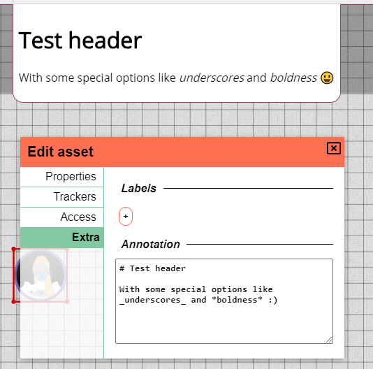

import { Image } from "astro:assets";
import EditAssetPropertiesPicture from "../docs/dm/assets/edit-asset-properties.png";

新しいリリースの時期です！他のリリースと同様に多数のバグ修正がありますが、他にもわくわくするような内容があります。
いくつかの UI 要素の再設計、スポーンロケーションの改善、テンプレートシステムなど！

**サーバー管理者にとって重要な情報** このリリースでは server_config に新しいセクションが追加されます。新しい設定ファイルにカスタム変更を上書きするか、既存の設定に新しいセクションを追加することで、必ず server_config を更新してください。

## スポーンロケーションの変更

このリリースでは、スポーンロケーションシステムに 2 つの変更がもたらされます。複数スポーンロケーションのサポートと、初期スポーンロケーションシステムの変更です。

### 自動スポーン作成の廃止

スポーンロケーションの最初のイテレーションでは、スポーンロケーションが自動的に作成されていました。
実際には、これはあまり良い感触ではありませんでした。スポーンが最初から作成されるとは限らず、
時には二重に表示され、時には単に予想していた場所とは違う場所にありました。
さらに、すべてのロケーションに実際にスポーンが必要なわけでもありません。

そこで、この自動作成をやめることにしました。
今後は、必要な場所に手動でスポーンロケーションを作成できます。

### 複数のスポーン

上記の変更に加えて、1 スポーンロケーションという制限も廃止されました。
スポーンロケーションを作成するときは、名前を求められます。

シェイプを別のロケーションに移動するとき、そのロケーションに定義されているスポーンから選択できるプロンプトが表示されます。
スポーンが 1 つだけの場合は、代わりにプロンプトがスキップされます。

<video autoplay loop muted style="max-width: min(680px, 75vw);">
    <source src="/blog/release-0.23/spawn.webm" type="video/webm" />
    <source src="/blog/release-0.23/spawn.mp4" type="video/mp4" />
</video>

## テンプレート

おそらく最もエキサイティングな変更は、後で再利用するためにアセットのテンプレートを保存できることです。
いつでも、右クリックのコンテキストメニューからアセットの状態を保存できます。

この状態には、既定のプロパティに加えて、トラッカー、オーラ、寸法（幅と高さ）が含まれます。

テンプレートが関連付けられたアセットをゲームボード上にドロップすると、基本の空のプリセットの代わりにテンプレートを選択するプロンプトが表示されます。

<video autoplay loop muted style="max-width: min(680px, 75vw);">
    <source src="/blog/release-0.23/templates.webm" type="video/webm" />
    <source src="/blog/release-0.23/templates.mp4" type="video/mp4" />
</video>

これは、HP や光源などの項目を事前に設定しておくため、頻繁に使用するトークンを再利用するのに非常に便利です。
これは、セットを他のプレイヤーと共有する上でも重要になります。

## UI の再設計

### ログインページ

ログインページが再設計され、より華やかになりました :)
さらに、以前の動作は誰にとっても明確ではなかったため、登録フローがより明示的になりました。

### 編集ダイアログ

シェイプ編集ダイアログは、リリースのたびに何かが追加され、かなり大きくなっていました。
そこで、このリリースでは、画面全体を埋めることなく物事をより適切に整理するため、編集ダイアログにいくつかのサブセクションを追加しました。

<Image src={EditAssetPropertiesPicture} width={500} aspectRatio={569 / 435} alt="Edit Asset" />

## システム通知

サーバー管理者向けの新機能として、サーバーメッセージを作成するオプションが追加されました。
これらのメッセージは、現在のすべてのプレイヤーと将来の訪問者にブロードキャストされます。
メッセージは、プレイヤーが閉じるか、サーバー管理者が再度削除するまで表示され続けます。

これらのメッセージの主な用途は、予定されているダウンタイムなどの情報をユーザーに知らせることです。

これらのメッセージを公開するための専用 API エンドポイントが、シンプルな REST セマンティクスで利用可能です。
この Web サーバーの設定専用の新しいセクション（ApiServer）が server_config にあります。
メインの Web サーバーと同じ方法で設定されますが、既定では `0.0.0.0` ではなく `localhost` を指し、
既定のポートとして 8001 を使用します。

利用可能なエンドポイントの詳細については、[API ドキュメント](/ja/docs/server/api/) をご確認ください。

## 生活の質の向上

### ルーラーのスナップ

ルーラーにも [スナップ動作](/ja/docs/game/snapping/) が追加され、特定のグリッドセルに対して 9 つのポイントのいずれかにスナップしようとします。
グリッドセルの 4 隅、その中点、そして完全な中心がすべてスナップ位置です。

### アノテーションのマークダウン

シェイプ編集ダイアログのアノテーションフィールドが、マークダウンをサポートするようになりました。
表示されるアノテーションの UI にも小さな更新が加えられました。

### サーバーのバックアップ

サーバーの保存ファイルは、専用のサブディレクトリに保存されるようになりました。
このリリース以前はメインのサーバーフォルダーに保存されていたため、
かなり散らかってしまう可能性がありました。

古い保存ファイルには影響ありませんが、この新しいサブディレクトリに移動していただいて構いません。

## その他の修正

- Docker コンテナを非 root として実行
- クイックメニューによるシェイプのロック解除で、シェイプがドラッグモードにならなくなりました
- マップが一部の無効な入力（負の数、0、数値以外のもの）を受け付ける
- ノートとアノテーションのテキストエリアの初期の高さが正しくない
- アクセスできないフロアを移動しようとしたときのコンソールエラー
- 非公開のシェイプ名が、アクセス権を持つユーザーに ? と表示される
- [tech] レスポンスボディに基づいてエラーメッセージを表示
