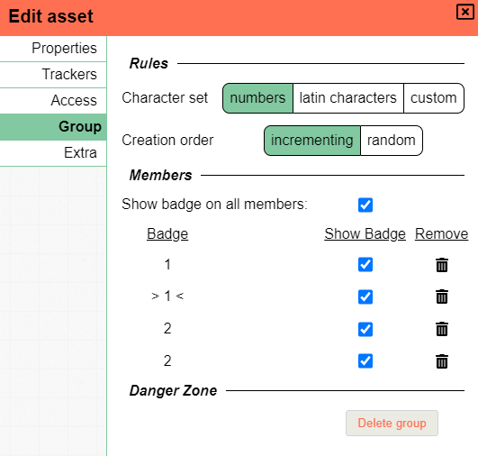

お久しぶりです!この1ヶ月は時間に恵まれたので、今回のリリースにはいくつかのエキサイティングな新機能と、たくさんのバグ修正が詰め込まれています!

新しいバージョンでマップを開く際の小さな注意点です:
非標準のグリッドサイズにおけるズームのバグ修正の影響で、初回のマップ読み込み時に、前回カメラを置いていた位置から若干ずれた場所が表示される可能性があります。とはいえ、元の位置から大きく外れることは通常ありません。
場所を見失った場合は、スペースバーでトークンに中心を合わせるか、ctrl+0でワールド中心に移動してみてください。
それでも問題が解決しない場合は私に連絡してください。コンソール用のコードをお渡しします。

## 六角形 (Hexagons)

長い間要望の多かった、正当な理由のある機能が六角形のサポートです。
ついに「ある程度の」サポートが入ったと言えるようになりました。

DMグリッド設定の一部として、グリッドタイプを選択できるようになりました。既定は正方形グリッドですが、フラットまたはポイント状の六角形に変更できます。
これはキャンペーンまたはロケーション単位で設定できます。

<video autoplay loop muted style="max-width: min(680px, 75vw);">
    <source src="/blog/release-0.24/hexagons.webm" type="video/webm" />
    <source src="/blog/release-0.24/hexagons.mp4" type="video/mp4" />
</video>

_グリッドの不透明度が低いため、あまりはっきり見えないかもしれませんが、ご容赦ください_

知っておいていただきたい重要な点として、グリッドスナップにはまだ対応していないため、六角形を使う際は当面の間、ALTキーの動作を反転することを強くおすすめします。

## グループの改善

グループは、シェイプを整理するための仕組みで、任意でバッジを付けて区別できます(例: オーガ 5)。
グループ内では、各シェイプはバッジという一意の値を持ちます。

このリリースまで、シェイプをコピー&ペーストしたときに適用される暗黙的なグループ化の概念がありました。

今回のリリースでは、グループ化のシステムが大幅に拡張され、より設定可能で明示的になりました。

シェイプの所有者/DM向けに、アセット編集ダイアログに新しいタブが追加されました。
このタブでは、選択中のシェイプが属するグループに関連するさまざまな設定を行うことができます。

文字セットを設定でき、2種類のプリセットセットが用意されていますが、カスタムセットも自由に設定できます(例: `α,β,γ,δ,ε,ζ,η,θ,ι,κ,λ,μ,ν,ξ,ο,π,ρ,ς,τ,υ,φ,χ,ψ,ω`)。

バッジは個別に、またはグループ全体に対して一括で切り替えられます。個々のメンバーの削除も、グループ全体の削除も可能です。

また、バッジをランダム化して、メタゲーミングをしがちなプレイヤーを牽制することもできるようになりました。

<video autoplay loop muted style="max-width: min(680px, 75vw);">
    <source src="/blog/release-0.24/groups.webm" type="video/webm" />
    <source src="/blog/release-0.24/groups.mp4" type="video/mp4" />
</video>

さらに、シェイプの選択範囲を右クリックしたときに、グループ関連の新しいコンテキストメニューオプションも追加されています。
これにより、グループの作成・結合・分割・削除を思いのままに行えます。

これは、グループが同じアセットのシェイプに限定されなくなったことも意味します!

グループ化システムの詳細については[ドキュメントをご覧ください](/ja/docs/game/assets/#group)

## バリアント

_これは**実験的**な機能です。いくつかのエッジケースが発生する可能性があるので、バグを見つけた場合はぜひお知らせください!_

シェイプの新機能として、バリアントを追加できるようになりました。バリアントは、新しいトークンを作成して古いトークンを削除することなく、切り替えたい他のシェイプとして大まかに定義されます。
ワイルドシェイプ、別アートワーク、複数段階のボス、サプライズ公開などを想像してください。

一度に表示されるバリアントは1つだけで、別のバリアントに切り替えることができます。
各バリアントは独自のサイズ、プロパティ、トラッカーを保持しますが、トラッカーとオーラは全バリアント間で共有するよう設定できます。

<video autoplay loop muted style="max-width: min(680px, 75vw);">
    <source src="/blog/release-0.24/variants.webm" type="video/webm" />
    <source src="/blog/release-0.24/variants.mp4" type="video/mp4" />
</video>

上記のビデオでわかるように、シェイプ編集ダイアログの下部にある新しいUI要素から、バリアントの作成、名前変更、削除ができます。

#### 既知の制限事項

新しいバリアントを作成する際、ベースバリアントに適用されていた設定は引き継がれません。
これにはアクセス権、一般的なシェイプのプロパティ(名前、トークンかどうかなど)、アノテーションが含まれます!

現時点では、アセットマネージャーにあるアセットのみを新しいバリアントとして追加できます。ただし、ベースのシェイプはどのようなシェイプでも構いません。
将来的には、アセットマネージャーから選択するだけでなく、基本的なトークンを代替として選択できるようになる予定です。

現時点では、バリアントを持つシェイプをデータベースに保存することはできません。これは、他のカスタムシェイプもデータベースに保存できるようになる将来に実現される予定です。

## ツール

### イニシアチブ

イニシアチブツールに小さな変更が加えられました。マイナス値に対する自動削除の動作に頼るだけでなく、エフェクトを削除するための明示的なボタンが追加されました。

また、ラウンドカウンターが0ではなく1から始まるようになり、イニシアチブの同期に関する多くのバグも修正されました。

### マップ

マップツールに縦横比を維持する機能が追加されました!グリッドの値を設定する際、ロックアイコンを切り替えて縦横比のロックを強制できます。

もう1つの新機能として、リサイズの選択をスキップし、代わりにアセット全体を直接スケールすることができます。
これはグリッドセル数またはピクセル単位で行えます。

### ルーラー

ルーラーに、ルーラーを曲げられる新しいキーバインドが追加されました。
「space」を押すと、最後のルーラーの端点から新しいルーラーを開始できます。
表示される距離は、現在のすべてのルーラーの合計です。

また、セレクトツールで「ルーラーを表示」を切り替えられるようになり、シェイプを移動する際にルーラーを表示できます。
これにより、元のシェイプの位置から始まるルーラーが表示され、移動中のシェイプに追従します。
これは、角の裏側の距離を測る「space」にも対応しています。

セレクトモードでルーラーを使う場合、ルーラーツールのプライバシーモード(つまり公開/非公開)が維持されます。

### 視野 (Vision)

最後のシェイプを選択解除したときの視野ツールの動作が変更されました。以前はすぐにすべてを再選択していました。
しかしこれは直感的でなく煩わしかったため、廃止されました。

視野の表示を一部のトークンに限定していることを視覚的に明確にするため、
視野ツールはすべてを表示していない場合、背景色が変わるようになりました。

## アセットのインポート/エクスポート

前回のリリースでテンプレートが追加されました。今回、アセットストアのアセットをローカルコンピューターにエクスポートし、別のPAサーバーにアップロードしたり、バックアップとして保存しておくことが可能になりました。

エクスポートされたファイルは、planar ally assetsの略である「.paa」拡張子で終わります。これは、テンプレート情報を含む、お使いの正確なフォルダー構造と命名スキームを保持します。

paaファイルをインポートすると、現在表示しているフォルダーにすべてが展開されます。
同じ名前のファイルは上書きされませんが、新しいファイルとフォルダーは常に作成されることにご注意ください。

<video autoplay loop muted style="max-width: min(680px, 75vw);">
    <source src="/blog/release-0.24/export.webm" type="video/webm" />
    <source src="/blog/release-0.24/export.mp4" type="video/mp4" />
</video>

**重要** 上記の映像は、プロセスがファイル/フォルダーのサイズに依存し、現時点ではこの期間にほとんどフィードバックが提供されないため、早送りされています(というより、一部のフレームがカットされています)。将来のリリースで改善したいと考えていますが、現状でも実用的なベースラインを提供しています。

## 一般的なUXの改善

### 編集ダイアログを開く

編集ダイアログは、シェイプの右クリックコンテキストメニューか、右上のクイック選択情報からいつでも開くことができました。

今回、選択中のシェイプで「enter」を押すと、すぐにこのウィンドウを開くこともできるようになりました。

### 移動

テンキーを使って画面を移動できるようになりました。完全な六角形の移動サポートも含まれます。
5を押すと、原点に画面の中心が合わせられます。

### トークン作成ダイアログ

入力フィールドが自動フォーカスされ、enterを押すと情報が送信されるようになりました!

### 一般的なツール

ほとんどのツールで、セレクトツールに切り替えることなく、選択中のシェイプに右クリックコンテキストメニューを使えるようになりました。

これには2つの例外があります: ドローとマップです。これらは独自の右クリック動作を持っています。

さらに、フィルターと視野ツールでは、切り替えずに使用できるセレクトツールのオプションが広がりました。

最後に、現在のツールがサポートしていないツールモードに変更した場合、自動的にセレクトツールに切り替わるようになりました。

### 削除のパフォーマンス

複数のシェイプを一度に削除する際、特に視野/照明に関連する場合、クライアントは大きなパフォーマンス低下に見舞われたり、完全に停止して部分的な削除しか実行されないことがありました。

これは、視野/照明の三角形分割の再計算がかなり非効率だったためです。今回、よりスマートに処理されるようになり、動作は**はるかに**迅速になりました。

## 注目すべき修正

### シェイプの選択

回転したシェイプに関するシェイプ選択に2つの修正が加えられました:

回転したシェイプをクリックして選択しようとするとき、非回転状態のシェイプが占める位置をクリックすると、コードがそのシェイプを選択していました。

グループ選択を行う際、ポリゴン(および他のシェイプ)は最大のバウンディングボックスを使用して当たり判定を行っていました。
これはかなり不正確だったため、正確な判定に変更されました。

## その他の変更

エンドユーザーにすぐ影響しない小さな技術的変更も行われました:

- socket.io v3へアップグレード
- トークンの最小視野範囲を決定するための計算数を削減

## その他の修正

- キーボードショートカットによるシェイプのロックがサーバーに同期されない問題
- 他のフロアのアノテーションが表示される問題
- ツール変更時にルーラーの表示状態を記憶するように
- `Ctrl 0`でビューポートの原点を中心に表示するように変更(以前は原点がビューポートの左上に表示されていた)
- 数値以外の入力でイニシアチブのエフェクトがNaNになる問題
- 新しいイニシアチブのエフェクトが、クライアントの完全なリフレッシュまで即座に同期されない問題
- シェイプの公開名の更新が、シェイプを所有していないユーザーに同期されない問題
- シェイプ名の更新がイニシアチブリストに常に反映されない問題
- 既定の移動権限でのシェイプ移動が機能しない問題
- イニシアチブの権限更新に関するさまざまなバグ
- オーラの負の値が描画の問題を引き起こす問題
- トラッカーがダイアログを開き直すまで空の行を提供しない問題
- シェイプのペーストで余分な空のトラッカー行が生じる問題
- 長方形のリサイズで位置がずれる問題
- ロケーションの変更が一部の人に反映されないことがある問題
- スナップ付きで回転したシェイプをリサイズする際、グリッドポイントに正しくスナップするように修正
- ドロップしたアセットがすぐにレンダリングされない問題
- 壊れたインデックス値を持つシェイプ(最背面へ移動/最前面へ移動で使用)の問題
- マウスが使えないことがあった画面上部中央の領域の問題
- 公開されたオーラが他のクライアントで視野ソースとして正しく設定されない問題
- 回転した長方形とアセットの選択の問題
- 回転したシェイプのグループ選択の問題
- 視野ツールでの二重エントリの問題
- ほとんどのアセットが自動的にグリッドセル1つ分にリサイズされる問題
    - ドロップ時に元のサイズを維持するように変更(テンプレート使用時を除く)
- 再接続時のアセットマネージャーの不正な状態の問題
- アセットマネージャーの並べ替え順序の問題
- ファイルとフォルダーを混在させたときのアセットマネージャーのシフト選択の動作がおかしい問題
- ルーラーとピングツールが詰まることがある追加のケース
- モード変更時にツールダイアログが正しく移動しない問題
- 別のシェイプを選択しても編集ダイアログが開いたままになる問題
- フロア移動で視野/移動の三角形分割が再計算されない問題
- 視野外のシェイプも選択に含まれる問題
- ラベルの追加/削除がサーバーによって同期されなくなる問題
- 現在のフロアがコンテキストメニューでハイライトされなくなる問題
- クライアントのグリッドサイズを変更したときの複数の問題
    - オーラ/ズーム/マップがすべて誤った計算をしていた
- スポーンロケーションへのテレポートで、ロケーションの変更のみで位置が設定されない問題
- ラベルの可視性の同期の問題
- ロケーションを変更したときにイニシアチブが機能しない可能性がある問題
- [DM] フロア名変更で常に空白の名前が設定される問題
