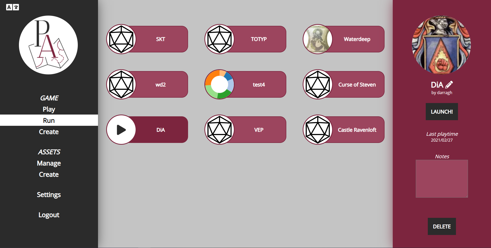

このリリースには、かなり多様なコンテンツが含まれています。UI の再設計、新しいツールオプション、QoL の変更などがあります！

また、このリリースには Discord サーバーの複数コントリビューターによるコントリビューションも含まれています。特に scoodle 氏と mischievous 氏に感謝します！

## ダッシュボードの再設計

まず、最もわかりやすい変更であるダッシュボードから始めましょう！
ダッシュボードは、ログイン後に表示されるページで、プレイ/運営するキャンペーンを選択する場所です。

このページは完全に再設計され、次のようになりました。

### メニュー

左のサイドバーがメニューとして機能し、さまざまなビューにすぐにアクセスできます。

メニューの最初のセクションは、ゲーム関連のすべてに関するものです。Play には、プレイヤーとしてアクティブなすべてのセッションが一覧表示され、Run には DM を務めるすべてのセッションが表示されます。最後に、Create オプションで新しいキャンペーンを作成できます。

2番目の部分はアセット関連のすべてに関するものです。Manage メニューはアセットマネージャーを開きます。これは以前はゲーム内からしかアクセスできなかったコンポーネントです。ここの Create オプションはまだ利用できませんが、将来のリリースで公開される予定です！

最後に、設定を開くアクションとログアウトがあります。

重要な注意点が1つあります。設定とマネージャーは現在、元のコンポーネントで開きますが、この新しいダッシュボード UI に合わせて再設計される予定です。

### Run/Play

Run モードと Play モードでは、右側に2番目のバーが表示され、現在選択しているキャンペーンの詳細情報が含まれます。

注目すべき新機能は、ロゴの設定（DM のみ）、キャンペーンに関連する小さな個人的ノートの作成、そのキャンペーンで最後にプレイした日時の確認、キャンペーンの退出/削除アクションです。

## ツール

### フロア消去モード（DM）

DM 向けのドローモードの新機能として、'erase'（消去）モードが追加されました。

この特別なモードでは、現在のフロアの領域を透明にでき、あなたとプレイヤーは下のフロアで何が起こっているかを見ることができます。

たとえば、フロアに穴を開ける突然の爆発や、前処理で何かを透明にするのを忘れて PA 内で編集したい場合などに使用できます。

上の画像には2つのフロアがあります。
下のフロアにはターコイズ色の長方形があります。
上のフロアには他のすべてのシェイプがあります。

右側にある太い矢印に似たポリゴンシェイプは、Erase モードで描かれたシェイプです。
これは下のフロアへの覗き穴を提供します。

このシェイプは、通常のシェイプと同様にドロースタックの一部です！ご覧のとおり、赤い長方形はこのポリゴンシェイプの上にあり、まるでフロアの開口部を横切る丸太のようです。ポリゴンを前面に移動する（または赤いオブジェクトを背面に移動する）と、ポリゴンに覆われていない赤い部分だけが表示されます！

最後に重要な点として、このシェイプは描画時にマップフロアに自動的に作成されます。ただし、他のフロアに移動することはできます。

### テキストシェイプ

誰でも利用できるドローツールへの新しい追加機能として、テキストを「描く」オプションがあります。

この最初のバージョンは比較的シンプルで、このシェイプを選択した状態で左クリックするとテキストプロンプトが表示されます。
シェイプは他のシェイプと同様に回転/サイズ変更できます。

今後の拡張にご期待ください。

### Ping と Ruler のサイズ変更

描いた Ping と Ruler は、常に一貫したサイズでした。
しかし、他のプレイヤーがそれらを描いた場合、そのサイズはあなたのズームレベルではなく、描画した人のズームレベルに影響されました。
その結果、ルーラーが非常に太く見えたり、非常に細く見えたり、Ping が見つけにくくなったりする可能性がありました。

このリリースでは、これらのシェイプのルールが変更され、常にまったく同じサイズで描画されます。あなたや描画者のズームレベルは、この決定に影響を与えなくなりました。

### スペルコーンアイコンの更新

小さな QoL アップデートとして、スペルコーンアイコンが塗りつぶしのコーンになりました。
友人の Jiri 氏に感謝します。

## 設定

### クライアント設定の再設計

ダッシュボードだけが刷新された UI ではありません。クライアント設定にも新しいペイントが施されました！

クライアント設定は、サイドメニューの一部ではなく、DM 設定と同じようにモーダルで開くようになりました。
これにより、よりゆとりが生まれ、より多くのオプションを追加できる余地も生まれます。

この再設計の一環として、キャンペーン固有のクライアント設定という概念も追加されました。
設定を変更すると、その横に2つのアイコンが表示されるようになりました。これは、その設定がデフォルト設定から逸脱していることを示します。

左のアイコンは値をグローバル設定にリセットし、右のアイコンはこの新しい値を新しいグローバルデフォルトにします。

後のリリースでは、グローバル設定もダッシュボードの設定ビューから編集できるようになります。

### スクロールズームの無効化

タッチパッドを使用するプレイヤーからよく聞かれる要望として、スクロールでのズームツールの起動を無効化するオプションがあります。
タッチパッドを使用していると、これは非常に簡単に誤って発生するためです。

この新しいオプションは、クライアント設定の「behaviour」（動作）で利用できるようになりました！

### 共同 DM オプション（DM）

DM は、メインの DM 設定内からプレイヤーを co-dm ロールに昇格させられるようになりました。

## シェイプ

### 敗北（Defeated）

今回のリリースでシェイプに加えられた変更は小さなもので、'defeated'（敗北）プロパティです。
シェイプのプロパティでこのチェックボックスをオンにするか、1つまたは複数のシェイプを選択した状態で 'x' を押すと、
影響を受けるすべてのシェイプに赤い X が描画されます。

_これは Discord の scoodle 氏によるコントリビューションです！_

### トラッカーのビジュアルバー

トラッカーは、前回のリリースでオーラに行われたのと同じ UI オーバーホールを受けました。
チェックボックスが1つと、カラー入力が2つ追加されています。

「トークンに表示」がオンになっている場合、選択した2色でトークンの上にバーが描画されます。

_これは Discord の scoodle 氏によるコントリビューションです！_

## 壁情報の読み込み（DM）

一部の DM が抱えるもう1つの不満は、視野システム用の壁を描くという骨の折れる作業です。

このリリースでは、代替ソースから壁情報を「インポート」する2つのオプションが追加されました。

### dungeondraft

Dungeondraft は、VTT にインポートする前にマップを準備するための人気のあるサービスです。
独自の dd2vtt ファイル形式でのエクスポートを提供しています。

この形式は PlanarAlly で理解されるようになり、そのようなファイルをボードにドロップすると、その情報が添付されます。

技術的な理由により、dd2vtt ファイルに関連する壁、ドア、ライトは、すぐにはシーンに追加されません。
その代わり、まずアセットを好みの形にリサイズ/マッピングしてから、シェイプのプロパティの「Extra」タブに移動し、「Apply ddraft info」ボタンをクリックして、追加情報をすべて読み込みます。

すべての情報は、適切な PlanarAlly シェイプとしてボードに追加されます。つまり、リサイズしたり、不要なライトを削除したりできます。

### svg

もう1つの新しいアプローチとして、壁情報を含む svg を任意のアセットに添付できます。dungeondraft ファイルと同様に、シェイプのプロパティの「Extra」タブから行えます。

**非常に大きな警告**: これらの svg はシンプルに保ってください。そうしないと、大変な苦労をすることになります。

これらの svg は壁情報のみを含むことを意図しているため、追加する前に壁や背景などを削除してください。

最後に注意点として、これらの壁は操作できません。シェイプの内部にのみ存在し、現時点ではリサイズなどはできません。

## QoL の改善

### 大きな赤い枠

サーバーへの接続が中断されると、画面の周りに大きな赤い枠が表示されるようになりました。

問題によっては接続が自動的に復元されますが、切断中に変更した内容は失われる可能性があります。
これは常にそうでしたが、いつ進行状況が失われる可能性があるかが、明確に分かるようになりました。

### Mac のキーバインディング

ctrl キーを使用するすべてのキーバインディングは、Mac ベースのコンピューターでは cmd キーを使用するようになりました。

### フォントの読み込み

PlanarAlly で使用される opensans フォントは、Google Fonts ではなくサーバーから取得されるようになりました。
そうしないと、オフラインでプレイするときにフォントの問題が発生する可能性がありました。

### ローディングアニメーション

味気ないスピナーが、凝った3D ダイスの変形アニメーションに置き換えられました。

<video loop autoplay muted style="max-width: 680px;">
    <source src="https://app.planarally.io/static/img/loading.webm" type="video/webm" />
</video>

_Discord の Jiri 氏によるアニメーション_

## サーバー

### 公開ホスト名の指定

デフォルトでは、DM 設定で招待リンクが DM に表示されるとき、現在のブラウザ URL からホストが推測されます。
ただし、DM がローカル IP または localhost 経由で接続している場合、その URL は他のプレイヤーには使用できません。

新しいサーバー設定オプションで `public_name` を設定できるようになり、設定すると常にルートホストとして使用されます。

_これは Discord の mischievous 氏によるコントリビューションです！_

## 注目すべきバグ

### 重複したフロア名（DM）

すでに使用されている名前のフロアを作成することはできなくなりました。
2つのフロアを操作するときに、複数の問題が発生する可能性がありました。

これはクイックフィックスですが、それほど多くの制限を課すものではありません。

### ファイルアップロードの中断

大容量ファイルのアップロードが短時間で停止するのを防ぐ修正が追加されました。

_これは Discord の scoodle 氏によるコントリビューションです！_

### 壁を離れる際のトークンスナップ

トークンを移動する一環として、マウスを壁に移動した場合、壁から戻ったときにシェイプとの同期が失われることがありました。
これは修正されました。

### 非デフォルトグリッドサイズでのテンプレートドロップ

サイズ情報を含むテンプレートを持つシェイプをボードにドロップするとき、非デフォルトのグリッドサイズを使用していた場合、
シェイプが誤ってリサイズされることがありました。

### variant シェイプの表示

実験的な variant 機能を使用している場合、すべてのプレイヤーが常に任意の variant シェイプを見ることができました。

### 画面外のコンテキストメニュー

画面の下部または右端でコンテキストメニューを開くと、コンテンツが画面の外に落ちてしまいました。
これらのメニューは端を認識し、それに応じて調整されるようになりました。

### 後方ナビゲーション

ブラウザの戻るボタンまたはマウスのボタンで後方に移動するとき、URL は正しく更新されますが、
何も変化しませんでした。これは修正されました。
