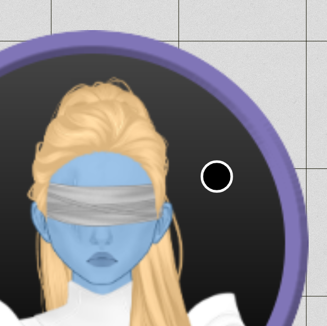

前回のリリースは大きな技術的変更でしたが、大きな破損の報告もなく移行が比較的スムーズに進んだことを嬉しく思います。今回のリリースでは、js ビルドシステムを vue-cli（webpack）から vite（esbuild + rollup）へ変更するという、もう 1 つの技術的変更が行われます。この変更はエンドユーザーへの影響はほとんどないはずですが、ビルド時間が大幅に短縮されます！

技術的な変更以外にも、いくつかの QoL 変更が追加され、かなりの数のバグが修正されました。そして今回の主な新機能は、フロアの背景色や繰り返し表示する画像を設定できることです。

## フロアの変更

フロア UI は少しコンパクトになり、編集アイコンとゴミ箱アイコンが表示されなくなりました。代わりに、PlanarAlly 全体で設定を表すために一般的に使用される歯車アイコンが表示されるようになりました。

フロアの名前変更と削除は、この新しいフロア設定 UI を通じて行えるようになりました。

フロアに詳しい方なら、2 つの新しい設定にお気づきになるでしょう。

_背景については専用のセクションで詳しく説明します。_

このリリースでは、フロアタイプの概念が追加されました。地下 / 地上 / 空中のあらかじめ用意されたオプションから構成されます。

フロア設定は、上の UI が示すようにフロアごとに設定できますが、フロアタイプに応じてロケーションまたはキャンペーンレベルでも設定できるようになります。

現在、フロアタイプが何かに影響を与えるのは背景設定のみです。将来的には、フロアタイプに応じた自動的なパフォーマンス改善を追加する予定です（例: 地上階にいる場合は下のフロアを描画しない）。

これはまだ私が試行錯誤しているアイデアであり、将来的にフロアタイプの概念を廃止して、フロアごとの描画設定に置き換えるかもしれません。

## 背景の塗りつぶし

ほとんどの場合、DM はプレイヤーが探索するためのマップを用意しているでしょう。
しかし、時には急なサイド探索が発生したり、プレイヤーが何かの裏技を見つけてマップの境界を越えてしまうこともあります。

そのような場合、プレイヤーが動き回る場所はデフォルトの白い背景になり、これはやや味気ないものです。もちろん DM が他のマップや画像を追加することもできますが、ただ何か空洞を埋めたいという場合もあります。

前述のとおり、フロアの背景を設定できるようになりました。特定のフロアだけに設定することも、同じタイプのすべてのフロアに設定することもできます。

### 単色

最も基本的なオプションは、背景色として単一の色を設定することです。

これにより、最小限の手間で草原のような雰囲気を与え、没入感を素早く高めることができます。

### パターン

ただし、画像を背景として設定し、全方向に繰り返し表示することも可能です。これにより、シームレスなタイルセットを使用できます。

画像を指定する際、パターンのオフセットとスケールを変更できます。

オフセットは、グリッドに対するパターンの移動量をピクセル単位で指定する値です。

スケールは、パターンのサイズに影響するパーセンテージです。

## QoL

### イニシアチブ

Release 0.26 でイニシアチブ UI が刷新されましたが、今回のリリースでは、自分が所有するキャラクターが現在行動中の場合に、プレイヤーがイニシアチブのターンを進められるようになるという小さな改善がこのレイアウト変更に追加されます。

### ツールバー

混乱の原因としてよく挙げられるのが、ツールバーのモードシステム、特にどのモードがアクティブなのかということです。過去のリリースでは、アクティブなモードがツールバーの右側に頭文字が表示される形で示されていました。その文字にカーソルを合わせると、モードの完全な名前が表示されていました。

多くの人が、それがアクティブなモードを示しているのか、クリックしたときに起動するモードを示しているのか、確信が持てませんでした。

今回のリリースでは、この混乱に対処し、ツールバーの下にすべての可能なモードを表示し、アクティブなモードをハイライトします。

### Draw ツールのヘルパー

Draw ツールを見失ってしまうというのも、よく聞かれる不満です。
今回のリリースで追加される非常に小さな改善は、ブラシの周囲に小さなコントラストのある境界線を付けるというもので、ブラシが背景と同じ色の場合にブラシが背景に溶け込まないようにするものです。

これは、Draw のブラシを見失ってしまう問題に対する完全な解決策では決してありませんが、小さな第一歩です。

ブラシが特定のサイズより小さい場合は、ブラシの周囲にもっと大きな円を追加することを考えていますが、皆さんがそれを喜ぶかどうかはまだ確信が持てません。

## 修正

### カラーピッカー

カラーピッカーは、前回のリリースの技術的変更の影響を最も受けた部分でした。使用していた元のコンポーネントがまだ vue3 で利用できなかったため、独自のバージョンを作成しました。

今回のリリースで修正される内容:

- マウスを押している間、彩度へのフォーカスを維持
- スライダーの高さを増加
- 色相スライダーのクリック時に初期位置が動かない問題を修正
- チェックボード背景を追加
- スライダーのホバー時にカーソル\:pointer を表示

### アノテーション

マークダウンコンポーネントも、まだ vue3 に移植されていないもう 1 つのコンポーネントでした。ただし、このコンポーネントについては、vue3 でマークダウンをサポートする別のオープンソースツールを見つけました。

しかし、デフォルトでは、以前のコンポーネントで慣れていた一部の描画設定が無効になっていました。特に、一連の HTML 変更が再度描画されるようになりました。

### その他

#### Draw ツール

Draw ツールのカーソルが、異なる色を選択したときに色が即座に更新されませんでした。

#### イニシアチブ

イニシアチブのエントリの 1 つに値がまだない場合、エントリの並べ替えでエラーが発生することがありました。

#### Co-DM

キャンペーン作成者の DM ステータスを剥奪することはできなくなり、作成者をキックすることもできなくなりました。

#### アセット

実験的な svg サポートの導入により、アセット（つまりユーザーがアップロードしたコンテンツ）の「視野をブロック」と「移動をブロック」のプロパティが機能しなくなるバグが発生しました。

#### メモ

ロケーションを変更すると、メモセクションがクリアされる問題がありました。
