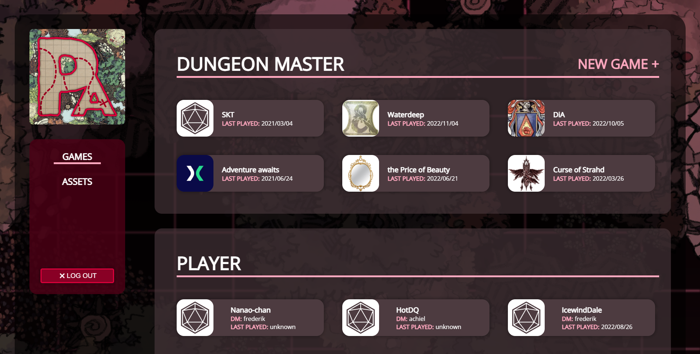
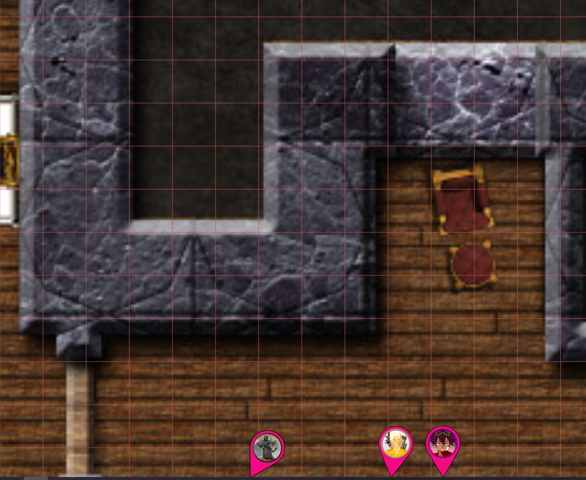

もっと定期的にアップデートを約束していたのに、まったく守れませんでした。ですが、今回は新しいリリースです！

_サーバー管理者の方へ: サーバーの起動方法に変更があります。[Server](#server) をご確認ください。_

## UI の変更

### ダッシュボードの再設計

0.26（2021 年 3 月）でダッシュボードを再設計しましたが、またしても再設計を行いました \:D

ゲームセクションは、3 つのナビゲーション項目（実行/プレイ/作成）から 1 つのセクションに整理されました。
さらに、以前の「詳細」サイドバーは、画面スペースが狭いデバイスで多くの場所を占めていました。
このセクションは再設計され、リスト内のゲームをクリックするとほとんどのオプションが表示されるようになりました。

また重要な点として、今回の再設計にはアセットマネージャーが実際に含まれています。
前回の出来上がりは別物でしたので、この点は喜ばれる方も多いと思います \:D

### ツールバーのアイコン

もう 1 つの視覚的な変更として、ツールバーがラベルではなくアイコン表示になりました。

気に入らない場合は、ユーザー設定でラベル表示に戻すことができます。

## キャンバス上を移動する

時々、ゲームボード上の自分の位置を見失ったり、他のキャラクターの視点に切り替えたいことがあります。

長年 PA を使っている方は、通常スペースキーでこれを実現できることをご存知でしょう。
今回は、この体験を向上させるための視覚的な機能を 2 つ追加しました。

### コンテンツへ戻る

1 つ目の機能は、無限キャンバスで迷子になり、画面全体が霧しか見えない場合に特に役立ちます。

この状況になった場合、画面の下部に新しい UI 要素がポップアップ表示されます。
この要素をクリックすると、表示されている最も近い要素の中心にビューが移動します。

この機能は、キャンペーンの vision モード（戦争の霧と視線の設定）を考慮します。

### トークンの方向

もう 1 つの追加機能として、(アクセス権のある)画面外のトークンが、画面の端に矢印付きで表示されるようになりました。
矢印はそのトークンの方向を示します。
この矢印をクリックすると、対応するシェイプの中心にビューが移動します。

矢印は、設定したルーラーの色と同じ色で表示されます。
この機能は、新しいクライアント設定で無効にすることもできます。

## QoL

さまざまな生活の質を向上させる変更が追加されました。

### パン操作

中クリックでのパン操作はすでに可能でしたが、今回はドラッグ中に右クリックでもパンモードが開始されるようになりました。

これは主に、中クリックが難しいトラックパッドを使用している方の体験を改善するためのものです。

### 動作のリマインダー

Draw ツールと vision ツールは、動作が変更されている場合にオレンジ色の背景色で表示されるようになりました。
何かを変更した後に忘れてしまうのを防ぐためです。

vision ツールでは、すべてのトークンがアクティブでない場合に常にハイライト表示されます。

Draw ツールでは、ロジックタブまたは vision タブのいずれかで何かがアクティブな場合にハイライト表示されます。

### 複雑なトラッカー式のサポート

トラッカーを使用する際、クイック選択情報を使ってプレイ中に素早くトラッカーを変更できるのはとても便利です。
ただし、これまでは単一の数値に限定されており、先頭に `+` または `-` を付けて元の値との相対値にすることしかできませんでした。

今回のリリースから、このインターフェースはより複雑な式をサポートするように変更されました。
math.js をベースとした、ほぼすべての数式がサポートされるはずです。

さらに、絶対モードと相対モードの 2 つのモードが追加されました。相対モードでは、式の結果が元の値に加算されます。

ゲームを起動したときに既定で選択されるモードを選ぶための、新しいクライアント設定もあります。

いくつか例を示します:

トラッカーの値が 50 で、次の式を実行した場合:

`-(10 + 20 + 5 * 2) + sqrt(4)`

絶対モードではトラッカーは `-38` になり、相対モードでは `12`（`50-38`）になります。

同様に、再度 50 から始めた場合:

`12`

絶対モードでは `12` になり、相対モードでは `62`（`50+12`）になります。

### vision ツール - 非公開のオーラ

vision ツールでシェイプの選択を解除すると、その非公開のオーラは表示されなくなります。

### インポート/エクスポート

インポートおよびエクスポートのコードにいくつか調整を加えました。

DM は、ダッシュボードのゲームリストから自分のキャンペーンをエクスポートできます。
インポートは「新規ゲーム」から行うことができます。

インポートとエクスポートの両方で、進捗状況を確認できる専用のページが表示されるようになりました。
これにより、インポート/エクスポートが正常に動作しているのか、どこかで失敗したのかがわかりやすくなります。

### ダイス

個々のダイスの結果が、小計や合計とともに表示されるようになりました。

これは、個々のダイスの結果が結果に影響を与える可能性があるシステムに対応するためです。

## DM: プレイヤー

### クライアント矩形

DM 設定で、特定のプレイヤーのビューポートを表示するオプションが DM に用意されています。
この設定は、プレイヤーが一度だけログインしている場合（つまり 1 クライアントの場合）に正常に機能します。

プレイヤーが複数のブラウザーでログインしている場合（つまり 1 より多いクライアント）、DM に表示されるビューポートは常に最後に移動したクライアントのものになります。
これは紛らわしく、期待とは異なります。現在は、接続されているクライアントごとに別々の矩形が表示されるようになりました。

1 つのクライアントの移動が、他のクライアントにも適用される点に注意してください。

### アクティブなプレイヤー

左のサイドバーに、接続されているすべてのプレイヤーをリストするプレイヤーセクションが DM にも追加されました。
このリストの名前をクリックすると、そのプレイヤーの現在のビューポートの中心にビューが移動します。

これは一時的なセットアップで、今後プレイヤーのコンセプトをさらに探求する予定ですが、
この大まかなプロトタイプを始めてから時間を見つけられていません。

## パフォーマンス

いくつかのパフォーマンス改善が追加されました。

### フロアの描画を制限する

アクティブなフロアのみに描画を制限するユーザーオプションが追加されました。

これは、フロアが多いマップを使用する際に、好ましくないパフォーマンスに気づくプレイヤーが 1 人以上いる場合に役立ちます。

### シェイプの中心計算

シェイプの中心は多くの場所で使用されており、必要なたびにその場で計算されていました。

今後は中心は一度計算して記憶され、中心が変わるような動作（例: シェイプの移動）が発生した時点で再計算されます。

ほとんどのシェイプ（例: 壁）は頻繁に位置を変えないため、理論上はパフォーマンスが向上するはずです。

### セクター

シーンを描画する際、各レイヤーについて、画面内に見えるシェイプだけが考慮されます。
これまでは、シェイプを反復処理して visibleInCanvas チェックを行うことで実現していました。

今回のリリースの新機能として、シェイプはセクター（またはチャンク）に整理され、ビュー内にあるセクターだけがチェックされるようになりました。

これは、さらに微調整が必要になる可能性があります。

## Server

### アセットファイルの場所の変更

すべてのアセットが配信されるアセットファイルフォルダーの場所を変更できるようになりました。

### サーバーの起動

サーバーの管理を少し簡単にするため、ファイルが再編成されました。
これはサーバーの起動に影響します。今後は `planarserver.py` ファイルではなく `planarally.py` ファイルを呼び出す必要があります。

元のスクリプトが受け付けていたパラメーターなどは同じものを受け付けます。

Docker イメージは変更済みなので、Docker を使用している場合に変更する必要はありません。

### インポート/エクスポート

インポートとエクスポートはより安定するようになり、server_config で既定で再び有効になっています。

## Last-Gameboard

このリリースには、last gameboard プラットフォームとの統合コードも含まれています。

## バグ

### シェイプロジックの修正

- プレイヤーとして開始した場合にテレポートゾーンが正しくトリガーされない
- テレポートゾーンがターゲットの中心に正しく着地しない
- プレイヤーのドアトグルがサーバーと同期/永続化されない
- ドア/TP エリアのプレビューでフロアが変わらない

### トラッカー/オーラ

- 共有トラッカー/オーラが選択情報に表示されない
- 共有トラッカー/オーラの削除が、更新するまでクライアントに表示されない

### イニシアチブ

2022.1 での技術的な変更以降、イニシアチブシステムは、クライアントにとって不明なシェイプが存在する場合に誤動作していました。
不明なシェイプはさまざまな理由で発生します（例: シェイプが別のロケーションに移動した、シェイプが DM レイヤー上にありプレイヤーに認識されていない、など）。

以下の項目の一部は上記の問題に関連しており、これはすでに解決されていますが、一部の項目はまったく別の問題です。

- サーバーがイニシアチブの一覧でのクライアントエラーをより適切に検出し、誤ったデータを拒否するように
- イニシアチブの変更で、現在のアクティブなアクターがより多くの状況で保持されるように
- シェイプの削除によってイニシアチブの不整合が発生することがある
- DM レイヤーとプレイヤー可視レイヤーを切り替えると、イニシアチブが乱れることがある
- イニシアチブのカメラロックでフロアが変わらない

### アセット

- [DM] アセットを親フォルダーに移動できない
- [DM] アセットへのリンクを持つシェイプが存在する場合、アセットを削除できない
- [DM|server] サブパス設定を使用している場合にアセットマネージャーが使用できなくなる

### その他

- プロンプトモーダルのエラーが表示されない
- アノテーションの表示情報が、更新するまで他のクライアントに同期されない（UI のみ）
- ロケーション変更時にプレイヤーの状態がクリアされる
- トラックパッドでのズーム感度
- ロケーションメニューのタイプミス
- ゲーム内 AssetPicker モーダルの UI 修正
- プロンプトモーダルでエラーメッセージが正しくクリアされない
- ツール詳細が常に正しい場所に表示されるとは限らない（例: モードを変更した場合）
- 選択情報内の余計な空白を削除
- マーカーへのジャンプでフロアが変わらない
- 複合/バリアントシェイプを別のフロアに移動して追跡すると、余分な選択ボックスが表示される
- Draw レイヤーが霧の下に描画される（例: ルーラーや ping など）
- マルチフロア設定でブロッキングシェイプを削除したときに vision が正しく再計算されない
- AssetPicker UI が低すぎる位置に表示される
- パン操作中にポリゴン編集 UI が取り残される
- ポリゴンが回転しているときにポリゴンポイントを移動する
- 通常のシェイプがスポーンロケーションとして誤って識別されることがある
- ダイスが画面外に出ることがある
- キーボード移動で Select ツールの回転ヘルパーが動かない
- [DM] プレイヤーアクセスを削除した後、更新するまでアノテーションが表示されたままになる
- [DM] ロケーション固有の設定のリセットが、更新するまでクライアントに即時同期されない
- [DM] フェイクプレイヤーモードを有効にすると、左サイドバーから DM エントリが非表示になる
- [server] サブパスサーバーでダイスローラーが動作しない
