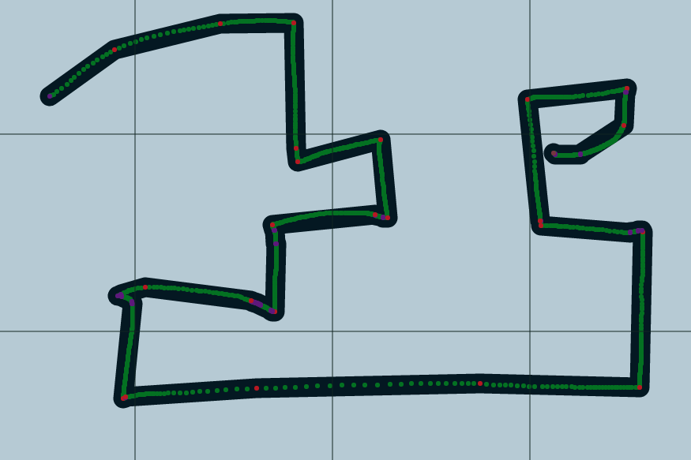

2023.2は、ほぼすべてバグ修正に焦点を当てたリリースです。そのため、特に目新しい機能は追加されていないので、かなり地味な内容になります。すみません!

前回のリリースから実に4か月が経ちました。今回こそはそうならないようにと思っていたのですが。

2023.1の後、パフォーマンスを向上させるためにWebWorkerでoffscreencanvasを使いたいと考え、意気込んでこのリリースを始めました。
さまざまな戦略を試すことに多くの時間を費やしましたが、結局、自分が満足できる成果は何も生まれず、少し燃え尽きてしまいました。

気分転換のために他の個人プロジェクトに取り組む時間を取り、近い将来、より有意義なアップデートを出せるようにしたいと考えています。

## アセットマネージャー

### アセットの直接ドロップ

マップ上に何かを表示させるには、これまで常にDMが先にアセットをアセットマネージャーにアップロードする必要がありました。
アセットマネージャーでアセットを適切に整理できるため、これは今でも推奨される方法ですが、今回のリリースでは、事前にアセットマネージャーへアップロードせずに、ゲームボードへ直接ドロップするオプションが追加されました。

これは、セッションの途中で何かを追加する必要がある場合に特に便利です。

この方法でアップロードされたアセットは、アセットマネージャーのルートフォルダーに保存されますが、ルートフォルダーの散らかりを減らすために、後のリリースでは専用のフォルダーに移動される可能性があります。

### プログレスバー

以前のアセットマネージャーにはプログレスバーがありました。新しいダッシュボードと統合して以来、この機能は再実装されていませんでした。

復活しました。それだけです :)

## ブラシ描画

ドローツールのブラシモードは、_長い_ 間、目に痛い存在でした。
存在はしますが、パフォーマンスを大きく消費するため、ほとんどの場合避けるべきツールでした。

そのパフォーマンス問題の原因は、シェイプの内部的な保存方法にありました。
内部的には、ポリゴンツールで描いたシェイプとまったく同じ構造ですが、違いは作成方法にあります。ポリゴンモードではクリックでポイントを指定しますが、ブラシモードではマウスのドラッグがポリゴンを決めます。

要するに、マウスのドラッグが多くのポイントを追加していたのです。
今回のリリースでは、実際のシェイプにほとんど寄与しないポイントを削除することで、ドラッグ中にポリゴンを簡略化するアルゴリズムを実装しました。

シェイプ全体に小さな変化が生じる可能性はありますが、もしあってもごく微妙なはずです。

例として以下の画像を見てください:

{/* <Image src="/blog/release-2023.2/brush.png" width={600} aspectRatio={875 / 583} alt="Brush draw point reductions" /> */}

緑色のポイントは、以前は保存されていたポイントです。ご覧の通り、もはや追跡する必要のないポイントが多数あるのです \:D

## テレポート

TeleportZone機能にいくつかの変更と修正が加えられました。

### 要求エリア表示の変更

TPゾーンが「request」モードに設定されている場合、ユーザーがテレポートゾーンを使用しようとすると、DMに通知が届きます。

この通知には、DMのカメラをテレポートゾーンに移動するボタンが含まれています。実際には、このボタンでDMはテレポートゾーンの目標地点に移動していました。

今回のリリースではこれを変更し、DMをテレポートゾーンのトリガー位置に移動させます。そこは要求したプレイヤーがいる場所であり、通常、何が起こっているかの文脈をより把握できるからです。

### プレイヤー向けTPが機能しない問題の修正

プレイヤーがテレポートを開始した場合に発生する、いくつかのケースが修正されました:

即時モード以外に設定されたテレポートゾーンは、プレイヤーがテレポートを開始した場合にまったく機能しませんでした。

ビルドモードが有効な間に開始されたテレポートも、プレイヤーでは機能しませんでした。

### プレイヤー移動時のズーム

_テレポートゾーン自体とは関係ありませんが、これもテレポートを実行するものなので、ここに追加しました :V_

DMが「Bring Players」(プレイヤー移動)アクションを使用すると、全プレイヤーが、選択したエリアが画面の中心になるようにテレポートされます。

さらに、全プレイヤーのズームレベルもDMに合わせて変更されていました。

今回のリリースでは、これはもう行われません。クライアントにはさまざまな理由で異なるズーム設定がある可能性があり、別の場所へ移動するというだけの理由でこれを上書きすべきではありません。

## テンプレート

テンプレートは、いくつかの設定をあらかじめ設定したシェイプを保存し、後で再利用するための機能です。
テンプレートを導入して以来、新機能に合わせて更新されておらず、保存されるはずのデータがいくつか欠けていました。

以下のデータも保存されるようになりました:

- アノテーションの公開表示設定
- トラッカー:
    - トークン上への表示
    - トークン上に表示する際の色
- オーラ:
    - オーラが有効かどうか
    - ストロークカラー
    - 角度と方向

これらのキーを見直すにあたり、もう保存されないいくつかの設定も削除しました。
削除した設定は、一般的な設定として保存するには状況依存的すぎると感じたためです。
理想的には、将来どこかの時点でテンプレートを保存する際に、何を保存するかをより細かいレベルで選択できるようになり、特定のケースのためにこれらを保存できるようになるはずです。しかし、残念ながらそこまではまだ到達していません。

以下のデータはもう保存されません:

- 非表示状態
- 撃破状態
- ロック状態
- 「バッジ表示」

## (モバイル) タッチスクロール

小さな変更ですが、メインのゲームボードとメニューバーで、モバイルのタッチデバイスのオーバースクロールが発生しなくなりました。

モバイル/タッチの改善はまだまだありますが、これはその第一歩です。

## グループ

グループの作成・削除ボタンは、複数の方法で壊れていました。これで正しく動作するはずです。

さらに、グループのネットワークコードにもいくつか修正が加えられました。
すべてのシェイプに対して完全なグループデータが送信されていましたが、グループ情報はグループごとに一度だけ必要なので、これは極めて無駄でした。
また、他のクライアントでのグループ変更が同期されておらず、グループへの一部の変更はリフレッシュするまで表示されませんでした。

## フェイクプレイヤー

フェイクプレイヤーモードは、DMがプレイヤーの視野を素早く再現するためのモードです。
しかし、長い間放置されていたため、前回のリリースから再び磨き上げる作業が始まりました。

今回のリリースではアクセスの内部構造を見直し、フェイクプレイヤーモードに関連する多くのバグを修正することができました。

シェイプは、ゲーム内のプレイヤーの誰かがそのシェイプへの視野アクセスを持ち、かつ視野ツールでそのシェイプがアクティブである場合にのみ描画されるようになりました。
つまり、アクティブに操作していない非表示シェイプは、もう描画されないということです。

最後に、DMレイヤー上のオーラもすべて非表示になりました。

## アクセス

アクセス全般に関連する問題も修正されました。

- アクセス: 特定のアクセスルールを持つプレイヤーが常に編集アクセスを持つ問題を修正
- アクセス: 別のクライアントでシェイプ編集UIが開いている場合、アクセスの変更がリアルタイムに反映されない問題を修正
- アクセス: シェイプにアクセス変更がなく、リロードまでUIの既定アクセスが最新でない問題を修正
- アクセス: DMに明示的なアクセスルールを設定できないように修正

## レンダリング

- リフレッシュするか、オーラに近づくまでオーラが表示されないことがある問題を修正
- ウィンドウのリサイズ後、上位レイヤーの透明度が適用されなくなる問題を修正
- 視野アクセスに関連する変更が即座に再描画されないケースを修正
- 画面の幅が高さより小さい場合にグリッドの水平線が描画されない問題を修正

## 雑多な修正

    - 認証: 認証ルーティングコードのロジックエラー - 場合によっては手動でログインページに移動する必要があった
    - ラベル: 削除が機能しない問題を修正
    - ツールバー: 視野ツールとフィルターツールが関連時にすぐに利用できない問題を修正
    - ロジック: リクエストモードが意図したとおりに動作せず、有効モードとして動作していた問題を修正
    - トークンの方向: 表示されるトークンがフィルタリング済みトークンを考慮していない問題を修正
    - セレクト: ズーム時に回転UIが一貫性を保つように修正
    - ロケーションバー: 複数行のロケーションのドラッグハンドルの幅を修正
    - プロパティ: プレイヤーでリフレッシュまで非表示トグルが適用されない問題を修正
    - イニシアチブ: 視野ロックがアクティブなトークンを正しくチェックしていない問題を修正
    - イニシアチブ: アクティブな状態で最後のエントリを削除するとイニシアチブが壊れる可能性がある問題を修正
    - 視野: 視野線を描画するときに無限ループを引き起こす可能性があったエッジケースを修正
    - アノテーション: FirefoxでMarkdownが太字として表示されなくなる問題を修正
    - [server] サブパス: サブパスベースのセットアップで画像が正しく読み込まれない2つのケースを修正 (イニシアチブ & アセット変更)
