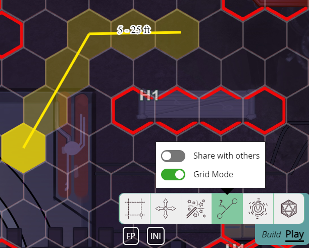

今回のリリースはグリッドがテーマで、特に六角形(ヘックス)に注目しています。

## 非推奨のお知らせ

本題に入る前に、いずれラベル/フィルターシステムを削除する予定であることをお知らせします。これは、_私の考えでは_、あまり広く使われていないため、過去の遺物のようなものです。

将来、代替機能が提供される可能性はありますが、現在の実装は残しておくには少し扱いにくすぎます。

もしこれを実際にご利用の方がいらっしゃいましたら、お知らせください。

## シェイプのグリッド設定

シェイプのグリッド動作に関する新しい設定を構成するために、シェイプ編集ダイアログに 'grid' という新しいタブが追加されました。

### シェイプのグリッドサイズ

シェイプのグリッドへのスナップは、1x1 のシェイプではうまく機能します。しかし、1x1 より大きいシェイプの場合、スナップ動作がやや予測しにくくなることがあります。これは、特定のシェイプが何個のグリッドセルを表すことになっているかを PA が最善の推測で判断する必要があるためです。

シェイプが 75px×75px を占有し、グリッドが 50px の場合、1x1 か 2x2 のどちらのグリッド領域にスナップすべきでしょうか? 答えはシェイプの実際の内容によって異なります。非常に大きなアートアセットだが、占有すべきは 1 グリッドセルだけかもしれないし、より大きなクリーチャー用の非常に小さなアセットかもしれません。

今回のリリースでは、シェイプが占有すべきグリッドサイズを明示的に指定できるオプションを提供することで、この動作をより細かく制御できるようにしました。PA は既定では引き続きシェイプの寸法に基づいてグリッドサイズを推定しますが、これを上書きできるようになりました。

### グリッド占有の表示

シェイプが現在占有しているグリッドセルを表示できる新しい設定です。グリッドセルの背景色と枠線の色を指定できます。

サイズが明確に分かりにくいアセットがあり、その影響範囲をはっきり表示したい場合に便利です。

### ヘックスの向き

改良された六角形サポートの一部として、均等サイズの六角形の向きを設定できるようになりました。六角形には 2 つの向きがあるため、この設定で 2 つの間を切り替えられます。

## 六角形

PA はかなり前から六角形グリッドをサポートしていましたが、常に二流扱いでした。フラットまたはポイントトップのヘックスグリッドを描画する以外、システム内の他の要素はヘックスと連携していませんでした。そのため、実際にヘックスを使おうとすると多くの問題が発生しました。たとえば、シェイプのグリッドやポイントへのスナップは、まだ正方形の表現でロジックを処理していたため、正しく動作しませんでした。

今回のリリースではこれを修正し、ヘックスを PA の正真正銘の一級市民にすることを目指します。

特に、スナップがヘックスで正しく機能するように更新されました。これには、ポイントのグリッドへのスナップだけでなく、シェイプのグリッドへのスナップも含まれます。

Select、Draw、Ruler、Map の各ツールがすべて、六角形でよりうまく機能するように更新されました。

## Ruler ツール: グリッドモード

グリッド関連のもう 1 つの変更点は、Ruler ツールに 'grid mode'(グリッドモード)という新しい有効化可能なオプションが追加されたことです。

グリッドモードでは、Ruler は 2 点間の距離を直線ではなく、グリッドに沿って測定します。これにより、通過したセル数だけが重要で、ピクセル単位の実際の距離にはあまり関心がない場合の、グリッド上の長距離測定で発生するいくつかの問題が解決されるはずです。

グリッドモードを有効にすると、Ruler はセル数と合計距離の両方を表示します。ただし、この動作はクライアント設定で構成でき、代わりに 2 つのうち 1 つだけを表示することもできます。

## コンテキストメニュー UI の更新

右クリックのコンテキストメニューが、長らく待望されていたビジュアル更新を受けました。

まず、UI に余白が増え、読みやすく操作しやすくなりました。次に、メニューが成長し続けるにつれて、新しいサブセクションが追加されました。

特に、シェイプを別の場所へ移動する関連の操作はすべて、新しい「Move」セクションに移動されました。

## エクスポート/インポート

### データの欠落

前回のリリースで実装された新しいノートシステムにより、エクスポートとインポートの機能が壊れていました。

今回のリリースでは、これを修正するとともに、エクスポート/インポートシステムに追加し忘れていた他のいくつかの項目も修正しました。特に、キャラクター、DataBlock、ノートが正しくエクスポートされるようになりました。

### インポート名

キャンペーンをインポートする際に、ファイル内の名前を常に使うのではなく、名前を指定できるようになりました。

### インポートのクリーンアップ

インポートコードに小さな改善が加えられました。

インポートに失敗した場合、インポート先のルームが正しくクリーンアップされるようになりました。

インポートコードが 2 回実行される可能性があるエッジケースも解決されました。

## シェイプ編集: グループ UI

シェイプ編集ダイアログのこのタブは、しばらく応答しない状態が続いていました。加えた変更がすぐに反映されず、実際に機能しているかどうか分かりにくくなっていました。

今回のリリースではこの UI の内部を完全に刷新し、期待通りに応答して動作するはずです。これはバッジ関連のすべての設定に適用されるほか、グループへのメンバーの追加/削除にも適用されます。

## 小さな変更

### ノートの修正

新しいノートシステムは概ね良好に動作していますが、いくつかの小さなバグが報告され、修正されました。

- シェイプのノートを開いたときにフィルターが正しく再実行されず、前のシェイプのノートが時々表示されたままになる問題
- シェイプのフィルタリング中に、Select ツールで別のシェイプをクリックすると UI のシェイプ名が変わってしまう問題
- シェイプ上に描画されたノートのアイコンが、場合によってはシェイプの背面に描画されることがある問題
- 表示アクセス権しかない場合に「シェイプを追加」「シェイプを削除」イベントがすぐに同期されない問題を修正
- アノテーションに生の HTML 要素を含むマークダウンのレンダリングを修正
- テンプレートにノートが正しく保存されない問題

### スナップの修正

Select ツールと Draw ツールで、いくつかの操作(ポイントへのスナップ、サイズ変更など)が移動中のポイントにスナップしようとする小さな問題が修正されました。これにより、まったくスナップされていないように見える奇妙な動作が発生していました。

また、Draw ツールは最初のクリックでポイントにスナップされていませんでした。

### Spell ツール

Spell ツールには、呪文を唱えた後に Select ツールへ戻る組み込みのロジックがあります。ただし、Select ツールに戻るという要求が少し強すぎました。別のツールを手動で選択しても、常に Select ツールが選択されてしまう問題がありましたが、これは解決されました。

もう 1 つの小さな改善として、1 未満の数値を入力しようとしたときのサイズ入力の動作が改善されました。

### ポリゴンの包含判定

ポリゴンをクリックしたかどうかを検出するロジックに 2 つの欠陥があり、それらが修正されました。

ポリゴンが(自己交差により)同じポイントを再利用した場合、包含判定コードが誤動作していました。

また、閉じていないポリゴンでは、最初と最後のポイントの間の仮想的な線もポリゴンの一部と見なされていました。

### その他のバグ修正

- シェイプを前面/背面に移動してもすぐに更新されない問題
- 特定の Shape ID で呼び出されたときに Initiative.Order.Change が失敗する問題を修正。
- グリッドのクライアント設定を変更しても画面にすぐに反映されない問題
