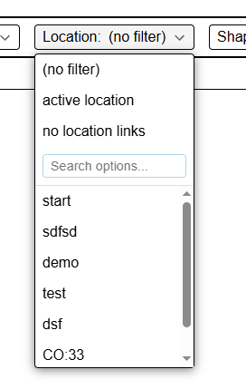

import Info from "/src/components/directives/Info.astro";
import Warning from "/src/components/directives/Warning.astro";

今回のリリースには、ワクワクするような機能がいくつか含まれています。主な内容は以下のとおりです。

- Initiative と Notes の UI/UX アップデート
- コピー＆ペーストや類似システムの修正
- シェイプに「custom data」（カスタムデータ）という新しい概念が追加され、簡単なキャラクターシートなどが作成可能になりました

<Info title="廃止予定のお知らせ">
    Variant 機能は 2026.2 で簡素化される予定です。詳細は[Variants](#variants)を参照してください。
</Info>

このリリースは当初、11月/12月を予定していましたが、技術的なリワーク（後述）の安定化に時間が必要でした。

また、このリリースにはさまざまな方からのコントリビューションが含まれています。皆様、ならびに開発ブランチでバグを報告してくださった皆様に感謝します！

<Warning title="サーバー設定の変更">[サーバーのセクション](#server-changes)を参照してください。</Warning>

## Initiative

_これらの変更は Rexy712 氏によるものです_

冒頭で述べたとおり、UI が以下のようにアップデートされました。

また、内部にオーバーフロースクロールが追加されたため、イニシアチブに多くのアクターがいる場合でも、Initiative 要素自体が巨大になることはありません。

さらに、エフェクトを追加する際に、時間を無限に設定できるようになりました。以前は、消滅するまでのターン数を必ず入力する必要がありました。

DM は、イニシアチブ全体を一度にクリアするオプションと、イニシアチブを1ラウンド進めるボタンも利用できるようになりました。

## Character Sheet の基本機能

### なぜ

時々いただく不満の1つが、キャラクターシートの不足に関するものです。
私は以前から、すべてのシステム/用途に適合する汎用のキャラクターシートを作るのは現実的ではないと考えており、その結果、キャラクターシートは mod に適していると考えてきました。

とはいえ、mod はまだ非常に実験的で、作成には専門的な知識が必要であり、正直なところ PA は非常にニッチな VTT です。
その結果、この分野ではこれまでほとんど作業が行われてこなかったのも当然のことです。

私は今でも「オールインワン」の見栄えの良いキャラクターシートは現実的ではないと考えていますが、ダイスシステムと統合する、より基本的なシステムの作成に着手しました。
これにより、mod はバックグラウンドでこの共通コアシステムを使用しつつ、より視覚的に美しい UI を提供できます。

### どのように

今回のリリースでは、「edit shape」UI に「custom data」という新しいタブが追加されました。

ここでは、シェイプに関連するデータを自由に追加できます。データはツリー形式で整理できます。

追加できるデータは現在、以下の3種類です。

- テキスト
- 数値
- ダイス式

これらのほとんどは自明です。ダイス式の良いところは、指定した式をすぐにダイスツールに読み込めることです。この式は他の custom data 要素（略してリファレンス）を参照できます。

さらに、これらのリファレンスをダイスツールで直接使用することもできます。その場合、正しいシェイプからステータスを選択するためのオートコンプリート UI が表示されます。

ダイスツールへの追加として、選択中の各シェイプにダイス式がある場合、クイックボタンが表示されるようになりました。
これにより、目的のロールを行うために毎回シェイプの設定を開き、custom data タブに移動してロールボタンをクリックする必要がなくなります。

### 今後

今後は、他の場所でもリファレンスを利用できるようにアップデートすることを目指しています。
トラッカーやオーラは、この連携が最も有用な場所の1つです。
（例: HP リファレンスに関連付けられた HP トラッカー）

また、実際にシステム固有のキャラクターシート mod を作成して、良い見本を示したいと考えています。
ただし、私にはライセンス/権利に関する大きな問題があります。

多くのシステムでは、公的な立場でこれらの機能を提供することは許可されていないか、契約が必要です。
たとえば D&D は、SRD はあるものの、独自のツールを持っているため他のプレイヤーを歓迎しておらず、私もその点には非常に慎重です。
同様に Mothership にも可能性を問い合わせましたが、現時点では VTT 統合は許可されていないという返答を受け取りました。
Wildsea システムは非常にオープンで、実際に example mods リポジトリで Wildsea 関連の mod の作業を開始しましたが、最大の問題は、このシステムが私自身が VTT をまったく使用していない数少ないシステムの1つであることです。少し気が引けます。

この先どうするかはまだ決めかねています。法的にできることが限られている一方で、人々は統合を求めているからです。難しい立場です。

## Notes

リリース[2024.1](/ja/blog/release-2024.1)で、ノートシステムの大規模なリワークが導入されました。
それまで存在していた断片的な概念に、統一されたフレームワークとより良い UI が追加されました。

その際、ノートはすべてのキャンペーンで利用できるグローバルノートか、キャンペーンのロケーションに固有のノートのいずれかになるという概念が導入されました。
通常、ゲーム固有のノート（ローカル）と、ステータスブロックなど頻繁に必要となるノート（グローバル）があるという考え方です。
ローカル/グローバル、またはその両方を切り替えることができ、「現在のロケーションのノートのみを表示」などのフィルタリングも可能です。

それから2年が経ち、このシステムに対する私の考えを再評価し、違和感のある点を変更する良い機会です。

### 現在のシステムの問題点

#### キャンペーンノート

私がよく直面する問題の1つは、特定のロケーションにのみ関連するノートを多数作成することです。
つまり、ロケーション X にいるとき、ゲーム内のすべてのロケーションのノートをすべて見るか、現在のロケーションのノートだけを見るかのどちらかになります。

これは一見問題ないように思えますが、実際にはキャンペーン全体に関連し、そのキャンペーンにのみ関連するノートもいくつかあります。
問題は、すべてのノートが作成されたロケーションに本質的に関連付けられているため、キャンペーン全体のノートを見つけにくいことです。
ノートを現在のロケーションにフィルタリングすると、キャンペーン全体のノートが見えなくなります（たまたま現在のロケーションで作成された場合を除く）。フィルタリングしないと、無数のノートが表示され、追跡が困難になります。

アクティブなロケーションのフィルターも追加のメニューの奥に隠れており、頻繁に切り替えるのはかなり面倒です。

#### シェイプノート

もう1つの問題点は、ノートが作成されたロケーションに関連付けられているため、ノートがシェイプに添付され、そのシェイプがロケーションを移動した場合に、不自然な状態になることです。
これにより、ノートが正しい場所に表示されないことがありました。

#### グローバルノート

前述のとおり、グローバルノートは頻繁に必要となるノートのためのニッチな機能です。私の当初のビジョンでは、これは主にモンスターのステータスブロックやシステムのルールセット向けでした。
その後、同じ (n)pc が登場する複数のキャンペーンに関連するノートを持っているという意見をいただいたこともあります。

しかし、グローバルノートの場合、特定のキャンペーンに属していないため、PA はどのプレイヤーを提案すればよいか分からず、アクセス設定に手間がかかります。
そのため、すべてのプレイヤーをそのようなノートごとに手動でリンクする必要があり、すぐに面倒になります。

#### ロケーションノート

最後の不満点は、「すべてのロケーション」または「現在のロケーション」の2択しかないため、他のロケーションのノートをちょっと確認したい場合でも、ロケーションを完全に変更するか、すべてのノートを検索する必要があることです。
後者が可能かどうかは、タイトルを覚えているかどうかにかかっています。

### 変更内容

これらの問題点を踏まえ、今回のリリースでは概念の一部を刷新しました。

#### グローバル/ローカルの廃止

ローカル/グローバルの区別は、結局当初の想定どおりには機能しませんでした。
現実には、ノートの用途は多種多様で、1つのロケーション、複数のキャンペーンにまたがる複数のロケーション、あるいは特定のキャンペーンとは無関係なものもあります。

その結果、ノートを特定のキャンペーンやロケーションにリンクするという方式に変更されました。
ノート作成時には、その主目的がキャンペーン全体なのか、ロケーション固有なのか、特定のリンクをしないのかを選択します。ただし、他のロケーションをリンクすることも可能です。

#### フィルター UI

分かりにくい設定パネルとタグフィルターバーの代わりに、検索/フィルター UI は、常にすぐにアクセスできるアクティブフィルターバーに再設計されました。現在アクティブでないロケーションのノートも表示できます。

#### サーバー側のページネーション

問題点では具体的に触れませんでしたが、これまでノートのページネーションは完全にクライアント側で行われていました。
つまり、キャンペーンを読み込む際にすべてのノートをクライアントに渡す必要がありました。
最初は素早く動作するバージョンを用意するのは簡単ですが、実際にはほとんどのノートを操作しないことが多いため、起動時間とデータベースの両方に負荷がかかります。

現在は、ノートが実際に要求された場合にのみサーバーから取得されます。

ページネーション UI も左下に移動し、より視覚的に分かりやすくなりました。

#### タグ

任意のノートにフリーフォームでタグを追加できました。ただし、タグを管理するための QoL 機能は特にありませんでした。
新しいノートにタグを追加するとき、過去にどう入力したかを正確に覚えている必要がありました。ドロップダウンや補完、検索などの機能は一切ありませんでした。

今回のリリースでは、タグがノートに添付された単なる JSON データではなく、専用のデータベースコレクションとして適切に管理されるようになりました。
これにより、UI はノート編集画面で既存のタグを表示でき、フィルターバーにも表示されます。

<video autoplay loop muted style="max-width: min(680px, 75vw);">
    <source src="/blog/release-2026.1/notes-tags.webm" type="video/webm" />
    <source src="/blog/release-2026.1/notes-tags.mp4" type="video/mp4" />
</video>

.

## Variants

### 権限の修正

_Rexy712 氏によるコントリビューション_

variant シェイプのアクセス/権限の仕組みは、DM 以外のユーザーが一部の側面を変更できないようになっていました。
以下の修正が行われました。

- プレイヤーは、編集アクセス権を持つシェイプに variant を追加できるようになりました
- プレイヤーは、編集アクセス権を持つシェイプの variant を切り替えられるようになりました
- [技術] variant のアクセス権限は、親シェイプの権限のみに基づくようになりました

### リワークの発表

Variant は現在、かなり複雑な方法で実装されています。
各 variant には実際のシェイプインスタンスがあり、さらに、正しいシェイプを表示し、すべての variant の状態/相互作用を管理する非表示のコントローラーシェイプがあります。

良い面としては、各 variant を完全に自由にカスタマイズできることです。すべてのシェイプ設定がその variant 固有であり、完全な創造的自由が得られます。

しかし、多くの欠点もあります。

- variant 間で共有されるべき概念はすべて複製する必要があります。すべての variant に適用される変更は、すべての variant に対して行う必要があります。
    - 例外はトラッカー/オーラで、共有可能にするための特別なシステムが追加されています。
- シェイプの管理方法が多くの相互作用に影響するため、コードベース全体がこのニッチな概念のためだけに余分なロジックを実装する必要があります
    - これは、variant シェイプとうまく連携するために、他のすべての機能に余分なオーバーヘッドを追加します
- 圧倒的多数のシェイプと動作が異なるため、微妙な問題が頻繁に発生します

現実には、すべてのシェイプの完全な創造的自由は、その手間に見合わず、実際には大多数のケースで必要ありません。
Variant のアイデアの本質は、わずかな違いがある可能性のあるアートアセットを素早く切り替えることです。

実際に便利だと考えられる小さな違いは、トークンのサイズ、場合によっては別の名前、そしていくつかのトラッカー/オーラです。

私は、複数のシェイプとそれらの切り替えという複雑さを、1つのシェイプにまで減らすつもりです。
この1つのシェイプには variant を管理する新しいタブが追加され、アイコンと名前を持つ新しいエントリを追加できます。

以上です。トラッカーとオーラについても、特別な「共有」という概念を削除できます。
私の当初の計画では、トラッカー/オーラに特別な連携はなく、ユーザーが variant を切り替えるときに必要に応じてトラッカー/オーラを切り替えるというものです。
これが面倒すぎる場合は、新しい variant タブにトラッカー/オーラ固有の切り替えロジックを追加することを検討するつもりです。

これは、一般的に UX も改善されることを意味します。現在、複数の variant が設定されている場合、特定の variant を直接読み込むことはできません。
現在はそれらを順に切り替える必要があり、そのたびにシェイプを見ることができるすべてのプレイヤーに一時的に表示されてしまいます。

<Warning>
    これは 2026.2 で変更されます。この変更について懸念や問題がある場合は、私に連絡して可能なことを確認しましょう。
</Warning>

## グリッドスナップの修正

_Rexy712 氏と Craftidore 氏によるコントリビューション_

スナップ動作のさまざまな修正が行われました。

### キーボード操作

キーボードによる移動でも、最も近いグリッドセルにスナップされるようになりました（スナップが有効な場合）。
これまではこれが行われておらず、移動中に一度壁に触れただけで、シェイプがグリッドから外れて移動してしまうような不自然なケースが発生していました。

さらに、移動中に Select ツールで Ruler が有効になっている場合、キーボード移動でシェイプが2回移動してしまうバグも修正されました。

### 水平サイズと垂直サイズ

[2024.2](/ja/blog/release-2024.2#shape-grid-size)で、グリッド上でのシェイプのサイズをより細かく制御できるようになりました。
実際のアートのサイズに関係なく、移動時にシェイプがグリッド上でどのくらいの大きさで動作するかを指定できます。
また、PA がシェイプのサイズを推定した値も表示されます。

今回のリリースでは、このサイズプロパティを水平コンポーネントと垂直コンポーネントに分割（正方形グリッドの場合）することで、さらに改善されています。
これにより、不規則なシェイプ（例: 2x7）のスナップ動作の一部が修正されます。

## 技術的なリワーク

### データ重複の改善

PA では、長期間未解決だった問題の一部を修正するために、複数の技術的リファクタリングが行われました。
これらの変更が行われるまでは修正できませんでした。

特に、以下の2点が変更されました。

- クライアント内で中間シェイプデータがどのように表現されるか
- （シェイプ）テンプレートがデータベースにどのように保存されるか

技術的な詳細は省略しますが、その結果、以下のアクションに共通していたさまざまなバグが、正しく動作するようになりました

- シェイプ削除の undo/redo
- シェイプのコピー＆ペースト
- ボードへのテンプレートのドロップ

この3つのシステムはすべて（ある程度）存在し、機能していました。ただし、どれもより専門化された場所に保存されているシェイプ情報を処理できませんでした。
たとえば Notes は別のデータベースコレクションに保存されるため、undo/redo はシェイプとのノートの関係を忘れてしまい、コピー＆ペーストにもそれが反映されませんでした。

あちこちに特殊ケースを追加する代わりに、新しい再構築では、上記の3つのシステムが詳細を知る必要がなくなるように機能し、単純に動作します。

### アセットテンプレート

#### ストレージの変更

アセットテンプレートは、特定のアセットに関連するデータを保存できる便利なシステムで、今後アセットをボードにドロップすると、そのデータが事前入力されます（例: ゴブリンの HP/AC を記憶する）。

前述のセクションで述べた問題に加えて、テンプレートには他にも問題がありました。
データベースへの保存方法により、データベースの新しいバージョンへの移行の影響を受けませんでした。

つまり、以前のバージョンで作成されたテンプレートが、新しいバージョンで使用した場合に正しく動作しない可能性がありました。

今後はデータベースに通常のシェイプとして保存されるため、自動移行が可能になり、他の内部ロジックもより一貫性のあるものになります。

#### アセットマネージャーのアイコン

これは技術的なリワークではありませんが、アセットテンプレートに関連する変更です。

アセットマネージャーでは、テンプレートデータを持つアセットにアイコンが表示されるようになりました。
同じ名前のアセットが複数ある場合（異なるコレクションなどによる）、どれに情報を保存したか分からなくなる問題を解決します。

### Pydantic のアップグレード

これは、サーバーが使用するデータ検証ライブラリの純粋に技術的なアップグレードです。
ただし、データフローには大きな影響があり、プレイヤーに実際に気づかれる変更はないはずですが、サーバーでエラーを引き起こすケースを見落としている可能性もあります。

これは主にサーバーホスト向けに言及しています。
サーバーログに検証エラーが表示された場合は、すぐに報告してください！

## バグ修正

#### シェイプの順序の不整合

シェイプが重なっているときに正しい順序で視覚的に表示されるように、サーバーはシェイプごとに位置を追跡しています。
シェイプを移動すると、上下に移動したシェイプがあるため、一部のシェイプの位置を調整する必要があります。

これは長い間かなりうまく機能していますが、現在のところ実際のエラー修正はありません。
そのため、何らかの理由でどこかでバグが発生し、順序に隙間ができたり、重複した位置エントリができたりすると、不自然な動作を引き起こす可能性があります。

順序の整合性を常にチェックするのはかなりコストがかかるため、代わりに、不整合を簡単にチェックでき、頻繁には実行されない場所を探しました。

今後、「シェイプを背面に移動」アクションを実行すると、更新されたシェイプの数が期待される数と一致するかどうかのチェックが行われます。
一致しない場合は、すべてのシェイプが再配置され、接続されているすべてのクライアントに通知が表示され、問題が説明され、視覚的な正確性を確保するためのリフレッシュが求められます。

さらに、位置更新クエリはパフォーマンスの観点から改善されていますが、おそらく気づくことはないでしょう。

## サーバーの変更

### ロギング

_nwhansen 氏によるコントリビューション_

ロギング動作をサーバー設定で構成できるようになりました。

サーバー所有者は、ファイルログを保持するかどうか、および各ロガーがキャプチャする重大度を選択できます。

詳細は[設定ドキュメント](/ja/server/management/configuration/#logging)を参照してください。

<Warning title="サーバー設定の変更">
    この変更により、デフォルトのロギングは stdout のみになります。つまり、このリリース以前のようなファイルログは作成されません。

    さらに、設定の「general」セクションにあった "max_log_backups" と "max_log_size_in_bytes" のログ設定は、ファイルロギングセクションに移動されました。
    これらを個別に設定していた場合、サーバーは起動しなくなります！

</Warning>

## その他

- 画面外のトークンの方向画像がコンテナをはみ出していた
- select 要素でのキーバインドの無視
- キャンペーン名のアンパサンド（&）がゲームを壊す問題
- 回転したポリゴンの修正
    - カット
    - ポイントの移動
- キャンペーン作成者は自分のロールを変更したり、自分自身をキックしたりできなくなった
- アカウント設定のテキストが狭いビューポート幅で重なる問題
- 戦争の霧レイヤーから特別な hide/reveal シェイプを移動すると、ニッチなバグが発生する可能性があった
- コンポーネント読み込み時に、回転スライダーがテキスト入力に現在の値を表示しない問題
- DDraft ファイルをアセットマネージャーにアップロードできなくなった
- グループの一部でありながらグループエントリとしてマークされていないイニシアチブエントリにホバーすると、すべてのグループメンバーが強調表示された
- サーバー上のビューポートに関するエラーログ
- Initiative をオフにすると、視線ロックの相互作用が起きる問題
- Initiative の歯車アイコンがクライアント設定の Initiative タブを開かなかった
- フォーカスされていたイニシアチブエントリが他のプレイヤーによって削除された場合、エントリがぼやけたままになった
- ロケーション変更時にグループシステムが適切にクリーンアップされない問題
- 数値文字セットに設定された場合、グループバッジがシェイプのグループ設定で数値的にソートされなかった
- トラッカー入力を空のままにすると、最後の値にリセットされる問題
