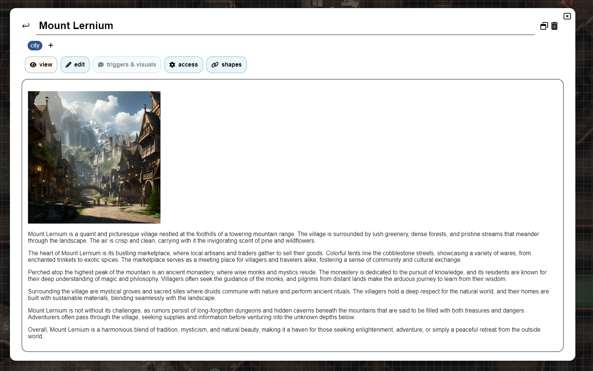
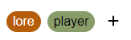

import Info from "/src/components/directives/Info.astro";
import Warning from "/src/components/directives/Warning.astro";

# ノート

DM やプレイヤーとして、キャラクター、ロケーション、イベントなどについてメモを取りたい場面に出会うこともあるでしょう。
このページでは、PlanarAlly が提供するノート管理の機能を紹介します。

## 概念

ノートは、その核となる部分では、テキストと、任意のタイトルと著者を含むシンプルなコンテナです。
ただし、さまざまな方法で使用できます。

ノートは他のプレイヤーと共有したり、ノートの作成者だけに限定して非公開に保ったりすることができます。
また、ノートをシェイプに添付して、シェイプを選択したときにノートへすぐアクセスできるようにすることもできます。
あるいは、シェイプについて何かを思い出すためのメモとして使用することもできます。

ノートは Markdown 書式に対応しています。詳細については [Markdown チュートリアル](../../../learn/dm/Markdown_Tutorial/markdown) を参照してください。

### ローカルとグローバル

ほとんどの場合、ノートは現在のキャンペーン/ロケーションにのみ関連します。
しかし、キャンペーンに依存せず、どこからでも利用できるノートが必要になるような特殊なケースもあります。

前者はローカル、後者はグローバルと呼ばれます。
ノートの作成時には、どちらを作成するかを選択する必要があります。

グローバルノートのよい例として、モンスターのスタットブロックが挙げられます。
これを [アセットテンプレート](/ja/docs/dm/assets/#templates) と組み合わせれば、ゴブリンをボードにドロップすると、そのスタットブロックが添付されたノートが付いてきます。

## ノートマネージャーの UI

ノート操作の中核となるのはノートマネージャーです。
これは、ノートの検索・フィルタリング・作成を可能にする大きな UI 要素です。

### 開き方

ノートマネージャーは、画面左側のサイドメニューにある「Notes」セクションをクリックすると開くことができます。

キーボードショートカットの <kbd>n</kbd> でも開閉できます。

最後に、シェイプのコンテキストメニューから、またはシェイプを選択したときに画面右側に表示される選択情報パネルからも開くことができます。
これらの場合、ノートマネージャーは、シェイプに関連するノートのみを表示するフィルターが適用された状態で開きます。

### メインビュー

現在利用可能なすべてのノートの一覧が表示されます（特定のフィルターが適用されます）。

#### 検索とフィルタリング

最初の大きな UI 要素は検索バーで、すべてのノートを検索してフィルタリングできます。

検索バーには、ローカルノートとグローバルノートを切り替えるトグルがあります。
これらのノートは通常、性質が大きく異なるため、専用の独立したビューが用意されています。

2 つ目の要素は実際の検索バーの入力欄で、ここに検索クエリを入力します。

PA はこのクエリとすべての既知のノートを照合し、その結果を下のリストに表示します。
クエリをどこで検索するかは使用するフィルターによって異なり、
これは検索バーの最後の要素で設定できます。

デフォルトでは、PA はノートのタイトルとタグを検索対象とします。
ただし、ノートの内容や著者も検索対象に含めるように変更できます。

PA はデフォルトでは、アクティブなロケーションで作成されたノートのみを検索します。
これは、アーカイブされていないすべてのロケーション、さらには現在のキャンペーン内のすべてのロケーションを検索するように変更できます。

シェイプに添付されたすべてのノートを非表示にすることもできます。
これは、ストーリー全体に関連するノートに焦点を当てたい場合に役立ちます。

最後のフィルターとして、ローカルのシェイプに添付されたグローバルノートについて、ローカルトグルを無視するというものがあります。
要するに、現在のロケーションのシェイプに添付されたすべてのノート（ローカル/グローバルの状態に関係なく）が含まれるようになります。
（例：現在のロケーションにゴブリンがいる場合、ゴブリンのグローバルスタットブロックがローカルの一覧に表示されます）

##### シェイプフィルタリング

シェイプのコンテキストメニューから「show notes」を選択するか、アクティブなシェイプ選択のノートセクションから操作することで、
ノートマネージャーをシェイプフィルターモードに設定できます。

この場合、関連するシェイプに添付されたノートのみが表示されます。
不要になるため、ほとんどの検索フィルターは消えるか無効になります（シェイプに添付されたグローバルノートとローカルノートの両方が表示されることに注意してください）。

このモードでは、新しいノートを作成するボタンも、ノートをシェイプに自動的に添付します。

<Info>編集ビューの「shapes」タブを使えば、既存のノートにノートを添付することもできます。</Info>

#### ノートの一覧

メインビューの中央には、検索クエリとフィルターに一致した各ノートのタイトル、著者、タグ、およびいくつかのクイックアクションが表示されます。

タイトルはクリック可能なリンクで、クリックすると編集ビューでノートが開きます。

現在利用できる 2 つのクイックアクションは、編集ボタンとポップアウトボタンです。
編集アイコンは、タイトルをクリックしたときと同様に編集ビューでノートを開きます。
ポップアウトアイコンは、ノートを別のモーダルで開きます（詳細は [ノートのポップアウト](#popout-notes) を参照してください）。

アクティブなフィルターに一致するノートが多すぎる場合、このビューはページ分割されます。その場合、右上に `<` と `>` のボタンが表示されます。

### 新しいノートを作成する

メインの一覧ビューで新しいノートを作成するボタンをクリックすると、新しいノートを事前設定するための画面が表示されます。
このビューでは、タイトルとノートの種類（グローバルまたはローカル）を設定できます。

これは、グローバルノートとローカルノートの違いを説明する余地を確保するための、独立したビューで行われます。

ノートの作成後は、自動的に編集ビューに移動し、さらに設定を行うことができます。

### 編集ビュー

このビューは、ノートを編集するための高度なモードです。
メインビューに戻りたい場合は、左上の、ノートのタイトルの隣にある戻る矢印を押してください。

編集ビューは、上から下に複数のセクションに分かれています。

#### タイトル

ノートのタイトルが表示されます。

ノートの編集権限があれば、編集できます。

右側にもクイックアクションがいくつか表示されます。
もう 1 つの[ポップアウト](#popout-notes)アイコンと、ノートを削除するゴミ箱アイコンがあります。

#### タグ

現在ノートに添付されているすべてのタグが表示されます。

ノートの編集権限があれば、タグを追加したり削除したりできます。

タグは自由形式で、好きなものを設定できますが、理想的には比較的短い方がよいでしょう。
PA におけるタグの用途はノートのフィルタリング・検索のみなので、自由に整理できます。

タグは、その内容に基づいて一貫した色が自動的に割り当てられます。

<Warning>
    タグは、ノートに対する「can view」権限を持つすべてのユーザーに表示されます（[アクセスタブ](#tab-access)を参照）。
</Warning>

_色の生成は SHA1 アルゴリズムを使用するため HTTPS コンテキストでのみ機能し、HTTP コンテキストでは灰色っぽい色にフォールバックします_

#### タブ：表示と編集

この 2 つのタブは連携して、ノートの中核を成します。

編集タブでは、Markdown に対応したテキスト形式でノートの実際のコンテンツを書いたり編集したりできます。
レンダリングされた Markdown は表示タブで確認できます。

#### タブ：トリガーと表示

このタブは、ノートがシェイプに添付されている場合のみ開くことができます。

ノートの特殊な動作を設定できます。

現在、2 つのオプションが用意されています。

ノートアイコンを表示：シェイプの隣（マップ上）に小さなアイコンを表示します。
重要なノートを思い出すために使用できます。

シェイプのホバー時にテキストを表示：シェイプにマウスを合わせると、ノートの内容（Markdown レンダリング済み）が表示されます。
画面の中央上部に表示されます。ノートが大きい場合は、画面の大部分を覆う可能性があることに注意してください。

#### タブ：アクセス

このタブでは、ノートを閲覧・編集できるユーザーを設定できます。

デフォルトでは、ノートの著者のみがノートを閲覧・編集できます。
しかし、プレイヤーがどこかで見つけたノートに対して、すべてのプレイヤーに閲覧アクセスを許可したい場合もあるでしょう。

また、特定のプレイヤーにきめ細かいアクセスを許可することもでき、秘密のノートを特定のプレイヤーと共有できます。

ノートのタグは、閲覧アクセスを持つプレイヤーに見えることを理解することが重要です。
`faction:evil` のようなタグでうっかりネタバレしないように注意してください。

<Info>
プレイヤーに閲覧アクセスを許可すると（特定のプレイヤーでも全員でも）、新しいノートが利用可能であるという通知が届きます。

つまり DM として、プレイヤーに閲覧アクセスを許可することは、彼らがちょうど発見した特定の情報を伝える良い方法です。

</Info>

#### タブ：シェイプ

このタブには、現在ノートに添付されているすべてのシェイプが一覧表示されます。

まず、すべてのキャンペーンにわたるシェイプの合計数が表示され、次にアクティブなロケーションの合計数が表示されます。

アクティブなロケーションについては、名前付きのすべてのシェイプも一覧表示されます。名前をクリックすると、画面がそのシェイプの中央に移動します。
名前の上にマウスを置くとゴミ箱アイコンが表示され、クリックするとノートがそのシェイプから切り離されます。

## ノートのポップアウト

1 つまたは複数のノートに頻繁にアクセスする必要がある場合があります。
そのたびにノートマネージャーを開いてノートを切り替えるのは面倒です。

この問題を解決するために、PA にはノートを別のモーダルにポップアウトする機能があります。
複数のモーダルを同時に開くことができ、それぞれ個別にドラッグ移動できます。

ポップアウトでは表示と編集の機能のみが提供され、その他のノート設定にはノートマネージャー本体を開く必要があります。

ポップアウトを折りたたむこともでき、ノートの内容を隠してタイトルだけを表示できます。
これは、複数のポップアウトを開いている場合や、特定のノートが現時点では不要だが近い将来必要になる場合に特に便利です。

## アクティブなシェイプ選択のノート

PA は常に、現在選択されているシェイプに関する簡単な情報とともに、画面右側に UI 要素を表示します。

このセクションには、専用のノートセクションもあります。
添付されているノートの数と、シェイプに関連するノートのみを表示するフィルターを適用してノートマネージャーをすぐに開くためのアイコンが表示されます（詳細は [シェイプフィルタリング](#shape-filtering) を参照してください）。

1 つ以上のノートがシェイプに添付されている場合、このセクションを展開・折りたたみしてノートを一覧表示できます。
これにより、ノートをすばやくポップアウトしたり、ノートマネージャーで開いたりできます。
さらに、これらのノートの上にマウスを置くと、トリガー設定に関係なく、ノートの内容が画面の中央上部に表示されます。
