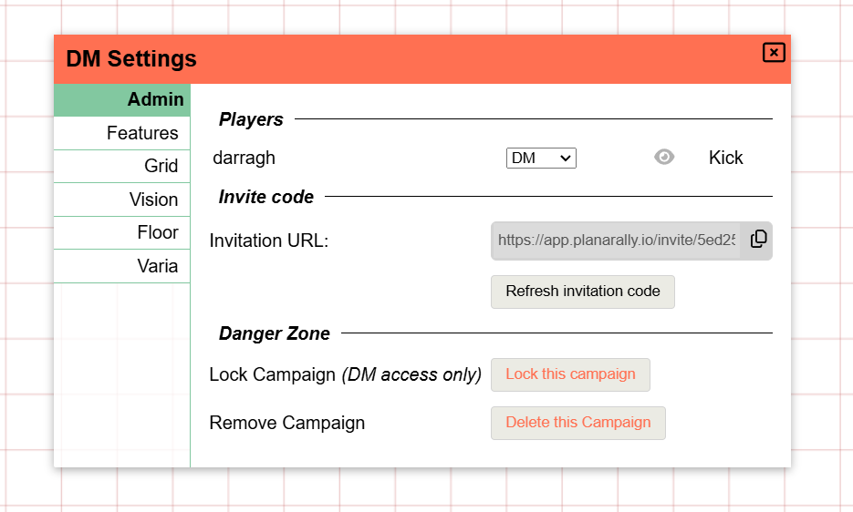

import Cog from "~icons/fa-solid/cog";
import Info from "/src/components/directives/Info.astro";
import Tip from "/src/components/directives/Tip.astro";

# 最初のマップ

ほとんどのゲームはマップを中心に展開します。常にそうとは限りませんが、このガイドでは伝統的なダンジョン探索のセットアップを想定しています。

このガイドでは、マップの追加、壁、照明、プレイヤーキャラクターとモンスターの設定を行います。

## 設定

本格的な作業に入る前に、変更したいかもしれない設定をいくつか見てみましょう。

左上の <Cog /> を開き、「DM Settings」をクリックします。
これにより、キャンペーン全体のさまざまなグローバル設定を構成できる UI が開きます。

### Admin 設定

<Info>ゲームにプレイヤーを追加するには、このタブにある招待リンクをプレイヤーに送信する必要があります!</Info>

しかし、今回の準備により関連性が高いのは、グリッドと視野のタブです。

### グリッド設定

ゲームによっては、これらのデフォルトで問題ない場合もあれば、少し調整が必要な場合もあります。

ここで注目すべき点:

- デフォルトでは正方形のグリッドが使用されます。これは六角形のグリッドに変更できます
- デフォルトでは、1 つのグリッドセルは様々な処理 (例: ルーラーツール) で 5x5 フィートのグリッドとして解釈されます

### 視野設定

とりあえず「Fill canvas with FOW」だけを有効にします。

個人的には FOW の不透明度を高く (例: 0.7) 設定するのも好きですが、これは好みの問題です。
プレイヤーが見えない領域が、DM であるあなたにはどのくらいはっきり見えるかを決定します。

なぜこの FOW 設定を有効にしたのでしょうか。

地下深くのダンジョン探索をシミュレートする予定なので、デフォルトの状態ではすべてが闇に包まれ、あちこちにある松明だけが光をもたらすという状況になるでしょう。
そのためキャンバスを FOW で塗りつぶしたのです。

これらの初期設定が完了したら、DM 設定を閉じて、実際にマップを追加しましょう。

## アセットの追加

PA にはアセットマネージャーがあり、OS のファイルエクスプローラーのように、アップロードしたアセットをフォルダーに整理したり、名前を変更したりできます。
複数のゲームを持っている場合や、一度に大量のトークン画像をアップロードしたい場合は、アセットマネージャーをしっかりと使いこなす必要があります。

しかし今は、OS のファイルエクスプローラーからマップにアセットをドラッグするだけにしましょう。
うまくいけば、次のような画面になっているはずです。

ここで使用されているマップは、[donjon ダンジョンジェネレーター](http://donjon.bin.sh/d20/dungeon/index.cgi)を使用してランダムに生成されたものです。

画面がかなり暗いことに気づくでしょう。これは私の 0.7 の不透明度設定のためです。今プレイヤーがセッションに参加したら、真っ黒な画面を見ることになるでしょう。

## レイヤーについての小休止

プレイヤーガイドも読んだなら、左下にプレイヤーには見えない追加の UI があることに気づいたかもしれません。
ここでフロアとレイヤーを制御します。フロアはより高度なトピックなので今回は省略しますが、レイヤーは DM のツールキットに不可欠なツールです。

レイヤーは互いの上に垂直に重なって構成され、レンダリングのパフォーマンスを向上させるだけでなく、関心の分離を実現するためにも使用されます。

デフォルトで選択されているレイヤーは「token」レイヤーです。これはすべての一般的なトークン (プレイヤー、NPC、モンスターを問わず) を配置するためのものです。
プレイヤーが実際に操作できる唯一のレイヤーでもあります。

DM はさらに多くのレイヤーにアクセスできます。token レイヤーの左には map レイヤーがあります。これは最下層のレイヤーで、大きなマップ要素をここに配置することを想定しています。
これにより、シェイプがマップの画像の後ろに挟まったり、誤ってマップアセット自体を動かしたりすることがなくなります。

3 つ目のレイヤーは DM レイヤーです。これは単純に、DM がプレイヤーに見せたくないものを何でも保存できるレイヤーです。
どこかに隠しモンスターがいて、適切なタイミングでだけ公開したい場合や、場所に覚え書きとしてテキストを追加した場合などです。

最後のレイヤーは Vision レイヤーです。これもすぐに使うことになりますが、今のところは壁などを描く際の通常の場所だと知っておけば十分です。

### マップの移動

ここで学んだこととして、先ほど追加したマップは間違ったレイヤーにあるということです。

マップを削除して map レイヤーに切り替えてから再度追加する方法もありますが、それはかなり手間です。

代わりに、マップアセットを右クリックします。(必ず token レイヤーにいることを確認してください。他のレイヤーのアセットを直接操作することはできません)

ここで選択したシェイプを別のレイヤーに移動できます。
これは、DM レイヤーにある隠しモンスターを token レイヤーに表示させる方法でもあります。

<Info title="隠されたレイヤー">
    実はもう 1 つレイヤーがあります。選択できない grid レイヤーです。grid レイヤーは map と token レイヤーの間にぴったりと収まっており、
    前述の DM グリッド設定の中からのみ構成できます。

    マップが token レイヤーにあるときはグリッド線がマップの後ろに隠れていたのに対し、今はマップの上を通っていることに注目してください。

</Info>

## 照明のセットアップ

さて、マップを正しいレイヤーに配置できました。それでは照明を灯しましょう。

どんなシェイプでも光源として機能するので、まずは小さな円を描いて、どこかの部屋に松明を表現しましょう。

### 基本シェイプ

シェイプを描くには Draw ツールを使う必要があります。これは主にセッションの準備中に使うため、ツールバーの Build モードに含まれるツールのひとつです。
それではモードを Build モードに切り替え (<kbd>tab</kbd> ショートカットを思い出してください)、Draw ツールを選択しましょう。

円 (または他のシェイプ!)、色を選んで、ボード上に描きます。シェイプは通常、マウスの左ボタンをクリックしてドラッグすることで描かれます。

<video autoplay loop muted style="max-width: min(680px, 75vw);">
    <source src="/learn/dm/add-light-shape.webm" type="video/webm" />
    <source src="/learn/dm/add-light-shape.mp4" type="video/mp4" />
</video>

### 光源の追加

描いたシェイプのプロパティを開いて、光源を追加できます。

これは、トラッカータブで、光源として機能し公開されているオーラを構成することで行えます。

ぜひ色々と試してみてください! 2 つの範囲値は、それぞれ明るい光と薄暗い光の範囲です。
完全な円の代わりに、光源を円錐状に制限して、特定の方向に向けることもできます。

また、光源に特定の色を付けて、より本物の松明らしくすることもできます。

<video autoplay loop muted style="max-width: min(680px, 75vw);">
    <source src="/learn/dm/add-light-source.webm" type="video/webm" />
    <source src="/learn/dm/add-light-source.mp4" type="video/mp4" />
</video>

## マップの寸法を修正する

半径 40 フィートの光源を追加しましたが、マップ画像を何の変更もなくボードにドロップしただけなので、それがマップの寸法とどう関係するのか気になるでしょう。

ルーラーツールでマップ上のグリッドセル 1 個のサイズを測ってみれば、疑念が確信に変わるでしょう。マップがまったく正しくスケーリングされていません。
マップと PA のグリッドのずれも、すでにそのことを示していたかもしれません ;)

Select ツールを使ってマップのサイズを変更し (Build モードで)、マップの寸法を手動で修正する方法もあります。
しかしこれはミスが起こりやすく退屈な作業です。代わりに、DM だけがアクセスできる Build ツールである Map ツールを使いましょう。

このツールでは、マップの寸法を構成できます。予想されるグリッドセル数で全体の幅/高さを入力するか、予想されるピクセル幅/高さを入力できますが、
領域をドラッグして、その領域が何グリッドセルに相当するかを構成することもできます。後者が最も簡単だと私は思います。

<video autoplay loop muted style="max-width: min(680px, 75vw);">
    <source src="/learn/dm/map-tool.webm" type="video/webm" />
    <source src="/learn/dm/map-tool.mp4" type="video/mp4" />
</video>

上のビデオでは、次の手順を実行しています:

1. map レイヤーに移動します (マップのシェイプを操作したいため)
2. マップを選択し、Map ツールに切り替えます
3. マップのシェイプ上で領域をドラッグします
4. Map ツールに、ドラッグした領域が水平・垂直に何グリッドセルを表すかを入力します
5. ドラッグした水平方向のセル数を数え、それが 5 だったので水平フィールドに入力しました
6. 数値を入力する前に、チェーンアイコンをクリックしました。これにより、編集すると自動的に他のフィールドも更新されてアスペクト比が維持されます
7. 結果として垂直フィールドは約 5.02 になりましたが、これで問題なさそうです
8. 適用を押すと、マップのシェイプがすぐに制約に合うようにリサイズされます
9. しかしまだずれているので、Select ツールに戻り、PA のグリッド (赤い線) と重なるようにドラッグします

これはかなり複雑に感じるかもしれませんが、慣れてしまえば、マップを整列させる非常に迅速な方法です。

<Tip title="ヒント">
    1. より広い領域をドラッグすると、精度が上がります!
    ただし、選択したグリッドセルの数を数えるのに手間がかかるかもしれません。  
    2. 私はグリッドのアウトラインを比較的薄く設定していますが、これはクライアント設定で変更できます  
    3.
    最終結果が完璧でなくても、おおよそのサイズが合っていれば、マップをより正確な一致にリサイズするのはずっと簡単になります
</Tip>

## 壁の追加

これでマップと照明が正しく整列しましたが、照明はマップを無視しています。
これを修正するには、壁がどこにあるかを PA に知らせる必要があります。

<Info>
    壁情報を含む svg をアップロードするなど、より高度なオプションがこのプロセスを支援するために利用できます。
    (ただし、私は個人的にほとんどの場合、壁を手動で描いています)
</Info>

照明と同様に、壁も Draw ツールを使用して描かれます。
主な問題は、どのレイヤーに描くかです。

最適な選択肢は 1 つありますが、実際にはプレイヤーに見えない DM レイヤーを除くどのレイヤーでも選択できます。

map レイヤーや token レイヤーに描くこともできますが、Vision レイヤーにはいくつかの品質改善機能があり、より興味深いものになっています:

まず、Vision レイヤー上のシェイプは、他のレイヤーにいるときにはレンダリングされません。つまり、多数の壁シェイプなどによる視覚的なノイズを、実際にプレイしているときには隠せるということです。
また、シェイプに色を付けて特定の意味を持たせることができます (例: オレンジ色の壁セグメントは秘密の扉) が、その色がメインのシーンににじみ出る可能性はありません。

2 つ目の利点は、Vision レイヤーを選択すると、Draw ツールが自動的にいくつかの設定を有効にすることです:

ご覧のとおり、`blocks vision/light` と `blocks movement` の設定が自動的に有効になっています。
これは小さな品質改善の助けで、壁を描くたびにそれらの設定を構成することを覚えておく必要がなくなるため、壁の構成が少し楽になります。

これらの 2 つの設定は非常に重要で、描画後に変更できます。名前が示すように、このシェイプを通過する光と移動がブロックされます。
壁には通常それを望むでしょう! 窓を模倣したい場合は、`blocks movement` を有効にしたまま、光と視野のブロックを無効にしたいところです。

<Info title="デフォルトの色">
もう 1 つの品質改善機能は、Vision シェイプのデフォルト色の設定です。
これらはクライアント設定の Appearance タブで構成できます:
 

シェイプは、関連する場合にここで定義された色を自動的に使用します。(例: 両方のブロック設定が有効なシェイプは壁として機能し、移動のみがブロックされたシェイプは窓として機能します)。

これらのシェイプをデフォルト色ではなく特定の色で描きたい場合は、Draw ツールの視野設定にある「Prefer default colours」オプションのチェックを外します。

</Info>

それでは、実際に壁を描きましょう。どのシェイプでも使えますが、多角形ツールが壁を描くのに最も汎用性があります。

<video autoplay loop muted style="max-width: min(680px, 75vw);">
    <source src="/learn/dm/draw-walls.webm" type="video/webm" />
    <source src="/learn/dm/draw-walls.mp4" type="video/mp4" />
</video>

ご覧のとおり、壁を描くのはとても簡単です。実際の壁のうちどれだけをプレイヤーに見せておくかは好みの問題です。
私は、影だけに頼るのではなく、視覚的に壁があるとわかるように、少し見せておくのが好きです。

<Tip>
    多角形シェイプを完成させるには、右クリックする必要があります!
     
    真っ直ぐでない線や、追加し忘れた点についてあまり心配しないでください。Build モードの Select ツールでは、
    多角形の点を移動できるほか、新しい点を追加したり、既存の点を削除したりできます。まず大きな図を描いてから、
    後で修正する方が、通常ははるかに速いです。
</Tip>

例えば token レイヤーに移動すると、描いた壁シェイプは消えているのに、影は残っていることを確認してください!

## キャラクターの追加

これで壁と光源のあるマップができましたが、まだキャラクターがありません。プレイヤーを表すものも、モンスターや NPC もありません。

マップと同じように、トークンをボードにドラッグ＆ドロップできます。ただし、この例のセットアップでは、PA 内で基本的なキャラクタートークンを作成します。
これらはテキストラベルだけの小さな円形トークンです。迅速なプロトタイピングや、セッションでアセットを探す時間を無駄にせずに NPC をすぐに用意したい場合に簡単です。

基本的なキャラクタートークンを追加するには、ボード上の空いている場所を右クリックします。理想的には token レイヤーで行います!

<video autoplay loop muted style="max-width: min(680px, 75vw);">
    <source src="/learn/dm/basic-token.webm" type="video/webm" />
    <source src="/learn/dm/basic-token.mp4" type="video/mp4" />
</video>

上のビデオでは、以下のことを行っています:

- 「test」という名前の基本トークンを作成する
- ユーザー名「test」のプレイヤーにシェイプへの権限を付与する
- 少しドラッグして壁が機能するかテストする。機能しています!

次に、ユーザー名「test」のプレイヤーが何を見えるか確認すると、次の問題に気づきます:

プレイヤーは、自分のキャラクターが入っていない部屋の明かりに照らされたすべてを見ることができます。

### 視野アクセス

視線の視野に飛び込む前に、シェイプのアクセスレベルについて簡単に話す必要があります。

上で「test」プレイヤーのアクセスをシェイプに追加したとき、3 つのアクセス権限 (edit/movement/vision) が自動的に付与されました。
3 つのアクセス権が常にすぐに付与されるわけではありません。状況によって異なるため、それらが何をするかを理解することが重要です。

特に、視野アクセス権限は、プレイヤーが何を見ることができるかを決定するため重要です。
アクセスが有効になると、PA はプレイヤーがシェイプの非公開オーラへの視野アクセスを持っていると想定し、基本的にトークンが世界で見えるものを見ます。

トークンにオーラが構成されていなくても、視界の悪い場所を移動しても見失わないように、周囲には常に最小限の視野オーラが存在します。

トークンの視野アクセスを無効にすると、代わりに次のようになります:

つまり、編集アクセスと移動アクセスは持っていても、シェイプがある領域を照明しているものが何もないため、実際にはシェイプを見ることができません。

## 視野

前述したように、プレイヤーがその光で照らされた部屋を、キャラクターがそこにいないのに見えるのは少し奇妙かもしれません。
これは、現在プレイヤーに視野の制限を適用していないためです。公開されている照明の当たるものなら何でも見ることができます。

これは特定のセットアップでは問題なく機能しますが、プレイヤーに自分のキャラクターが見えるものだけを見せたい場合は、
DM がマップ探索に合わせて照明をオン/オフしなければならないため、非常に面倒になります。

そして、この手間のかかるアプローチでも、結局プレイヤーは他のプレイヤーが見ているものを見ることができてしまい、それも望まないかもしれません。

キャラクターごとに視野を適切に有効にするには、2 つのことが必要です:

1. プレイヤーが自分のシェイプに対して視野アクセスを持っている必要があります
2. ロケーションが視線を有効にするように構成されている必要があります

(1) は前述の視野アクセスのセクションでカバーしたので、すでに対応済みですが、(2) については、[以前「full FOW」設定を有効にした](#vision-settings) DM 設定に戻る必要があります。

<Tip>
複数のロケーションがある場合 (後述)、これらの DM 設定はロケーションごとに構成できることがよくあります。

DM 設定はデフォルトの設定であり、ロケーションによって明示的に上書きされない場合に使用されます。

</Tip>

すべてがうまくいけば、(DM 側では) 次のようなビューになります:

ここで起こっていることは、プレイヤーが描いた壁に基づいて、自分の視線内に光が視覚的に届いている場所だけを見ることができるということです。
(右側の小部屋の内壁だけを描いたことを思い出してください)。

なぜこのように表示されるのかを視覚化するために、この粗い図を作りました:

- 赤い線は作った壁で、光を遮断します。
- 黄色の線は、壁に残した扉の開口部を通って光が放つ円錐を示しています
- 緑の線は、キャラクターが同じ扉の開口部を通って別の部屋を見ることができる円錐を示しています

キャラクターがいる部屋について:

- キャラクターは部屋全体を見ることができます
- 光は一部分だけを照らしています (その黄色い円錐)

-> 実際に見えるのは円錐の部分だけです

光がある部屋について:

- キャラクターは緑の円錐の部分しか見ることができません
- 光は部屋全体を照らします

-> 実際に見えるのは円錐の部分だけです

### プレイヤーのオーラ

通常、キャラクターは一定距離まで暗闇を見通す生来の能力を持っていたり、松明のような光を与える物体を持っていたりします。

[前述](#add-light-source)で別の部屋の光のオーラを作成する方法を見ました。プレイヤーキャラクターにも同じことを行うだけです!
シェイプ設定を開き、Trackers タブに移動して新しいオーラを追加します。

公開として構成されたオーラは (オーラの視野を持つ) すべてのプレイヤーに表示されるため、松明に最適です。一方、非公開のオーラは暗視のような生来の能力に適しています。

「acts as light source」プロパティをオンにすることが重要です。それが実際に光/視野のソースとして機能させるものだからです。(視野ソースの方が適切な名前かもしれません)

--

これで、マップをプレイに備えるための基本が身についたはずです!

[次へ](/ja/learn/dm/other-features)では、DM として知っておくべきであろう他の機能をいくつか見ていきます。
