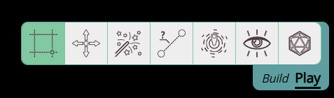

import PenSquare from "~icons/fa-solid/pen-square";
import Unlock from "~icons/fa-solid/unlock";
import Info from "/src/components/directives/Info.astro";
import Tip from "/src/components/directives/Tip.astro";
import Warning from "/src/components/directives/Warning.astro";

# ゲームとの操作

いよいよ PA を実際に使ってみましょう!

## マップの移動

まずは最も簡単なこと、マップの移動から始めましょう。

あらゆる VTT を使う上で欠かせないのは、カメラの動かし方を知ることです。

### ズーム

ズームイン/アウトは、マウスホイールをスクロールするだけなのでとても簡単です。
前の章で見たように、右上には専用のズームスライダーもあり、それを使うこともできます。

主な違いは、スライダーは常に画面の中心を基準にズームするのに対し、
マウスでのズームは現在のマウス位置を基準にズームすることです。

### パン

マップを移動するには、マウスの中ボタンまたは右ボタンを押したままマウスを動かします。

<Tip>誤ってパンしてしまうのを防ぐため、使う予定のないボタンをクライアント設定で無効にできます</Tip>

キーボードでも移動できます。矢印キーのいずれかを押すと、指定された方向に画面がパンします。
1 回押すごとに、画面はグリッドセル 1 個分移動します。

<Tip>他にも方法を発見したい場合は、[キーバインド](/ja/docs/reference/#keybindings)を参照してください!</Tip>

## ツールを見てみる

右下のツールバーを詳しく見てみましょう。
**モード**によって 2 つの形を取りますが、プレイヤーとしてはほぼ専ら Play モードを使用します:

<Tip>
    1: 抽象的なアイコンが好みでない場合は、クライアント設定でテキストラベルを表示するように UI を変更できます。
     
    2: <kbd>tab</kbd> を押すと、モードをすばやく切り替えられます
</Tip>

PA での操作のほとんどは、現在アクティブなツールに依存します。上の例では、それが Select ツールです。

ここではすべてのツールを簡単に見ていきますが、説明はよく使う基本に限定します。
より詳細な情報は[ツールのドキュメント](/ja/docs/tools/select/)を確認してください。

### Select

これは間違いなく最もよく使うツールです。その主な用途は…何かを選択することです!

シェイプを左クリックすると選択され、シェイプの周りに赤い枠が表示されます。
マウスを動かしながら左クリックを押し続けると、シェイプを移動できます。

複数のシェイプを選択すると、一度にまとめて移動できます!

驚きの情報ですね、わかってます。

しかし Select ツールにはもっと機能があります。選択範囲がアクティブなとき、
右上に選択したシェイプのクイック情報が表示される特別な UI が現れ、
右下には Select ツールの追加の構成オプションが利用可能になります。

<Info title="サイズ変更 / 回転">
    Select ツールには、シェイプのサイズ変更や回転の機能もあります。
     
    これは通常頻繁に行うことではないため、この機能は Build モードのときにのみ表示されます。
    これにより、シェイプをドラッグしたいだけで、角に少し近すぎる場所をクリックしてしまった場合の
    誤ったサイズ変更を防ぎます。
</Info>

### Pan

次は、おそらく最も使われないツールです。左クリックで画面を移動/パンできるからです。

中ボタンや右ボタンでどのツールからでも常にパンできるため、
このツールを積極的に使うのは、マウスがないデバイスを使用しているときだけでしょう。

### Spell

ボードに一時的に呪文エフェクトを追加する必要があるとき、このツールが役立ちます。

一般的な呪文のシェイプを選択し、寸法を構成して、マップ上に配置できます。

シェイプを選択している場合、シェイプと呪文エフェクトの間にはルーラーが自動的に表示され、
どのくらいの距離から詠唱しているかを把握できます。

### Ruler

距離を測る必要があるときの頼れるツールです。

非常にわかりやすいツールで、クリックしてドラッグして線を引き、グリッドセル数またはゲーム内の距離 (例: フィートまたはメートル) で距離を測定します。

<Tip>
    マウスをドラッグしている間にスペースキーを押すと、新しいアンカーポイントが作成され、角を曲がって測ることができます!
</Tip>

### Ping

もう 1 つの小さくても便利なツールが Ping ツールです。マップ上の特定の領域に注意を引き付けることができます。

### Vision

複数のキャラクターを操作している場合にのみ表示される専門的なツールです。

このツールで選択したキャラクターに視野を限定します。

### Dice

頻繁に使うか、まったく使わないかのどちらかのツールがダイスツールです。

純粋にテキスト形式でダイスロールを解決したり、仮想の 3D ダイスを実際にシミュレートして解決したりできます。

### Draw

このツールは Build モードのときだけ表示されます!

このツールを使うと、マップ上にさまざまなシェイプを描くことができます。

## キャラクターの変更

まだ説明していないのは、キャラクターの変更方法です。もちろん、これもプレイの重要な部分です。

キャラクターを選択しているとき、編集 UI を開く方法は複数あります。

- クイック情報 (右上) の <PenSquare /> アイコンを押す
- キャラクターを右クリックして「show properties」をクリックする
- <kbd>Enter</kbd> を押す

どれを選んでも、キャラクターの複数の側面を編集できる大きな UI 要素が表示されるはずです。
多くのことが構成できますが、心配しないでください。プレイヤーにとって最も重要なタブは Properties と Trackers です。

### Properties

ここでは、キャラクターの名前やアセットなどの基本事項を編集できます。

### Trackers

ここでは、トラッカーとオーラを構成できます。

トラッカーは、ゲームを通じて保持・変更したい数値データです (例: HP)。
オプションで、マップ上のキャラクターの上に表示することもできます。非公開または他のすべてのプレイヤーに見えるように、のどちらかで。

一方、オーラは常に視覚的で、範囲効果や照明などを表します。
オーラが視野を与えるためのもの (例: 松明や暗視) なら、「Light source」トグルをオンにするようにしてください。

オーラの範囲入力には 2 つの値があります。1 つ目の値は明るい光が何フィートあるか、
2 つ目の値は薄暗い光が何フィートあるかです。つまり、5e の松明は 20 / 20 にする必要があります (20 / 40 ではありません!)。

## さらに読む

これは PlanarAlly との操作を可能にするツールの非常に短い概要でした。

言及しなかったけれど調べてみたいかもしれないもの:

- ノート: 特定の NPC やストーリーの要所について収集した情報を記録する
- チャット: シンプルなテキストベースの一時的なチャット
- イニシアチブ: 基本的なイニシアチブトラッカー

そして、実際に自分でゲームをホストすることに興味があるなら、[DM ガイド](/ja/learn/dm/intro/)をチェックして、それがどんなものか確かめてみてください。
