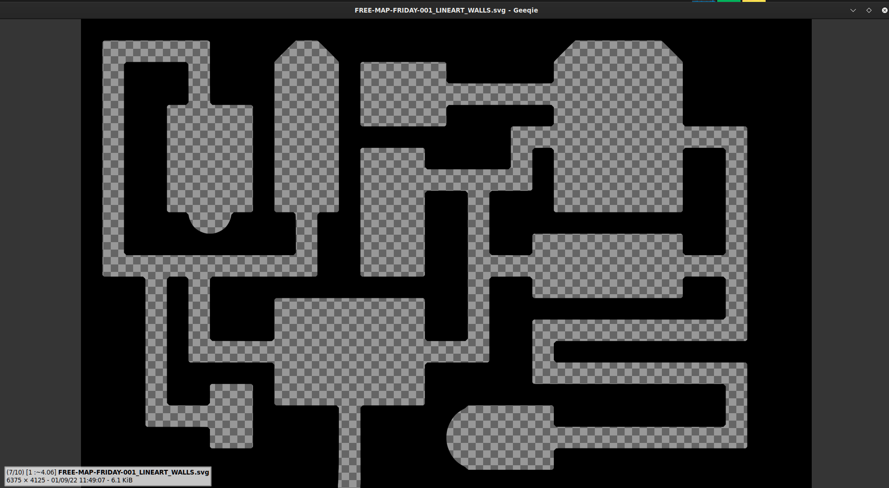
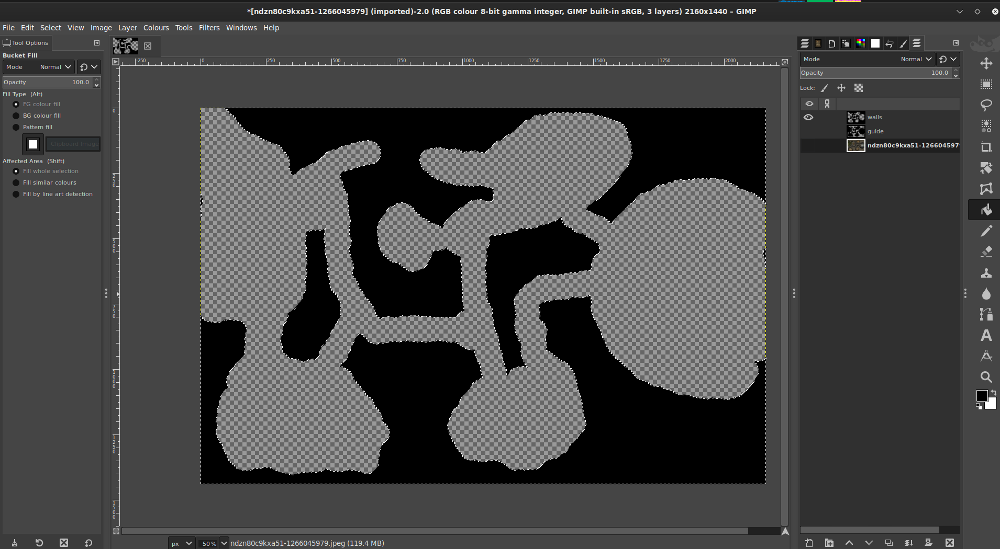

# **壁マスクの作成ガイド。**

[@veritanuda](https://keybase.io/veritanuda) による寄稿ガイド

この方法は、その精度次第でどのようなマップでも機能するはずですが、洞窟のような不規則なマップでも簡単にマスクできます。

# 要件

以下の手順は、無料で利用できるツールの [GIMP](https://gimp.org) と [potrace](https://potrace.sourceforge.net/) を使用するためのものです。もちろん、同じ結果を得るためにプロプライエタリなツールを使用することもできますが、同じ動作を保証するものではありません。

---

以下に 2 つの方法を示します。

- 1 つはダンジョンと既製マップ用の方法です
- もう 1 つは不規則なマップとカスタムマップ用の方法です。

# **方法 1**

この方法では、Free Friday Maps からランダムなマップを選びます。こちらから入手できますが [here](https://www.drivethrurpg.com/browse/pub/10213/Paths-to-Adventure/subcategory/25973_33572/Free-Map-Friday)、いくつかの重要な特徴があればどのマップでも構いません。

- 白黒バージョンがあり
- グリッドなしオプションがある。

    これらは必須ではありませんが、マスクの作成に費やす時間が少し減るだけです。

では、これが最初に使用するマップです。

Lineart を含むいくつかのタイプがあります。それが私たちが使用するものです。

# 背景の削除

このマップには、背景としてマップの周りに不規則なハッチングがあります。幸いなことに、それは灰色という別の色です。`Fuzzy select/Colour Select` ツールを選択し、`Colour Select` を選んで背景の灰色の領域の 1 つを選択すると、すべての灰色がハイライトされるはずです。

これは良いですが、それらの間の線が選択されていないため、今すぐ削除すると、黒いひび割れ舗装のような見た目が残ってしまいます。

すべてが選択されている状態で、画像を右クリックして `Select` `>` `Grow...` に進みます。

グレーのスポットの間の線を覆うまで、選択範囲を数ピクセル拡張します。すべてを捉えたと満足したら、`Delete` を押すと _パッ_ と背景が消えます。

次に `Fuzzy Select` に戻り、今回は `Fuzzy Select` を選びます。今度は白い背景をクリックすると、すべてが選択されるのがわかります。

- _このマップのように閉じた空間がある場合は、Shift キーを押しながらクリックして、それを選択に追加する必要があります。_

次に、`Layers` パネルで `New Layer` を追加し、このレイヤーに `mask` という名前を付けます。

そのレイヤーで `Bucket Fill` ツールを選択します。先ほど作成した背景の選択範囲をクリックすると、すべて黒く塗りつぶされるはずです。

線画レイヤーを非表示にして、欠けている部分のない完全なマスクができているか確認します。

何か見逃した場合は、慌てないでください。`Cntrl-Z` を押して元に戻し、見逃した部分の選択に戻ってください。

マップと背景の選択方法によっては、いくつかのドアも塗られている可能性があります。消しゴムツールと、最適な形のブラシを使用して、すべてのドアと秘密の扉を塗りつぶし、黒を除去する必要があります。

これをしないと、ドアが通過不可能になります。マップをインポートして壁を追加したら、作った開口部にいつでもドアトークンを追加できます。

マスクに満足したら、線画レイヤーを削除できます。

次の部分は、PlanarAlly が壁に使用する SVG に正しく変換したい場合は**不可欠**です。

画像を右クリックして `Image` `>` `Mode` に進みます。私のように Line art をインポートした場合は、`greyscale` になっていたでしょう。背景の削除などを簡単にするために、カラーマップを `greyscale` に変換する必要がある場合があります。しかし今はモードが `RGB` でなければなりません。画像をそれに変更します。

次に、画像を右クリックして `File` `>` `Export As...` に進み、画像を `BMP` として保存します。`Run Length Encoding` をオフにし、`Do not write colour space information` をオフにし、`Advanced` の下で `32 Bits` になっていることを確認します。

保存したら、コマンドラインの `potrace` を使用するか、[このウェブサイト](https://svg-converter.com/potrace) からオンラインで無料で行うことができます。

自分で行うコマンドは非常に簡単です。

`potrace -s FREE-MAP-FRIDAY-001_LINEART_WALLS.bmp`

これにより `svg` が得られるはずで、グラフィックプログラムで開くと、光が遮られる場所は黒く、光が届く場所は透明になっているはずです。

# **方法 2**

不規則なマップがあり、背景の除去がそれほど簡単ではないとします。通常のツールだけを使って手動でマスクを作ることもできます。

この例では、[このマップ](https://www.reddit.com/r/FantasyMaps/comments/hrf51h/battlemap30x202160x1440pxcavejunglepirateoc/) を使用します。

マップを gimp にインポートします。

新しいレイヤーを作成し、`guide` という名前を付けます。

`Pencil tool` でブラシとして `Circle` を選択し、黒にします。必要に応じてサイズを変更します。`guide` レイヤーを選択していることを確認し、壁の**内側**のマップの色付き部分に描き始めます。

すべてのシェイプを塗りつぶしたと満足したら、`walls` という名前の別のレイヤーを作成します。

`guide` レイヤーで `Select by colour` ツールを使用し、作成した黒いガイドをクリックします。次に選択範囲を反転します。

次に、`walls` レイヤーでバケツ塗りつぶしツールを使用して、反転した選択範囲を黒で塗りつぶし、壁を塗りつぶします。

完了したら、以前のレイヤーを非表示にし、見逃した場所がないと満足したら、それらのレイヤーを削除して、上記のいずれかの方法で変換できるように画像を BMP として保存します。

# PA への壁のインポート

次に、この SVG を PlanarAlly の `Assets` フォルダーに、プレイヤーマップと (あれば) GM マップと一緒にアップロードします。

それらのアセットをロケーションにドラッグします。プレイヤーマップは MAP レイヤーに、GM マップは GM レイヤーに配置します。MAP レイヤーでそれを右クリックして Properties を開き、`Name` を設定し、`Advanced` の下で `Blocks Vision/Light` と `Blocks Movement` にチェックを入れます。次に `Extra` タブに移動し、`Lighting & Vision` `>` `Upload walls` で、先ほどアセットにアップロードした SVG を選択します。壁が適用されるはずです。

`Token` レイヤーに光源を持つトークンでテストすれば、ほぼ完了です。ドアや秘密の通路がある場合は、ドアトークンまたは FOW で手動で隔離する必要があります。あなたの選択です。しかし、うまくいけば、もう手作業で壁を作ることを心配する必要はありません。

楽しいゲームを!

\*/}
