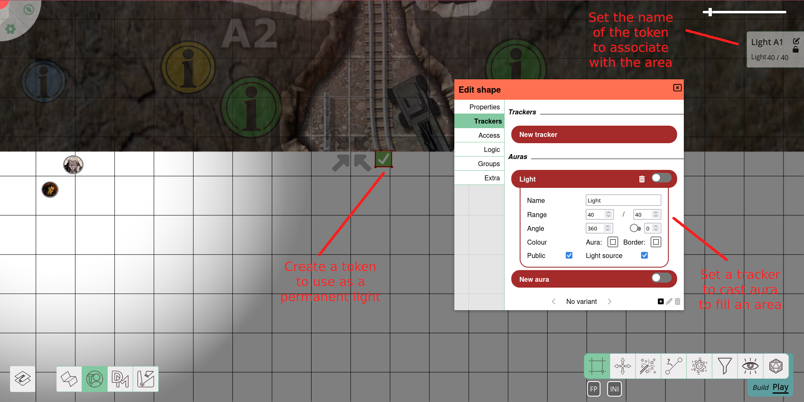
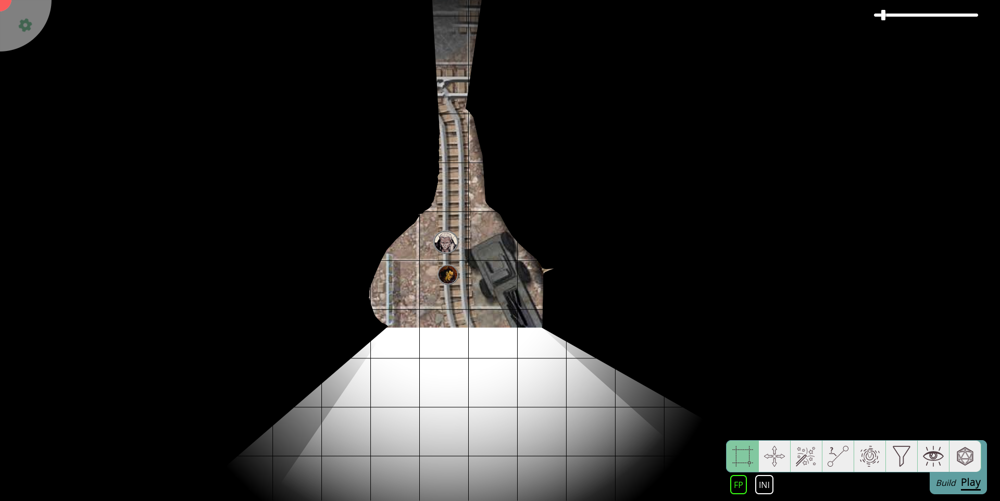

import Lightbulb from "~icons/fa-solid/lightbulb";

# RTS風照明

[@veritanuda](https://keybase.io/veritanuda) による寄稿ガイド

このチュートリアルでは、より複雑な照明のセットアップに焦点を当てます。
PlanarAlly の[照明と視野システム](/ja/docs/dm/lighting-vision/)、その[レイヤー](/ja/docs/dm/layers)、トークンの[オーラ](/ja/docs/game/shapes/#trackers--auras)と[アクセス](/ja/docs/game/shapes/#access)に精通していることを確認してください。

このチュートリアルでは、RTS (リアルタイムストラテジー) 風の照明セットアップを再現したいと思います。
このセットアップでは、以下のことが**できます**:

- プレイヤーに探索するためのマップを提供し
- すでに探索した領域を表示します。

このセットアップでは、以下のことは**できません**:

- プレイヤーの実際の視線を考慮せず、簡略化された方法で動作する
- トークンだけを隠しマップは隠さない「薄い戦争の霧」を追加する (PlanarAlly ではこれはできません)、または
- プロセスを自動化する。

## コンセプト

リアルタイムストラテジーゲームでは、プレイヤーは未探索のマップに直面することがよくあります。
しかし、斥候がその領域に到達した瞬間、マップは明らかになり、戦争の霧は他のプレイヤーのユニットだけを隠し、マップは隠しません。
これはよくリクエストされる機能です。
それでも、さまざまな理由から、PlanarAlly には (まだ?) 実装されていません。

しかし、同様の効果を再現するのは簡単です。
前述の欠点はありますが、プレイヤーに自分の視線だけよりも、マップ上でのより多くの (そしてより良い) 方向性を与えることができます。

基本的に、私たちは次のことを行います:

- マップをゾーンに分割し、
- これらのゾーンにそれぞれ光源を提供し、
- プレイヤーが探索した瞬間にそのゾーンを照らして、離れた後も見えるようにします。

## 準備

まず、照明と視野システムを使用して通常のマップをセットアップします: キャンバスを戦争の霧で塗りつぶし、好みに応じて壁と照明を追加します。

### セクター

次に、マップを見て、独立して探索できる部分を特定します。
通常のダンジョンでは、すでにいくつかの部屋に分割されているため、これは簡単でしょう。

次に、1 つ以上の光源を配置します (ゾーンのレイアウトによって異なります)。
これらの照明は、ゾーン全体を照らすことができなければなりません。
おそらく、端に薄暗い光のない、くっきりとしたオーラだけが欲しいでしょう。

照明を _DM_ レイヤーに隠し、および/または後で使用するためにオーラを非アクティブ化します。

## 実装

ゾーンがプレイヤーに表示されるべき瞬間 (入ったとき、または完全に探索したとき) に、照明をオンにします。
これを行うには、オーラをアクティブ化し (非アクティブ化した場合)、光源を `fow` レイヤーに移動して、ゾーンを照らします。
光源も _公開_ に設定して、プレイヤーが実際にそれを見えるようにします。

光源が _fow_ レイヤーにあるため、そのオーラは token レイヤーに描画され、シェイプ自体は不可視のままです。
`fow` レイヤーはオーラから*あらゆる*色も除去します。

実際の視野と RTS 風の視野を区別できるようにしたい場合は、プレイヤーの視野にわずかな色合いを与えるか、光源を _map_ レイヤーに移動します。
トークンを不可視にするか、`move to back` 機能を使用して追加したマップ画像の下に隠すことができます。
`lock` 機能を使用して、グループやマップの他の要素で照明を誤ってドラッグしないようにします。

_視線内の照明のみ表示_ オプションを有効にしている場合は、代わりに、使用したい照明に対してすべてのプレイヤーに*視野*アクセスを追加する必要があります。
そうしないと、プレイヤーとそのゾーンの間に壁がある瞬間、すでに探索したゾーンについての知識を失います。
この場合、光源のプロパティにあらかじめすべてのプレイヤー用のアクセス*エントリ*を追加し、すべてのアクセスレベルを非アクティブ化しておくとよいでしょう。

これにより、いくつかの <Lightbulb/> アイコンにチェックを入れるだけで、ゾーンを照らすことができます。

これは _map_ レイヤーだけでなく _tokens_ レイヤーも照らすことに注意してください。

プレイヤーから敵の動きを隠したい場合は、敵のトークンを _DM_ レイヤーに移動します。
