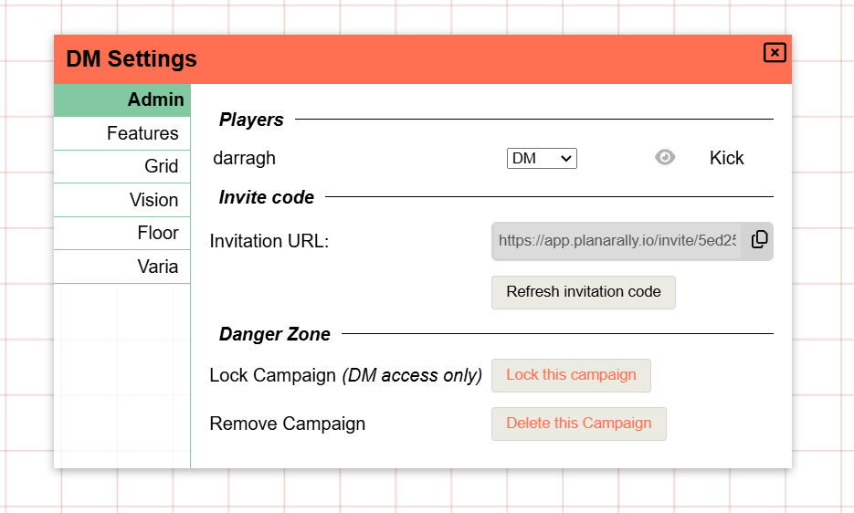
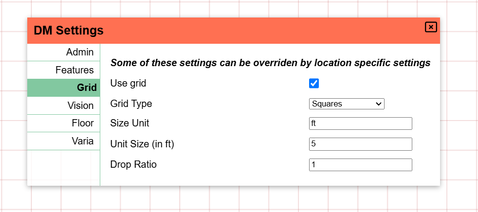
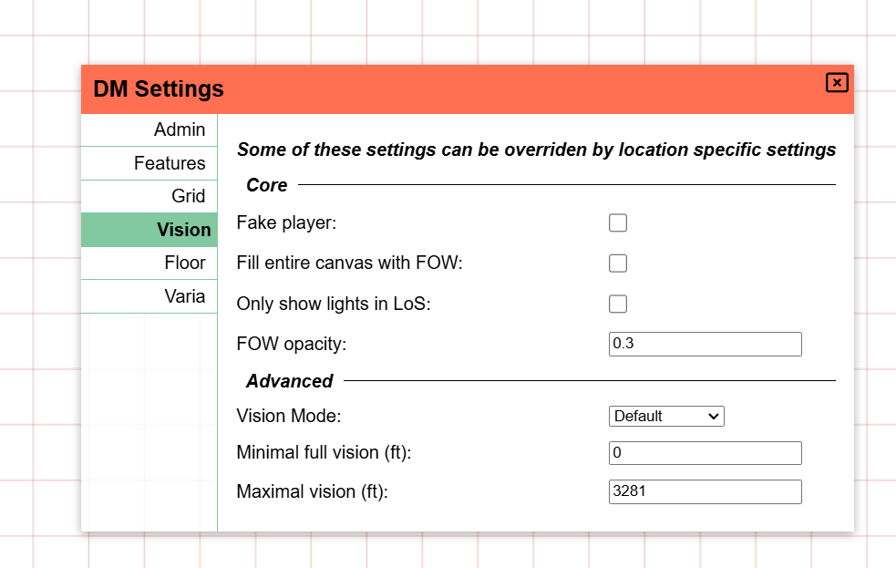
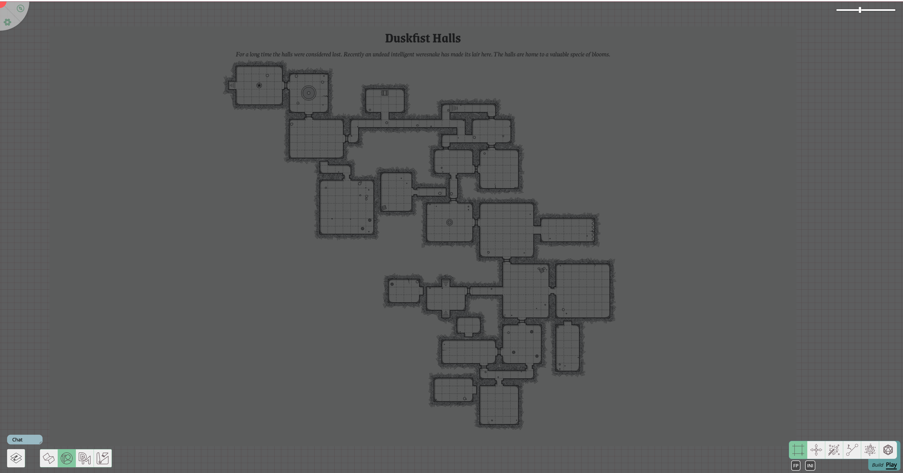
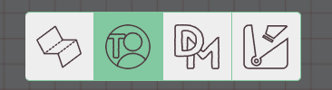
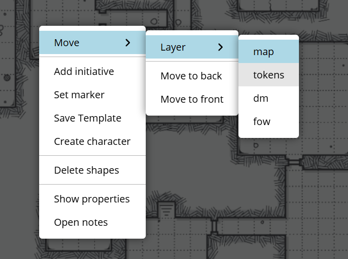

import Cog from "~icons/fa-solid/cog";
import Info from "/src/components/directives/Info.astro";
import Tip from "/src/components/directives/Tip.astro";

# Your first map

Most games end up revolving around a map, this is not always the case, but we're going to assume in these guides that we're going for a traditional dungeon diving setup.

In this guide we'll add a map, configure walls, lights, player characters and monsters.

## Configuration

Before getting down into the proper work, let's first take a look at some configuration we might want to modify.

Open the <Cog /> in the top-left and click on the "DM Settings".
This will open the UI in which you can configure a variety of global settings for the entire campaign.

### Admin Settings

<Info>To add players to your game, you have send them the invite link, which you can find on this tab!</Info>

More relevant to our current preparations however are the grid and vision tabs.

### Grid Settings

Depending on your game these defaults might be fine, or will require some tweaking.

Some notable things here:

- A square grid is used by default, this can be changed to hex grids
- A single grid cell is by default interpretted as a 5x5 ft grid for various things (e.g. ruler tool)

### Vision Settings

For now only enable "Fill canvas with FOW".

I personally also like to set the FOW opacity higher (e.g. 0.7), but this is up to personal preference.
It will dictate how strong the areas that players can't see, will be visible for you as the DM.

Why did we enable this FOW setting?

We're going to simulate a dungeon delve deep underground, so the default setup will likely be that everything is coated in darkness and only some torches here and there will bring light into the scene.
That's why we filled the canvas with FOW.

With these initial settings configured, let's close the DM settings and actually add a map.

## Adding assets

PA has an asset manager where much like your OS file explorer, you can organize uploaded assets in folders, rename them etc.
Once you have multiple games or just want to upload a lot of token art at once, you'll want to actually explore the asset manager properly.

For now however, we're just going to drag an asset from your operating system's file explorer onto the map.
If all went well you should now see the following:

The map used here was generated randomly using the [donjon dungeon generator](http://donjon.bin.sh/d20/dungeon/index.cgi).

Notice that the screen is pretty dark, that's because of my 0.7 opacity setting. Right now if a player were to join the session, they would see a pure black screen.

## An intermezzo on layers

If you also followed the player guide, you might have noticed the additional UI in the bottom left that the player couldn't see.
This is where you control floors & layers. Floors are a more advanced topic that we'll skip for now, but layers are an essential tool in your DM kit.

Layers are organized vertically on top of eachother and are used to improve render performance but also to have separation of concerns.

The default selected layer is the "token" layer. This is intended for all general tokens (be it players, npcs or monsters) to live on.
It's the only layer that players can actually interact with.

As a DM you have access to a bunch more layers. Left of the token layer there is the map layer. This is the lowest layer and the idea is that you place your big map elements here.
This ensures that at no point some shape is stuck behind the map art or that you accidentally move the map asset itself.

The third layer is the DM layer, this is simply a layer where you as a DM can store anything you want, that players should not be able to see.
Maybe you have a hidden monster somewhere that you only want to reveal when the time is right or maybe you added some text in certain locations as reminders.

The last layer is the Vision layer, we'll use this pretty shortly, but for now all you need to know is that this is the usual location to draw walls and the likes.

### Moving our map

So what we actually learned now is that the map we added earlier is on the wrong layer!

We could delete the map, change to the map layer and add the map again, but that's a lot of effort.

Instead, right click on the map asset. (Make sure you're still on the token layer!, you can't interact directly with assets from another layer)

Here we can move the selected shape to a different layer!
This is also how you would make that hidden monster on the DM layer show up on the tokens layer.

<Info title="The hidden layer">
    There's actually another layer, one that you can't select, the grid layer. The grid layer is snugly fit between the
    map and token layer and can only be configured from within the DM Grid settings as we saw earlier.

    Notice how when the map was on the token layer, the grid lines were hidden behind the map, whereas now they actually go over the map!

</Info>

## Setting up a light

Alright, we got our map on the right layer, let's light it up!

Any shape can act as a light source, so let's start with drawing a small circle to represent a torch in some room.

### Base Shape

To draw shapes we need to use the draw tool, it's one of the tools that is part of the Build Mode of the toolbar as it's primary use is during session preparation.
So let's change the mode to build mode (remember the <kbd>tab</kbd> shortcut) and select the draw tool.

Choose a circle (or some other shape!), a colour and draw it on the board. Shapes are generally drawn by left clicking with the mouse and dragging.

<video autoplay loop muted style="max-width: min(680px, 75vw);">
    <source src="/learn/dm/add-light-shape.webm" type="video/webm" />
    <source src="/learn/dm/add-light-shape.mp4" type="video/mp4" />
</video>

### Add light source

We can now open the just drawn shape's properties, and add a light source!

This can be done in the trackers tab by configuring an aura that acts as a light source and is public.

Feel free to play around with this! The two range values are respectively bright and dim light range.
Instead of a full circle you can restrict the light source to a cone and angle it in a particular direction.

You can also give your light a specific colour to give it more of a real torch feel.

<video autoplay loop muted style="max-width: min(680px, 75vw);">
    <source src="/learn/dm/add-light-source.webm" type="video/webm" />
    <source src="/learn/dm/add-light-source.mp4" type="video/mp4" />
</video>

## Fixing the map dimensions

Now that we've added a light that's supposed to have a radius of 40ft,
you might be wondering how that actually relates to the map dimensions as we just dropped the map image on the board without any extra modifications.

If you took the ruler tool and measured the size of a subgke grid cell on the map, you would confirm your suspicions: the map isn't properly scaled at all!
The misalignment of the map with the PA grid may also have given this away already ;)

We could do an attempt to manually fixing the map dimensions by using the select tool and resize the map (in build mode).
This is however error prone and tedious work. Instead we're going to make use of a build tool that only DMs have access to: The Map tool.

This tool lets you configure the dimensions of the map. You can insert the full width/height in either expected grid cells or just expected pixel width/height,
but you can also drag an area and configure what that area is supposed to be in # grid cells. I find the latter the easiest.

<video autoplay loop muted style="max-width: min(680px, 75vw);">
    <source src="/learn/dm/map-tool.webm" type="video/webm" />
    <source src="/learn/dm/map-tool.mp4" type="video/mp4" />
</video>

In the above video, we do the following steps:

1. Move to the map layer (as we want to interact with our map shape)
2. Select the map, and switch to the map tool
3. Drag an area on the map shape
4. Insert in the map tool how many grid cells the dragged area should represent both horizontally and vertically
5. I counted the horizontal number of cells dragged which is 5 and inserted that in the horizontal field
6. Before inserting the number, I clicked on the chain icon which ensures that any edit, will automatically update the other field to retain the aspect ratio
7. This ended up with ~5.02 for the vertical field which seems fine
8. After hitting apply, the map shape is immediately resized to fit our constraints
9. It's still misaligned however, so we go back to the select tool and drag it in such a way that it overlaps with the PA grid (the red lines)

This might feel quite involved, but once you get the hang of it, it's actually a quite rapid way to align maps.

<Tip title="Tips">
    1. If you drag a bigger area, the precision will go up! It only might take more work to count the number of grid
    cells you've selected.  
    2. I have my grid outline relatively faint, you can change this in your client settings  
    3. Even if the end result isn't perfect, you should be able to resize the map to a more accurate match way more
    easy now that the general size is roughly ok
</Tip>
