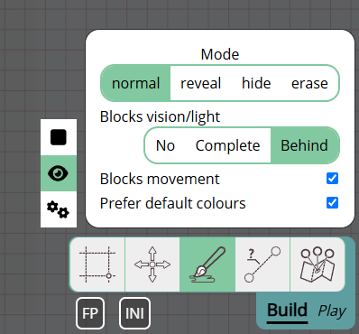
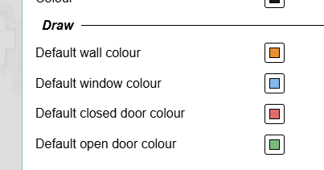
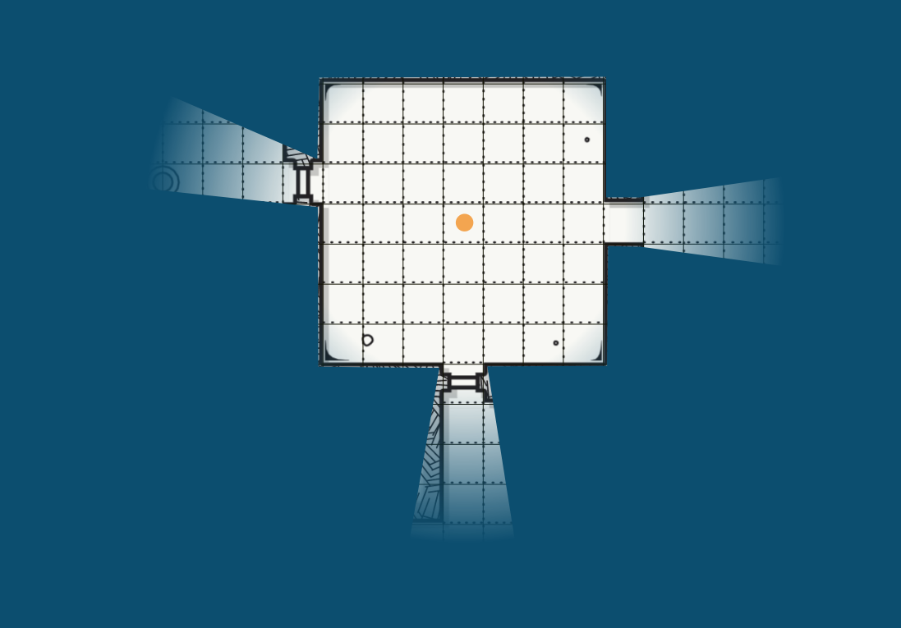
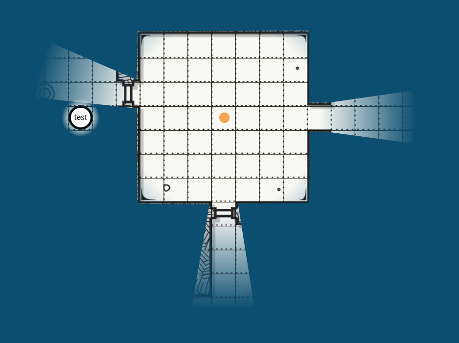
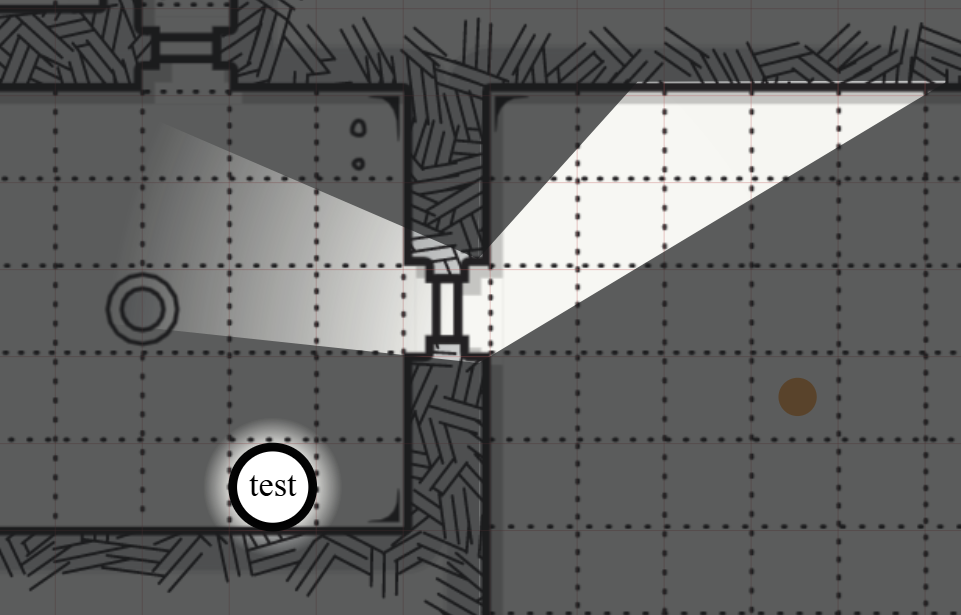
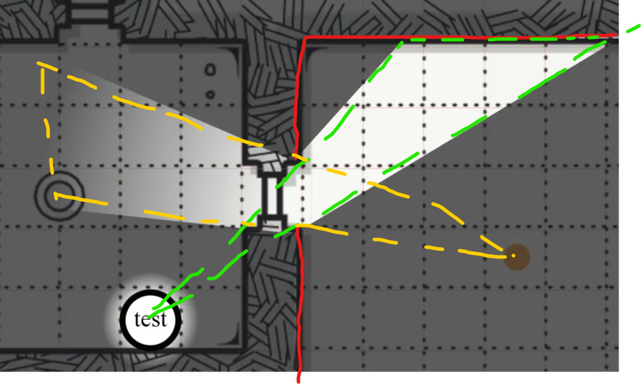

import Cog from "~icons/fa-solid/cog";
import Info from "/src/components/directives/Info.astro";
import Tip from "/src/components/directives/Tip.astro";

# Your first map

Most games end up revolving around a map, this is not always the case, but we're going to assume in these guides that we're going for a traditional dungeon diving setup.

In this guide we'll add a map, configure walls, lights, player characters and monsters.

## Configuration

Before getting down into the proper work, let's first take a look at some configuration we might want to modify.

Open the <Cog /> in the top-left and click on the "DM Settings".
This will open the UI in which you can configure a variety of global settings for the entire campaign.

### Admin Settings

<Info>To add players to your game, you have to send them the invite link, which you can find on this tab!</Info>

More relevant to our current preparations however are the grid and vision tabs.

### Grid Settings

Depending on your game these defaults might be fine, or will require some tweaking.

Some notable things here:

- A square grid is used by default, this can be changed to hex grids
- A single grid cell is by default interpretted as a 5x5 ft grid for various things (e.g. ruler tool)

### Vision Settings

For now only enable "Fill canvas with FOW".

I personally also like to set the FOW opacity higher (e.g. 0.7), but this is up to personal preference.
It will dictate how strong the areas that players can't see, will be visible for you as the DM.

Why did we enable this FOW setting?

We're going to simulate a dungeon delve deep underground, so the default setup will likely be that everything is coated in darkness and only some torches here and there will bring light into the scene.
That's why we filled the canvas with FOW.

With these initial settings configured, let's close the DM settings and actually add a map.

## Adding assets

PA has an asset manager where much like your OS file explorer, you can organize uploaded assets in folders, rename them etc.
Once you have multiple games or just want to upload a lot of token art at once, you'll want to actually explore the asset manager properly.

For now however, we're just going to drag an asset from your operating system's file explorer onto the map.
If all went well you should now see the following:

The map used here was generated randomly using the [donjon dungeon generator](http://donjon.bin.sh/d20/dungeon/index.cgi).

Notice that the screen is pretty dark, that's because of my 0.7 opacity setting. Right now if a player were to join the session, they would see a pure black screen.

## An intermezzo on layers

If you also followed the player guide, you might have noticed the additional UI in the bottom left that the player couldn't see.
This is where you control floors & layers. Floors are a more advanced topic that we'll skip for now, but layers are an essential tool in your DM kit.

Layers are organized vertically on top of eachother and are used to improve render performance but also to have separation of concerns.

The default selected layer is the "token" layer. This is intended for all general tokens (be it players, npcs or monsters) to live on.
It's the only layer that players can actually interact with.

As a DM you have access to a bunch more layers. Left of the token layer there is the map layer. This is the lowest layer and the idea is that you place your big map elements here.
This ensures that at no point some shape is stuck behind the map art or that you accidentally move the map asset itself.

The third layer is the DM layer, this is simply a layer where you as a DM can store anything you want that players should not be able to see.
Maybe you have a hidden monster somewhere that you only want to reveal when the time is right or maybe you added some text in certain locations as reminders.

The last layer is the Vision layer, we'll use this pretty shortly, but for now all you need to know is that this is the usual location to draw walls and the likes.

### Moving our map

So what we actually learned now is that the map we added earlier is on the wrong layer!

We could delete the map, change to the map layer and add the map again, but that's a lot of effort.

Instead, right click on the map asset. (Make sure you're still on the token layer!, you can't interact directly with assets from another layer)

Here we can move the selected shape to a different layer!
This is also how you would make that hidden monster on the DM layer show up on the tokens layer.

<Info title="The hidden layer">
    There's actually another layer, one that you can't select, the grid layer. The grid layer is snugly fit between the
    map and token layer and can only be configured from within the DM Grid settings as we saw earlier.

    Notice how when the map was on the token layer, the grid lines were hidden behind the map, whereas now they actually go over the map!

</Info>

## Setting up a light

Alright, we got our map on the right layer, let's light it up!

Any shape can act as a light source, so let's start with drawing a small circle to represent a torch in some room.

### Base Shape

To draw shapes we need to use the draw tool, it's one of the tools that is part of the Build Mode of the toolbar as it's primary use is during session preparation.
So let's change the mode to build mode (remember the <kbd>tab</kbd> shortcut) and select the draw tool.

Choose a circle (or some other shape!), a colour and draw it on the board. Shapes are generally drawn by left clicking with the mouse and dragging.

<video autoplay loop muted style="max-width: min(680px, 75vw);">
    <source src="/learn/dm/add-light-shape.webm" type="video/webm" />
    <source src="/learn/dm/add-light-shape.mp4" type="video/mp4" />
</video>

### Add light source

We can now open the just drawn shape's properties, and add a light source!

This can be done in the trackers tab by configuring an aura that acts as a light source and is public.

Feel free to play around with this! The two range values are respectively bright and dim light range.
Instead of a full circle you can restrict the light source to a cone and angle it in a particular direction.

You can also give your light a specific colour to give it more of a real torch feel.

<video autoplay loop muted style="max-width: min(680px, 75vw);">
    <source src="/learn/dm/add-light-source.webm" type="video/webm" />
    <source src="/learn/dm/add-light-source.mp4" type="video/mp4" />
</video>

## Fixing the map dimensions

Now that we've added a light that's supposed to have a radius of 40ft,
you might be wondering how that actually relates to the map dimensions as we just dropped the map image on the board without any extra modifications.

If you took the ruler tool and measured the size of a single grid cell on the map, you would confirm your suspicions: the map isn't properly scaled at all!
The misalignment of the map with the PA grid may also have given this away already ;)

We could do an attempt to manually fixing the map dimensions by using the select tool and resize the map (in build mode).
This is however error prone and tedious work. Instead we're going to make use of a build tool that only DMs have access to: The Map tool.

This tool lets you configure the dimensions of the map. You can insert the full width/height in either expected grid cells or just expected pixel width/height,
but you can also drag an area and configure what that area is supposed to be in # grid cells. I find the latter the easiest.

<video autoplay loop muted style="max-width: min(680px, 75vw);">
    <source src="/learn/dm/map-tool.webm" type="video/webm" />
    <source src="/learn/dm/map-tool.mp4" type="video/mp4" />
</video>

In the above video, we do the following steps:

1. Move to the map layer (as we want to interact with our map shape)
2. Select the map, and switch to the map tool
3. Drag an area on the map shape
4. Insert in the map tool how many grid cells the dragged area should represent both horizontally and vertically
5. I counted the horizontal number of cells dragged which is 5 and inserted that in the horizontal field
6. Before inserting the number, I clicked on the chain icon which ensures that any edit, will automatically update the other field to retain the aspect ratio
7. This ended up with ~5.02 for the vertical field which seems fine
8. After hitting apply, the map shape is immediately resized to fit our constraints
9. It's still misaligned however, so we go back to the select tool and drag it in such a way that it overlaps with the PA grid (the red lines)

This might feel quite involved, but once you get the hang of it, it's actually a quite rapid way to align maps.

<Tip title="Tips">
    1. If you drag a bigger area, the precision will go up! It only might take more work to count the number of grid
    cells you've selected.  
    2. I have my grid outline relatively faint, you can change this in your client settings  
    3. Even if the end result isn't perfect, you should be able to resize the map to a more accurate match way more
    easy now that the general size is roughly ok
</Tip>

## Adding walls

We now have a properly aligned map and a light, but the light is just ignoring our map.
To fix this we need to inform PA where the walls are.

<Info>
    Some more advanced options like uploading an svg with the wall info are available to help you with this process.
    (Though I personally just draw the walls manually most of the time)
</Info>

As with the light, the walls will also be drawn using the draw tool.
The main question is on which layer do we want to draw these?

Although there is one optimal choice, we could actually choose any layer with the exception of the DM layer as those won't be visible to the players.

We could draw them on the map or token layer, but the vision layer has some quality of life improvements that make it more interesting:

First off shapes on the vision layer are not rendered when on another layer, which means that the visual noise of a lot of wall shapes etc can be hidden when actually playing.
It also means that you can colour code your shapes to mean specific things (e.g. the orange wall segments are secret doors) without those colours potentially bleeding into the main scene.

The second benefit is that when you select the vision layer, the draw tool automatically enables some settings:

As you can see the `blocks vision/light` and `blocks movement` settings are automatically enabled.
This is a small QoL help that makes configuring walls just a tad bit easier as you don't have to rememberto configure those settings everytime you want to draw a wall.

These 2 settings are quite important and can be changed after drawing. As the name suggests, light and movement will be blocked through this shape.
Which you usually want for a wall! If we want to mimic a window, we would want to keep the `blocks movement` enabled, but disable the light and vision blocking.

<Info title="Default Colours">
Another QoL feature is the default colour setup for vision shapes.
These can be configured in your client settings' Appearance tab:
 

The shape will automatically use the colour defined here when relevant. (e.g. shapes with both block settings enabled act as walls, and those with only movement blocked will act as windows).

If you want to draw these shapes in a particular colour instead of their default, you can uncheck the 'Prefer default colours' option in the draw tool's vision settings.

</Info>

With all that out of the way, let's actually draw our wall! You can use any shape, but the polygon tool is the most versatile for wall drawing.

<video autoplay loop muted style="max-width: min(680px, 75vw);">
    <source src="/learn/dm/draw-walls.webm" type="video/webm" />
    <source src="/learn/dm/draw-walls.mp4" type="video/mp4" />
</video>

As you can see, drawing walls is super easy! It's a bit of a stylistic preference how much of the actual wall you want to keep visible to the players,
I usually like to show them a bit so that they visually see that there is a wall instead of only relying on shadow.

<Tip>
    You need to right-click to complete the polygon shape!
     
    Don't worry too much about lines that aren't straight or points you forgot to add. The select tool in build mode
    allows you to move points on the polygon as well as add new points or remove existing points. Getting the bigger
    picture drawn first with some touchups afterwards is usually way faster.
</Tip>

Check what it looks like when you now go to the token layer for example and notice that the drawn wall shapes are gone, but the shadow remains!

## Adding characters

We now have a map with some walls, a light source, but no characters yet. There is nothing representing the players and there are no monsters or npcs.

We can drag and drop some tokens on the board just like we did with the map. For this example setup however we're going to create a basic character token in PA itself.
These are small circular tokens with just a text label. Easy for rapid prototyping or when you need an npc on the boared quickly and don't want to waste time looking for some asset in your session.

To add a basic character token, right click on an empty spot on the board. Ideally we do this on the token layer!

<video autoplay loop muted style="max-width: min(680px, 75vw);">
    <source src="/learn/dm/basic-token.webm" type="video/webm" />
    <source src="/learn/dm/basic-token.mp4" type="video/mp4" />
</video>

In the video above we:

- Create a basic token with the name "test"
- Give the player with username "test" permission to the shape
- Drag it around a bit testing if the wall works, and it does!

If we now check what the player with username "test" can see we notice the following problem:

There are two problems actually:

1. We don't see the test token, it's hidden behind the fog
2. Our player can see the room with the light while their character is not even in there

### "Is a Token"

The first problem is easy to fix, open the test shape's settings and check the "is a token" property (in the properties tab).

This property makes it so that PA recognizes this shape as a special token and basically indicates that this is a token that will be used to represent a player.

Tokens will automatically have a minimal vision aura around them so that you don't lose them when moving in a place you can't see much in.

This property however also plays a much bigger role when paired with a proper vision setup as we'll see below.

## Vision

As pointed out earlier it might be a bit odd that the player can see the room that was lit by that light while not being there with their character.
This is because we currently apply no vision restrictions to the player. They can just see everything that is (publicly) lit.

This can work fine in certain setups, but when you expect the player to only be able to see what their character can see,
this can become very tedious as you as a DM will have to turn on or off lights as they go about exploring the map.

And this labour intensive approach will still end up with players being able to see what other players see, which might also not be what you desire.

To actually enable vision per character properly we need two things:

1. Players need to have their shapes configured to be a token
2. The location needs to be configured to have line of sight enabled

(1) we did in the "Is a token" section, so that is already covered, but for (2) we need to go back to our DM settings [where we enabled the "full FOW" setting earlier](#vision-settings).

<Tip>
If you have multiple locations (see later), these DM settings can often also be configured on a per location basis.

The DM settings are the default settings and will be used when not explicitly overriden by a location.

</Tip>

If everything went right we now have the following view:

So what is happening here is that the player now only sees those places where there is light visually within their line of sight based on the walls we drew.
(Remember that we only drew the inner wall in the chamber on the right).

To help you visualize why this is shown I made this crude drawing:

- The red lines are the walls we made, those block light.
- The yellow lines show the cone that the light is emitting that goes through the door opening we left in the wall
- The green lines show the cone that the character can see into the other room going through that same door opening

For the room the character is in:

- The character can see the entire room
- The light only lights up a section (that yellow cone)

-> Only the cone section is actually visible

For the room the light is in:

- The character can only see the green cone section
- The light lights up the entire room

-> Only the cone section is actually visible

### Player auras

Usually characters will have some inate ability to see through darkness up to a certain distance or they simply have some object like a torch that gives light.

We [previously](#add-light-source) saw how to create an aura for the light in the other room, we can simply do the same for our player character!
Open the shape settings, go to the Trackers tab and add a new aura.

Auras configured as public will show up for all players (with vision of the aura) so this is perfect for a torch, whereas a private aura is better suited for inate abilities like darkvision.

It's important to mark the 'acts as light source' property as that is what actually makes it work as a light/vision source. (vision source is probably a better name)

--

This should give you the essentials to getting your maps ready for play!

[Next up](/learn/dm/other-features) we're going to check out some other features that you'll probably want to be aware of as a DM.
