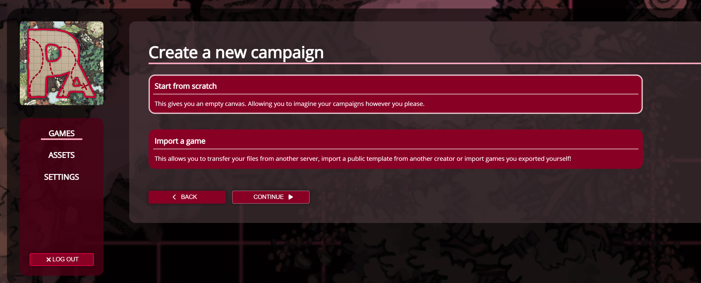

import Info from "/src/components/directives/Info.astro";

# Introduction

Getting started on a new VTT is always a bit of a challenge as every platform has their own nuances and features.
The idea of this series of guides is to get you started with the most common basic flow of preparing and running a game.

You should probably have a read through the [player guide](/learn/player/intro/) which is quite short as we won't reiterate some of the basic things explained there (e.g. moving the camera etc).

## Choosing a server

An important first step is actually choosing on which PA server you intend to run your game.
You can self-host, or join an existing open server, the choice is yours.

For more info on this choice, see the [server documentation](/server/setup/).

## Creating a game

With the server choice out of the way, let's create a game.
If you visit the main games overview when you log in, there is a big NEW GAME button in the top right.

This will bring up a selection to either create a game from scratch or import a game from another server.

<Info>
    This also means that you can actually export your games! If you end up wanting to move to a different server, this
    is definitely possible.
</Info>

As we want to create a new campaign, we'll do it from scratch, let's continue.
Choose a name, optionally add a logo and off we go.

The first thing we see after creating a game is a big white canvas with nothing on it yet.
This is something we're obviously going to fix, and we'll do that in [the next chapter](/learn/dm/first-map/).
