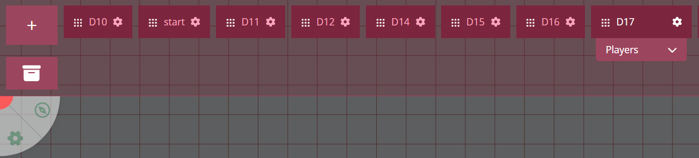

import Info from "/src/components/directives/Info.astro";
import Warning from "/src/components/directives/Warning.astro";

# Other noteworthy features

This section will be shorter and mostly link to some features you might want to explore as a DM in your prep or during your games.

<Warning>
    Some of the linked reference pages might be out of date. These new intro docs are a first step in an effort to get
    the docs up to date!
</Warning>

## Initiative

_full reference: [the initiative docs](/docs/tools/initiative/)_

A common aspect of rpg's is some form of combat. PA offers a simple initiative tracker to keep track of rounds.

The essence is that you can open the initiative UI by right clicking on the board.
If you happen to click on a shape, you'll instead be able to add the specific shape to the initiative, giving them an entry in the UI.

Entries can be hidden from players until relevant, timers can be added to keep track of effects lasting X turns etc.

## Locations

_full reference: [the location docs](/docs/dm/locations/)_

We have now made our first map, but what about a second map?

We could simply dedicate another area of the board to a new map,
but this has multiple issues:

- navigation can quickly become difficult, trying to remember where which part was located and
- there is just more and more data, making PA slower
- you might want to have other settings for specific maps (e.g. different grid layout, different light setup)

Instead it's easier to separate your maps in something that PA calls a "Location".

The location bar can be accessed as a DM using the second handle of the top-left UI element.
It will show a list of all of your active locations (you can archive/reactivate locations) and where certain players currently are.

Each location can be individually configured to override the DM settings we saw in previous parts. As a DM you can quickly load a location for yourself by clicking on an entry.

### Moving players

To move players from one location to another there are 2 options.

Option 1 is dragging the players box from one location to another,
option 2 is to create something called a spawn location in the target location and doing a right-click on a shape (or multiple shapes) and moving them to another location.

The latter may sound like much more work, but the former only moves the players' camera so to say. Whereas using the spawn locations you're actually moving their tokens to a specific new place in the target location.

Option 1 is thus better suited for locations where there is no need for character tokens, maybe an overworld map or some location where you prepared various loose images to roleplay around.

Option 2 is almost always the cleaner way to transition between locations for the players. We'll see some extra utilities later on in the logic section to help you out a bit more.

## Floors

_full reference: [the floor docs](/docs/dm/floors/)_

The location system is great for dealing with a wide variety of places your players might explore.
Sometimes however we're dealing with places where there is verticality.
A house with multiple floors is a simple example of this.

Using a different location per floor is quite cumbersome as each location is a bit like a different level in a video-game, where some internals are fully reset and you get a small loading screen.
Other things like initiative are also tracked per location, so that quickly becomes problematic when dealing with characters all over the place.

A simple solution is to just put the other floors on some other area of your "house" location. You can still use spawn locations within the same location so moving between floors can still be pretty straightforward.

PA however has a special extra feature which is aptly named 'floors'. It allows you to add a completely new set of layers on top of the current set.
By combining this with transparency it means that a shape on the top floor can actually look down the stairs and see a character on a lower floor!
Something you wouldn't be able to replicate without using this feature.

This honestly greatly improves the immersion and transitions between floors are much smoother as the camera does not have to jump around.

## Logic

_full reference: not yet created :(_

PA currently has two different "logic" systems that can be thought of as interaction elements for the DM or the players during gameplay.

### Doors

A shape can be marked as a door, causing the shape to be able to toggle between an opened and a closed state.
While open the shape does not block vision/movement and while closed it does!

This is a simple QoL feature mostly for DMs as they can just click on doors while players explore, but you can optionally configure your doors to also become interactable for your players.

<Info>
    Door interaction is only possible while in Play mode, in build mode this is disabled to prevent frustration while
    for example resizing a door.
</Info>

Although the feature is called "door(s)", you can actually modify what blocker should be toggled by the interaction. This means you can only toggle the vision blocker and you get a window!
If you instead only block the movement you have something like a hidden door in a smooth wall.

### Teleport zones

The other logic element is the teleport zone. An area can be designated as a teleport zone, meaning that shapes that enter it can teleport to another place (i.e. a spawn location).

Teleport zones can be configured to automatically trigger (e.g. a teleport trap) or to show an action asking you if you want to teleport.

Example uses of teleport zones are staircase landings between floors, making it much easier to quickly traverse between floors.

## Assets

_full reference: [the asset docs](/docs/dashboard/assets/)_

Earlier in the introduction we mentioned the asset manager, but instead of using it we just dragged assets straight on the map.

The asset manager is a feature that allows you to organize your various assets. It's available outside of the game in the main dashboard, but it can also be accessed in-game.

You might for example have a specific folder for all your D&D tokens, but also have a specific folder for each campaign.
