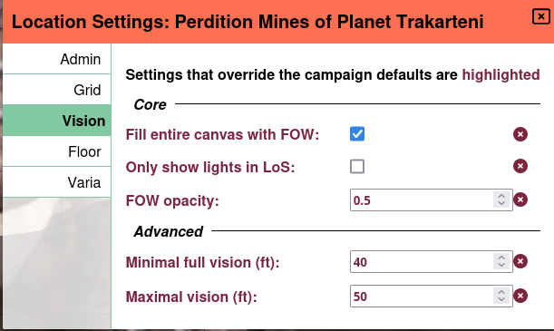
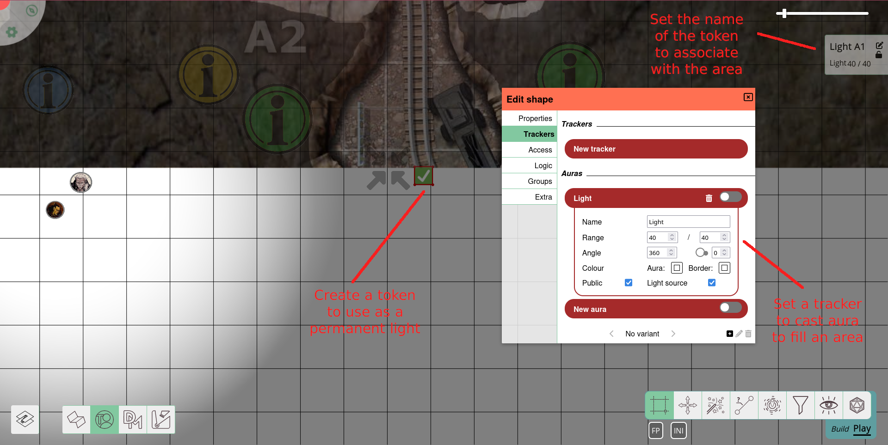
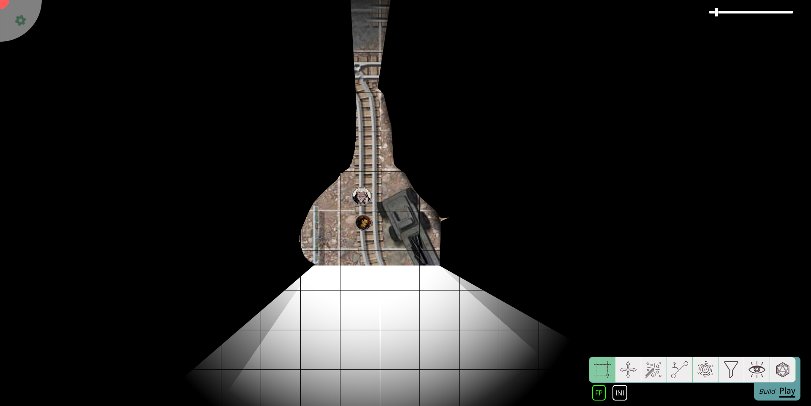
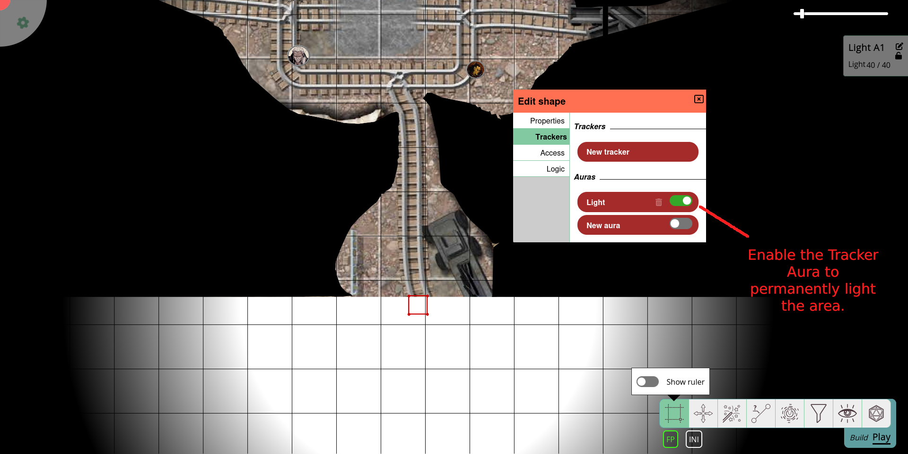
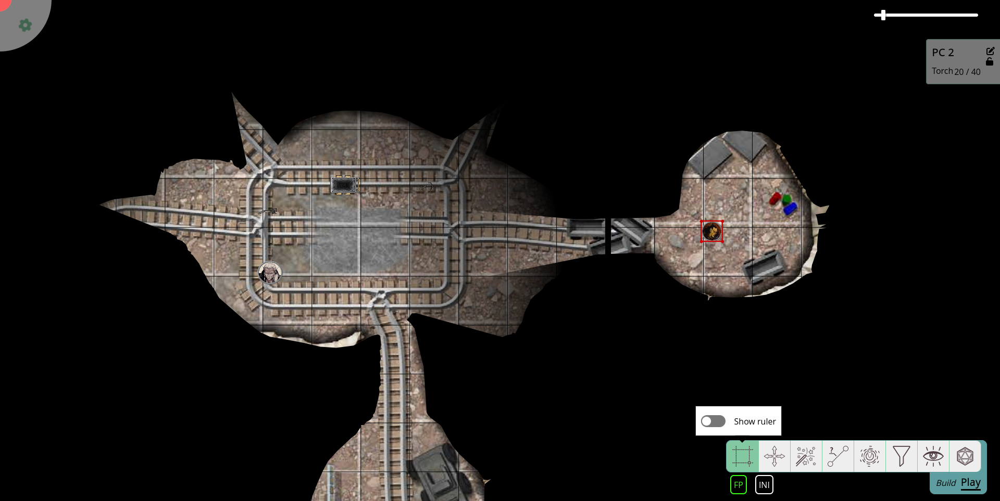
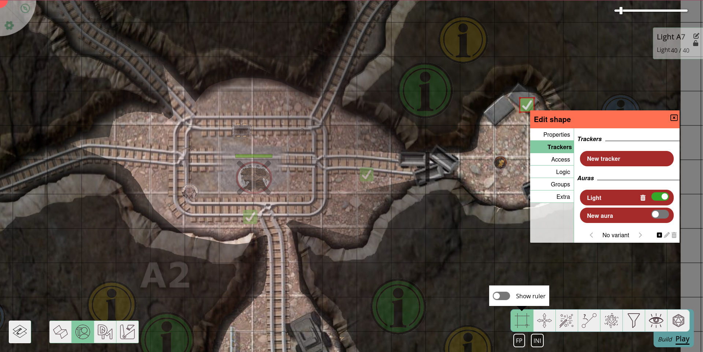
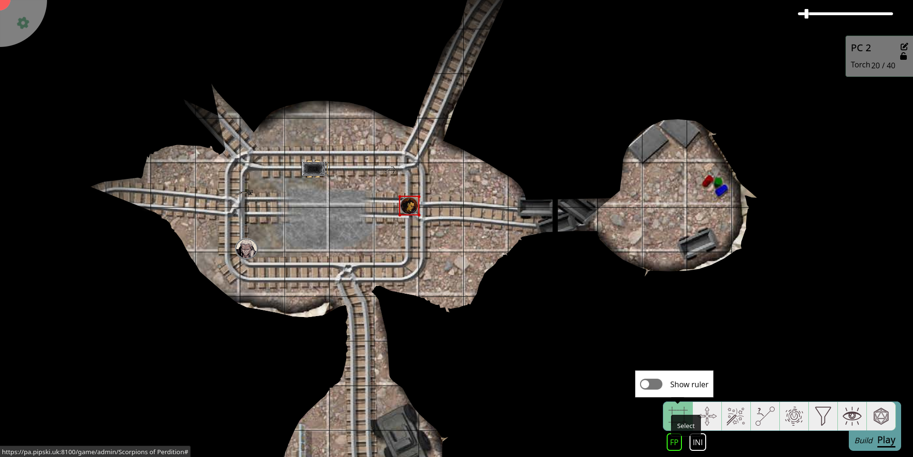

import Lightbulb from "~icons/fa-solid/lightbulb";

# RTS-style Lighting

This tutorial will focus on a more complex lighting setup.
Make sure you are familiar with PlanarAlly's [lighting & vision system](/docs/dm/lighting-vision/), as well as its [layers](/docs/dm/layers) and the tokens' [auras](/docs/game/shapes/#trackers--auras) and [access](/docs/game/shapes/#access).

In this tutorial, we want to emulate RTS-style (*R*eal *T*ime *S*trategy) lighting setups.
The setup **will**:

-   give players a map to explore and
-   show them areas they already explored.

The setup **will not**:

-   take into account player's actual line of sight, but work with simplifications,
-   add 'thin fog of war' that only hides tokens but not the map (PlanarAlly cannot do this), or
-   automate the process.

## Concept

Real-Time-Strategy games often confront players with unexplored maps.
Yet, the moment a scout reached the area, the map is revealed and any fog of war will only hide other players' units but not the map.
This is a feature that was often requested.
Still, for various reasons, it has not been implemented into PlanarAlly (yet?).

But it is easy to emulate a similar effect.
It will have the draw-backs mentioned above, but will give players more (and better) orientation on the map than just their own line of sight.

In essence, we will

-   divide up the map into zones,
-   provide these zones with light sources, each,
-   light up the zones the moment, the players have explored it, so they will be able to see it, when they left.

## Preparation

First, set up your regular map using the lighting and vision system: fill the canvas with fog of war, add some walls and lights as it pleases you.

### Sectors

Then look at your map to identify portions that can be explored independently.
For your regular dungeon, this should be easy, as it already is divided up into several rooms.

Now, place one or more light sources (depending on the zone's layout).
These lights should be able to shed light on the entire zone.
You will probably want just sharp auras with no dim light on the edges.

Hide away the lights on the _DM_ layer and/or deactivate the auras for later use.

## Implementation

The moment the zone shall be visible to your players (either as they enter it or as they have fully explored it), turn on the lights.
Do this via activating the aura (if you deactivated it) and moving the light source to the `fow` layer, to light up the zone.
Set the light source to _public_ also, so that players can actually see it.

Since the light source is on the _fow_ layer, its aura will be drawn on the token layer, while the shape itself will remain invisible.
The `fow` layer will also strip the aura of _any_ colour.

In case you want to be able to differentiate between actual sight and RTS-style sight, either give the players' sight a slight hue, or move the light sources to the _map_ layer instead.
You can either make the token invisible or hide it beneath any map images you added via the `move to back` function.
Use the `lock` function to prevent accidentally dragging the lights with your group or other elements of the map.

In case you enabled the _only show lights within line-of-sight_ option, you need, instead, add _vision_ access for all the players to the lights you want to use.
Otherwise, they will lose knowledge of the already explored zone the moment there is a wall between them and the respective zone.
In this case, you might want to add access _entries_ for all players in the light sources properties beforehand while deactivating every access level.

This way, you just need to tick a few <Lightbulb/>-icons to light up a zone.

Note that this will light up not only the _map_ layer but also the _tokens_ layer.

If you want to hide enemy movements for your player, move their tokens to the _DM_ layer.

