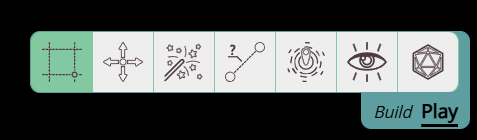

import PenSquare from "~icons/fa-solid/pen-square";
import Unlock from "~icons/fa-solid/unlock";
import Info from "/src/components/directives/Info.astro";
import Tip from "/src/components/directives/Tip.astro";
import Warning from "/src/components/directives/Warning.astro";

# Interacting with the game

It's time to actually use PA!

## Moving the map around

Let's start with the easiest stuff, moving the map.

An essential part of using any VTT is knowing how to move the camera around.

### Zooming

Zooming in/out is pretty straightforward as it's just scrolling the mousewheel.
As seen in the previous chapter, there is also a dedicated zoom slider in the top-right that you can also use.

The main difference is that the slider will always zoom in regards to the center of the screen,
whereas mouse zooming will zoom in relation to the current mouse position.

### Panning

To move the map around, you can hold down either the middle or right mouse button and move the mouse around.

<Tip>
    You can disable the button you don't intend to use to prevent accidental panning around in your Client Settings
</Tip>

You can also move around with the keyboard, by pressing any of the arrow keys the screen will pan in the provided direction.
For each press the screen will be moved 1 grid cell.

<Tip>See the [keybindings](/docs/reference/#keybindings) if you want to discover more ways!</Tip>

## Checking out the tools

Let's take a closer look to the toolbar in the bottom right.
It can take two forms depending on the **mode**, but as a player you'll almost exclusively use the play mode:

<Tip>
    1: If you don't like the abstract icons, you can change the UI to show text labels instead in your Client Settings.
     
    2: You can quickly change between the modes by pressing <kbd>tab</kbd>
</Tip>

Most interactions in PA will depend on which tool is currently active, which in the example above is the Select tool.

We'll quickly go over all the tools here, but limit the explanation to the essentials that you'll often use.
For more in-depth information check out the [Tool documentation](/docs/tools/select/).

### Select

This is by far the most common tool you'll use. It's main use is ... selecting things!

Left clicking on a shape will select it and add a red border around the shape.
If you now left-click and hold while moving the mouse, you'll be able to move the shape around.

If you select multipe shapes, you'll be able to move them all around at once!

Shocking stuff I know.

The select tool has more in store however, when you have an active selection,
a special UI in the top left will appear with quick info about the selected shape.

<Info title="Resizing / Rotating">
The select tool also has the capability to resize or rotate a character.
 
Because this is usually not something you tend to do regularly, this functionality is only visible when you're in the Build mode.
This prevents accidental resizes when you just want to drag your shape and happen to click a little bit too close to the corner.
</Info>

### Pan

The next one is a tool that is probably the least used one, as it allows you to move/pan the screen with your left mouse click.

As you can always pan from any tool with the middle or right mouse buttons,
you'll only use this tool actively when you're on a device without a mouse.

### Spell

If you ever need to temporarily add some spell effect to the board, this tool got your back.

It allows you to select some common spell shapes, configure the dimensions and place them on the map.

If you have a shape selected, a ruler is automatically tracked between the shape and the spell effect,
to ensure you're aware of the distance you're casting at.

### Ruler

Your friend if you need to measure distances.

A very straightforward tool, you click and drag a line to measure the distance in either the amount of grid cells or the in-world distance (e.g. ft or m).

<Tip>
If you hit space while dragging the mouse, a new anchor point is made, allowing you to measure around corners!
</Tip>

### Ping

Another small, but handy tool is the ping tool, which simply allows you to draw attention to a specific area on the map.

### Vision

This is a specialized tool that will only show up if you control multiple characters.

It will limit your vision to the selected characters in this tool.

### Dice

A tool that you'll either use frequently or never at all is the dice tool.

This allows you to resolve dice rolls either in a purely textual form or by actually simulating virtual 3D dice. 

### Draw

This tool is only visible when you're in Build mode!

Using this tool you can draw a variety of shapes on the map.

## Modifying your character

Something not covered yet is how you modify your character, which is of course also an important part of playing.

When you've got your character selected there are multiple ways to open the Edit UI.

- Press the <PenSquare /> icon in the quick info (top-right)
- Right click your character and click "show properties"
- Press <kbd>Enter</kbd>

Whatever you end up choosing, a bigger UI element should appear that allows you to edit multiple aspects of your character.
A lot can be configured, but don't worry, as a player the most essential tabs are the Properties and the Trackers.

### Properties

Here you can edit some essentials like your character's name and asset.

### Trackers

Here you can configure trackers & auras.

You can use trackers to well track numbers. They are purely a numeric thing, that you can optionally make visible above your character's token.

Auras on the other hand are visual, they represent things like area effects and lights.
If the aura is meant to give you vision (e.g. a torch or darkvision), make sure to toggle the "Light source".

Auras have 2 values for their range input, the first value is how many ft of bright light there should be,
whereas the second is how many ft of dim light. So a 5e torch should be 20 / 20 (and not 20 / 40!).