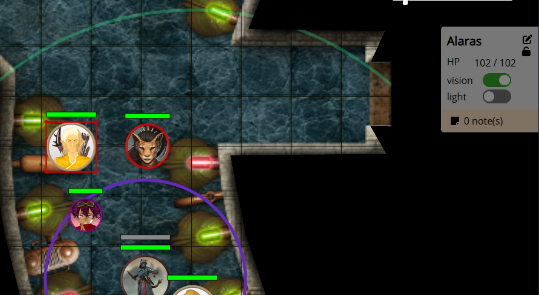
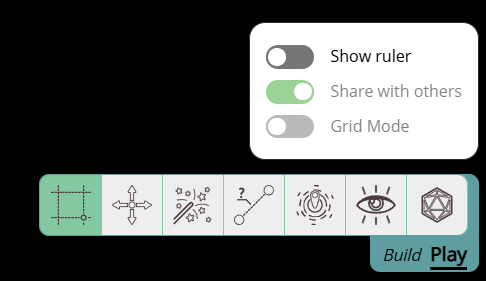
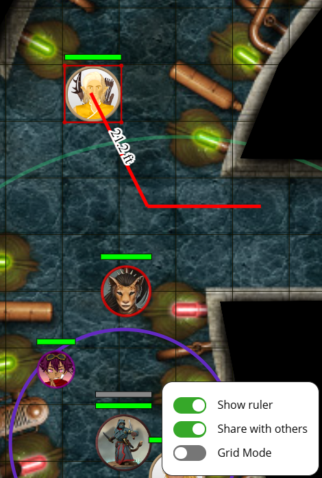

import PenSquare from "~icons/fa-solid/pen-square";
import Unlock from "~icons/fa-solid/unlock";
import Info from "/src/components/directives/Info.astro";
import Tip from "/src/components/directives/Tip.astro";
import Warning from "/src/components/directives/Warning.astro";

# Interacting with the game

It's time to actually use PA!

## Moving the map around

Let's start with the easiest stuff, moving the map.

An essential part of using any VTT is knowing how to move the camera around.

### Zooming

Zooming in/out is pretty straightforward as it's just scrolling the mousewheel.
As seen in the previous chapter, there is also a dedicated zoom slider in the top-right that you can also use.

The main difference is that the slider will always zoom in regards to the center of the screen,
whereas mouse zooming will zoom in relation to the current mouse position.

### Panning

To move the map around, you can hold down either the middle or right mouse button and move the mouse around.

<Tip>
    You can disable the button you don't intend to use to prevent accidental panning around in your Client Settings
</Tip>

You can also move around with the keyboard, by pressing any of the arrow keys the screen will pan in the provided direction.
For each press the screen will be moved 1 grid cell.

<Tip>See the [keybindings](/docs/reference/#keybindings) if you want to discover more ways!</Tip>

## Checking out the tools

Let's take a closer look to the toolbar in the bottom right.
It can take two forms depending on the **mode**, but as a player you'll almost exclusively use the play mode:

<Tip>
    If you don't like the abstract icons, you can change the UI to show text labels instead in your Client Settings.
</Tip>

Most interactions in PA will depend on which tool is currently active, which in the example above is the Select tool.

### Select tool

This is by far the most common tool you'll use. It's main use is ... selecting things!

Left clicking on a shape will select it and add a red border around the shape.
If you know left-click and hold while moving the mouse, you'll be able to move the shape around.

If you select multipe shapes, you'll be able to move them all around at once!

Shocking stuff I know.

The select tool has more in store however, when you have an active selection, 2 extra UI elements are visible.

#### Quick shape info

In the top right a small box will appear with some quick information about the selected shape.

It will list the name of the shape, and any trackers and auras it may have.

Next to the name two icons are visible, <PenSquare /> will open the shape details, this is an important one we'll go into later!
The other one <Unlock /> will lock the shape's position when toggled. It's unlikely you'll quickly need this as a player \:D

This sidebar doesn't only show things, it also allows you to quickly modify some elements.
It's for example possible to click on the HP value and modify it, or toggle the light source.

Lastly there is also a section that will list any note you may have about the shape.

#### Select configuration

The other new UI element that pops up when selecting a shape is in the bottom right, right above the toolbar.

In general UI elements shown here are related to configuration of the tool itself.
For the select tool this comes down to a series of toggles that are all related to the 'Show ruler' setting.

The ruler is a completely separate tool allowing you to measure things on the map,
it however also has a special integration with the select tool that can be configured here.

For more info on the ruler, check the ruler tool!
