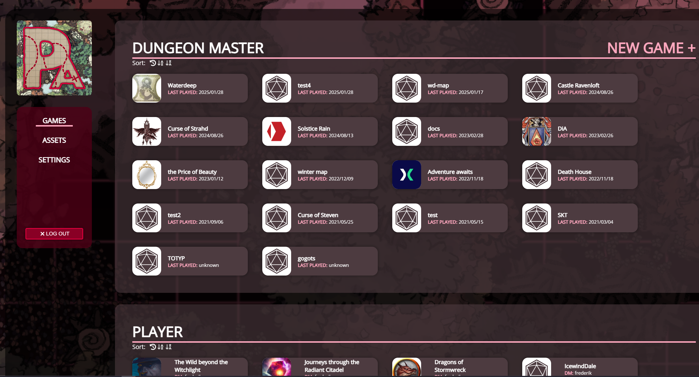
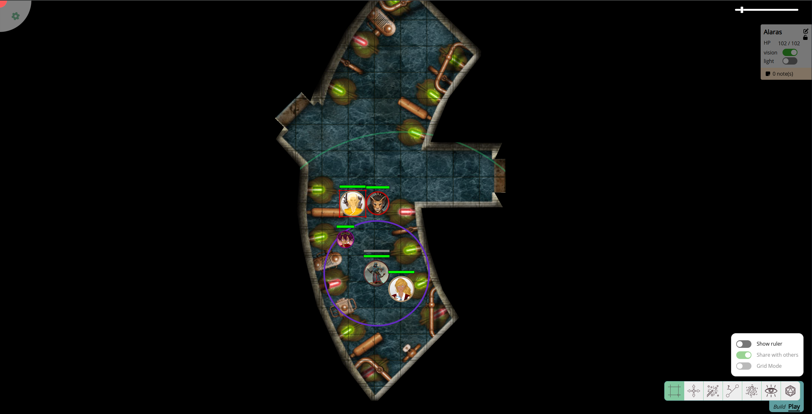

import Cog from "~icons/fa-solid/cog";
import Info from "/src/components/directives/Info.astro";
import Warning from "/src/components/directives/Warning.astro";

# Introduction

Congratulations, your group is considering PlanarAlly for your next game!
But how do you actually use it?

In this intro guide we're going to check out how to create an account, join a game and
get our toes wet by looking at the main UI elements that are visible when opening a game!

## Account Creation

<Info title="PA servers">
    There is not a single PlanarAlly server, anyone is free to host their own version and make it open or closed to
    other people. Usually someone in your group arranged on what PA server you're going to play, if not someone will
    have to read up on the [server documentation](/server/setup/) and settle on a common server.
</Info>

When you visit the chosen server host, you'll immediately be greeted with a login page.
PlanarAlly doesn't require anything special from you when you register for a new account,
just a username and a password with optionally an email address.

Currently the email address isn't used for anything in PA itself,
but a server admin might use it to inform users of upcoming downtown or the likes.

## Joining a game

When logged in, you'll be greeted with the main dashboard, it will show games you're a part of and if at a later time you decide to host a game yourself, they'll also show up here.

For a game to show up here however, you first need to be invited.

Your host will send you a URL that when visited, will automatically set up the connection with your account and put you in the game.
In the future the game will show up in your main dashboard as explained above!

## Quick intro to the UI

Once you open a game, you're immediately greeted with a variety of UI elements.

Dominating the majority of the screen is the core of any VTT, the map with tokens, vision and lighting.
Your DM will have prepared this earlier.

<Warning title="It's all black?!">
    It's possible that the only thing you see is the pure black void. But don't worry, your DM probably still has to
    give you access to a shape!

    If they've done that and you still don't see anything, try hitting <kbd>space</kbd> to recenter the screen on a token you have access to.

</Warning>

In the next chapter we'll see how we can properly interact with the map, panning and zooming it as well as moving our characters around.

Let's first introduce you to the corners of the screen, where PA puts most other prominent UI elements.

In the top-left there is a <Cog /> that will open a sidebar,
this is mostly to configure some less-used settings and also the way to leave the current game and go back to the main dashboard.

In the top-right, there is a zoom-slider to control the zoom level of the map and you also see a UI element showing info about the currently selected character.

Going further around the clock, we see a bunch of icons in the bottom right and a Build/Play toggle.
These are all related to a variety of tools that PA offers. This ranges from things like draw tools, to rulers and dice.
More about these in the next chapter!

Lastly there is the bottom-left corner, which on the screenshot above is empty.
This area is mostly reserved for DM specific things, but can show up on the player side if your DM uses a special PA feature called "floors".
Text chat will also show up here if your DM has enabled this functionality!

This quick intro only got our feet wet, let's dive in completely and see what these tools are about and how we can interact with our character [in the next chapter](/learn/player/interaction/)!
