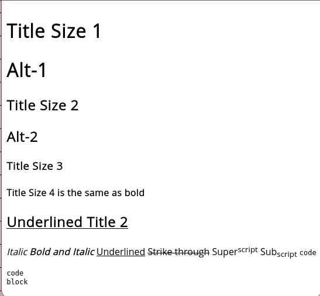
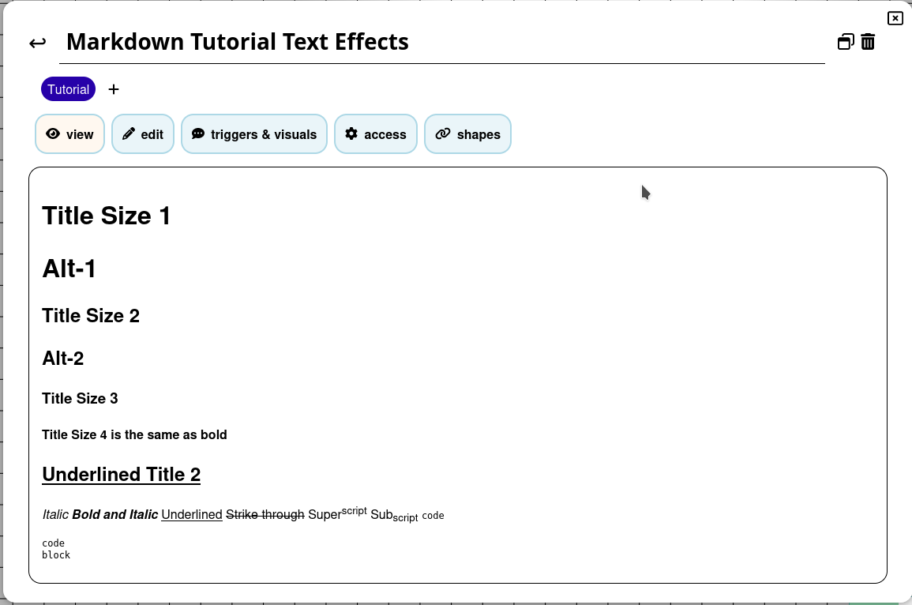
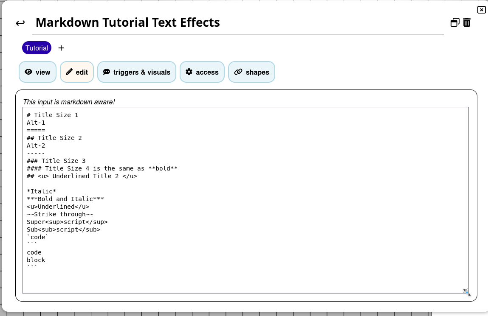
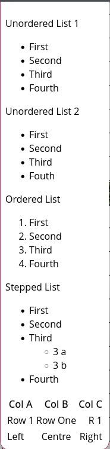
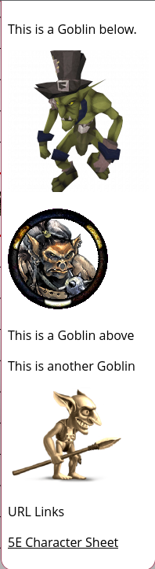
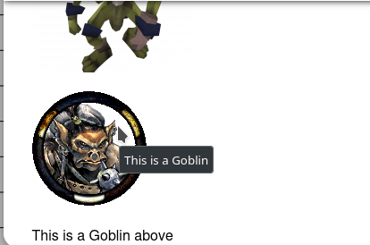

# **Markdown Tutorial Guide.**

Guide contributed by [@veritanuda](https://keybase.io/veritanuda)

This guide will specifically explore the features of Markdown formatting throughout PlanarAlly. It is used in both [Notes](../../../../docs/game/notes) fields as well as the [Chat](../../../../docs/game/chat) window.

Information in this guide was heavily sourced from this [Syntax Guide](https://markdown-it.github.io/)

## **Text Effects**

The following is an example of the Text Effects that can be applied.



In it you can see:

- Title sizes
- Text formatting
- Text styles

This is how it looks in the Notes window.



And ths is how it looks in edit mode.



The `#` character can be used to set title sizes. 1 will give the largest size `Title Size 1`

2 `#` gives the next size down `Title Size 2`

3 `#` in the next sized down still. `Title Size 3`

u4 `#` is the same as using bold type which can be done either by `**` or `__` surrounding the text. `Title Size 4`

Underlining requires HTML notation which will also work for other text effects like italic `<i> </i>` and bold `<b></b>`.

`<u>Underlined</u>`

`*` is _Italic_

`**` is **bold**

`***` is **_Bold and Italic_**

`~~` is ~~Strike through~~

`<sup> </sup>` is Super<sup>script</sup>

`<sub> </sub>` is Sub<sub>script</sub>

``is`code`

` ``` ` is

```
code
block
```

---

## **Text Layout**

The following is an example of Text Layouts



### <u>Unordered Lists</u>

Unordered lists can use either `*` or `-` to delimit items in that list.

```
Unordered List 1
* First
* Second
* Third
* Fourth
```

Unordered List 1

- First
- Second
- Third
- Fourth

```
Unordered List 2
- First
- Second
- Third
- Fouth
```

Unordered List 2

- First
- Second
- Third
- Fouth

### <u>Ordered Lists</u>

Ordered lists use `<number>.` with the numbers incrementing from the first number you specify.

```
Ordered List
1. First
2. Second
3. Third
4. Fourth
```

Ordered List

1. First
2. Second
3. Third
4. Fourth

### <u>Stepped/Multi-level Lists</u>

Stepped lists, or multi-level lists can be achieved by add a double space between each list level.

```
Stepped List
- First
- Second
- Third
  - 3 a
  - 3 b
- Fourth
```

Stepped List

- First
- Second
- Third
    - 3 a
    - 3 b
- Fourth

### <u>Tables</u>

Tables use the `|` to delimit columns while `-` and `:` are used to specify justification (optional as left justification is the default)

```
|Col A|Col B|Col C|
|--|:--:|--:|
|Row 1|Row One|R 1|
|Left|Centre|Right|
```

| Col A |  Col B  | Col C |
| ----- | :-----: | ----: |
| Row 1 | Row One |   R 1 |
| Left  | Centre  | Right |

---

## <u>Images and Links</u>

Below is and example of inline images and hyperlinks.



For **_most_** image URLs you can simply just cut and paste the image location and it should resolve the picture.

If it does not you should be able to insert inline images if you precede the item with `!` specify a tag name in `[ ]` and then the link in `( )`.

```
This is a Goblin below.


```

There is an alternative method, which can make the code cleaner, called the reference method where instead of a link to the image, you can use a reference, which in turn links to the image.

```
![Goblin][Goblin1]

This is a Goblin above

This is another Goblin

![Goblin2][Goblin2]

[Goblin1]:https://www.imarvintpa.com/Mapping/Tokens/g1/Goblin.png "This is a Goblin"
[Goblin2]:https://gamepedia.cursecdn.com/crafttheworld_gamepedia/thumb/b/be/Cave_Goblin.png/150px-Cave_Goblin.png "This is a Cave Goblin"
```

References can also supply tool tips so when a cursor hovers over an image a tool tip can be seen. These are made by quoting `" "` the tool tip text after the URL



**NOTE:** When selecting images to insert they will be scaled in the chat window but when the image is clicked it will open up to a larger version in another window.

## <u>**URL Links**</u>

URL links are the same above but without the preceding `!`

```
[5E Character Sheet](https://media.wizards.com/2016/dnd/downloads/5E_CharacterSheet_Fillable.pdf)
```

[5E Character Sheet](https://media.wizards.com/2016/dnd/downloads/5E_CharacterSheet_Fillable.pdf)

# Conclusion

Using markdown in notes or in the chat is a useful way to engage with your players and give them access to things like handouts or monster images to bring more depth to a game. From a GMs point of view managing notes on tokens for stats, special abilities, general information, locations descriptions etc can greatly ease the amount of information you need to store and reference outside of a game. This makes running a game much more fluid and frictionless.

Happy gaming!
