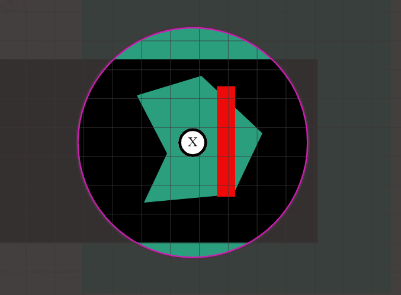

В этом релизе представлено довольно разнообразное содержимое: редизайн интерфейса, новые возможности инструментов, улучшения качества жизни и не только!

Стоит также отметить, что в релиз вошли правки от нескольких участников с дискорд-сервера, отдельное спасибо scoodle и mischievous!

## Редизайн дашборда

Начнём с одного из самых заметных изменений — с дашборда!
Дашборд — это страница, которую вы видите после входа в систему и на которой выбираете кампанию, в которую хотите играть или которую хотите вести.

Эта страница полностью переработана и теперь выглядит так:

### Меню

Левая боковая панель выполняет роль меню, которое даёт мгновенный доступ к различным представлениям.

Первый раздел меню связан со всем, что относится к игре: Play перечисляет все сессии, в которых вы участвуете как игрок, а Run — все сессии, которые вы ведёте как DM.
И наконец, опция Create позволяет создать новую кампанию.

Вторая часть связана с активами. Меню Manage откроет менеджер активов — компонент, который раньше был доступен только из игры. Опция Create здесь пока недоступна, но появится в одном из будущих релизов!

И наконец, здесь есть действия для открытия настроек и выхода из аккаунта.

Важное замечание: настройки и менеджер пока по-прежнему открываются в своих исходных компонентах, но в планах — переработать их, чтобы они вписались в этот новый интерфейс дашборда.

### Run/Play

В режимах Run и Play справа появляется вторая панель с дополнительными сведениями о выбранной в данный момент кампании.

Среди заметных новинок — возможность установить логотип (только для DM), создавать небольшие личные заметки, связанные с кампанией, видеть, когда вы в последний раз играли в этой кампании, а также действия для выхода из кампании или её удаления.

## Инструменты

### Erase floor mode (DM)

Новое дополнение к режимам рисования для DM — режим «Erase».

Этот специальный режим позволяет сделать участки текущего этажа прозрачными, чтобы вы и игроки могли видеть, что происходит на этаже ниже.

Его можно использовать для внезапных взрывов, пробивающих дыру в полу, или, возможно, вы просто забыли сделать что-то прозрачным при подготовке и хотите отредактировать это прямо в PA.

На изображении выше два этажа.
На нижнем этаже находится прямоугольник бирюзового цвета.
На верхнем этаже — все остальные фигуры.

Многоугольник, отдалённо похожий на толстую стрелку, направленную вправо, — это фигура, нарисованная в режиме Erase.
Она открывает вид на нижний этаж.

Эта фигура, как и любая обычная, является частью стопки отрисовки! Как видите, красный прямоугольник лежит поверх этого многоугольника, словно бревно, перекрывающее проём в полу. Если переместить многоугольник на передний план (или красный объект на задний), будут видны только те красные части, которые не перекрыты многоугольником!

И ещё один важный момент: при рисовании эта фигура автоматически создаётся на слое карты. Однако ничто не мешает вам переместить её на другой этаж.

### Текстовые фигуры

Довольно простое новое дополнение к инструменту Draw, доступное всем, — возможность «рисовать» текст.

Эта первая версия относительно проста: при клике левой кнопкой мыши с выбранной фигурой появляется запрос на ввод текста.
Фигуру можно поворачивать и изменять её размер, как и другие фигуры.

В будущем ожидайте дальнейших улучшений.

### Изменение размера Ping и Ruler

Нарисованные вами пинги и линейки всегда были одного размера.
Однако когда их рисовали другие игроки, их размер зависел от уровня масштабирования того, кто рисовал, а не от вашего.
Это могло приводить к тому, что на вашем экране некоторые линейки выглядели очень толстыми или очень тонкими, а пинги было трудно разглядеть.

Этот релиз меняет правила для этих фигур: теперь они всегда рисуются ровно одного размера. Уровень масштабирования — ваш или рисующего — больше не влияет на это.

### Обновление значка конуса Spell

Небольшое улучшение качества жизни: значок конуса Spell теперь представляет собой закрашенный конус.
Спасибо моему другу Jiri.

## Настройки

### Редизайн настроек клиента

Дашборд был не единственным интерфейсом, который обновился, — настройки клиента тоже получили новую отделку!

Настройки клиента больше не часть бокового меню: теперь они, как и настройки DM, открываются в модальном окне.
Это даёт больше пространства и простора для новых опций.

В рамках этого редизайна также появилась концепция настроек клиента, специфичных для кампании.
Когда вы меняете настройку, рядом с ней появляются два значка, указывающих на то, что настройка отличается от значений по умолчанию.

Левый значок сбрасывает значение к глобальной настройке, а правый делает новое значение глобальным значением по умолчанию.

В одном из следующих релизов глобальные настройки также можно будет редактировать в представлении настроек дашборда.

### Отключение масштабирования при прокрутке

Частая жалоба игроков, использующих тачпад, — желание отключить активацию инструмента Zoom при прокрутке,
поскольку на тачпаде это очень легко происходит случайно.

Эта новая опция теперь доступна в настройках клиента в разделе «Поведение»!

### Опция со-DM (DM)

Теперь вы как DM сможете повышать игроков до роли со-DM прямо из основных настроек DM.

## Фигуры

### Поверженность

В этом релизе фигуры получили лишь небольшое изменение — свойство «Поверженность».
Если установить этот флажок в свойствах фигуры или нажать `x` при выбранных одной или нескольких фигурах,
по всем затронутым фигурам будет прорисован красный крест.

_Этот вклад сделал scoodle на дискорде!_

### Визуальные полосы трекеров

Трекеры получили такое же обновление интерфейса, как ауры в прошлом релизе.
Теперь у них есть дополнительный флажок и два поля выбора цвета.

Если установлен флажок «display on token», над жетоном будет отображаться полоса в двух выбранных вами цветах.

_Этот вклад сделал scoodle на дискорде!_

## Загрузка информации о стенах (DM)

Ещё одна причина разочарования для некоторых DM — утомительная работа по отрисовке стен для системы обзора.

Этот релиз добавляет 2 опции «импорта» информации о стенах из альтернативных источников.

### dungeondraft

Dungeondraft — популярный сервис для подготовки карт перед импортом их в виртуальный игровой стол.
Он позволяет экспортировать данные в собственном формате файлов dd2vtt.

Теперь PlanarAlly понимает этот формат: когда вы перетаскиваете на игровой стол актив, представляющий собой такой файл, к нему будет прикреплена соответствующая информация.

По техническим причинам стены, двери и источники света, связанные с файлом dd2vtt, не добавляются в сцену немедленно.
Вместо этого вы можете сначала изменить размер/расположить актив так, как вам удобно, а затем загрузить всю дополнительную информацию, перейдя на вкладку «Extra» в свойствах фигуры и нажав кнопку «Apply ddraft info».

Вся информация добавляется на игровой стол в виде обычных фигур PlanarAlly, а значит, вы можете изменять их размер, удалять ненужные источники света и т. д.

### svg

Ещё один доступный теперь способ — прикрепить SVG с информацией о стенах к любому активу. Как и в случае с файлами dungeondraft, это можно сделать через вкладку «Extra» в свойствах фигуры.

**Очень важное предупреждение**: держите такие SVG-файлы простыми, иначе вы сильно пожалеете.

Эти SVG-файлы предназначены только для хранения информации о стенах, поэтому перед добавлением убедитесь, что удалили стены, фон и т. п.

И последнее замечание: эти стены неинтерактивны, они полностью внутренние для фигуры, поэтому на данный момент их нельзя изменить в размере и т. д.

## Улучшения качества жизни

### Большая красная рамка

Теперь при обрыве соединения с сервером по краям экрана будет отображаться большая красная рамка.

В зависимости от проблемы соединение должно восстановиться автоматически, но всё, что вы изменили во время разрыва, может быть потеряно.
Так было всегда, но теперь вам будет понятно, когда прогресс может быть потерян.

### Сочетания клавиш на Mac

Все сочетания клавиш, использующие клавишу `ctrl`, на компьютерах Mac теперь будут использовать клавишу `cmd`.

### Загрузка шрифтов

Шрифт OpenSans, используемый в PlanarAlly, теперь будет загружаться с сервера, а не из Google Fonts.
В противном случае при игре офлайн могли бы возникать проблемы со шрифтами.

### Анимация загрузки

Скучный спиннер заменили на эффектную 3D-анимацию трансформации игральной кости.

<video loop autoplay muted style="max-width: 680px;">
    <source src="https://app.planarally.io/static/img/loading.webm" type="video/webm" />
</video>

_Анимация сделана Jiri на дискорде_

## Сервер

### Указание публичного имени хоста

По умолчанию, когда DM показывается ссылка-приглашение в настройках DM, для определения хоста используется текущий URL браузера.
Однако если DM подключён через локальный IP или localhost, этот URL будет бесполезен для других игроков.

Новая настройка конфигурации сервера позволяет задать `public_name`, который при наличии будет всегда использоваться в качестве корневого хоста.

_Этот вклад сделал mischievous на дискорде!_

## Заметные исправления

### Дублирование имени этажа (DM)

Создать этаж с уже используемым именем больше невозможно.
Раньше это могло приводить к множеству проблем при взаимодействии с двумя этажами.

Это быстрое исправление, которое в любом случае вряд ли наложит слишком много ограничений.

### Прерывание загрузки файлов

Добавлено исправление, предотвращающее остановку загрузки больших файлов через короткое время.

_Этот вклад сделал scoodle на дискорде!_

### Привязка жетона при выходе из стены

Если при перемещении жетона вы завели курсор в стену, при возврате из стены вы могли рассинхронизироваться с фигурой.
Теперь это исправлено.

### Размещение шаблона с нестандартным размером сетки

При размещении на игровом столе фигуры с шаблоном, содержащим информацию о размере, но при нестандартном размере сетки
фигура изменяла размер неправильно.

### Отображение фигур-вариантов

При использовании экспериментальной возможности вариантов все игроки могли видеть любую фигуру-вариант в любой момент.

### Контекстное меню за пределами экрана

При открытии контекстного меню у нижней или правой границы экрана его содержимое выходило за пределы экрана.
Теперь такие меню учитывают границы и соответствующим образом подстраиваются.

### Переход назад

При переходе назад — с помощью кнопки браузера или кнопки на мыши — URL обновлялся корректно,
но ничего не менялось. Теперь это исправлено.
