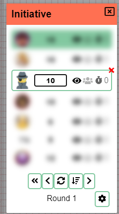

Прошло уже некоторое время с последнего релиза. Хорошая новость в том, что было сообщено мало ошибок, поэтому релиз 0.26 оказался довольно стабильным, что всегда приятно видеть. Плохая новость в том, что этот релиз может оказаться несколько более «неровным», и вскоре мы узнаем почему.

Этот релиз был в первую очередь задуман для одной цели — обновления реактивного фреймворка PA (Vue) с версии 2 до версии 3. Это очень техническое изменение, которое _в идеале_ не должно напрямую влиять на пользовательский опыт, но затрагивает много кода, поэтому я хотел выделить больше времени на проверку корректности. Я подробно расскажу о том, что влекут за собой изменения, в конце этой статьи, чтобы не отпугнуть обычных пользователей! :)

Но внутренние изменения кода — не единственное, что изменилось: инициатива получила серьёзную доработку, появились новые возможности для использования PA как физического игрового стола, а также снова были прекрасные вклады от сообщества. Итак, давайте разберёмся!

## Инициатива

Инструмент Initiative в его нынешнем виде был создан на скорую руку за пару дней после комментария на Reddit с вопросом о поддержке инициативы. Он выполнял свою работу, но у него всегда были небольшие проблемы. Наконец я нашёл время решить эти нерешённые проблемы и переосмыслить часть функциональности инициативы.

### UI/UX

Одна из проблем заключалась в том, что интерфейс мог быть перегруженным. Особенно для игроков, которые всегда видели кнопки администратора, но не могли никак с ними взаимодействовать.

#### Панель DM

Действия, доступные только DM, были перенесены в отдельную «панель DM» и будут видны только DM и со-DM.

#### Настройки

Вместе с этим значки блокировки камеры и обзора были перенесены в настройки клиента, которые можно открыть с помощью небольшой иконки-шестерёнки. Это также решает «ошибку», из-за которой людям, часто использующим эти настройки, приходилось каждый раз применять их заново.

#### Удаление

Ещё одно заметное изменение — убрана корзина из значков каждого участника инициативы. То, что не _так_ важно видеть постоянно, занимало лишнее место. Вместо неё теперь при наведении на участника инициативы в правом верхнем углу появляется небольшой красный крестик.

#### Поле ввода

Наконец, самому полю ввода добавили больше ширины. Теперь у него есть пространство для «дыхания»! Изменился и стиль: оно больше не выглядит странным полем ввода, а выглядит как «обычный» элемент модального окна.

При вводе инициативы вы можете потерять фокус на поле ввода, если кто-то другой одновременно изменяет значения, из-за чего инициативы «прыгают». Раньше эта проблема решалась ожиданием обновления окна инициативы до тех пор, пока вы не отправите своё изменение. Однако не было никакого указания на то, что значения не синхронизированы, если вы всё ещё держите фокус на поле ввода. Это не идеально, поскольку очень непонятно и может привести к путанице. Поэтому в новом окне инициативы все остальные строки будут размыты, пока вы держите фокус на поле ввода, чтобы наглядно показать, что вы выполняете ещё не завершённое действие.

И последнее улучшение качества жизни: теперь нажатие `enter` тоже работает в полях ввода инициативы :) .

### Поведение

Вторая проблема старой инициативы заключалась в том, что сортировка могла «застревать»: порядок инициативы переставал обновляться или обновлялся неправильно. Структура данных, отвечавшая за это, была изменена и теперь должна работать корректно всегда.

Панель DM инициативы тоже получила новые возможности:

Теперь можно вернуться назад, если вы случайно пропустили кого-то или чей-то ход не был завершён. Также теперь можно очистить все значения инициативы. Это позволяет объявить новую инициативу и увидеть, кто ещё не обновил своё значение, тогда как иначе вы могли бы не быть уверены, новое это значение или старое.

#### Сортировка

Наконец, теперь можно активно менять поведение сортировки. Доступны три варианта: по убыванию, по возрастанию и вручную. Если перетаскивать записи инициативы, сортировка автоматически переключится в ручной режим, если только вы не поменяли местами двух участников с одинаковым значением инициативы.

## Копирование локаций

_Вклад: CalebKoch_

Эта удобная возможность позволяет DM копировать локацию в другую сессию. Концепция довольно проста, но экономит много работы, если вы ведёте одну и ту же кампанию для нескольких групп и не хотите заново создавать всю карту и заново рисовать туман войны!

DM может получить к ней доступ через настройки локации, которую хочет скопировать. В диалоговом окне будут показаны все ваши кампании.

## Игровой стол

Отчасти это было запросом от людей из Last Gameboard, с которыми я сотрудничаю, чтобы принести PA на их платформу, но у этой функции есть и общее применение!

В большинстве случаев PA используется чисто как цифровое решение для настольных игр. В этом контексте в первую очередь важно, какой размер в пикселях должна иметь ячейка сетки.

В некоторых случаях PA используется как расширение «традиционной» физической игры, и тогда PA выступает в роли более традиционного игрового стола с дополнительными возможностями. В этом контексте ввод размера в пикселях напрямую менее интересен, а вот возможность ставить миниатюры на стол важна.

Теперь можно задать размер сетки в физическом контексте, указав размер миниатюр и PPI (иногда называемый DPI) экрана. Одно из следствий этого — зум теряет смысл, поэтому пока он работать не будет.

## Область просмотра

Будучи DM, вы иногда имеете собственный экран DM, но также управляете другим экраном, который показывает, что видят игроки. В этом контексте может быть утомительно переключаться между экранами/устройствами, чтобы управлять камерой игроков.

Новинка этого релиза — возможность показывать активную область просмотра игроков. В настройках администратора можно включить область просмотра для отдельных игроков.

Каждая область просмотра будет отображаться на слое DM как прямоугольник без заливки, граница которого показывает точную область, которую игрок смотрит в данный момент.

Кроме того, DM может перемещать каждую область просмотра, напрямую панорамируя экран соответствующего игрока.

<video autoplay loop muted style="max-width: min(680px, 75vw);">
    <source src="/blog/release-0.27/viewport.webm" type="video/webm" />
    <source src="/blog/release-0.27/viewport.mp4" type="video/mp4" />
</video>

_извините за артефакты, а тем, кто узнает изображение на фоне, — дополнительные баллы ;)_

## Улучшения качества жизни

На этом основные изменения заканчиваются, но было сделано и много приятных улучшений качества жизни!

### Синхронизация меню активов

Боковая панель меню активов, пока доступная только DM, никогда не обновлялась в реальном времени, когда в менеджер активов добавлялись новые активы. Это доставляло мне и многим другим много неудобств: каждый раз приходилось перезагружать страницу после добавления новых активов.

Больше нам не нужно терпеть это — теперь панель обновляется в реальном времени вместе с изменениями в менеджере активов!

### Редактирование текстовых значений фигур

У некоторых фигур (например, Text и CircularToken) есть связанное текстовое значение. Раньше это значение можно было задать только при создании фигуры, и после этого его нельзя было изменить.

В диалоги редактирования этих фигур была добавлена новая строка 'value' на вкладке свойств.

### HiDPI/Retina

Как вы, возможно, видели на более раннем скриншоте, в настройках клиента появилась новая вкладка «Дисплей». Она также содержит переключатель поддержки экранов HiDPI и retina. Это должно сделать всё более чётким!

**предупреждения**:

- Вашему компьютеру тяжелее отрисовывать изображение
- Были сообщения о том, что при включённой настройке зум/панорамирование ведёт себя странно, так что будьте осторожны!

### Снятие выделения по ctrl

Клик по фигурам с зажатым ctrl позволяет добавлять отдельные фигуры в активное выделение. Другие инструменты обычно также поддерживают клик по уже выделенным фигурам с зажатым ctrl, чтобы снять выделение. Теперь это тоже поддерживается.

### Подтверждение исключения игрока

Теперь при исключении игрока сначала будет запрашиваться подтверждение :)

## Сервер

### API-сервер теперь отключён по умолчанию

API-сервер — очень специфичная возможность, и раньше она была включена по умолчанию, из-за чего требовался дополнительный открытый порт. Теперь она отключена по умолчанию, чтобы предотвратить загадочные сообщения об ошибках у тех, кто запускает PA в контейнерах с открытым только основным портом.

### public_name закомментирован по умолчанию

_вклад: dthv_

Небольшое улучшение качества жизни, которое даёт понять, что это необязательная возможность.

### Изменения в Dockerfile

_вклад: jirsat_

Очистка некоторых неиспользуемых зависимостей и добавлена поддержка ARM в dockerfile.

## Исправления

- Ошибка, из-за которой этажи и освещение на верхних этажах не обновлялись
- Перестановка этажей отображалась неправильно до перезагрузки
- Redo не работал на Mac
- Полосы трекеров с отрицательными значениями показывали полосу, уходящую влево
- Со-DM не видели приватные инициативы
- Удаление последнего этажа давало пустой экран
- Удаление этажей под активным этажом давало пустой экран
- Была возможность задать значение &lt; 1 для unitSize

## Детали переработки клиента

Как уже говорилось во введении, PA теперь использует Vue 3, который ввёл Composition API, более дружелюбный к TypeScript.

Весь код интерфейса был полностью переписан под использование этого нового API. Кроме того, все «хранилища» были переписаны на собственный очень простой API состояния, который лучше соответствует моим потребностям. Это позволило мне отрефакторить много кода, который раньше был разбросан по чистым ts-файлам и связанным хранилищам.

Ещё одно приятное преимущество Vue 3 — поддержка Map и Set в реактивных контекстах, что значительно улучшило некоторые области, где мне приходилось работать с данными, подобными Map, не самым идеальным образом.
