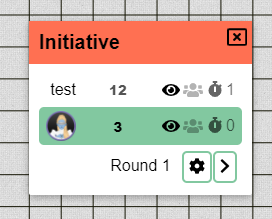
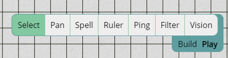

Прошлый релиз был большим техническим изменением, и я рад, что переход прошёл довольно гладко — ничего серьёзного не сообщали о поломках. Этот релиз приносит ещё одно техническое изменение: система сборки js меняется с vue-cli (webpack) на vite (esbuild + rollup). Это изменение не должно почти никак повлиять на конечных пользователей, но значительно ускоряет время сборки!

Помимо технического изменения, добавлены некоторые улучшения качества жизни, прибито изрядное количество багов, а главная новая возможность — это настройка цвета фона или повторяющегося изображения для этажа.

## Изменения этажей

UI этажей был слегка сокращён: в нём больше не показываются иконки редактирования и корзины. Вместо них теперь есть шестерёнка, которая в PlanarAlly повсеместно обозначает настройки.

Переименование и удаление этажей теперь выполняется через новый UI настроек этажа.

Если вы знакомы с этажами, вы заметите две новые настройки.

_Фон заслуживает собственного раздела и будет подробно объяснён ниже._

Этот релиз вводит понятие типов этажей, состоящее из предустановленного списка опций: underground/ground/air.

Настройки этажа можно задавать на уровне конкретного этажа, как показано в UI выше, но их также можно будет настраивать на уровне локации или кампании — в зависимости от типа этажа.

Сейчас тип этажа влияет только на настройку фона. В будущем я планирую добавить автоматические улучшения производительности в зависимости от типов этажей (например, не рендерить нижние этажи, если вы находитесь на первом).

Это пока ещё идея, которую я обдумываю; возможно, в будущем я уберу понятие типов этажей и заменю его настройками рендеринга для каждого этажа.

## Заполнение фона

В большинстве случаев DM подготовит карту для исследования игроками.
Однако иногда может случиться импровизированное побочное исследование, или игроки выйдут за границы вашей карты, потому что нашли какой-то эксплойт.

В таких случаях они будут перемещаться по белому фону по умолчанию, а это может быть довольно скучно. Другие карты и изображения, конечно, может добавить DM, но иногда хочется просто чем-то заполнить пустоту.

Как уже намекалось ранее, теперь можно настроить фон для этажа — либо для конкретного этажа, либо для всех этажей одного типа.

### Простой цвет

Самый простой вариант — задать один цвет в качестве цвета фона.

Это может быстро улучшить погружение, придав травянистый вид с минимальными усилиями.

### Узоры

Однако также можно задать изображение в качестве фона, которое будет повторяться во всех направлениях. Это позволяет использовать бесшовные тайлсеты.

При указании изображения можно изменить смещение и масштаб узора.

Смещение — это значение в пикселях, на которое узор сдвигается относительно сетки.

Масштаб — это процент, влияющий на размер узора.

## Улучшения качества жизни

### Инициатива

Релиз 0.26 переработал UI инициативы, а этот релиз добавляет небольшое улучшение этого макета: игроки теперь могут продвигать ход инициативы, если в данный момент действует персонаж, которым они владеют.

### Панель инструментов

Частая причина путаницы — система режимов панели инструментов и, в частности, какой режим активен. В прошлых релизах активный режим показывался в правой части панели инструментов с отображением первой буквы его названия. При наведении на букву показывалось полное название.

Многие никогда не были уверены, показывает ли она активный режим или режим, который активируется при клике.

Этот релиз устраняет эту путаницу: теперь под панелью инструментов показываются все возможные режимы, а активный выделен.

### Помощник рисования

Потеря инструмента Draw из виду — ещё одна часто звучащая жалоба.
Очень небольшое улучшение, добавляемое в этом релизе, — тонкая контрастная обводка вокруг кисти, чтобы кисть не сливалась с фоном, если она того же цвета.

Это ни в коем случае не полное решение проблемы потери кисти из виду, но это первый маленький шаг.

Я думаю о добавлении круга большего размера вокруг кисти, если кисть меньше определённого размера, но пока не уверен, понравится ли людям такое.

## Исправления

### Палитра цветов

Палитра цветов больше всего пострадала от технических изменений в прошлом релизе, так как изначальный компонент, который я использовал, ещё не был доступен для vue3, поэтому я сделал собственную версию.

Этот релиз исправляет:

- Удержание фокуса на насыщенности при нажатой кнопке мыши
- Увеличение высоты ползунков
- Исправление отсутствия движения при первоначальном клике по ползунку оттенка
- Возврат шахматного фона
- Показ cursor\:pointer при наведении на ползунок

### Аннотации

Компонент markdown был ещё одним, ещё не портированным на vue3. Однако для этого компонента я нашёл другой инструмент с открытым исходным кодом, обеспечивающий поддержку markdown в vue3.

Однако по умолчанию он отключал некоторые настройки рендеринга, к которым мы привыкли в старом компоненте. В частности, теперь снова рендерится набор HTML-изменений.

### Другое

#### Инструмент Draw

Курсор инструмента Draw не сразу обновлял свой цвет при выборе другого цвета.

#### Инициатива

Переупорядочивание записей инициативы вызывало ошибки, если у одной из записей ещё не было значения.

#### СоДМ

Больше невозможно снять статус DM у создателя кампании, как и исключить создателя.

#### Ассеты

С введением экспериментальной поддержки svg был внесён баг, из-за которого свойства «blocks vision» и «blocks movement» ассетов (т.е. загруженного пользователем контента) перестали работать.

#### Заметки

При смене локации раздел заметок очищался.
