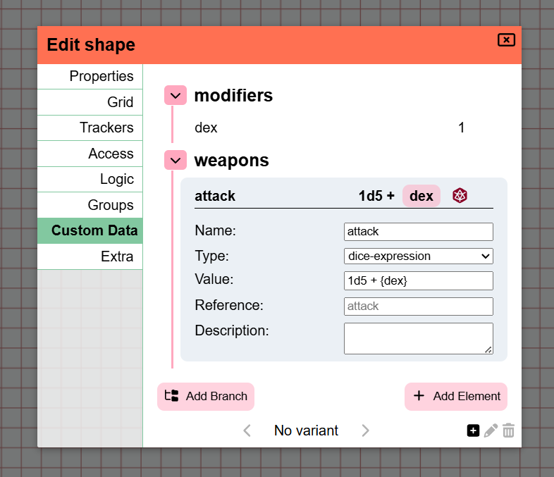

import Info from "/src/components/directives/Info.astro";
import Warning from "/src/components/directives/Warning.astro";

В этом релизе есть кое-что интересное! Вот основные моменты:

- Обновления UI/UX для Initiative и Notes
- Исправления копирования/вставки и похожих систем
- К фигурам добавлена новая концепция «custom data», которая, среди прочего, позволяет создать простой лист персонажа

<Info title="Уведомление об устаревании">
    Функциональность вариантов будет упрощена в 2026.2, подробнее см. [Variants](#variants).
</Info>

Изначально этот релиз планировался на ноябрь/декабрь, но технические доработки (см. ниже) потребовали больше времени, чтобы довести стабильность до ума.

В этом релизе также есть вклад от разных людей — спасибо всем вам, а также всем, кто сообщал об ошибках на ветке разработки!

<Warning title="Изменения в конфигурации сервера">См. [раздел о сервере](#server-changes)</Warning>

## Initiative

_Эти изменения внесены участником Rexy712_

Как уже упоминалось во вступлении, интерфейс получил ряд обновлений, как видно ниже.

Теперь у него также есть внутренняя прокрутка при переполнении,
чтобы сам элемент инициативы не становился гигантским, если в инициативе много участников.

Ещё одно нововведение: при добавлении эффектов теперь можно сделать эффект бесконечным по времени,
раньше всегда нужно было указывать количество ходов, по истечении которых он исчезал.

Теперь у DM также есть возможность одним действием очистить всю инициативу целиком,
а также кнопки для перевода инициативы на полный круг.

## Основы листа персонажа

### Почему

Одна из жалоб, которые я время от времени получаю, касается отсутствия листов персонажей.
Я всегда считал, что создать универсальный лист персонажа, подходящий для всех систем и случаев, практически невозможно,
а потому листы персонажей лучше реализовывать в виде модов.

Однако моды всё ещё очень экспериментальны, требуют технических знаний для создания,
и, будем честны, PA — очень нишевый VTT.
Неудивительно, что в этой области до сих пор не появилось никаких наработок.

Я по-прежнему считаю, что по-настоящему красивый лист персонажа «под всё сразу» вряд ли возможен,
но я решил создать более простую систему, интегрированную с системой кубиков.
Так моды смогут за кулисами использовать этот общий базовый механизм, предлагая при этом более привлекательный интерфейс.

### Как

Этот релиз добавляет новую вкладку в интерфейс «редактирование фигуры», которая называется «custom data».

Здесь можно свободно добавлять данные, связанные с фигурой. Данные можно организовывать в древовидном формате.

Сейчас добавляемые данные могут быть одного из 3 типов:

- текст
- число
- выражение кубиков

Большинство из них довольно очевидны. Приятная особенность выражений кубиков в том, что инструмент кубиков можно сразу загрузить с заданным выражением,
которое может ссылаться на другие элементы custom data, кратко — ссылки (references).

Кроме того, эти ссылки можно использовать непосредственно в инструменте кубиков — при этом появится интерфейс автодополнения, помогающий выбрать характеристику из нужной фигуры.

Ещё одно дополнение к инструменту кубиков: для каждой фигуры в вашем выделении, у которой есть выражения кубиков, теперь присутствует быстрая кнопка.
Благодаря этому не нужно постоянно открывать настройки фигуры, переходить на вкладку custom data и нажимать кнопку броска для нужного результата.

### Будущее

Цель — обновить и другие места, чтобы они тоже взаимодействовали со ссылками.
Трекеры и ауры — одни из самых очевидных мест, которые могли бы выиграть от такого взаимодействия.
(например, трекер HP, связанный со ссылкой на HP)

Ещё я очень хочу создать мод с листом персонажа под конкретную систему как достойную демонстрацию возможностей.
Однако для меня здесь есть большая проблема с лицензиями и правами.

Для многих систем не разрешено, либо требуются контракты, чтобы официально предлагать такие вещи.
Например, к D&D я в этом вопросе подхожу очень осторожно — несмотря на наличие SRD,
его владельцы не слишком гостеприимны к сторонним решениям, ведь у них есть собственные инструменты.
Аналогично я связывался с командой Mothership, чтобы узнать, что возможно, но получил ответ, что сейчас интеграции с VTT не разрешены.
Система Wildsea очень открыта, и я даже начал работу над модом для Wildsea в репозитории примеров модов,
но моя главная проблема в том, что эта система — одна из немногих, для которых я вообще не использую VTT,
так что это выглядит немного нелепо.

Так что я не совсем уверен, что делать дальше, — это ситуация в духе «как ни сделаешь, всё плохо»:
юридически я мало что могу, но люди, похоже, хотят интеграций.

## Notes

В релизе [2024.1](/ru/blog/release-2024.1) была представлена масштабная доработка системы заметок.
Она добавила единую структуру и лучший интерфейс вокруг разрозненных концепций, существовавших ранее.

Была введена концепция, согласно которой заметка либо глобальная (доступна во всех ваших кампаниях), либо привязана к локации кампании.
Идея в том, что обычно есть заметки, специфичные для вашей игры (локальные), и заметки, которые нужны часто, например стат-блоки (глобальные).
Можно переключаться между локальными/глобальными или обеими, а также использовать фильтры, например «показывать только заметки для текущей локации».

Спустя 2 года самое время заново оценить, как я отношусь к этой системе, и изменить то, что ощущается неправильным.

### Проблемы текущей системы

#### Заметки кампании

Одна из проблем, с которой я часто сталкиваюсь, — я создаю много заметок, актуальных только для конкретной локации.
Это значит, что, находясь в локации X, я вижу либо все заметки для всех локаций своей игры, либо только заметки для текущей локации.

На бумаге это звучит нормально, однако на практике у меня есть и заметки, актуальные для всей кампании и только для неё.
Проблема в том, что каждая заметка по умолчанию привязана к локации, в которой создана, поэтому такие кампанийные заметки трудно найти.
Если отфильтровать заметки по текущей локации, кампанийные заметки больше не видны (если только они случайно не были созданы в текущей локации); если не фильтровать — видно миллион заметок, и уследить за чем-либо сложно.

Кроме того, фильтр по активной локации спрятан за дополнительным меню, из-за чего частое переключение становится довольно утомительным.

#### Заметки фигур

Ещё одна странность: поскольку заметка привязана к локации, где создана, возникают неудобные ситуации, когда заметка прикреплена к фигуре, а фигура переезжает в другую локацию.
Из-за этого заметка не всегда появлялась в правильных местах.

#### Глобальные заметки

Как уже говорилось, глобальные заметки закрывают нишу для заметок, которые могут часто понадобиться. В моём первоначальном замысле это были в основном стат-блоки монстров или правила системы.
После этого несколько человек упомянули, что иногда у них бывают заметки, актуальные для нескольких кампаний, потому что в них фигурируют одни и те же (Н)ИП.

Однако проблема в том, что для глобальных заметок настройка доступа требует больше усилий: поскольку они не принадлежат конкретной кампании, PA не знает, каких игроков предлагать.
Поэтому каждого игрока приходится вручную привязывать к каждой такой заметке, что довольно быстро становится утомительным.

#### Заметки локаций

Последняя досадная мелочь: поскольку выбор есть только между «все локации» и «текущая локация», чтобы быстро заглянуть в заметку из другой локации, приходится либо полностью менять локацию, либо просматривать все заметки.
Второй вариант возможен или нет в зависимости от того, помните ли вы заголовок.

### Что меняется

Итак, с учётом этих болевых точек в этом релизе переработаны некоторые концепции.

#### Отказ от глобальных/локальных заметок

Разделение на локальные и глобальные заметки в итоге не сработало так, как я ожидал изначально.
На деле заметки сильно различаются по использованию и могут быть актуальны для 1 локации, для нескольких локаций в разных кампаниях или вообще не привязаны к конкретной кампании.

Поэтому теперь акцент сделан на привязке конкретной кампании и/или локации к заметке.
При создании заметки теперь сразу выбирается, будет ли её основное назначение кампанийным, привязанным к локации или без конкретной привязки,
но при этом можно связать с ней любую другую локацию.

#### Интерфейс фильтра

Вместо запутанной панели настроек и полосы фильтра по тегам поиск/фильтр переработан в активную полосу фильтра, которая всегда доступна сразу и позволяет показывать заметки из локаций, в которых вы сейчас не активны.

#### Пагинация на стороне сервера

Момент, о котором не упоминалось в болевых точках: до сих пор пагинация заметок полностью выполнялась на стороне клиента.
Это значит, что при загрузке кампании клиенту должны были передаваться все заметки.
Так было легко быстро получить рабочую версию, но это лишь увеличивает нагрузку и на время запуска, и на базу данных,
хотя на практике вы обычно не взаимодействуете с большинством заметок.

Теперь заметки запрашиваются с сервера только тогда, когда действительно нужны.

Интерфейс пагинации также переехал в левый нижний угол и стал визуально понятнее.

#### Теги

Раньше можно было добавлять к любой заметке теги в произвольной форме. Однако не было никаких удобств для управления тегами.
При добавлении тега в новую заметку приходилось точно помнить, как вы вводили его в прошлый раз, ведь не было ни выпадающего списка, ни автодополнения, ни поиска.

Этот релиз меняет подход: теперь теги должным образом хранятся в отдельной коллекции базы данных, а не как случайные JSON-данные, прикреплённые к заметке.
Это позволяет интерфейсу показывать существующие теги при редактировании заметки, а также отображать их в полосе фильтра.

<video autoplay loop muted style="max-width: min(680px, 75vw);">
    <source src="/blog/release-2026.1/notes-tags.webm" type="video/webm" />
    <source src="/blog/release-2026.1/notes-tags.mp4" type="video/mp4" />
</video>

.

## Variants

### Исправления прав доступа

_внесены участником Rexy712_

Способ настройки доступа и прав для фигур-вариантов не позволял не-DM участникам изменять некоторые их аспекты.
Были внесены следующие исправления:

- Игроки теперь могут добавлять варианты к фигурам, к которым у них есть доступ на редактирование
- Игроки теперь могут переключаться между вариантами фигур, к которым у них есть доступ на редактирование
- [тех.] Права доступа вариантов теперь основываются только на правах родительской фигуры

### Анонс переработки

Сейчас варианты реализованы довольно сложным образом.
Для каждого варианта существует реальный экземпляр фигуры, а также скрытая управляющая фигура, отвечающая за отображение правильной фигуры и управление состоянием и взаимодействиями всех вариантов.

Положительная сторона в том, что каждый вариант можно полностью настроить под любые нужды. Все настройки фигуры уникальны для конкретного варианта, что даёт полную творческую свободу.

Однако у этого есть и множество недостатков.

- Любую концепцию, которая должна быть общей для вариантов, приходится дублировать. Любое изменение, которое может затронуть все варианты, нужно вносить во все варианты.
    - Исключение — трекеры/ауры, для которых была добавлена специальная система, делающая их общими.
- Всей кодовой базе приходится выполнять дополнительную логику только ради этой нишевой концепции, ведь то, как управляются фигуры, влияет на множество взаимодействий
    - Это добавляет дополнительную нагрузку на каждую другую возможность, чтобы та корректно работала с потенциальными фигурами-вариантами
- Поскольку они работают не так, как подавляющее большинство фигур, в них часто появляются едва заметные проблемы

На деле полная творческая свобода для каждой фигуры не стоит всех этих хлопот, а в большинстве случаев она и вовсе не нужна.
По своей сути идея вариантов — просто быстро переключаться между несколькими арт-активами, возможно, с небольшими отличиями.

Небольшие отличия, которые, как я вижу, действительно могут пригодиться, — это размер жетона, возможно, другое имя и некоторые трекеры/ауры.

Я намерен свести всю сложность с несколькими фигурами и переключением между ними к одной-единственной фигуре.
У этой 1 фигуры появится новая вкладка для управления вариантами, где можно будет добавлять новую запись с иконкой и именем.

И всё. Для трекеров и аур это также означает, что специальную концепцию «общего» можно убрать.
Мои изначальные планы — не предлагать особых взаимодействий для трекеров/аур, а просто позволить пользователю включать/выключать трекеры и ауры по мере необходимости при смене вариантов.
Если это окажется слишком обременительным, я готов рассмотреть добавление специфичной логики переключения для трекеров/аур на новой вкладке вариантов.

Это также означает, что UX в целом улучшится, ведь сейчас при нескольких настроенных вариантах нельзя напрямую загрузить конкретный.
Приходится перебирать их все, и при этом они на мгновение становятся видны всем игрокам, которые видят фигуру.

<Warning>
    Это изменится в 2026.2. Если у вас есть опасения или проблемы с этим изменением, свяжитесь со мной, чтобы мы
    посмотрели, что можно сделать.
</Warning>

## Исправления привязки к сетке

_внесены участниками Rexy712 и Craftidore_

Внесено множество исправлений в поведение привязки.

### Взаимодействия с клавиатурой

Перемещение с клавиатуры теперь тоже привязывается к ближайшей ячейке сетки (когда привязка актуальна).
Раньше этого не происходило, из-за чего возникали странные случаи, когда фигура оказывалась вне сетки, потому что на пути один раз коснулась стены.

Кроме того, исправлена ошибка, из-за которой перемещение фигуры с клавиатуры срабатывало дважды, если во время перемещения в инструменте Select была включена линейка Ruler.

### Горизонтальный и вертикальный размер

В [2024.2](/ru/blog/release-2024.2#shape-grid-size) был добавлен больший контроль над размером фигуры в контексте сетки.
Теперь пользователь может указать, насколько крупной фигура должна быть на сетке при перемещении, независимо от фактического размера изображения.
Также показывался расчётный размер, который, по мнению PA, имеет фигура.

Этот релиз добавляет дальнейшие улучшения, разделяя это свойство размера на горизонтальную и вертикальную составляющие (для квадратных сеток).
Это исправляет некоторые случаи поведения привязки, когда фигура нерегулярна (например, 2x7).

## Технические доработки

### Улучшения дублирования данных

PA прошла через несколько технических рефакторингов, исправивших ряд давно открытых проблем,
которые я не мог устранить до этих изменений.

В частности, было изменено две вещи:

- Как промежуточные данные фигуры представлены в клиенте
- Как (фигурные) шаблоны хранятся в базе данных

Не буду утомлять вас техническими деталями, но результат таков: у следующих действий был общий набор ошибок, которые теперь должны работать корректно

- undo/redo удаления фигуры
- копирование-вставка фигуры
- размещение шаблона на игровом столе

Все эти 3 системы существовали и работали (в какой-то степени). Однако все они не умели работать с информацией фигуры, которая хранится в более специализированных местах.
Например, заметки хранятся в отдельной коллекции базы данных, из-за чего undo/redo забывали о связи заметки с фигурой, а копирование-вставка тоже ничего о ней не знала.

Вместо добавления особых случаев повсюду новая структура устроена так, что упомянутые 3 системы вообще не должны знать деталей — всё просто работает.

### Шаблоны активов

#### Изменения в хранении

Шаблоны активов — удобная система, позволяющая сохранить данные, связанные с определённым активом,
чтобы при размещении этого актива на столе в будущем они были предзаполнены. (например, запоминание HP/AC для гоблина)

Помимо проблем, упомянутых в предыдущем разделе, у шаблонов были и другие неполадки.
Из-за того, как они хранились в базе данных, на них не распространялась ни одна миграция базы данных на новую версию.

Это значит, что шаблоны, созданные в более ранних версиях, могли некорректно вести себя при использовании в новой версии.

Теперь они будут храниться в базе данных как обычные фигуры, что обеспечивает автоматическую миграцию, а также делает некоторую внутреннюю логику более согласованной.

#### Иконка в менеджере активов

Это не техническая доработка, но связано с шаблонами активов.

Менеджер активов теперь показывает иконку на тех активах, у которых есть данные шаблона.
Это помогает, если у вас есть несколько активов с одинаковым именем (из-за разных коллекций или тому подобного) и
вы не уверены, по какому из них сохранили информацию.

### Обновление Pydantic

Это чисто техническое обновление библиотеки проверки данных, используемой сервером.
Однако оно существенно влияет на поток данных, и хотя для игроков не должно быть никаких заметных изменений,
всегда возможно, что я упустил какие-то случаи, вызывающие ошибки на сервере.

Я упоминаю об этом в основном для владельцев серверов,
чтобы при появлении ошибок проверки в логах сервера
они как можно скорее сообщали об этих проблемах!

## Исправления ошибок

#### Несогласованность порядка фигур

Чтобы гарантировать визуально корректный порядок перекрывающихся фигур,
сервер ведёт учёт позиции для каждой фигуры.
При перемещении фигуры позиции некоторых фигур приходится корректировать, так как они могли сдвинуться вверх или вниз.

Хотя это долгое время работало достаточно хорошо,
сейчас нет реальной коррекции ошибок,
поэтому если где-то по какой-то причине что-то сбоит и в порядке возникает пропуск или дублирующаяся запись позиции,
это может привести к странному поведению.

Постоянно проверять целостность порядка было бы слишком дорого,
поэтому вместо этого я занялся поиском места, где несогласованность можно легко проверить и которое не запускается часто.

Отныне при выполнении действия «переместить фигуру на задний план»
будет проверяться, совпадает ли количество обновлённых фигур с ожидаемым.
Если нет, все фигуры будут переразмещены, а всем подключённым клиентам появится уведомление,
объясняющее проблему и просящее обновить страницу, чтобы гарантировать визуальную корректность.

Кроме того, запрос обновления позиции был улучшен с точки зрения производительности,
хотя вы, скорее всего, этого не заметите.

## Изменения на сервере

### Ведение логов

_внесено участником nwhansen_

Поведение ведения логов теперь можно настраивать через конфигурацию сервера.

Это позволяет владельцу сервера выбирать, сохранять ли файловые логи и какой уровень серьёзности фиксируют различные логгеры.

Подробнее см. [документацию по конфигурации](/ru/server/management/configuration/#logging).

<Warning title="Изменения в конфигурации сервера">
    С этим изменением ведение логов по умолчанию идёт только в stdout, то есть файлового логирования, как до этого релиза, больше нет.

    Кроме того, настройки логов «max_log_backups» и «max_log_size_in_bytes», которые изначально находились в разделе «general» конфигурации, теперь перенесены в раздел файлового логирования.
    Если они были у вас явно настроены, ваш сервер больше не запустится!

</Warning>

## Прочее

- Изображения направления жетонов за пределами экрана выходили за границы своего контейнера
- Игнорирование сочетаний клавиш в элементе select
- Амперсанд в названии кампании ломал игру
- Исправления повёрнутых полигонов
    - разрезание
    - перемещение точек
- Создатель кампании больше не может изменить свою собственную роль или исключить себя
- Перекрытие текста в настройках аккаунта при небольших размерах области просмотра
- Перемещение специальных фигур показа/скрытия со слоя тумана войны могло приводить к нишевой ошибке
- Ползунок поворота не показывал текущее значение в текстовом поле при загрузке компонента
- Файлы DDraft больше нельзя загружать в менеджер активов
- Наведение на запись инициативы, которая входит в группу, но не отмечена как групповая, подсвечивало всех участников группы
- Лог ошибок об областях просмотра на сервере
- Переключение Initiative выключало взаимодействия блокировки обзора
- Шестерёнка Initiative не открывала вкладку Initiative в настройках клиента
- Записи инициативы оставались размытыми, если сфокусированную запись удалял другой игрок
- Система групп не очищалась должным образом при смене локаций
- Значки групп не сортировались по числовому порядку в настройках групп фигуры при наборе символов «цифры»
- Ввод трекера сбрасывается к последнему значению, если поле оставить пустым
