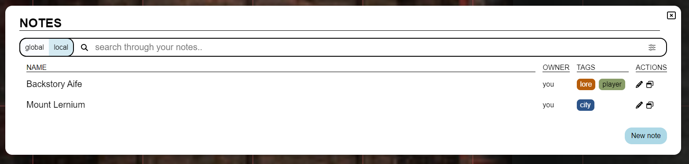
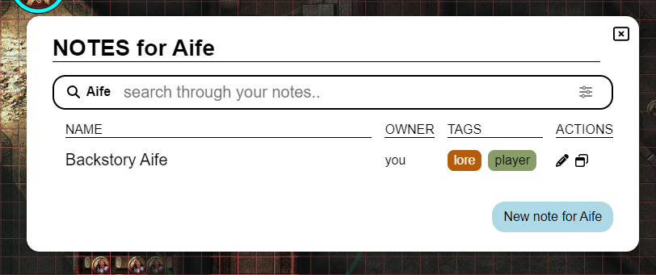

import Info from "/src/components/directives/Info.astro";
import Warning from "/src/components/directives/Warning.astro";

# Заметки

Как DM, так и игроку иногда приходится делать заметки о персонаже, локации, событии, ...
На этой странице показано, что PlanarAlly предлагает для управления заметками.

## Основные понятия

По своей сути все заметки — это простые контейнеры, содержащие текст, необязательный заголовок и автора.
Однако использовать их можно множеством разных способов.

Заметки можно открывать другим игрокам или держать в приватном доступе, доступном только создателю заметки.
Заметки также можно привязывать к фигурам, что позволяет быстро получать к ним доступ при выборе фигуры.
Или просто чтобы напомнить себе о чём-то, что связано с фигурой.

Заметки поддерживают форматирование Markdown. Дополнительную информацию об этом смотрите в [Уроке по Markdown](../../../learn/dm/Markdown_Tutorial/markdown)

### Глобальные и локальные

В большинстве случаев заметка актуальна только для текущей кампании/локации.
Но есть и пограничные случаи, когда может понадобиться заметка, не привязанная к кампании и доступная откуда угодно.

Первые называются локальными, а вторые — глобальными.
При создании заметки вам придётся решить, какую именно вы хотите создать.

Хороший пример глобальной заметки — блок характеристик чудовища.
Если объединить это с [шаблонами активов](/ru/docs/dm/assets/#templates), вы сможете поместить гоблина на игровой стол и
получить заметку с прикреплённым к нему блоком характеристик.

## Интерфейс менеджера заметок

В основе работы с заметками лежит менеджер заметок.
Это крупный элемент интерфейса, позволяющий искать, фильтровать и создавать заметки.

### Открытие

Менеджер заметок можно открыть, нажав на раздел «Заметки» в боковом меню в левой части экрана.

Его также можно открыть/закрыть с помощью сочетания клавиш <kbd>n</kbd>.

Наконец, его можно открыть с помощью контекстного меню фигуры или
через панель информации о выделении в правой части экрана, когда выбрана фигура.
В этих случаях менеджер заметок откроется с применённым фильтром, показывающим только заметки, связанные с фигурой.

### Основной вид

Здесь отображается список всех доступных в данный момент заметок (с применёнными конкретными фильтрами).

#### Поиск и фильтрация

Первый крупный элемент интерфейса — строка поиска, которая позволяет искать по всем заметкам и фильтровать их.

Строка поиска содержит переключатель между локальными и глобальными заметками.
Эти заметки обычно сильно различаются по своей природе, поэтому для них предусмотрено отдельное представление.

Второй элемент — это само поле ввода поиска, куда можно ввести поисковый запрос.

PA сопоставит все известные заметки с этим запросом и покажет результаты в списке ниже.
То, где PA будет искать ваш запрос, зависит от используемых фильтров;
это можно настроить с помощью последнего элемента строки поиска.

По умолчанию PA ищет ваш запрос в заголовке и тегах заметки.
Однако это можно изменить, чтобы поиск также затрагивал содержимое заметки и автора.

По умолчанию PA также ищет только в заметках, созданных в активной локации.
Это можно изменить, чтобы искать во всех неархивированных локациях или даже во всех локациях текущей кампании.

Можно скрыть все заметки, привязанные к фигурам;
это может быть полезно, если вы хотите сосредоточиться на заметках, более связанных с общим сюжетом.

Последний возможный фильтр — игнорировать локальный переключатель для глобальных заметок, привязанных к локальным фигурам.
По сути, это включит все заметки (независимо от локального/глобального статуса), привязанные к фигуре в текущей локации.
(например, глобальный блок характеристик гоблина появится в локальном списке, если в текущей локации есть гоблин)

##### Фильтрация по фигуре

Можно перевести менеджер заметок в режим фильтрации по фигуре, используя контекстное меню фигуры и
выбрав «Показать заметки» или через раздел заметок активной выбранной фигуры.

В этом случае будут показаны только заметки, привязанные к соответствующей фигуре.
Большинство фильтров поиска при этом исчезнут или станут недоступными, так как они больше не актуальны. (обратите внимание, что будут показаны как глобальные, так и локальные заметки, привязанные к фигуре)

В этом режиме кнопка создания новой заметки также будет автоматически прикреплять заметку к фигуре.

<Info>Заметки также можно привязывать к существующим заметкам через вкладку «Фигуры» в режиме редактирования.</Info>

#### Список заметок

В центре основного вида для каждой заметки, соответствующей поисковому запросу и фильтрам, отображаются заголовок, автор, теги и несколько быстрых действий.

Заголовок — это кликабельная ссылка, открывающая заметку в режиме редактирования.

Сейчас доступны два быстрых действия: кнопки «Редактировать» и «Открыть в отдельном окне».
Значок редактирования, как и клик по заголовку, открывает заметку в режиме редактирования,
а значок отдельного окна открывает заметку в отдельном модальном окне. (Подробнее см. [Открытие заметок в отдельном окне](#popout-notes))

Этот вид будет разбит на страницы, если активным фильтрам соответствует слишком много заметок. В этом случае в правом верхнем углу появятся кнопки `<` и `>`.

### Создание новой заметки

После нажатия на кнопку создания новой заметки в основном списке появится новый экран для предварительной настройки заметки.
В этом представлении можно настроить заголовок и тип заметки (глобальная или локальная).

Для этого используется отдельное представление, чтобы оставить место для объяснения разницы между глобальными и локальными заметками.

После создания заметки вы автоматически попадёте в режим редактирования для дальнейшей настройки.

### Режим редактирования

Этот вид — расширенный режим редактирования заметки.
Чтобы вернуться к основному виду, нажмите стрелку назад в левом верхнем углу, рядом с заголовком заметки.

Режим редактирования разделён на несколько разделов, сверху вниз:

#### Заголовок

Здесь просто отображается заголовок заметки.

Если у вас есть права на редактирование заметки, вы можете его изменить.

В правой части снова доступны некоторые быстрые действия:
ещё один значок [отдельного окна](#popout-notes) и значок корзины, удаляющий заметку.

#### Теги

Здесь отображаются все теги, прикреплённые к заметке.

Если у вас есть права на редактирование заметки, вы можете добавлять/удалять теги.

Теги свободные и могут быть какими угодно, хотя в идеале они должны быть относительно короткими.
Единственное их применение в PA — фильтрация/поиск заметок, поэтому вы можете организовать их как угодно.

Тегу автоматически назначается стабильный цвет на основе его содержимого.

<Warning>
    Теги видны каждому пользователю, имеющему право «просмотра» заметки. (см. [Вкладка «Доступ»](#tab-access))
</Warning>

_Генерация цвета работает только в контексте HTTPS, так как использует алгоритм SHA1; в контексте HTTP будет использоваться сероватый цвет_

#### Вкладка: Просмотр и Редактирование

Эти две вкладки работают вместе и составляют основу заметки.

Во вкладке «Редактирование» вы можете писать/редактировать содержимое заметки в текстовом формате, поддерживающем Markdown.
Готовый отрендеренный Markdown можно увидеть во вкладке «Просмотр».

#### Вкладка: Триггеры и Визуальные элементы

Эту вкладку можно открыть, только если заметка привязана к фигуре.

Она позволяет настроить особое поведение заметки.

Сейчас она предлагает два варианта:

Показать значок заметки: рядом с фигурой (на карте) будет отображаться небольшой значок.
Это может помочь напомнить себе о важной заметке.

Показывать текст при наведении на фигуру: содержимое заметки (отрендеренное через Markdown) будет отображаться при наведении курсора на фигуру.
Оно появится в верхнем центре экрана. Учтите, что если заметка большая, она, скорее всего, закроет значительную часть экрана.

#### Вкладка: Доступ

Эта вкладка позволяет настроить, кто может видеть и редактировать заметку.

По умолчанию видеть и редактировать заметку может только её автор.
Но, возможно, вы захотите дать всем игрокам право просмотра заметки, которую они где-то нашли.

Вы также можете предоставить точечный доступ конкретным игрокам, что позволит вам делиться скрытыми заметками с определёнными игроками.

Важно понимать, что теги заметки видны игрокам с правом просмотра.
Убедитесь, что вы случайно не раскрыли что-то, используя тег `faction:evil` или тому подобное.

<Info>
При предоставлении игроку права просмотра (будь то конкретному или всем игрокам) он получит уведомление о том, что доступна новая заметка.

Так что для DM простое предоставление права просмотра заметки — хороший способ уведомить игроков о конкретной информации, которую они только что обнаружили.

</Info>

#### Вкладка: Фигуры

Эта вкладка перечисляет все фигуры, привязанные к заметке.

Сначала выводится числовая сумма всех фигур по всем кампаниям, затем сумма для активной локации.

Для активной локации также перечисляются все фигуры с их именами. Нажатие на имя отцентрирует экран на этой фигуре.
При наведении курсора на имя также появится значок корзины, при клике на который заметка будет откреплена от фигуры.

## Открытие заметок в отдельном окне

Иногда вам часто нужен доступ к одной или нескольким заметкам.
Постоянно открывать менеджер заметок и переключаться между заметками в этом случае утомительно.

Чтобы решить эту проблему, PA предлагает возможность открыть заметку в отдельном модальном окне.
Одновременно может быть открыто несколько таких окон, и каждое из них можно перетаскивать по отдельности.

В отдельном окне доступны только функции просмотра и редактирования; для других настроек заметки нужно открыть сам менеджер заметок.

Отдельное окно также можно свернуть, скрыв содержимое заметки и оставив только заголовок.
Это особенно полезно, если открыто несколько окон или вы знаете, что определённая заметка больше не актуальна, но скоро снова понадобится.

## Заметки активной выбранной фигуры

PA всегда отображает элемент интерфейса в правой части экрана с краткой информацией о выбранной в данный момент фигуре.

В этом разделе также есть отдельная секция заметок.
Она показывает количество прикреплённых заметок и значок для немедленного открытия менеджера заметок с применённым фильтром, показывающим только заметки, связанные с фигурой. (Подробнее см. [Фильтрация по фигуре](#shape-filtering))

Если к фигуре прикреплена одна или несколько заметок, этот раздел можно также развернуть/свернуть, чтобы увидеть список заметок.
Это позволяет быстро открыть заметку в отдельном окне или в менеджере заметок.
Кроме того, при наведении курсора на эти заметки их содержимое будет отображаться в верхнем центре экрана, независимо от конфигурации триггеров.
