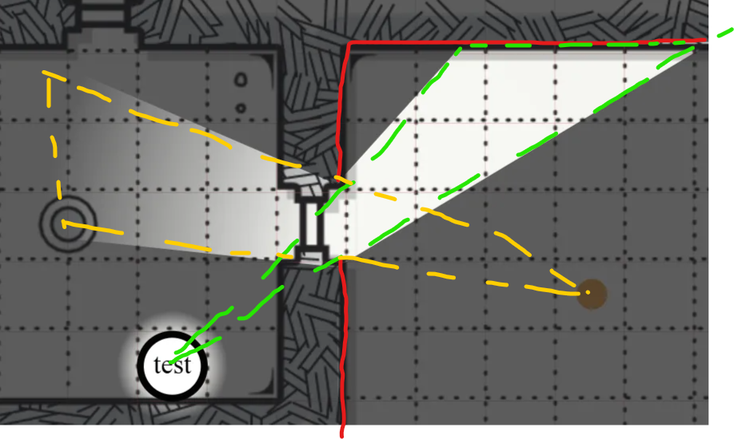

import Cog from "~icons/fa-solid/cog";
import Info from "/src/components/directives/Info.astro";
import Tip from "/src/components/directives/Tip.astro";

# Первая карта

Большинство игр в конечном счёте строится вокруг карты — так бывает не всегда, но в этих руководствах мы будем исходить из классического сценария прохождения подземелий.

В этом руководстве мы добавим карту, настроим стены, свет, персонажей игроков и монстров.

## Конфигурация

Прежде чем перейти к основной работе, давайте рассмотрим некоторые настройки, которые нам, возможно, захочется изменить.

Откройте <Cog /> в левом верхнем углу и нажмите на «Настройки DM».
Откроется интерфейс, в котором можно настроить множество глобальных параметров для всей кампании.

### Настройки администратора

<Info>
    Чтобы добавить игроков в игру, нужно отправить им пригласительную ссылку, которую можно найти на этой вкладке!
</Info>

Более актуальны для наших текущих приготовлений вкладки сетки и обзора.

### Настройки сетки

В зависимости от вашей игры эти значения по умолчанию могут подойти, а могут потребовать подгонки.

Здесь есть несколько примечательных моментов:

- По умолчанию используется квадратная сетка, её можно заменить на шестиугольную
- Одна ячейка сетки по умолчанию интерпретируется как 5×5 футов для различных целей (например, для инструмента линейки)

### Настройки обзора

Пока просто включите «Заполнить холст туманом войны».

Лично я также предпочитаю повышать непрозрачность тумана войны (например, до 0,7), но это дело вкуса.
От неё зависит, насколько сильно области, которые не видят игроки, будут заметны вам как DM.

Зачем мы включили эту настройку тумана войны?

Мы собираемся симулировать глубокое погружение в подземелье, поэтому изначально всё, скорее всего, будет окутано тьмой, и лишь кое-где факелы будут освещать сцену.
Именно поэтому мы заполнили холст туманом войны.

С этими начальными настройками закроем окно настроек DM и наконец добавим карту.

## Добавление активов

В PA есть менеджер активов, где, как и в проводнике файлов вашей операционной системы, вы можете организовывать загруженные активы по папкам, переименовывать их и т. д.
Если у вас несколько игр или вы хотите загрузить сразу много изображений для жетонов, стоит как следует разобраться в менеджере активов.

А пока мы просто перетащим актив из проводника вашей операционной системы прямо на карту.
Если всё прошло успешно, вы должны увидеть следующее:

Используемая здесь карта была сгенерирована случайным образом с помощью [генератора подземелий donjon](http://donjon.bin.sh/d20/dungeon/index.cgi).

Обратите внимание, что экран довольно тёмный — это из-за моей непрозрачности 0,7. Если бы прямо сейчас к сеансу присоединился игрок, он увидел бы чисто чёрный экран.

## Интермеццо о слоях

Если вы также прошли руководство для игрока, вы, возможно, заметили дополнительный интерфейс в левом нижнем углу, который игроку не виден.
Здесь управляются этажи и слои. Этажи — более продвинутая тема, которую мы пока пропустим, а вот слои — важнейший инструмент в арсенале DM.

Слои располагаются вертикально друг над другом и используются для повышения производительности рендеринга, а также для разделения зон ответственности.

По умолчанию выбран слой «жетоны». Он предназначен для всех обычных жетонов (игроков, NPC или монстров).
Это единственный слой, с которым игроки могут непосредственно взаимодействовать.

Как DM вы имеете доступ к ещё нескольким слоям. Слева от слоя жетонов находится слой карты. Это самый нижний слой, и предполагается, что здесь вы размещаете крупные элементы карты.
Это гарантирует, что никакая фигура никогда не окажется позади картинки карты и что вы случайно не передвинете сам актив карты.

Третий слой — слой DM. Это просто слой, где вы как DM можете хранить всё, что захотите, но чего игроки видеть не должны.
Возможно, где-то у вас спрятан монстр, которого вы хотите показать лишь в нужный момент, или вы добавили в некоторых местах текстовые заметки-напоминания.

Последний слой — слой обзора. Мы воспользуемся им совсем скоро, но пока вам нужно знать лишь то, что здесь обычно рисуют стены и тому подобное.

### Перемещение нашей карты

Итак, из всего сказанного мы узнали, что карта, которую мы добавили ранее, находится не на том слое!

Мы могли бы удалить карту, переключиться на слой карты и добавить её заново, но это слишком много возни.

Вместо этого щёлкните правой кнопкой мыши по активу карты (убедитесь, что вы всё ещё на слое жетонов! — с активами с другого слоя напрямую взаимодействовать нельзя).

Здесь мы можем переместить выбранную фигуру на другой слой!
Именно так вы заставите того спрятанного монстра со слоя DM появиться на слое жетонов.

<Info title="Скрытый слой">
    На самом деле существует ещё один слой, который нельзя выбрать, — слой сетки. Слой сетки плотно зажат между
    слоем карты и слоем жетонов и настраивается только в настройках сетки DM, как мы видели ранее.

    Обратите внимание: когда карта была на слое жетонов, линии сетки скрывались за картой, тогда как теперь они проходят поверх неё!

</Info>

## Настройка света

Отлично, мы поместили карту на нужный слой — давайте осветим её!

Любая фигура может выступать источником света, поэтому начнём с того, что нарисуем небольшой круг, обозначающий факел в какой-нибудь комнате.

### Базовая фигура

Чтобы рисовать фигуры, нужно использовать инструмент рисования — это один из инструментов, входящих в режим сборки панели инструментов, поскольку его основное применение — подготовка к сеансу.
Итак, переключимся в режим сборки (помните про сочетание клавиш <kbd>tab</kbd>) и выберем инструмент рисования.

Выберите круг (или любую другую фигуру!), цвет и нарисуйте его на игровом столе. Фигуры обычно рисуются зажатием левой кнопки мыши и перетаскиванием.

<video autoplay loop muted style="max-width: min(680px, 75vw);">
    <source src="/learn/dm/add-light-shape.webm" type="video/webm" />
    <source src="/learn/dm/add-light-shape.mp4" type="video/mp4" />
</video>

### Добавление источника света

Теперь мы можем открыть свойства только что нарисованной фигуры и добавить источник света!

Это делается на вкладке трекеров: нужно настроить ауру, которая действует как источник света и является публичной.

Не бойтесь экспериментировать! Два значения дальности — это соответственно дальность яркого и тусклого света.
Вместо полного круга источник света можно ограничить конусом и направить его в нужную сторону.

Своему свету можно также задать определённый цвет, чтобы он больше походил на настоящий факел.

<video autoplay loop muted style="max-width: min(680px, 75vw);">
    <source src="/learn/dm/add-light-source.webm" type="video/webm" />
    <source src="/learn/dm/add-light-source.mp4" type="video/mp4" />
</video>

## Исправление размеров карты

Мы добавили свет с радиусом 40 футов, и теперь вас, вероятно, интересует, как это соотносится с размерами карты, ведь мы просто бросили изображение карты на игровой стол без каких-либо дополнительных действий.

Если бы вы взяли линейку и измерили размер одной ячейки сетки на карте, ваши подозрения подтвердились бы: карта вообще не отмасштабирована должным образом!
Несовпадение карты с сеткой PA тоже могло выдать это ещё раньше ;)

Мы могли бы попытаться вручную исправить размеры карты, выбрав её инструментом выделения и изменив размер (в режиме сборки).
Однако это трудоёмкая работа, в которой легко ошибиться. Вместо этого мы воспользуемся инструментом режима сборки, доступным только DM: инструментом карты.

Этот инструмент позволяет настроить размеры карты. Вы можете указать полную ширину/высоту либо в ожидаемых ячейках сетки, либо просто в ожидаемой ширине/высоте в пикселях,
но также можно выделить область и указать, скольким ячейкам сетки она должна соответствовать. Последний способ мне кажется самым простым.

<video autoplay loop muted style="max-width: min(680px, 75vw);">
    <source src="/learn/dm/map-tool.webm" type="video/webm" />
    <source src="/learn/dm/map-tool.mp4" type="video/mp4" />
</video>

В видео выше выполняются следующие действия:

1. Переходим на слой карты (так как хотим взаимодействовать с нашей фигурой-картой)
2. Выбираем карту и переключаемся на инструмент карты
3. Выделяем область на фигуре-карте
4. Указываем в инструменте карты, скольким ячейкам сетки должна соответствовать выделенная область по горизонтали и по вертикали
5. Я посчитал количество выделенных ячеек по горизонтали — их 5 — и ввёл это значение в поле «горизонтально»
6. Перед вводом числа я нажал на значок цепочки, который гарантирует, что любое изменение автоматически обновит другое поле, сохраняя пропорции
7. В итоге в вертикальном поле получилось ~5,02, что выглядит нормально
8. После нажатия «Применить» фигура-карта немедленно изменяет размер в соответствии с нашими ограничениями
9. Тем не менее она всё ещё смещена, поэтому возвращаемся к инструменту выделения и перетаскиваем её так, чтобы она совпала с сеткой PA (красные линии)

Это может показаться довольно сложным, но, когда освоитесь, это на самом деле довольно быстрый способ выравнивать карты.

<Tip title="Советы">
    1. Если выделить область побольше, точность возрастёт! Правда, посчитать количество выбранных ячеек сетки станет
    сложнее.  
    2. У меня контур сетки довольно бледный — это можно изменить в настройках клиента  
    3. Даже если конечный результат не идеален, теперь, когда общий размер примерно правильный, вам будет гораздо легче
    изменить размер карты до более точного соответствия
</Tip>

## Добавление стен

Теперь у нас есть правильно выровненная карта и свет, но свет попросту игнорирует нашу карту.
Чтобы это исправить, нужно сообщить PA, где находятся стены.

<Info>
    Некоторые более продвинутые возможности, например загрузка svg-файла с информацией о стенах, призваны помочь в этом
    процессе. (Хотя лично я в большинстве случаев просто рисую стены вручную)
</Info>

Как и свет, стены также рисуются с помощью инструмента рисования.
Главный вопрос — на каком слое их рисовать?

Хотя существует один оптимальный вариант, на самом деле подойдёт любой слой, кроме слоя DM, поскольку такие стены не будут видны игрокам.

Можно рисовать их на слое карты или жетонов, но у слоя обзора есть улучшения удобства, которые делают его более привлекательным:

Во-первых, фигуры на слое обзора не отображаются при нахождении на другом слое, а значит, визуальный шум множества стен и прочих фигур можно скрывать во время самой игры.
Это также позволяет с помощью цветов помечать фигуры, обозначая ими определённые вещи (например, оранжевые сегменты стен — это секретные двери), не опасаясь, что эти цвета «просочатся» в основную сцену.

Второе преимущество в том, что при выборе слоя обзора инструмент рисования автоматически включает некоторые настройки:

Как видите, настройки `блокирует обзор/свет` и `блокирует перемещение` автоматически включены.
Это небольшое улучшение удобства, которое делает настройку стен чуть проще: вам не нужно каждый раз вспоминать о включении этих настроек при рисовании стены.

Эти 2 настройки довольно важны, и их можно изменить после рисования. Как следует из названия, фигура блокирует свет и перемещение.
Обычно именно это и нужно для стены! Если мы хотим изобразить окно, стоит оставить `блокирует перемещение` включённым, но отключить блокировку света и обзора.

<Info title="Цвета по умолчанию">
Ещё одна возможность для удобства — цвета по умолчанию для фигур обзора.
Их можно настроить на вкладке «Внешний вид» в настройках клиента:
 

Фигура автоматически использует заданный здесь цвет, когда это уместно (например, фигуры с обеими включёнными блокировками действуют как стены, а те, у которых заблокировано только перемещение, — как окна).

Если вы хотите рисовать такие фигуры определённым цветом вместо цвета по умолчанию, снимите флажок «Предпочитать цвета по умолчанию» в настройках обзора инструмента рисования.

</Info>

С этим покончено, давайте наконец нарисуем нашу стену! Можно использовать любую фигуру, но для рисования стен лучше всего подходит инструмент «полигон».

<video autoplay loop muted style="max-width: min(680px, 75vw);">
    <source src="/learn/dm/draw-walls.webm" type="video/webm" />
    <source src="/learn/dm/draw-walls.mp4" type="video/mp4" />
</video>

Как видите, рисовать стены очень просто! Сколько от самой стены оставлять видимым для игроков — дело вкуса,
я обычно показываю им немного, чтобы было видно, что здесь стена, а не полагаться только на тень.

<Tip>
    Чтобы завершить полигон, нужно щёлкнуть правой кнопкой мыши!
     
    Не переживайте слишком сильно из-за неровных линий или пропущенных точек. Инструмент выделения в режиме сборки
    позволяет перемещать точки полигона, а также добавлять новые или удалять существующие. Сначала набросать общий
    контур, а потом подправить детали обычно гораздо быстрее.
</Tip>

Проверьте, как это выглядит: перейдите, например, на слой жетонов и обратите внимание, что нарисованные фигуры-стены исчезли, но тень осталась!

## Добавление персонажей

Теперь у нас есть карта со стенами и источником света, но пока нет персонажей. Ничто не представляет игроков, нет ни монстров, ни NPC.

Мы можем перетаскивать жетоны на игровой стол точно так же, как мы делали это с картой. Однако для этого примера мы создадим базовый жетон персонажа прямо в PA.
Это небольшие круглые жетоны с текстовой подписью. Они удобны для быстрого прототипирования или когда нужно быстро получить NPC на игровом столе и не хочется тратить время на поиски актива в сеансе.

Чтобы добавить базовый жетон персонажа, щёлкните правой кнопкой мыши по пустому месту на игровом столе. В идеале делать это стоит на слое жетонов!

<video autoplay loop muted style="max-width: min(680px, 75vw);">
    <source src="/learn/dm/basic-token.webm" type="video/webm" />
    <source src="/learn/dm/basic-token.mp4" type="video/mp4" />
</video>

В видео выше мы:

- Создаём базовый жетон с именем «test»
- Даём игроку с именем пользователя «test» доступ к фигуре
- Немного перетаскиваем его, проверяя, работает ли стена, — и она работает!

Если теперь проверить, что видит игрок с именем пользователя «test», мы заметим следующую проблему:

Наш игрок видит всю комнату со светом, хотя его персонажа там даже нет!

### Доступ к обзору

Прежде чем погрузиться в линию обзора, нужно сделать небольшое отступление и поговорить об уровнях доступа к фигурам.

Когда мы выше давали игроку «test» доступ к фигуре, все 3 права доступа (изменение/перемещение/обзор) были предоставлены автоматически.
Эти 3 права доступа предоставляются не всегда сразу — это зависит от контекста, поэтому важно понимать, что они делают.

Особенно важно право доступа к обзору, ведь именно оно определяет, что могут видеть игроки.
Когда доступ включён, PA считает, что игрок имеет доступ к обзору приватных аур фигуры и, по сути, видит то, что жетон видит в мире.

Даже если на жетоне не настроено ни одной ауры, вокруг него всегда присутствует минимальная аура обзора, чтобы вы не потеряли его при перемещении в местах, где почти ничего не видно.

Если бы мы отключили доступ к обзору для жетона, мы увидели бы следующее:

Итак, даже имея доступ на изменение и перемещение, мы на самом деле не видим фигуру, потому что в данный момент ничто не освещает область, где она находится.

## Обзор

Как уже отмечалось, может показаться странным, что игрок видит комнату, освещённую тем светом, хотя его персонаж находится не там.
Это потому, что мы сейчас не применяем к игроку никаких ограничений обзора. Он просто видит всё, что (публично) освещено.

В некоторых сценариях это может работать нормально, но если вы ожидаете, что игрок сможет видеть только то, что видит его персонаж,
вам как DM придётся включать и выключать свет, пока игроки исследуют карту, что очень утомительно.

И даже этот трудоёмкий подход в итоге позволит игрокам видеть то же, что видят другие игроки, — а этого вы, возможно, и не хотите.

Чтобы по-настоящему включить обзор для каждого персонажа, нам нужны две вещи:

1. Игрокам нужен доступ к обзору своих фигур
2. Локация должна быть настроена на включённую линию обзора

(1) Мы уже рассмотрели это в разделе о доступе к обзору выше, так что с этим покончено, а для (2) нужно вернуться в настройки DM [туда, где мы включили настройку «полный туман войны»](#vision-settings).

<Tip>
Если у вас несколько локаций (об этом позже), эти настройки DM часто можно настроить и отдельно для каждой локации.

Настройки DM — это настройки по умолчанию, они используются, когда локация не переопределяет их явно.

</Tip>

Если всё прошло правильно, теперь мы видим следующую картину (со стороны DM):

Итак, теперь игрок видит только те места, где есть свет, в пределах своей линии обзора с учётом нарисованных нами стен.
(Помните, что мы нарисовали только внутреннюю стену в камере справа).

Чтобы помочь вам понять, почему картинка именно такая, я сделал этот грубый рисунок:

- Красные линии — это наши стены, они блокируют свет.
- Жёлтые линии показывают конус света, который проходит через оставленный нами дверной проём в стене
- Зелёные линии показывают конус, через который персонаж видит другую комнату, глядя сквозь тот же дверной проём

Для комнаты, в которой находится персонаж:

- Персонаж видит всю комнату
- Свет освещает лишь её часть (тот жёлтый конус)

-> На самом деле виден только конус

Для комнаты, в которой находится свет:

- Персонаж видит только зелёный конус
- Свет освещает всю комнату

-> На самом деле виден только конус

### Ауры игрока

Обычно у персонажей есть врождённая способность видеть сквозь тьму на определённое расстояние, либо у них есть какой-то предмет, например факел, дающий свет.

Мы [ранее](#add-light-source) видели, как создать ауру для света в другой комнате, — точно так же можно сделать и для персонажа игрока!
Откройте настройки фигуры, перейдите на вкладку «Трекеры» и добавьте новую ауру.

Ауры, настроенные как публичные, будут видны всем игрокам (имеющим обзор этой ауры), так что это идеально для факела, тогда как приватная аура лучше подходит для врождённых способностей вроде тёмного зрения.

Важно отметить свойство «действует как источник света», ведь именно оно превращает её в источник света/обзора (наверное, точнее было бы назвать её источником обзора).

--

Это должно дать вам основу для подготовки карт к игре!

[Дальше](/ru/learn/dm/other-features) мы рассмотрим некоторые другие возможности, о которых вам как DM, вероятно, стоит знать.
