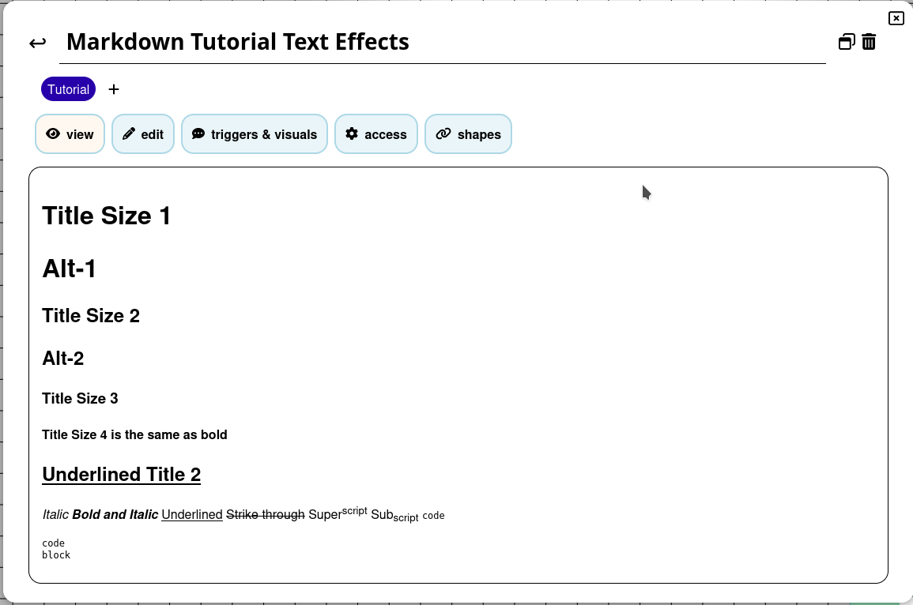
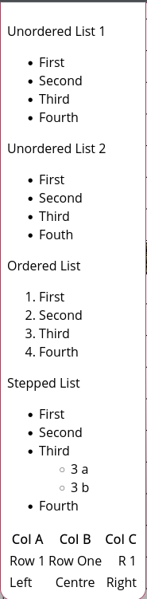
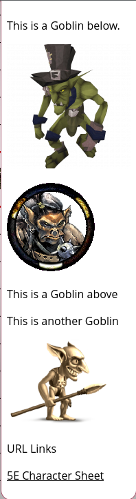

# **Учебник по Markdown**

Руководство предоставлено [@veritanuda](https://keybase.io/veritanuda)

В этом руководстве подробно рассматриваются возможности форматирования Markdown в PlanarAlly. Оно используется как в полях [Заметок](../../../../docs/game/notes), так и в окне [Чата](../../../../docs/game/chat).

Значительная часть информации в этом руководстве взята из этого [Справочника по синтаксису](https://markdown-it.github.io/)

## **Эффекты текста**

Ниже приведён пример эффектов текста, которые можно применять.


На нём можно увидеть:

- Размеры заголовков
- Форматирование текста
- Стили текста

Так это выглядит в окне заметок.



А так — в режиме редактирования.


Символ `#` используется для задания размера заголовка. Один `#` даёт самый большой размер `Title Size 1`

Два `#` дают размер поменьше `Title Size 2`

Три `#` — ещё на размер меньше `Title Size 3`

Четыре `#` — то же самое, что и жирное начертание, которое можно получить, обрамив текст символами `**` или `__`. `Title Size 4`

Подчёркивание требует HTML-нотации, которая работает и для других текстовых эффектов, например курсива `<i> </i>` и жирного начертания `<b></b>`.

`<u>Underlined</u>`

`*` — это _курсив_

`**` — это **жирный**

`***` — это **_жирный курсив_**

`~~` — это ~~зачёркнутый~~

`<sup> </sup>` — это верхний<sup>индекс</sup>

`<sub> </sub>` — это нижний<sub>индекс</sub>

``is`code`

` ``` ` — это

```
code
block
```

---

## **Расположение текста**

Ниже приведён пример расположения текста.



### <u>Маркированные списки</u>

Маркированные списки можно создавать с помощью `*` или `-` перед пунктами списка.

```
Unordered List 1
* First
* Second
* Third
* Fourth
```

Маркированный список 1

- Первый
- Второй
- Третий
- Четвёртый

```
Unordered List 2
- First
- Second
- Third
- Fouth
```

Маркированный список 2

- Первый
- Второй
- Третий
- Четвёртый

### <u>Нумерованные списки</u>

В нумерованных списках используется `<номер>.`, причём номера возрастают, начиная с указанного вами первого числа.

```
Ordered List
1. First
2. Second
3. Third
4. Fourth
```

Нумерованный список

1. Первый
2. Второй
3. Третий
4. Четвёртый

### <u>Многоуровневые списки</u>

Многоуровневые списки создаются добавлением двойного пробела между уровнями списка.

```
Stepped List
- First
- Second
- Third
  - 3 a
  - 3 b
- Fourth
```

Многоуровневый список

- Первый
- Второй
- Третий
    - 3 a
    - 3 b
- Четвёртый

### <u>Таблицы</u>

В таблицах `|` разделяет столбцы, а `-` и `:` задают выравнивание (необязательно, так как по умолчанию используется выравнивание по левому краю)

```
|Col A|Col B|Col C|
|--|:--:|--:|
|Row 1|Row One|R 1|
|Left|Centre|Right|
```

| Колонка A | Колонка B | Колонка C |
| --------- | :-------: | --------: |
| Строка 1  | Строка 1  |     Стр 1 |
| Влево     | По центру |    Вправо |

---

## <u>Изображения и ссылки</u>

Ниже приведён пример встроенных изображений и гиперссылок.



Для **_большинства_** URL-адресов изображений достаточно просто скопировать и вставить адрес изображения — и картинка отобразится.

Если это не сработало, вы можете вставить изображение в текст, поставив перед ним `!`, указав имя метки в `[ ]`, а затем ссылку в `( )`.

```
This is a Goblin below.


```

Есть и альтернативный способ, который делает код чище, — метод ссылок. Вместо прямой ссылки на изображение вы используете ссылку-метку, которая в свою очередь ведёт на изображение.

```
![Goblin][Goblin1]

This is a Goblin above

This is another Goblin

![Goblin2][Goblin2]

[Goblin1]:https://www.imarvintpa.com/Mapping/Tokens/g1/Goblin.png "This is a Goblin"
[Goblin2]:https://gamepedia.cursecdn.com/crafttheworld_gamepedia/thumb/b/be/Cave_Goblin.png/150px-Cave_Goblin.png "This is a Cave Goblin"
```

Ссылки также позволяют добавлять всплывающие подсказки: когда курсор наводится на изображение, появляется подсказка. Для этого текст подсказки заключается в `" "` после URL.


**Примечание:** при вставке изображения масштабируются в окне чата, но по клику на изображение откроется его увеличенная версия в отдельном окне.

## <u>**URL-ссылки**</u>

URL-ссылки работают так же, как описано выше, но без `!` в начале.

```
[5E Character Sheet](https://media.wizards.com/2016/dnd/downloads/5E_CharacterSheet_Fillable.pdf)
```

[5E Character Sheet](https://media.wizards.com/2016/dnd/downloads/5E_CharacterSheet_Fillable.pdf)

# Заключение

Использование Markdown в заметках или чате — полезный способ вовлечь игроков и дать им доступ к таким вещам, как раздаточные материалы или изображения монстров, чтобы сделать игру глубже. С точки зрения DM ведение заметок на жетонах — характеристики, особые способности, общая информация, описания локаций и т. д. — заметно облегчает объём информации, который нужно хранить и искать вне игры. Это делает ведение игры гораздо более плавным и беспроблемным.

Приятной игры!
